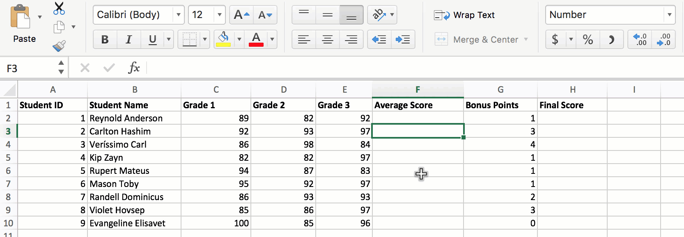
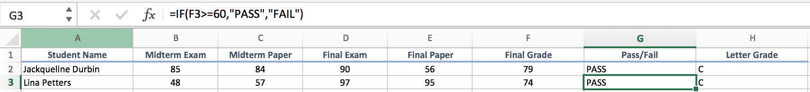
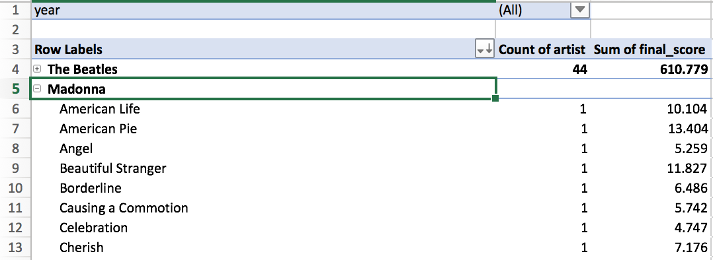
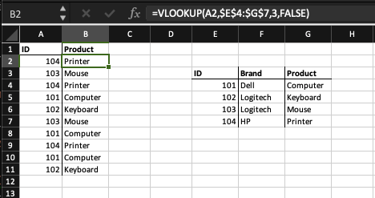
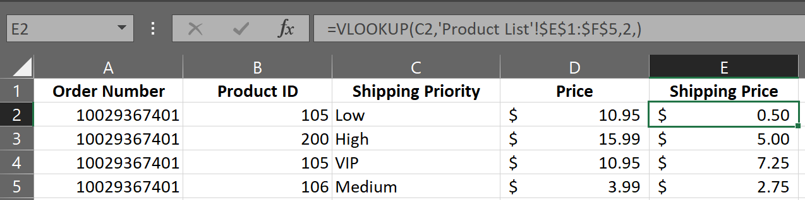

# 1.2 - Data Fundamentals in Excel

## Overview

In this class, students will be introduced to more advanced features in Microsoft Excel such as Pivot Tables, Lookups, and Conditional Formatting.

## Class Objectives

* Students will feel fully proficient in basic Excel navigation and functionality
* Students will gain familiarity with the value of Pivot Tables and the steps for their utilization.
* Students will gain comfort utilizing VLookups and HLookups
* Students will understand how to implement conditional formatting based on logical rules

## Instructor Prep

  
<strong>Instructor Notes</strong>

* Welcome back to Day 2! Hope your first day was fun. Today's session marks the first "real" class. As will be the case throughout this program, you will be guiding students through a series of exercises of increasing complexity.

* Today's class is wholly focused on Microsoft Excel. Admittedly, Microsoft Excel isn't the most invigorating of subjects to teach. However, it is of critical importance that, as future analysts, your students gain strong mastery of the tools less commonly used by everyday users. You'd be surprised by the number of your students who will struggle with creating advanced conditionals even in Microsoft Excel.

* Spend time prior to class practicing your work-flow. Opening and navigating through multiple spreadsheets can easily feel cumbersome. Make sure that you are well aware of the layout and key takeaways for all activities prior to class. There's a "magic" felt in a class where things flow seamlessly, but this magic requires active preparation from you to create.

* As you talk through today's exercises find ways to pepper in commentary around the benefits and limitations of Microsoft Excel vs. the future topics we'll be introducing. Excel has its uses, but so too will Python, JavaScript, and SQL.

* Have your TAs refer to the [Time Tracker](TimeTracker.xlsx) to stay on track.

* Please reference our [Student FAQ](../../../05-Instructor-Resources/README.md#unit-01-excel) for answers to questions frequently asked by students of this program. If you have any recommendations for additional questions, feel free to log an issue or a pull request with your desired additions.

* When the lesson plan calls for files to be sent to students there are a few ways to do so. For the first couple of weeks it may be easiest to use Slack, but as the files and directories get more complex you may look to try alternate methods such as pushing and pulling from GitHub/GitLab and sending out the link, using a file storage like google drive, or zipping up files and continuing to Slack out. Please use whatever method you find most comfortable for sending files out to students.

* Remember that today's slideshow includes information relevant to your own class. Specifically, there are two slides that require you to Slack links to your student-facing repository and Panopto Video Feed.

* Lastly, as a reminder these slideshows are for instructor use only - when distributing slides to students, please first export the slides to a PDF file. You may then send out the PDF file.

  
<strong>Sample Class Video</strong>

* To view an example class lecture visit (Note video may not reflect latest lesson plan): [1.2 Class Video](https://codingbootcamp.hosted.panopto.com/Panopto/Pages/Viewer.aspx?id=e00c04a8-77f4-456e-973f-ab76000854e0)

- - -

# Class Activities

## 1. Instructor Presentation

| Activity Time:       0:25 |  Elapsed Time:      0:25  |
|---------------------------|---------------------------|

  
<strong>📣 1.1 Instructor Do: Egad! It's Excel Slideshow (0:05)</strong>

* You may choose to open up the [slideshow](https://docs.google.com/presentation/d/1IxA5mxfRa4pnRGmbH9YJw_iten9JK1cbN_i6144S5Ds) and step through slides 1-9 to facilitate your welcome to the class. Otherwise cover the following talking points:

  * Explain that before we start today's class, it is important that we look at our class repository and Panopto video feed.

  * Show the students their github class repository on the [github](https://github.com/) site.

    * Explain that this is where all of the classroom content and homework assignments will be posted.

  * Show the students their Panopto video feed site

    * Explain that this is where all of the classroom recordings will be automatically uploaded.

  * Explain that we will take a few minutes to review some of the core concepts from yesterday's class.

  * Ask a student to explain the two aspects of data analytics.

    * Explain that at its core, data analytics is about storytelling and truth-telling.

  * Ask another student to list the steps in the analytics paradigm.

    * Explain that the analytics paradigm is the following steps:

      1. Decompose the ask.

      2. Identify the data sources.

      3. Define strategy and metrics.

      4. Build a data retrieval plan.

      5. Retrieve the data.

      6. Assemble and clean the data.

      7. Analyze data for trends.

      8. Acknowledge limitations of study.

      9. Make the call or tell the story.

  
<strong>📣 1.2 Instructor Do: Excel Playground (0:05)</strong>

* You may choose to open up the [slideshow](https://docs.google.com/presentation/d/1IxA5mxfRa4pnRGmbH9YJw_iten9JK1cbN_i6144S5Ds) and step through slides 10-20 to accompany the beginning of this next activity. Otherwise cover the following talking points:

  * Explain that this unit will cover a number of fundamentals in programming and statistics. The easiest means of teaching fundamentals is by using a tool that many of us are familiar with, Excel.

  * Explain that Excel can be thought of as a type of proto-programming.

  * Explain that all programming languages have **functions** (or methods) that produce an output.

  * Explain that these functions rely on parameters, or **arguments**, as input to know how to produce the desired output.

  * Point out that in Excel, we use **formulas** to call functions and provide arguments to calculate new values in a cell.

  * Point out that in Excel, we call the arguments that are provided to a function **variables**.

  * Explain that a formula can contain multiple functions and variables.

  * Explain that a variable in Excel can be a number, a cell, a range of cells or the output of another function.

  * Explain that in Excel, functions typically expect a number, a cell, a range of cells, or the output of another function.

  * Explain that when an inner function is the variable to an outer function, the inner function is known as a **nested function**.

  * Explain that throughout this course we will work with multiple programming languages and scripting tools. Although the implementation of each will vary, the concept of functions, arguments and variables do not differ.

* Now open the starter file inside [/01-Ins_ExcelPlayground/Solved/Excel_Playground_Starter.xlsx](Activities/01-Ins_ExcelPlayground/Solved/Excel_Playground_Starter.xlsx). The file includes a mock Grade Book.

* Acknowledge that the next demo will be simple before showing them how to manipulate the data in basic ways. Specifically,

  * Show the students how to calculate the average grade for each student by using the `average` function.

  * Show the students how to copy a formula downstream in an Excel column (using both copy/paste and by dragging the bottom right corner cell).

  

  * Finally, show the student how you can pull up the Excel Formula Builder to see a GUI for accessing Excel's off-the-shelf formulas. Use the appropriate formula to calculate the cells associated with average, max, min, and standard deviation of grades.

  

* Once complete, TAs should send your completed file for students.

  
<strong>📣 1.3 Instructor Do: Named Ranges (0:05)</strong>

* You may choose to open up the [slideshow](https://docs.google.com/presentation/d/1IxA5mxfRa4pnRGmbH9YJw_iten9JK1cbN_i6144S5Ds) and step through slides 21-24 to accompany the beginning of this next activity. Otherwise cover the following talking points:

  * Explain that most excel functions expect more than one value. Therefore, we provide the function with a range of values to calculate the output.

  * Explain that if an Excel workbook is large, it can be difficult to keep track of which values are being used as input to a function.

  * Explain that we can name a range of cells in Excel to help keep track of what values are being used.

* Next, proceed to the example on [02-Ins_NamedRanges/ShoppingTrip.xlsx](Activities/02-Ins_NamedRanges/Solved/ShoppingTrip.xlsx).

  * Open the exercise and begin to highlight entire columns of existing data (e.g. `A1:A6`, `B1:B6`, etc.). Note the fact that the upper left corner indicates a named range. These can be created by selecting any set of cells and clicking to insert a name.

  

  * Show students that these named ranges can be used in formulas as any Excel selection typically would. Point out that named ranges provide a more readable version of spreadsheet formulas.

  

* Once complete, TAs should send out the spreadsheet for students to reference.

  
<strong>📣 1.4 Instructor Do: Color Counter (0:05)</strong>

* You may choose to open up the [slideshow](https://docs.google.com/presentation/d/1IxA5mxfRa4pnRGmbH9YJw_iten9JK1cbN_i6144S5Ds) and step through slides 25-32 to accompany the beginning of this next activity. Otherwise cover the following talking points:

  * Explain that conditionals are used to control the flow of logic.

  * Explain that the most common conditional used in programming is the **if statement**. In Microsoft Excel, we use if statements to selectively assign cell values.

  * Explain that conditional statements can be found across all programming languages, and are fundamental to automating any code.

  * Point out that just like in real life, making a decision may require multiple conditions.

    * For example, you may not want to go to the park unless it is light out **and** it is not raining.

  * Explain that in programming, including Excel, we can use **logical operators** such as `AND`, `NOT` and `OR` to combine logical statements to produce a desired outcome.

* Then transition into the first demonstration on [03-Ins_ColorCounter/FavoriteColors.xlsx](Activities/03-Ins_ColorCounter/Solved/FavoriteColors.xlsx). Explain to students:

  * In this example, a column of colors is listed.

  * A row of color counters uses conditional statements like `COUNTIF(Colors, "Red")` to count the number of instances of each color.

  * A second row of "Above Five" counters use a _different_ version of conditional statement (`IF(C2>5), "TRUE", "FALSE"`) to check if the color count exceeds five for each color.

  * Remind students that in both cases, the cell value is determined by the above conditional.

* Answer any questions, then proceed to send it to students.

  
<strong>👥 1.5 Partners Do: Review Color Counter (0:05)</strong>

* The students will reflect on the exercise for a moment or two with the person next to them. Once time is up, the students will re-explain the concept and syntax of conditionals in Excel.

- - -

## 2. Gradebook

| Activity Time:       0:20 |  Elapsed Time:      0:45  |
|---------------------------|---------------------------|

  
<strong>✏️ 2.1 Students Do: Gradebook (0:15)</strong>

* Next proceed with the first student exercise of the day. In this example, students are tasked with modifying a more complex grade book to determine the letter grades and pass/fail status of a make-believe class.

* Show students the solution, [04-Stu_GradeBook/GradeBook_Solved.xlsx](Activities/04-Stu_GradeBook/Solved/GradeBook_Solved.xlsx), they will be building to.

* You may choose to open up the [slideshow](https://docs.google.com/presentation/d/1IxA5mxfRa4pnRGmbH9YJw_iten9JK1cbN_i6144S5Ds) and use through slides 33-35 to accompany this next activity.

* **Files:**

  * [README](Activities/04-Stu_GradeBook/README.md)

  * [04-Stu_GradeBook/GradeBook_Unsolved.xlsx](Activities/04-Stu_GradeBook/Unsolved/GradeBook_Unsolved.xlsx)

  
<strong>⭐ 2.2 Review: Gradebook (0:05)</strong>

* Once time is complete, send out the [04-Stu_GradeBook/GradeBook_Solved](Activities/04-Stu_GradeBook/Solved/GradeBook_Solved.xlsx) folder and go over the solved version of this activity with the class. Make sure to answer whatever questions students may have.

* Key points to cover in this discussion:

  * The values in the "Pass/Fail" column are determined by a conditional which checks whether a students "Final Grade" was greater than or equal to 60. If the statement evaluates true, then the value is "PASS". If the statement evaluates false, the value is "FAIL"

  

  * The values in the "Letter Grade" column are also determined by a conditional although this conditional is far more complex. Whenever a statement evaluates to false in this formula, another conditional is run to check the "Final Grade". Once a statement is found to be true, a letter grade is placed into the column.

  

  * A recent Excel update provided an additional method to solve a problem like this: the `IFS` function. This function can be used in place of several nested `IF` functions. It works in exactly the same manner as the nested functions, but is slightly less bulky.

  

[Having issues with this activity? Report a bug!](https://bit.ly/2UZy9T2)

- - -

## 3. Measuring the Measures - Central Tendency

| Activity Time:       0:35 |  Elapsed Time:      1:20  |
|---------------------------|---------------------------|

  
<strong>📣 3.1 Instructor Do: Measures of Central Tendency (0:15)</strong>

* Explain that this week's classes will not only cover the fundamentals of data visualization using Excel, but will also include an introduction to statistics.

* Explain that in this first statistics activity, we will start with the basics. Some of the most basic concepts in statistics are the **measures of central tendency**.

* You may choose to open up the [slideshow](https://docs.google.com/presentation/d/1IxA5mxfRa4pnRGmbH9YJw_iten9JK1cbN_i6144S5Ds) and step through slides 36-40 to accompany the beginning of this next activity. Otherwise cover the following talking points:

  * Ask the students if anyone has heard the term "measures of central tendency" or would like to define the term.

  * Explain that the **measures of central tendency** are values that describe a data set. More specifically, the **measures of central tendency** are values that describe the _center_ of a data set.

  * Point out that the most common measures of central tendency are the **mean**, **median** and **mode**.

  * Explain that in addition to knowing how to define the measures of central tendency,  it is very important to know how to manually calculate the **mean**, **median** and **mode**. Many employers will ask you to manually calculate these values as part of their proficiency tests during the interview process.

  * Explain that the **mean** of a data set is also referred to as the _arithmetic_ average of a data set.

  * Explain that to manually calculate the mean, we sum all of the numbers in a data set, and divide by the number of elements in a data set.

  * Explain that the **median** of a data set is the middle element.

  * Explain that to manually calculate the **median**, we first sort the values of a data set, then select the middle element.

    * For even-length data sets, we have _two_ elements in the middle of the list. The average of the two elements is the median of such a list.

  * Explain that the **mode** of a data set is the _most frequently occurring value_.

    * Unlike the **mean** and **median** which can only be used to describe numerical data sets, the **mode** can be used to describe numerical or _categorical_ data sets.

  * Explain that to manually calculate the **mode**, we would count every element in a data set. The element with the greatest frequency in a data set is the **mode**.

    * If there are multiple elements in a data set that share the greatest frequency, we would consider the data set to be **multimodal** and would therefore have multiple **modes**

* Now open the activity file [05-Ins_CentralTendency](Activities/05-Ins_CentralTendency/Solved/CentralTendency.xlsx).

* Show the students the first sheet in the workbook.

* Point out that this example consists of a data set of 30 numbers ranging between one and ten.

* Explain that we have plotted each value and its frequency to better visualize the data set in Excel.

  * "If any of you are unfamiliar with bar plots that is fine; We will learn how to make plots like these tomorrow!"

* Explain the steps needed to manually calculate the mean in Excel.

  * Calculate the sum of all values in the data set using the `SUM` function.

  * Calculate the number of elements in the data set using the `COUNT` function.

  * Divide the sum of all values by the number of elements to calculate the mean.

* Point out that in Excel, we have already calculated the mean of a data set in previous activities using the `AVERAGE` function.

* Show the students the next sheet in the workbook.

* Point out that this example consists of another 30 numbers ranging between one and ten.

* Point out that once again we have plotted each value and its frequency to visualize the data set.

* Explain the steps necessary to manually calculate the median.

  * Sort the data set in ascending order.

  * Determine the length of the data set.

  * Determine what the middle element is. This is the median value.

* Point out that because our data set is even in length, the middle of the data set is between both numbers. Therefore, we must calculate the mean between both numbers, which is five in this case.

* Explain that in Excel, we use the `MEDIAN` function to calculate the median of the data set for us.

* Show the students the next sheet in the workbook.

* Point out that this example consists of yet another 30 numbers ranging between one and ten.

* Point out that once again we have plotted the values to visualize the data set. In this data set the distribution has changed slightly.

* Explain the steps necessary to manually calculate the mode.

  * Count the occurrence of each value in the data set.

  * Determine the most frequent value or values. This is the mode.

* Explain that for this data set there is only one element with the highest count. In this case, the number five is the only mode in the data.

* Explain that in Excel, we would use the `MODE` or `MODE.SNGL` function to determine the single mode of the data set.

* Point out to the students that the `MODE` function is just an abbreviation of the `MODE.SNGL` function.

* Show the students the next sheet in the workbook.

* Point out that once more our example consists of 30 numbers ranging between one and ten.

* Point out that the difference between this data set and the previous is that there are three numbers with the highest occurrence in the data set.

* Explain that if we count the occurrence of each element in the data set, the values two, five and eight occur four times. Therefore we would call this data set _multimodal_.

* Explain that if we were to calculate the mode manually, we would say that two, five and eight are modes of the data set.

* Point out that in Excel, the `MODE.SNGL` function will only return the first mode it finds. When a data set is multimodal, the `MODE.SNGL` function should not be used.

* Explain that instead of `MODE.SNGL`, we use `MODE.MULT` to return all of the modes in a data set.

* Explain that the behavior of `MODE.MULT` is different than other functions in Excel.

  * "`MODE.MULT` is an array function in Excel. All that means is the function will act slightly different than any of the other functions you will learn in this unit."

  * When you use `MODE.MULT`, you start by typing the function into the cell just like any other Excel function. Then you select a range of data.

  * Once the data has been selected, press `Enter` on your keyboard to execute the function; this action fills in all mode values into the array of cells.

* Point out that when we use `MODE.MULT` it returns all of the modes in the data set correctly.

* Explain that if we are calculating the mode but are uncertain if the data set is multimodal, it is better to use `MODE.MULT` function and select a large array of cells.

  * Any unused cells in Excel array functions will show an "N/A" value, but it is better to have unused cells than to miscalculate the mode.

* Send out the workbook [05-Ins_CentralTendency](Activities/05-Ins_CentralTendency/Solved/CentralTendency.xlsx) for students to refer to later.

  
<strong>🎉 3.2 Everyone Do: Measuring the Measures (0:20)</strong>

* Explain that the measures of central tendency are a type of **summary statistic** because they can be used to summarize the data set using single values. Whenever we analyze a new data set, we should calculate all three measures of central tendency/.

* Point out to students that depending on the type and size of data, the different measures of central tendency may or may not describe the data set effectively. Therefore, we should be mindful of what measures of central tendency summarize the data well before using them in a summary table.

* Explain that in this exercise we will be looking at a number of example data sets, calculating the mean, median and mode, and determining which measures of central tendency describe the data effectively.

* Open the activity [workbook](Activities/06-Evr_MeasuringMeasures-CentralTendency/Solved/MeasuringMeasures.xlsx) and show the students the first example.

* Explain to the students that this first data set contains the number of cup holders from 20 vehicles surveyed in a school parking lot.

* Point out to the students that in this example we have plotted out the distribution of cup holder results into categories and determined the number of vehicles for each category.

* Ask a student to demonstrate or explain how to manually calculate the mean in Excel.

  * Remember that the manual calculation for mean is the sum of all values divided by the number of values in the data set.

  * If possible, have the student enter the calculations directly into the projected workbook. Otherwise, enter the formula as the student dictates.

* Ask a different student to demonstrate or explain how to manually calculate the median in Excel.

  * Remember that the manual calculation for median is finding the center of a sorted data set.

  * If possible, have the student enter the calculations directly into the projected workbook. Otherwise, enter the formula as the student dictates.

* Ask a third student to demonstrate or explain how to manually calculate the mode in Excel.

  * Remember that the manual calculation for mode is determining which value is the most frequent in a data set.

  * If possible, have the student enter the calculations directly into the projected workbook. Otherwise, enter the formula as the student dictates.

* Now show the students the next sheet in the workbook for the solution.

* Point out that we have calculated the values for mean, median and mode using the Excel functions and plotted their values using colored lines. In this example all three measures of central tendency are roughly the same value.

* Explain that in this instance, any of the three measures of central tendency would describe the center of the data effectively.

* Show the students the next sheet in the workbook.

* Explain that this second example data set contains the 10 employee's salaries of a small, family-owned car dealership.

* Point out that in this example we have already calculated the mean, median and mode using Excel functions. Additionally, we have already plotted the distribution of salaries and colored the measures of central tendency on the graph.

* Ask the students if they notice anything different between the mean of the first example and the mean of the second example.

* Point out that the mean of the data set no longer describes the center of the data effectively.

* Explain that when there are there are extreme values in a data set, the mean can drift from the center of the data.

  * In this example the $100,000 and $200,000 salaries are disproportionately larger than the rest of the salaries; these salaries would be considered extreme values.

* Point out to the students that the `MODE.SNGL` function in Excel returned an "#N/A" value. Explain that this indicates there is no mode to the data set.

* Ask the students why a data set would have no mode.

* Explain to the students that the mode is used to describe the center of a data set when measurements are repeated, or there are a finite number of options for each data point. When there are an infinite number of possible values, there is typically no mode to the data.

  * In this example, each employee's salary was a different amount. Therefore, the data set does not have a mode.

* Point out to the students that the median salary is $24,500, which is right around the center of the data set.

* Ask the students to turn to the people around them. Ask them to take one minute and come up with a reason for why the median was able to effectively describe the center of the data, but the mean was not.

* Ask a student to share what reason their group came up with.

  * The reason is that the median only considers the _center_ of a sorted data set, while the mean considers _every_ value of a data set.

* Explain that in the absence of extreme values or when a data set is large, mean and median values are _usually_ very close. When the data set is smaller or contains extreme values the mean and median _usually_ differ.

* Show the students the next sheet in the workbook.

* Explain to the students that this third data set contains the results from a survey around an office asking employees how many cups of coffee they drink per day.

* Point out that for this example we have calculated the mean, median and mode for the data set and that the cups of coffee per day has been plotted help visualize the data. Point out the mean, median and mode have been represented as colored lines on the plot.

* Explain that in this example we can see we are dealing with a data set with discrete groups once again. The number of cups of coffee fall into four groups: 0 cups, 1 cup, 2 cups or 3 cups.

* Ask the students which measure of central tendency they believe would best describe the center of the data. Ask them to provide their reasoning.

* Explain that when numerical data falls into a small number of categories, the data can often times become _multimodal_.

* Explain that in this example we can see that there are two modes in the data representing two distinctive groups of employees - one group drinks two cups of coffee per day, while the other group does not drink coffee at all.

* Point out that the mean and median both estimate the center of the data around 1.5 cups of coffee per day. However, if we used the mean or median to describe the data set, we would be misrepresenting the large group of employees who do not drink any coffee.

* Explain that in this example the measure of central tendency we choose may be dependent on what question we are trying to answer.

* Ask the students to provide a scenario in which we would want to use the mean or median to describe the center of the data.

  * If the reason for collecting this data was to answer the question "How much coffee should we buy for the break room?", then the mean or median would be the best means of describing the center of the data.

* Now ask the students to provide a scenario in which we would want to use the mode to describe the center of the data.

  * If the reason for collecting this data was to answer the question "Is coffee the drink of choice at our company?", then the mode would be the best means of describing the center of the data.

* Show the students the fourth example.

* Explain that the fourth data set contains the amount of rainfall per month at an airport over the course of a year.

* Point out that for this example we have calculated the mean, median and mode for the data set and that the rainfall per month has been plotted help visualize the data. Point out the mean, median and mode have been represented as colored lines on the plot.

* Ask the students which measure of central tendency they believe would best describe the center of the data. Ask them to provide their reasoning.

  * This data set is rainfall and there are an infinite number of possibilities to the amount of rainfall per month. Therefore using mode to describe the data set is not the best measure.

  * The mean or median could be used to describe the center of this data set because the values are relatively close to one another.

  * Because there are relatively extreme values in January and April, the median would be the best measure of central tendency.

* Explain that the median is typically the safest measure of central tendency to use when you are uncertain about the origins of the data, or what questions are trying to be answered using the data. But caution the students that when people ask for the average of the data, they most likely are referring to the mean.

* Send out the [workbook](Activities/06-Evr_MeasuringMeasures-CentralTendency/Solved/MeasuringMeasures.xlsx) for students to refer to later.

[Having issues with this activity? Report a bug!](https://bit.ly/34fJFy9)

- - -

## Break

| Activity Time:       0:15 |  Elapsed Time:      1:35  |
|---------------------------|---------------------------|

- - -

## 4. Top Songs Pivot Table

| Activity Time:       0:50 |  Elapsed Time:      2:25  |
|---------------------------|---------------------------|

  
<strong>📣 4.1 Instructor Do: Formatting (0:10)</strong>

* Welcome students back from their break. Explain that we will be changing gears back to Excel fundamentals for the rest of the class. We will return to our introduction to statistics next class.

* You may choose to open up the [slideshow](https://docs.google.com/presentation/d/1IxA5mxfRa4pnRGmbH9YJw_iten9JK1cbN_i6144S5Ds) and step through slides 42-44 to accompany the beginning of this next activity. Otherwise cover the following talking points:

  * Explain that formatting in Excel can be split up into two distinct parts: Data Formatting and Style Formatting.

  * Explain that data formatting changes the way a value is represented in a cell. Data formatting can help provide context for a range of values.

    * For example, a value of 5 could be represented as $5 or 5 o'clock depending on the context.

  * Explain that style formatting changes the way a cell is viewed.

    * Style formatting is commonly used to highlight values of interest in a data set.

* Open up [07-Ins_Formatting/NumberTypes.xlsx](Activities/07-Ins_Formatting/Solved/NumberTypes.xlsx) and go over the data contained within with the class.

  * Excel has the ability to style the numeric data of a spreadsheet so that it looks a certain way. This can be done by selecting a cell or range of numeric data, clicking on the "Number" group, then selecting any of the numeric styles offered.

  * It is important to note that only the look of the number is being altered. The data itself is actually the same as it was before the styling was applied.

  

* In-depth means of formatting a spreadsheet is done by altering the styling of the cells on the page. Open up [07-Ins_Formatting/ConditionalFormatting.xlsx](Activities/07-Ins_Formatting/Solved/ConditionalFormatting.xlsx), and show the class what is being accomplished on this page.

  * Each cell within the "Favorite Color" column is being painted a certain color based upon what value is contained within the cell.

  * The cells within the range of C2 to H2 are being painted based upon how many of each color appear within the "Favorite Color" column.

  * While this kind of formatting could be applied manually, this process would be rather tedious and would also have to be redone any time the data changed. Thankfully Excel includes the option to format cells based upon conditionals.

  * Click on the "Conditional Formatting" option within Excel's "Home" tab and select "Manage Rules" from the menu that appears. Now you can show the formatting rules for the entire worksheet.

  * **Conditional Formatting** changes the the styling of a cell based upon whether or not some conditions are met. As such, this sheet includes rules which style cells based upon the values they contain.

  

  * Click through some of the rules within this spreadsheet to show students some of the options for how conditional formatting rules can be set.

  
<strong>📣 4.2 Instructor Do: Pivot Tables (0:10)</strong>

* You may choose to open up the [slideshow](https://docs.google.com/presentation/d/1IxA5mxfRa4pnRGmbH9YJw_iten9JK1cbN_i6144S5Ds) and step through slides 45-49 to accompany the beginning of this next activity. Otherwise cover the following talking points:

  * Explain that another powerful tool in the Excel arsenal is **Pivot Tables**, which allows users to extract summary data from large, detailed, consistent, and data sets.

  * Explain that pivot tables summarize data using functions like `SUM`, `COUNT` and `AVERAGE` on subsets of the data. These subsets can be as general or as specific as we like.

  * Caution students that pivot tables are not designed for deeper analysis, they are designed to provide at-a-glance summary metrics.

* Open up [09-Ins_PivotTables/PivotTables_Solved.xlsx](Activities/09-Ins_PivotTables/Solved/PivotTables_Solved.xlsx) for this activity.

  * In order to create a pivot table, simply select "Pivot Table" within the "Insert" tab and then hit OK in the new window that pops up.

  * There will now be a menu where users can pick and choose what columns from the original sheet they would like to place into their pivot table.

  * Place "Product" into "Rows" and a column consisting of all products will appear on the screen with all duplicate datapoints having been placed together.

  * Users can also group rows into subcategories to allow for more specific/generalized tables by adding more fields into the "Rows" section.

  

  * Place "Profit" into "Values" and a new column will appear containing the sum of the "Profit" column from the original spreadsheet as it relates to the "Product" column. In other words, all "Apple" values are added together, all "Banana" values are added together, etc.

  * Users can change what kind of data they would like to analyze within a pivot table by clicking on any of the fields placed within the "Values" section and selecting "Field Value Settings" from the drop down menu. This allows users to look at maximums, minimums, averages, and much more.

  

  * Place "Country" into "Filters" and a new field listed as "Country" will appear above the pivot table. By clicking on this field and selecting a value from the menu which appears, users can filter data based upon what sales took place in a particular country.

  

* Users can also sort tables by selecting any single cell, then right-clicking. Within the pop-up menu that appears, select sort, then choose whichever sorting method desired.

  
<strong>✏️ 4.3 Students Do: Top Songs Pivot Table (0:20)</strong>

* Explain that pivot tables are exceptionally helpful when dealing with data sets that are large in scale, but contain enough similarities between data points to find commonalities.

* Show students the [solution](Activities/10-Stu_TopSongsPivot/Solved/Top5000Songs_Solved.xlsx) they will be building to, before sending the instructions and starter file below.

* You may choose to open up the [slideshow](https://docs.google.com/presentation/d/1IxA5mxfRa4pnRGmbH9YJw_iten9JK1cbN_i6144S5Ds) and use through slides 50-52 to accompany this next activity.

* **Files:**

  * [README](Activities/10-Stu_TopSongsPivot/README.md)

  * [Top5000Songs_Unsolved.xlsx](Activities/10-Stu_TopSongsPivot/Unsolved/Top5000Songs_Unsolved.xlsx)

  
<strong>⭐ 4.4 Review: Top Songs Pivot (0:10)</strong>

* Once the time has concluded, send out the [solution](Activities/10-Stu_TopSongsPivot/Solved/Top5000Songs_Solved.xlsx), and go over the solved version of this activity with the class. Make sure to answer whatever questions students may have.

* Key points to hit upon during this activity's discussion:

  * The "Rows" for the pivot table are artist as the main category and name as the subcategory, so all songs are stored under their artist's name.

  * To determine how many songs an artist has in the original chart, place "artist" into the "Values" section, then count how many times their name appears. The sum of "final_score" is fairly self-explanatory.

  * To sort the chart based upon an artist's overall score, click on the "Sum of Final_Score" column within the pivot table and select "Sort From Largest to Smallest".

[Having issues with this activity? Report a bug!](https://bit.ly/2X2cxbm)

- - -

## 5. Product Pivot

| Activity Time:       0:35 |  Elapsed Time:      3:00  |
|---------------------------|---------------------------|

  
<strong>📣 5.1 Instructor Do: Lookups (0:10)</strong>

* You may choose to open up the [slideshow](https://docs.google.com/presentation/d/1IxA5mxfRa4pnRGmbH9YJw_iten9JK1cbN_i6144S5Ds) and step through slides 53-58 to accompany the beginning of this next activity. Otherwise cover the following talking points:

  * Explain that when working with large workbooks which contain multiple tables, it sometimes becomes very challenging to find specific values.

  * Explain that **lookup** functions in Excel are designed to search through ranges and create references automatically.

  * Point out that there are two lookup functions: **vlookup** and **hlookup**.

  * Explain that **vlookup** is used to find values in adjacent columns, while **hlookup** is used to find values in adjacent rows.

  * Explain that lookup formulas work by:

    * Selecting a range of data to browse through (generally a table)

    * Selecting a value from within that range

    * Selecting what corresponding information is desired

    * Grabbing the result

* Open up [11-Ins_Lookups/Lookups.xlsx](Activities/11-Ins_Lookups/Solved/Lookups.xlsx), and show students how column B is using a function called `VLOOKUP()` to collect values from the table to the right based upon the values in "ID".

  * `VLOOKUP()` takes in four values: a lookup value, the range of a table, the index number for a column within that range, and the match parameter.

  * Make sure students understand that, when `VLOOKUP()` searches for a value, it is only looking for matches within the leftmost column of the range they have selected.

  * Since the formula listed specifies 3 as the column index, it will grab the value stored within the third column of the second table. As such, it is grabbing the value stored within the "Product" column.

  

  * The match parameter indicates either an Exact Match (`FALSE`) or an Approximate Match (`TRUE`).

* `HLOOKUP()` is almost identical to `VLOOKUP()`, but with one major exception. `HLOOKUP()` searches through ranges horizontally instead of vertically. As such, this formula searches through rows instead of columns.

  
<strong>👥 5.2 Partners Do: Product Pivot (0:15)</strong>

* A small company selling electronics and electronic media has called upon the class to create a table which visualizes the cost of their recent orders. Using lookups, create a pivot table which serves this purpose.

* Show students the [solution](Activities/12-Stu_ProductPivot/Solved/ProductionPivot_Solved.xlsx) they will be building to, before sending the instructions and starter file below.

* You may choose to open up the [slideshow](https://docs.google.com/presentation/d/1IxA5mxfRa4pnRGmbH9YJw_iten9JK1cbN_i6144S5Ds) and use through slides 59-61 to accompany this next activity.

* **Files:**

  * [README](Activities/12-Stu_ProductPivot/README.md)

  * [12-Stu_ProductPivot/ProductionPivot_Unsolved.xlsx](Activities/12-Stu_ProductPivot/Unsolved/ProductionPivot_Unsolved.xlsx)

  
<strong>⭐ 5.3 Review: Product Pivot (0:05)</strong>

* Once the time has concluded, send out the solution, [12-Stu_ProductPivot/ProductionPivot_Solved.xlsx](Activities/12-Stu_ProductPivot/Solved/ProductionPivot_Solved.xlsx), and go over the solved version of this activity with the class. Make sure to answer whatever questions students may have.

* Key points to cover during this discussion:

  * The `VLOOKUP()` within column D of the "Orders" sheet searches for a matching "Product ID" within the first table of the "Product List" sheet and then grabs the "Price" from within.

  

  * The `VLOOKUP()` within column E of the "Orders" sheet searches for a matching "Shipping Priority" within the second table of the "Product List" sheet and then grabs the "Price" from within.

  

  * The pivot table is made with a primary row of "Order Number", a secondary row of "Product ID", a primary value of "Sum of Price", and a secondary value of "Sum of Shipping Price"

  

  
<strong>📣 5.4 Instructor Do: Final Questions and End Class (0:05)</strong>

* Take a few minutes to ask the students if they have any final questions and answer questions if they arise.

  * If students are reluctant to ask questions, use the [slideshow](https://docs.google.com/presentation/d/1IxA5mxfRa4pnRGmbH9YJw_iten9JK1cbN_i6144S5Ds) slides 63 and 64 as prompts. Use the fist to five technique (fist meaning not comfortable at all, five meaning they feel like they have mastered the topic) to survey students on their comfort of pivot tables and the measures of central tendency.

[Having issues with this activity? Report a bug!](https://bit.ly/2Uz8amy)

- - -

© 2021 Trilogy Education Services, LLC, a 2U, Inc. brand. Confidential and Proprietary. All Rights Reserved.
