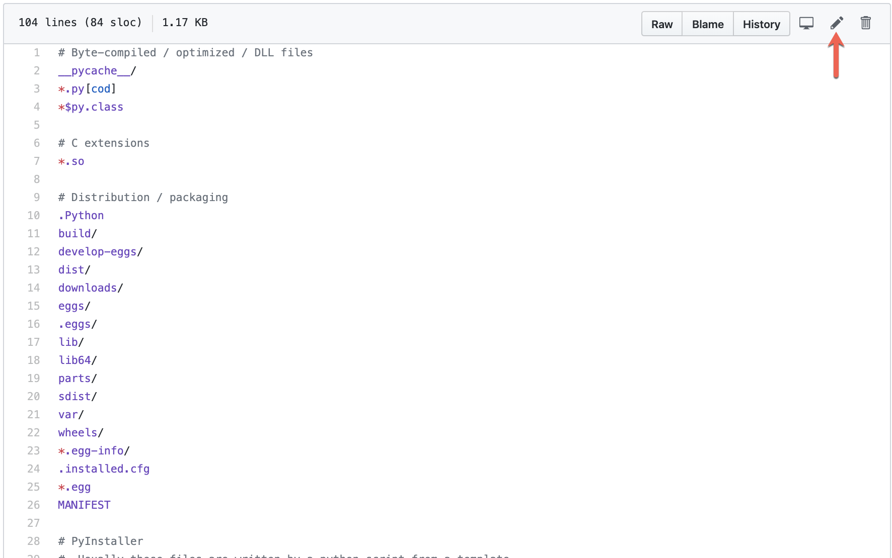
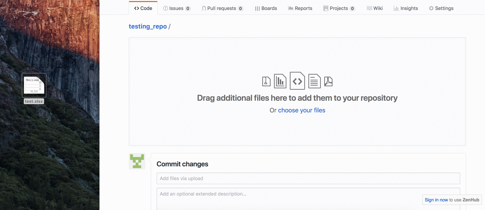
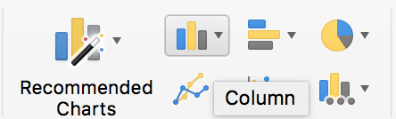
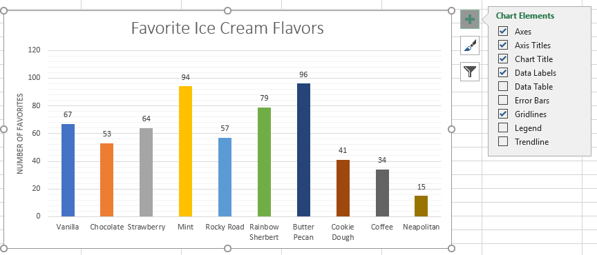
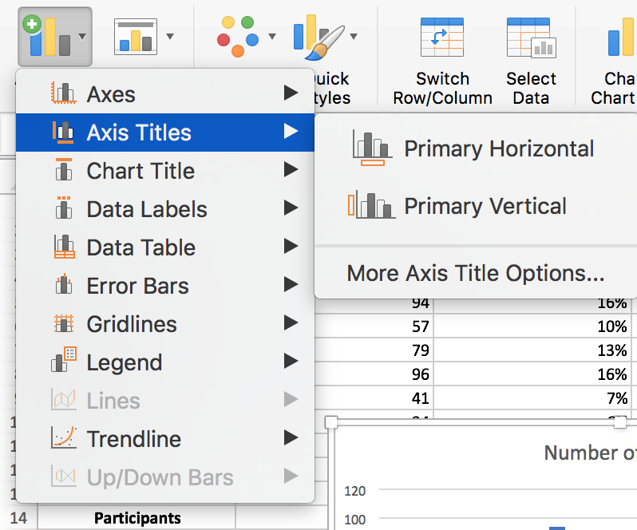
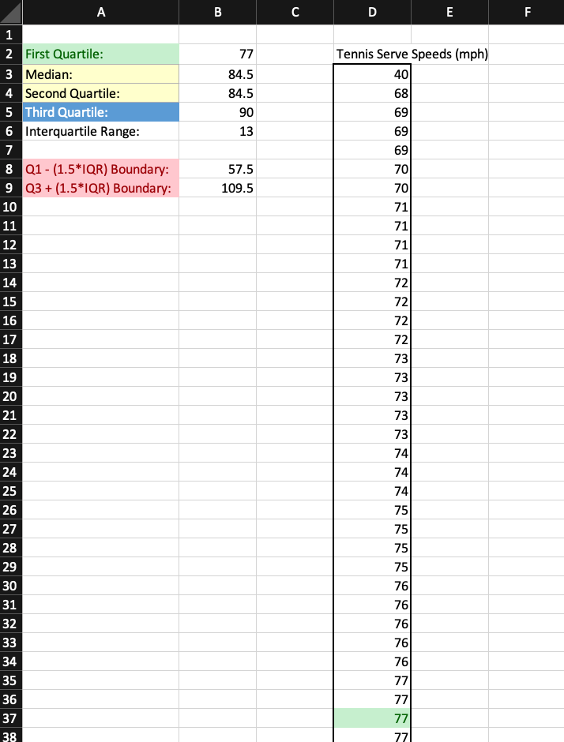
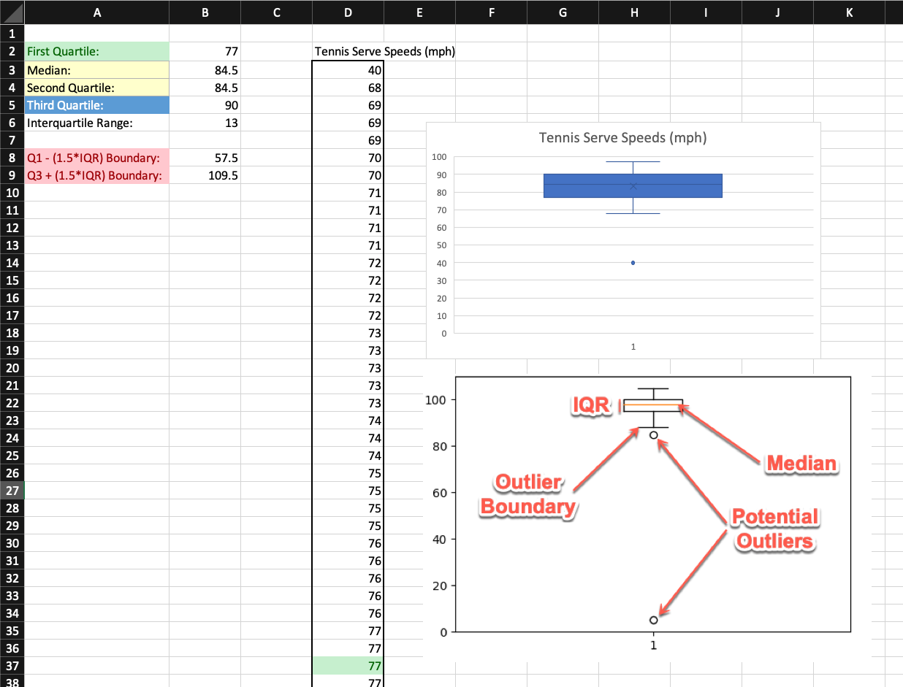

# 1.3 Charting a New Course With Excel

## Overview

Today's class will introduce students to both basic and advanced charting in Excel, teaching them everything they need to know to make data visualizations.

## Class Objectives

* Students will create, modify, and stylize basic charts from scratch using Microsoft Excel.
* Students will comfortable creating scatter plots and trend lines.
* Students will have a firm understanding of how to create charts that contain filtered data.
* Students will know how to create regressions and calculate moving averages using Excel.

## Instructor Prep

<details>
  <summary><strong>Instructor Notes</strong></summary>

* You may find that this lesson falls on a weekday due to a holiday shifting the course schedule. In this case, we have provided notes within the LP that will allow you to **easily adjust the length of the lesson to fit into a weekday class**.

  * Be on the lookout for a ⏰**3-Hour Adjustment** note at the top of activities in this Lesson Plan. If this class is being taught on a weekday, please utilize the directions found in the note. Keep in mind that breaks will be reduced from 40 minutes to the typical 15 minutes for a weekday class as well.

  * Shortening these activities could potentially limit the students' ability to finish them, so please remind them to utilize office hours to clear up any questions they may have.

* When the lesson plan calls for files to be sent to students there are a few ways to do so. For the first couple of weeks it may be easiest to use Slack, but as the files and directories get more complex you may look to try alternate methods such as pushing and pulling from GitHub/GitLab and sending out the link, using a file storage like google drive, or zipping up files and continuing to Slack out. Please use whatever method you find most comfortable for sending files out to students.

* Send out out the installation [instructions](../../../00-Prework/Conda_Installation.md) for Anaconda and ask that students work with TAs during the next week to install Anaconda and Python. This will help resolve installation issues before the Python unit.

* Please reference our [Student FAQ](../../../05-Instructor-Resources/README.md#unit-01-excel) for answers to questions frequently asked by students of this program. If you have any recommendations for additional questions, feel free to log an issue or a pull request with your desired additions.

* Have your TAs refer to the Time Tracker to stay on track.

* Lastly, as a reminder these slideshows are for instructor use only - when distributing slides to students, please first export the slides to a PDF file. You may then send out the PDF file.

</details>

<details>
  <summary><strong>Sample Class Video</strong></summary>

* To view an example class lecture visit (Note video may not reflect latest lesson plan): [Class Video](https://codingbootcamp.hosted.panopto.com/Panopto/Pages/Viewer.aspx?id=9d629fc9-bf16-4f5f-b11d-b96fcd1adf67)

</details>

- - -

# Class Activities

## 1. Instructor Presentation

| Activity Time:       0:40 |  Elapsed Time:      0:40  |
|---------------------------|---------------------------|

<details>
  <summary><strong>📣 1.1 Instructor Do: Welcome Class (0:05)</strong></summary>

* You may choose to open up the [slideshow](https://docs.google.com/presentation/d/1pJa1TZABU9A5sGXxak7XimvBMlzGin-TZ0EKKQDKVvk) and step through slides 1-5 to facilitate your welcome to the class. Otherwise cover the following talking points:

  * Welcome your students to their first ever extended class.

  * Explain that today's class is four hours, which means we have ample time to round out our discussion on visualizations and summary statistics in Excel.

  * Explain that we will use our combined knowledge from the past two classes to work through more advanced activities.

  * Reassure students that we will take our time with each concept and encourage the students to ask questions.

  * If this is the first combined class, take a few moments to have each professor and TA introduce themselves briefly. This way all of the students will feel comfortable asking questions to any member of the instructional team.

</details>

<details>
  <summary><strong>🎉 1.2 Everyone Do: Adding files to GitHub (0:15)</strong></summary>

* ⏰**3-Hour Adjustment**: Reduce activity time to 10 minutes.

* You may choose to open up the [slideshow](https://docs.google.com/presentation/d/1pJa1TZABU9A5sGXxak7XimvBMlzGin-TZ0EKKQDKVvk) and step through slides 6-9 to accompany the beginning of this next activity. Otherwise cover the following talking points:

  * Explain that "GitHub offers a centralized location where all developers can push and pull (upload and download) their code."

  * Point out that GitHub always holds the most up-to-date code and files, handling everyone's updates appropriately.

  * Explain that for now, we will only need to know how to use the GUI for GitHub in order to submit homework.

  * Explain that later in the course, we will learn to work with GitHub through the terminal using Git.

  * Point out to students that as with many skills, Git and GitHub get easier with use.

* Have the students follow along with the following steps:

  * Visit <https://github.com> and ask students to login to their personal accounts.

  * From the main page, create a new repository with an initialized `README.md` file. Explain that the convention in the software world is for each repository to have a "README" file that explains what the repository contains.

    

  * Make the repository public so TAs can have access to it for grading.

  * Click on the "Add .gitignore" and type "Python".

    

  * Click the green "Create repository" box. After clicking "Create repository", you’ll now be on the "homepage" of your repository.

    * The purpose of the "gitignore" file that you added to the repository is to ensure that files not tracked by GitHub remain untracked.

    * Click on the `.gitignore` file on your repository to open it.

      

    * In the `.gitignore` file you can see many different files by extension and distribution packages that won’t be tracked for this repository.

      

    * If you don’t want GitHub to track a file you can edit the `.gitignore` file by adding the file name or file extension.

    * Let's untrack a common file, `.DS_Store` for this repository. The `.DS_Store` file is created and maintained by the macOS Finder application in every folder, and has functions similar to the file `desktop.ini` in Microsoft Windows. We don't see this file in our folders.

      * Click on the pencil icon in the `.gitignore` file to edit the file.
      * Once in edit mode, add the following to the `.gitignore` above the `# Distribution / packaging` section.

      ```python
      # .DS_Store
      .DS_Store
      ```

      * Scroll to the bottom and enter the commit message. "Updating .gitignore file." where it says "Commit changes".
      * Click the green "Commit changes" button.

      

  * Switch back to computer's Desktop and create a new empty Excel file and save it. This will be used to demonstrate how to upload new files.

  * Navigate back to your repository homepage you created and click **Upload files**.

    

  * Choose your Excel file in the dialog box; instead of the "Upload Files" button, you may also drag files from your desktop to the GitHub web page for a repo. Add a commit message and commit the changes.

  * Finally, refresh the web page to show that the new file is now safely saved to the repository.

    

* Make sure that all the students have been able to follow along. Let students know that this will be how they will be submitting their homework for the first two weeks. Students will add all of the necessary files to their GitHub repo then submit the repository link to BCS.

* Encourage students to practice GitHub before the next class and to use office hours if they run into any problems.

</details>

<details>
  <summary><strong>📣 1.3 Instructor Do: Basic Charting (0:20)</strong></summary>

* ⏰**3-Hour Adjustment**: Reduce activity time to 15 minutes.

* During this walk-through, have the TAs send out the images for where things are located on the opposite operating system.

* You may choose to open up the [slideshow](https://docs.google.com/presentation/d/1pJa1TZABU9A5sGXxak7XimvBMlzGin-TZ0EKKQDKVvk) and step through slides 10-13 to accompany the beginning of this next activity. Otherwise cover the following talking points:

  * Point out that up until this class we haven't explored one of the major features of Microsoft Excel: visualizations.

  * Explain that this next activity will be an instructor walk-through of generating visualizations in Excel. Most of the commands and concepts are the same between Mac and Windows operating systems, but the software may look a bit different.

  * Reassure students that as we proceed through the walk-through, the TAs will be distributing the images of each step for both operating systems. Therefore everyone should be able to follow along using their own computers.

  * Explain that today we will concentrate on 4 primary types of plots - scatter plots, line plots, bar plots and box plots.

* Now open the [IceCreamFavesIceCreamFaves.xlsx](Activities/01-Ins_GitHub/Resources/IceCreamFaves.xlsx) file and select all of the data in columns A and B. Your selection should include the header rows containing the column labels and all rows containing data. Then navigate into the `Insert` tab at the top of the application to show off all of the nifty charting options that are available in the Charts group.

* **PC**

  

* **Mac**

  

* Excel allows its users to create many kinds of charts, but first we are going to be creating a bar chart since that fits our data nicely.

* Whenever you select a charting option from the Charts group, a new menu will appear that allows us to select various visual options. In the case of bar charts we can choose between 2D or 3D visuals with a horizontal or vertical layout.

  * For now, just stick with a vertical 2D chart since it is the most basic.

* Once a chart option has been selected, a new chart will automatically be placed in the spreadsheet. Clicking on this chart will allow us to edit it and, if we so wished, we could double-click on any one element to edit that piece more specifically.

  * For now, click on the chart's title to show your students that we can rename the chart whatever we would like. (Note that its title may be a generic "Chart Title" if you did not include the header rows in your selection).

* **PC**

  * Next, click on the plus sign to the right of our chart. This brings up a list of elements we can add/remove. Some of these elements have sub-elements which we can choose from as well.

    

  * Click on the "Axes Titles" option to add in titles for both our vertical and horizontal axes. Then click on the arrow to the right of the "Axes Titles" option to bring up the sub-menu, which allows us to choose the specific titles we would like to show.

  * By clicking on the paintbrush to the right of a chart, we can choose a number of basic visual styles from a list. We can also select a color scheme for our chart by selecting a palette from the Color group.

    

  * Selecting a new color palette may not seem to make much of a difference at first, but if we double-click on the bars of our chart a new menu will appear at the side of the application that allows us to format our bars. If we then click on the paint can and select the "Vary colors by point" option, each bar will be given a different color that fits the palette we selected for our chart earlier.

* **Mac**

  * Click on "Add Chart Element" on the left side of the ribbon and move down to "Axis Titles". Here, you can select Primary Horizontal or vertical.

    

  * Click on "Change Colors" on the ribbon to changes the colors of the bar graph (to the right of the "Add Chart Element").

  * Double click on any of the bars to bring up the "Format Data Series" menu. Here we can check the "Vary colors by point" option that will give each bar a different color.

    

* Point out that the format menu for a chart element can be brought up by double-clicking on any specific element. This gives us even more control over the look of our chart. Remember: the exact location of the formatting control may differ between versions of Excel.

* Let's say that we made a bar chart but then our employer told us they really wanted a pie chart. Lucky for us, Excel has an option which allows us to change a chart's type by simply going into the chart's right-click menu and selecting "Change chart type". This means we can turn a bar chart into a pie chart very easily.

  * You can also change a chart's type by selecting the chart, going into the Design tab's Type group, and clicking "Change Chart Type".

  * Turn that bar chart we have been working on into a pie chart. Make sure to add in the "Legend" element for our new pie chart. Otherwise no one will know what each slice of the pie corresponds to.

    * On Macs, you can add a legend by clicking on "Add Chart Element" on the ribbon again, and select add "Legend" and the location.

      

* Another type of graph that is necessary to understand is the line graph. The problem is that the data we currently have is not exactly ideal for creating a line graph... Ask your students why this is the case.

  * Our data does not show any changing trend over time. It instead compares a single piece of data across multiple named categories.

* Open [02-Ins_BasicCharting/Solved/BasicCharts.xlsx](Activities/02-Ins_BasicCharting/Solved/BasicCharts.xlsx) in Excel and go to the second sheet, named "Ice Cream Sales". This sheet contains data which shows how many scoops of ice cream flavors have been sold over a period of a year.

  * Select all of the data on this sheet and then choose a 2D line chart from the Charts group on the Insert tab. Remember: your selection should include the rows and columns containing labels.

    

  * Your students should notice just how cluttered this chart appears to be, which makes it difficult to glean any information from this chart.

    * **PC**: To filter the rows you'd like to show, choose the third option to the right of chart - this allows us to filter what categories of data we would like to show.

      * Select just a couple ice cream flavors from the list and then hit the "Apply" button to filter some data for our chart.

    * **Mac**: To filter what is shown on the chart, choose the `Home` tab, select column `A`, and click `Sort & Filter` in the right of the toolbar (may be hidden in the `Editing` tab at certain screen sizes). Once your column is in filter mode, click the arrow dropdown in its header cell: from there you will see options for sorting and filtering.

      

      * Select a few ice cream flavors from the list and show the chart updating.

    * It is important to note that the filter options listed here are only helpful in certain cases. When we would like to filter out data based upon some condition (e.g. greater than, less than, etc.) these limited filter options will not cut it.

* Answer any questions your students may have before moving onto the next activity.

</details>

- - -

## 2. The Line and Bar Grades

| Activity Time:       0:20 |  Elapsed Time:      1:00  |
|---------------------------|---------------------------|

<details>
  <summary><strong>✏️ 2.1 Students Do: The Line and Bar Grades (0:15)</strong></summary>

⏰ **3-Hour Adjustment**: Reduce activity time to 10 minutes.

* For this activity, our students are going to take upon themselves the role of a teacher as they create a series of bar and line graphs that visualize the grades of their class over the course of a semester.

* You may choose to open up the [slideshow](https://docs.google.com/presentation/d/1pJa1TZABU9A5sGXxak7XimvBMlzGin-TZ0EKKQDKVvk) and step through slides 14-16 to accompany this next activity.

* **Files:**

  * [README](Activities/03-Stu_LineAndBar/README.md)

  * [03-Stu_LineAndBar/StudentGrades_Unsolved.xlsx](Activities/03-Stu_LineAndBar/Unsolved/StudentGrades_Unsolved.xlsx)

</details>

<details>
  <summary><strong>⭐ 2.2 Review: The Line and Bar Grades (0:05)</strong></summary>

* Open and send out the [03-Stu_LineAndBar/StudentGrades_Solved.xlsx)](Activities/03-Stu_LineAndBar/Solved/StudentGrades_Solved.xlsx) version of the previous activity before going over it with your students. Make certain to answer any questions they may have to the best of your ability before moving onto the next section.

* One of the key factors to cover here is in filtering data within the line chart. Without picking and choosing which students we want to look at in specific, the chart is overcrowded and difficult to read. Sometimes, as in cases like this one, less data on a chart is better than more.

  * They'll also need to "Switch Row/Column" from the Chart Design menu on the line graph.

</details>

<sub>[Having issues with this activity? Report a bug!](https://bit.ly/3aEtBrT)</sub>

- - -

## 3. Video Game Sales - Scatter Plots

| Activity Time:       0:25 |  Elapsed Time:      1:25  |
|---------------------------|---------------------------|

<details>
  <summary><strong>📣 3.1 Instructor Do: Scatter Plots and Trend Lines (0:10)</strong></summary>

* You may choose to open up the [slideshow](https://docs.google.com/presentation/d/1pJa1TZABU9A5sGXxak7XimvBMlzGin-TZ0EKKQDKVvk) and step through slides 17-19 to accompany the beginning of this next activity. Otherwise cover the following talking points:

  * Explain that a scatter plot consists of a scattering of points on a graph and it is extremely handy when checking for relationships between two variables.

  * Point out that both line and scatter plots visualize the relationship between two variables, but their purposes are different. Line plots are used to compare a continuous variable such as time or temperature, while scatter plots are used to compare independent measurements.

  * Explain that the main purpose of a scatter plot is to visualize trends or clusters in the data.

  * Explain that scatter plots are one of the most common plots because we can visualize huge amounts of data without making a visualization feel too busy.

* Once again the TAs should send out the images of each step for both operating systems. Therefore,everyone should be able to follow along using their own computers.

* Open [04-Ins_ScatterPlot/ScatterPlot.xlsx](Activities/04-Ins_ScatterPlot/Solved/ScatterPlot.xlsx) in Excel, navigate into the "Normal Trend" worksheet, and show your students how we are using a scatter plot to compare an individual's salary to the price of their car.

* **PC**

  * Adding a trend line to a chart is very simple. Simply click on the plus symbol to the right of your selected chart and click the "trendline" option.

    

* **Mac**

  * Click "Add Chart Element" on the left side of the ribbon and move down to "Trendline" and select the one that best fits our data.

    

* Our original scatter plot showed the most common form of trend line, a straight line, but there are other kinds of trend lines as well that may fit some data sets better.

  * Navigate into the second sheet of the Excel workbook, named Power Trend, and show your students how the Y variable increases exponentially in relation to the X variable. Due to this, the "Power" trend line would fit this data set better.

    * **PC**

      * In order to change the type of trend line that is being used, simply double-click on a chart's trend line and then select one of the options presented to you.

        

    * **Mac**

      * Click "Add Chart Element" on the left side of the ribbon and move down to "Trendline". This time select "More Trendline Options" to bring up the "Format Trendline" menu.

      * Check the "Power" option.

        

* Navigate into the third sheet of the Excel workbook, named Exponential Trend, and show your students how this data set's second value increases exponentially based upon the row it is contained within. This means that an "Exponential" trend line would best fit this data.

* Another aspect of creating and modifying charts can be done via configuring the axes themselves. For example, if our data increases exponentially, then we may wish to consider creating a chart with axes that also increase exponentially.

  * This can be done by double-clicking on an axis and then changing the bounds, units, and the methods through which the axes are displayed.

  * **Mac**

    

  * Make sure to let your students know that although editing axes does allow for more customization, it can also be used to make charts misleading. For example, if we used larger units on a data set whose values are fairly low, we could make it look as if the correlation between two variables were far smaller than it really is.

* Students may be wondering how to reverse the X and Y axes of their charts and, unfortunately, there is no simple way to do this for scatter plots. This means that the best way to handle swapping axes is to reverse their positions on the table.

  * This is made all the more annoying by the fact that Excel's charts look at specific positions and ranges. That means that, if you move around data to make one chart, it could change other charts you have created. The best way to avoid this is to copy your chart and paste it into an external program like paint where changing a table's values cannot affect it.

* Answer whatever questions your students may have before moving onto the next activity.

</details>

<details>
  <summary><strong>👥 3.2 Partners Do: Video Game Sales (0:10)</strong></summary>

* Looking into a product's sales within a region and comparing it to that product's sales worldwide is a great way to determine how important a region is to a company. In this activity, students will pair up in order to create a series of scatter plots which will compare video game sales across regions.

* You may choose to open up the [slideshow](https://docs.google.com/presentation/d/1pJa1TZABU9A5sGXxak7XimvBMlzGin-TZ0EKKQDKVvk) and step through slides 20-22 to accompany this next activity.

* **Files:**

  * [README](Activities/05-Par_GameSales-ScatterPlots/README.md)

  * [Activities/Unsolved/Par_GameSales-ScatterPlots/VideoGameSales_Unsolved](Activities/05-Par_GameSales-ScatterPlots/Unsolved/VideoGameSales_Unsolved.xlsx)

</details>

<details>
  <summary><strong>⭐ 3.3 Review: Video Game Sales (0:05)</strong></summary>

* Open and send out [05-Par_GameSales-ScatterPlots/VideoGameSales_Solved.xlsx](Activities/05-Par_GameSales-ScatterPlots/Solved/VideoGameSales_Solved.xlsx) to your students. Make certain to answer any questions they may have to the best of your ability before moving onto the next section.

* Point out to your class how all of these charts use linear trend lines. Discuss with your students why this might be the case and collect a few of their answers before moving onto the next activity.

</details>

<sub>[Having issues with this activity? Report a bug!](https://bit.ly/2xDJoZr)</sub>

- - -

## 4. Filter Game Sales

| Activity Time:       0:35 |  Elapsed Time:      2:00  |
|---------------------------|---------------------------|

<details>
  <summary><strong>🎉 4.1 Everyone Do: The Need to Filter (0:10)</strong></summary>

* You may choose to open up the [slideshow](https://docs.google.com/presentation/d/1pJa1TZABU9A5sGXxak7XimvBMlzGin-TZ0EKKQDKVvk) and step through slides 23-26 to accompany the beginning of this next activity. Otherwise cover the following talking points:

  * Point out that in the previous activity, the video game data set contained far more information than what we needed.

  * Explain that the video game data set contained variables such as "Publisher", which we could theoretically use in order to look into the sales for specific companies.

  * Explain that the most straightforward way to look at a subset of data in Excel is to use the built-in filter functionality. Excel can filter data in a spreadsheet and make a chart from the subsetted data.

* Now send out the [06-Evr_PigeonRacing-Filter/Unsolved/PigeonRacing.xlsx](Activities/06-Evr_PigeonRacing-Filter/Unsolved/PigeonRacing.xlsx) activity notebook to the class. Walk-through this activity with the class, pausing frequently to allow students to catch up.

* Tell your students that this is real data from a pigeon racing competition. What is pigeon racing? Why are there people who race pigeons? No clue, but it is a fun data set.

* Select the first row of data on the sheet and then, in the Editing group of the Home tab, click on the "Sort & Filter" button. Next, select "Filter" from the menu that appears.

  * Arrows should appear at the top of each column. By clicking on these arrows, we can choose which rows we would like to filter out of our chart based upon the values that are contained within that column.

    * For example, in the "Sex" column, if we select H then the sheet will display all the rows with an H value. (H = Hen, C = Cock)

  * We can then create charts using only the data that is left behind. So if we wanted to create a chart which only takes into account the times for H gendered pigeons, we could now do so.

  * It is very important to note that whatever charts we create using filters will be modified if we change the filtering options again. The way in which to preserve your filtered charts, therefore, is by copying them to an external program like paint or word.

* Play around with this sheet's filtering options with your students for a bit before taking questions and answering them to the best of your ability.

* Another cool thing that you can do to create charts from filtered data is to create a "Pivot Chart".

  * **PC**

    * Pivot charts operate in much the same way as pivot tables do, allowing users to aggregate data of similar types and then create visualizations for them.

    * To create a pivot chart, simply navigate into the Charts group of the Insert tab and select "Pivot Chart" from the options available. Once that is done, simply set up the pivot table you desire and a chart will be created based off of it.

      

  * **Mac**

    * We can also create what is called a Pivot Chart.

    * **NOTE:** There is an issue with some versions of Excel 2016 for Mac. If you find a student have this problem, make sure they update their Excel version: it works on updated versions.

    * There will be students who may worry, but assure them it can be done. Don't believe all the dramatic Google search results!

    * First create a pivot table using Sex as our row values. "POS" and "Speed" as value.

    * Click the **!** next to them and switch to **Max** and this will create our pivot table.

    * The result should look as follows

      

    * Locate "Insert" on the ribbon add any recommended chart to create a Pivot Chart.

    * Now when you play around with the filters in our pivot table, the chart will adjust.

</details>

<details>
  <summary><strong>👥 4.2 Partners Do: Filter Game Sales (0:20)</strong></summary>

⏰ **3-Hour Adjustment**: Reduce activity time to 10 minutes.

* Now that we know how to apply filters to a spreadsheet and create charts based on filtered data sets, lets take some time to create charts which compare the sales of publishers against one another.

* You may choose to open up the [slideshow](https://docs.google.com/presentation/d/1pJa1TZABU9A5sGXxak7XimvBMlzGin-TZ0EKKQDKVvk) and step through slides 27-29 to accompany this next activity.

* **Files:**

  * [README](Activities/07-Par_FilterGameSales/README.md)

  * [07-Par_FilterGameSales/VideoGameSales2_Unsolved.xlsx](Activities/07-Par_FilterGameSales/Unsolved/VideoGameSales2_Unsolved.xlsx)

</details>

<details>
  <summary><strong>⭐ 4.3 Review: Filter Game Sales (0:05)</strong></summary>

* Open and send out [07-Par_FilterGameSales/VideoGameSales2_Solved.xlsx](Activities/07-Par_FilterGameSales/Solved/VideoGameSales2_Solved.xlsx) to your students. Make certain to answer any questions they may have to the best of your ability before moving onto the next section.

* **Note** The images for scatter plots in the exercise will be saved in [Nintendo Scatter plot](Activities/07-Par_FilterGameSales/Solved/NintendoVsCritic.png) and [EA Scatter plot](Activities/07-Par_FilterGameSales/Solved/NintendoVsCritic.png)

* Demonstrate that first we select row one and create our filter off of there.

  

* Once you have this, filter "Publisher" to "Nintendo".

  

* Explain how to get rid of empty cells by going to the filter for "Critic_Score" and un-checking the "Blanks" box.

* Explain how, in order to create the chart, we need to highlight the columns "Publisher" and "Critic_Score" before inserting a 'scatter plot.'

  * To add labels, click on the Chart Design tab on the ribbon and click "Add Chart Element" and select "Axis Titles".

* Save the image and repeat for "Electronic Arts"

* Explain that for the filtered chart, we first select all the data and create a pivot table.

  * Set the Filter to "Publisher"

  * Set the row as "Year_of_release"

  * Set the values as "Global_sales"

* Finally set the publisher to whomever you want, then highlight the year and sales columns and create a line graph.

* As your students may have noticed during this activity, the charts they created changed whenever they altered their filters. Point out to them once again why this denotes the importance of saving charts externally.

</details>

<sub>[Having issues with this activity? Report a bug!](https://bit.ly/343Sbjv)</sub>

- - -

## Break

| Activity Time:       0:40 |  Elapsed Time:      2:40  |
|---------------------------|---------------------------|

⏰ **3-Hour Adjustment**: Reduce break time to 15 minutes.

- - -

## 5. Variance, Standard Deviation, and Z-Score

| Activity Time:       0:40 |  Elapsed Time:      3:20  |
|---------------------------|---------------------------|

<details>
  <summary><strong>📣 5.1 Instructor Do: Variance, Standard Deviation and Z-Score (0:20)</strong></summary>

* Welcome the students back from break. Explain to the students that for the remainder of class will be focusing on statistics.

* Explain that these next activities will be introducing statistical topics that may be new to most people.

* Reassure the students that we will be revisiting these topics throughout the curriculum, so it is ok if it feels overwhelming at first.

* You may choose to open up the [slideshow](https://docs.google.com/presentation/d/1pJa1TZABU9A5sGXxak7XimvBMlzGin-TZ0EKKQDKVvk) and step through slides 31-40 to accompany the beginning of this next activity. Otherwise cover the following talking points:

  * Remind students that yesterday we discussed the measures of central tendency, which are used to describe the center of a data set.

  * Explain that today we will discuss the **summary statistics** that are used to describe the variability of a data set.

  * Explain that in statistics, **variance**, **standard deviation** and **z-score** are the **summary statistics** used to describe the variability in data.

  * Explain that **variance** describes overall how far values in the data set are from the mean. In other words, **variance** describes how much variation exists within the data.

  * Show the students the equation for variance.

  

  * Reassure students that it is not critical to know how to manually calculate **variance**. Almost all analytical tools and programming languages have functions to calculate **variance** for us.

  * Explain that the most important takeaway from the equation is that the variance calculation considers the distance of each value in the data set from the center of the data.

  * Point out that it does not matter if a value is above or below the mean of the data set, because the difference is squared, the **variance** will always be positive.

* Open [08-Ins_Variance-SD-Zscore/Variance-SD-Zscore.xlsx](Activities/08-Ins_Variance-SD-Zscore/Solved/Variance-SD-Zscore.xlsx) in Excel.


* Explain that this data set contains the monthly average rainfall for Washington, D.C. and Manaus, Brazil. Explain that Washington is considered a humid, subtropical climate, while Manaus, Brazil is considered a tropical monsoon climate.

* Point out that we can visually assert from the bar chart that the overall rainfall in Washington is less than that of Manaus. However, the amount of rainfall per month changes substantially more in Manaus than Washington.

* Explain that we can calculate the total variance of rainfall for each city using Excel's `VAR.P` function.

* Point out that the variance of annual rainfall in Washington is only 0.17, while the annual rainfall in Manaus is 11.04. Therefore, we can quantitatively determine that the overall rainfall is less variable in Washington than in Manaus.

* Explain that one problem with using variance to describe a data set is that the units of variance are not the same units as the mean, nor the same units as the data set itself.

* Explain that in the variance equation we divide the squared distance of each data point versus the mean. Therefore the variance is in terms of the unit of measurement, squared.

* Explain that in the first example we would say that the average rainfall annually in Washington was 3.6 inches, with a variance of 0.17 inches squared.

* Caution that depending on the complexity of the measurement, describing the variability in terms of units squared may be complicated.

* You may choose to return to the [slideshow](https://docs.google.com/presentation/d/1pJa1TZABU9A5sGXxak7XimvBMlzGin-TZ0EKKQDKVvk) and step through slides 41 and 42 to accompany the next section of the activity. Otherwise cover the following talking points:

  * Explain that in statistics, we use the **standard deviation** to interpret how _spread out_ the data is from its mean.

  * Explain that **standard deviation** can be derived from the variance by calculating the square root of the variance metric. Additionally, most analytical tools and programming languages have functions to calculate the **standard deviation** directly.

  * Point out that by calculating the square root of the variance, the **standard deviation** describes the variability of the data using the same units as the mean.

* Show the students the next sheet in the Excel workbook.


* Explain that this is the same rainfall data set from the previous sheet, except now we have calculated the standard deviation of both cities using the `STDEV.P` function in Excel.

* Point out that we also manually calculated the standard deviation by taking the square root of the variance, both standard deviation calculations are equal.

* Explain that under certain circumstances the standard deviation becomes an even more powerful statistical tool than just describing the variability of the data.

* Explain that when a data set is considered to be **normally distributed** the standard deviation can be used to describe how many data points are close to the mean.

* Reassure students we will discuss **normal distributions** later in the course, but for now we will use a general rule of thumb - when measurements in a data set are obtained independent of one another, the data is considered to be normally distributed.

* Explain that in this case, each rainfall measurement was obtained independently month-to-month and region-to-region. Therefore we will assume the data is normally distributed.

* Explain that when a data set is normally distributed, the data points follow a **68-95-99.7** rule.

* Explain that with the **68-95-99.7** rule, roughly 68% of all values in a data set fall within one standard deviation of the mean (in either direction). Additionally, 95% of the values fall within two standard deviations, and 99.7% of the values fall within three standard deviations.

* Show the students the next sheet in the Excel workbook.


* Explain that in this sheet we have taken the same rainfall data as before, calculated the mean and standard deviation, and calculated the boundary values of one standard deviation from the mean in either direction.

* Point out that from the Washington data, eight of the twelve months fall within one standard deviation, or 67% of all data points.

* Point out that from the Manaus data, only six of the twelve months fall within one standard deviation, or 50% of all data points.

* Explain that although this rule is not perfect, the 68-95-99.7 helps analysts to extrapolate characteristics about a data set using only summary statistic values.

* Explain that we have now studied two different statistic values to describe the overall data set in terms of distance from the mean.

  * "But what if we wanted to describe a single data point in terms of its distance from the mean?"

* You may choose to return to the [slideshow](https://docs.google.com/presentation/d/1pJa1TZABU9A5sGXxak7XimvBMlzGin-TZ0EKKQDKVvk) and step through slides 43 and 44 to accompany the next section of the activity. Otherwise cover the following talking points:

  * Explain that we can calculate a data point's **z-score** to measure its distance from the mean in terms of standard deviations.

  * Show the students the equation for z-score:

  

  * Explain to students that not all programming languages and software tools contain a function to calculate **z-score**. Therefore, we will be calculating the z-score manually using the standard deviation and the mean of the data.

  * Reassure students that we will be distributing the Excel workbook to use as reference later if they ever forget how to calculate the z-score.

  * Explain that the z-score can be positive or negative. If the z-score is negative, the data point is less than the mean, or if the z-score is positive, the data point is more than the mean.

* Show the students the last sheet in the workbook.


* Explain that on this sheet we have now used the mean and standard deviation to calculate the z-score for rainfall each month for both cities.

* Point out that the z-scores provides an overview of each value in a data set where we can easily determine which values are the most extreme relative to the mean.

* Point out that in this example data set, the most extreme difference in rainfall from the mean was February in Washington, and August in Manaus. In both instances the average monthly rainfall was far below the mean.

* Send out the [08-Ins_Variance-SD-Zscore/Variance-SD-Zscore.xlsx](Activities/08-Ins_Variance-SD-Zscore/Solved/Variance-SD-Zscore.xlsx) workbook for students to refer to later.

</details>

<details>
  <summary><strong>✏️ 5.2 Students Do: Variance, Standard Deviation and Z-Score Review (0:15)</strong></summary>

* ⏰**3-Hour Adjustment**: Reduce activity time to 10 minutes.

* You may choose to open up the [slideshow](https://docs.google.com/presentation/d/1pJa1TZABU9A5sGXxak7XimvBMlzGin-TZ0EKKQDKVvk) and step through slides 45-47 to accompany this next activity.

* **Files:**

  * [README](Activities/09-Stu_VarSDZScoreReview/README.md)

  * [09-Stu_VarSDZScoreReview/variance_review.xlsx](Activities/09-Stu_VarSDZScoreReview/Unsolved/Variance_Review_Unsolved.xlsx)

</details>

<details>
  <summary><strong>⭐ 5.3 Review: Variance, Standard Deviation and Z-Score (0:05)</strong></summary>

* Open the solution workbook [09-Stu_VarSDZScoreReview/variance_review.xlsx](Activities/09-Stu_VarSDZScoreReview/Solved/Variance_Review_Solved.xlsx) and move to the second sheet.


* Point out that the first step was to name the sheet "Summary Table" and copy over the `Team` names.

* Explain that once we have copied the team names we use the `AVERAGE`, `VAR.P` and `STDEV.P` functions to calculate the mean, variance and standard deviation, respectively.

* Point out that the cleanest way to calculate these values in Excel is to start typing out the formula on the "Summary Table" sheet and then click on the range of values we want to calculate from the raw data sheet.

* Demonstrate how to calculate the mean `PTS` (overall season points per player) for the `CLE` (Cleveland Cavaliers) using the `AVERAGE` function across both sheets.


* Explain that we must repeat this process for each team and each function.

* Explain that once we have the summary table we can answer the questions from the activity.

* Explain that the team with the biggest difference in total season points would be the team with the largest `PTS` standard deviation - the Golden State Warriors.

* Explain that the team with the least variable player age was the Miami Heat, and their average player age was 26.6 years old.

* Explain that the team with the least variable field goals per player was the Los Angeles Lakers.

* Show the students the next sheet in the workbook.


* Explain to the students that once we copy over the `Player` and `PTS` columns, we need to calculate the mean and standard deviation for the team.

* Point out to the students when calculating the z-scores, it is important to always report the mean and standard deviation in addition to the calculated values. In this example we placed the mean and standard deviation below the last player's row.

* Ask the students how they would interpret the z-scores for the Cleveland Cavaliers. Ask them what do the z-scores tell us about each player in terms of points?

* Explain that the player with the largest difference in overall points from the mean of the team would be the player with the largest magnitude z-score. This means that we are looking for the largest absolute value of the z-score regardless if the z-score is positive or negative.

* Explain that the z-score is showing us each player's total contribution of points compared to the rest of the team throughout the season. In the crudest sense, we are determining player "value" to the team.

* Explain that in this example LeBron James had the largest difference in overall points from the mean of the team. Therefore, we could say that LeBron is the most valuable player to the Cleveland Cavaliers in terms of points.

* Show the students the last sheet in the workbook.


* Explain to the students that pivot tables can be used to vastly speed up the process of calculating summary statistics in Excel.

* Explain that the first step in generating a pivot table would be to go to Insert > PivotTable and select the data from the first worksheet.

* Point out to the students that they do not need to copy over every column into the pivot tables, in this example we can simply use columns `A` through `H`.

* Explain that once we have our columns and new pivot table generated, we can start to build our summary statistics table.

* Explain that in order to reproduce our "Summary Table" we need to use the `Tm` (Team) column as our "Rows".

* Explain that once we have designated the rows in the pivot table, we bring each field down to the "Value" section.

* Explain that for each value, we must designate whether the summary value will be the mean, variance or standard deviation. This can be done by changing the field settings by right-clicking on the value.

* Demonstrate to the students how to change the `Average of PTS` value to `Max of PTS` and back to `Average of PTS`.


* Point out that pivot tables trivialize the process of generating summary statistics in Excel.

* Explain that pivot tables reduce the overhead of switching back and forth between sheets to calculate the mean, variance and standard deviation. Pivot tables also reduce the chance of errors.

* Send out the solution workbook [09-Stu_VarSDZScoreReview/variance_review.xlsx](Activities/09-Stu_VarSDZScoreReview/Solved/Variance_Review_Solved.xlsx) for students to review later.

</details>

<sub>[Having issues with this activity? Report a bug!](https://bit.ly/3dO4SDx)</sub>

- - -

## 6. Outliers - Drawn and Quartiled

| Activity Time:       0:30 |  Elapsed Time:      3:50  |
|---------------------------|---------------------------|

<details>
  <summary><strong>📣 6.1 Instructor Do: Quantiles, Outliers and Boxplots (0:15)</strong></summary>

* You may choose to open up the [slideshow](https://docs.google.com/presentation/d/1pJa1TZABU9A5sGXxak7XimvBMlzGin-TZ0EKKQDKVvk) and step through slides 48-52 to accompany the beginning of this next activity. Otherwise cover the following talking points:

  * Remind students that when we are characterizing a data set, we need to be careful that our summary statistics don't misrepresent the data.

  * Explain that one of the biggest challenges in statistics is the fact that real-world data is imperfect. Often times real-world data will contain extreme values that can skew our interpretations, especially when we try to describe the center of a data set.

  * Explain that one of the simplest methods of describing real-world data is to break up a data set into smaller segments.

  * Explain that in statistics, we use **quantiles** to describe segments of a data set.

  * Explain that **quantiles** are the "cut points" that separate a sorted data set into equal-sized fragments.

  * Explain that the two most popular types of **quantiles** are **quartiles** and **percentiles**.

  * Explain that **quartiles** divide up a data set into four equal parts, and **percentiles** divide a data set into 100 equal parts.

* Open up the activity workbook [10-Ins_QuantilesOutliersBoxplots/quantiles_outliers_boxplots.xlsx](Activities/10-Ins_QuantilesOutliersBoxplots/Solved/quantiles_outliers_boxplots.xlsx) and show the students the first sheet.


* Explain that this data set is a sorted list of 11 values ranging between 10 and 100.

* Ask the students if they remember what we call the center of a sorted data set.

* If no student can recall, remind them that the center of a sorted data set is known as the median.

* Explain that the median can also be considered the cut point that divides a data set into two equal parts. Therefore, the median can also be called the **second quartile** or **Q2**.

* Point out that the median of this data set is 55. There are five values below 55 and five values above 55.

* Explain that the **first quartile** (also known as **Q1**) is the median of the first set of values separated by **Q2**. Alternatively, the **third quartile** (also known as **Q3**) is the median of the second set of values separated by **Q2**.

* Point out this example is very simplified and its easy to see where the cut points should be in order to make four equally-sized groups of data.

* Show the students the next sheet in the workbook.


* Explain that this data is a sorted list of a professional tennis player's serve speeds. In total 137 measurements were made ranging from 68 to 97 mph.

* Explain that when a data set is large, it can be difficult to determine where the quartiles are.

* Explain that we can use the `QUARTILE.EXC` function in Excel to calculate the quartile values.

* Explain that the input to the `QUARTILE.EXC` function is a range of values and the number corresponding to which quartile it should calculate.

* Point out that in this data set the quartiles divide the data into groups of 34 values, with one group consisting of 35 values.

* Explain that quartiles allow us to make observations about the data set without the need to plot the distribution of values.

* Explain that one observation we can make is that on average, the tennis player serves around 85 mph.

* Explain that another observation we can make is that 50% of the tennis player serves were between 77 and 90 mph.

* Explain that because quartiles divide the data into 4 equal segments, the range between Q1 and Q3 covers roughly 50% of all data points.

* Explain that this range is known as the **interquartile range**, or **IQR** for short. In statistics the **interquartile range** is used to help identify the most trustworthy measurements in a data set. The **interquartile range** is calculated by subtracting Q1 from Q3.

* You may choose to return to the [slideshow](https://docs.google.com/presentation/d/1pJa1TZABU9A5sGXxak7XimvBMlzGin-TZ0EKKQDKVvk) and step through slides 53-55 to accompany the next section of the activity. Otherwise cover the following talking points:

  * Explain that in data science, we call suspicious data points that are at either extreme of a data set **potential outliers**.

  * Explain that an **outlier** is a data point that differs from the rest of a data set.

  * Explain that **outliers** can be caused by changes in data collection methods,  experimental error, a malfunction of a machine, or any general source of unaccounted variability when generating a data set.

  * Explain that **outliers** cause a data set to alter its distribution, which causes issues when we try to characterize a data set with summary statistics. Therefore, it is critical to identify **potential outliers** in a data set before moving forward with any analysis.

  * Explain that there are two common ways to identify potential outliers in a data set.

  * Explain that the most common qualitative method to identify potential outliers is by using a **box and whisker plot**.

  * Explain that the **box and whisker plot** is also known as a **box plot** and shows the distribution of values from a single list.

  * Explain that the most common quantitative method to identify potential outliers is to use the `1.5*IQR` rule.

  * Explain that the `1.5*IQR` rule states that any data point that is 1.5 times the interquartile range lower than Q1 could be a potential outlier. Alternatively, any data point that is 1.5 times the interquartile range higher than Q3 could be a potential outlier.

* Show the students the next sheet in the workbook.



* Explain that the third example is the same professional tennis serve speed data set, except that there is a new 40 mph data point.

* Explain to the students that with real-world data, is is common to see suspicious data points at the low and high end of a sorted data set.

* Ask the students if they think that based upon the rest of the data, is the 40 mph data point trustworthy.

* Caution students that we have to be careful how we identify and correct for outliers.

* Explain that if we remove data points that are not outliers, or report data without disclosing that we removed data points, we can be held liable for showing deceptive statistics.

* Explain that in this example the lower boundary of the `1.5*IQR` rule is 57.5 mph. Therefore the new 40 mph data point could be considered an outlier, and we could remove that value from our calculations.

* Remind the students if we were to remove the potential outlier, it is critical to report that the value was removed alongside any table or figure generated from the data set.

* Show the students the last worksheet.



* Explain that **box plots** are a very powerful plot that provides a number of summary statistics at a glance.

* Explain that most analytical tools and programming languages have methods to build a **box plot**, and most **box plots** use the same shapes and styles to convey summary statistics.

* Point out to the students the annotated diagram below the Excel chart.

* Explain that the box in a box plot is the interquartile range, and the line in the middle of the box is the median of the data set.

* Explain that sometimes a box plot will include an `X` or triangle in the middle of the box, this symbol indicates the mean of the data set.

* Explain that the lines, or whiskers, protruding from the box indicate largest and smallest data points inside the `1.5*IQR` rule.

* Explain that the data points plotted past the whiskers indicate the potential outliers.

* Explain that we compare the data points on the box plot to the extreme values of the data set to determine which data points are the potential outliers.

  * In Excel, you can hover over any data point to look at what value is being represented.

* Point out that the Excel box plot shows us that the 40 mph data point from the tennis serve data may be an outlier.

* Point out that in this example we are looking at a vertical box plot. Explain that just like bar plots can be displayed with vertical or horizontal bars, box plots can also be displayed vertically or horizontally.

* Send out the activity workbook [10-Ins_QuantilesOutliersBoxplots/quantiles_outliers_boxplots.xlsx](Activities/10-Ins_QuantilesOutliersBoxplots/Solved/quantiles_outliers_boxplots.xlsx) for students to refer to later.

</details>

<details>
  <summary><strong>✏️ 5.2 Students Do: Outliers - Drawn and Quartiled (0:10)</strong></summary>

* You may choose to open up the [slideshow](https://docs.google.com/presentation/d/1pJa1TZABU9A5sGXxak7XimvBMlzGin-TZ0EKKQDKVvk) and step through slides 56-58 to accompany this next activity.

* **Files**:

* [README](Activities/11-Stu_OutliersDrawnQuartiled/README.md)

* [11-Stu-OutliersDrawnQuartiled/Outliers_Activity_Unsolved.xlsx](Activities/11-Stu_OutliersDrawnQuartiled/Unsolved/Outliers_Activity_Unsolved.xlsx)

</details>

<details>
  <summary><strong> 6.3 Review: Outliers - Drawn and Quartiled (0:05)</strong></summary>

* Open up the solution workbook [11-Stu-OutliersDrawnQuartiled/Outliers_Activity_Solved.xlsx](Activities/11-Stu_OutliersDrawnQuartiled/Solved/Outliers_Activity_Solved.xlsx) and show the students the first sheet.

* Point out that this data set is over 3000 values and by just glancing at the data, we can see the antioxidant content jump from less than one to greater than 100.

  * That much variability is indicative of potential outliers in the data set.

* Show the students the next sheet of the workbook.


* Explain that the first step in this activity was to create a summary statistics table.

* Explain that once we calculated the first and third quartiles we could calculate the `1.5*IQR` boundary rule.

* Remind the students that the lower boundary of the `1.5*IQR` rule is `Q1-(1.5*IQR)` while the upper boundary is `Q3+(1.5*IQR)`.

* Point out that the lower boundary extends beyond the minimum antioxidant value. Therefore all values lower than the median are within the boundary.

* Explain that once we have the upper boundary, we can use this value in the filter of the raw data.

* Demonstrate to the students how to copy the upper bound to create a "Greater than" filter.


* Explain that once we have the filtered list of potential outliers, we copy over the product name and antioxidant content to our worksheet.

* Explain that the final step is to create a box and whisker plot using all of the antioxidant values.

* Point out that the box and whisker plot may look a bit different. There does not appear to be a box, but instead there is a line.

* Explain that when there are large extremes in the data, the box and whisker plot gets compacted.

* Point out to the students that the median is 0.5, the IQR is 2.12 and the upper boundary is 5.46. However, the largest values are almost 3000.

* Explain that this compacted box plot is typically observed when potential outliers are orders of magnitude larger than the median.

* Explain that box plots are great at showing us when there are outliers in a data set, but they are not very helpful when determining how many potential outliers exist.

* Explain that this is why many data scientists will start by plotting the data in a box and whisker, and reflex to quantifying the `1.5*IQR` boundaries if any potential outlier data points exist.

* Send out the solution workbook [11-Stu-OutliersDrawnQuartiled/Outliers_Activity_Solved.xlsx](Activities/11-Stu_OutliersDrawnQuartiled/Solved/Outliers_Activity_Solved.xlsx) for students to refer to later.

</details>

<sub>[Having issues with this activity? Report a bug!](https://bit.ly/2R5XOIH)</sub>

- - -

## 7. Excel's Statistics Add-On

| Activity Time:       0:10 |  Elapsed Time:      4:00  |
|---------------------------|---------------------------|

<details>
  <summary><strong>📣 7.1 Instructor Do: Excel's Statistics Add-On (0:10)</strong></summary>

* ⏰**3-Hour Adjustment**: Remove this activity and proceed to the end of class.

* You may choose to open up the [slideshow](https://docs.google.com/presentation/d/1pJa1TZABU9A5sGXxak7XimvBMlzGin-TZ0EKKQDKVvk) and step through slides 59-65 to accompany the beginning of this next activity. Otherwise cover the following talking points:

  * Explain that Excel is a fantastic tool for quickly viewing, manipulating and visualizing small to medium-sized data sets. However, Excel does not contain many statistical algorithms or tests "out of the box".

  * Point out that up until this point, we have only discussed statistical summary functions. But as we progress through the curriculum, we will cover a number of more robust statistical functions, tests and concepts.

  * Explain that if we enable Excel's Analysis ToolPak add-on, we can always return to Excel to perform statistical tests on smaller data sets.

  * Caution students that Excel is not designed to handle large data sets, nor is Excel designed to record parameters. Therefore, we should only use Excel's Analysis ToolPak for gut-checks or one-off analysis.

  * Walk the students through installing the Excel Analysis ToolPak. Point out that the installation process is different for Mac and PC, and using the ToolPak is slightly different between the two operating systems.

  * Official instructions can be found [here](https://support.office.com/en-ie/article/load-the-analysis-toolpak-in-excel-6a63e598-cd6d-42e3-9317-6b40b)

* Now open [12-Ins_StatisticsAddon/Solved/MovingAverages.xlsx](Activities/12-Ins_StatisticsAddon/Solved/MovingAverages.xlsx) in Excel.

* Explain to the students that we will look at a short example of using the ToolPak to calculate a moving average on a range of values.

* Explain that the moving average function simply calculates the mean over a set interval of data points.

* Explain that there is sufficient documentation online if anyone is interested in the specific use cases for moving average. For our purposes, the moving average is the most straightforward function in the ToolPak.

* Navigate into the Data tab, locate the Analyze group, and select the "Data Analysis" option. Macs just have a "Data Analysis" button.

* From the menu that appears, select "Moving Average".

  

* Click on the arrow beside "Input Range" and select the cells that you would like to average. In this case, select B2 to M2.

* Set the interval that you would like to take the average of. We will be setting this particular interval to 2 for the time being.

* Select an output range for the averages you are calculating. In this case, select B3 to M3.

* Hit "Ok" and Excel will calculate/print the moving average according to your specifications.

  * Students should notice that the first cell of our range has been filled in with the value "#N/A" - meaning "Not Available". This is because there are not enough data points prior to this one to calculate an average for.

  

* Point out that Excel's Analysis ToolPak prompts you through any variables needed. However, it does not provide context around any of the statistical functions.

* Explain that we will cover many of the functions supported by the ToolPak throughout the curriculum. As we become more familiar with the variables and outputs of each statistical function, the Analysis ToolPak can become more and more of a secondary resource to use when exploring new data.

</details>

<details>
  <summary><strong>📣 7.2 Instructor Do: Video Guide and End Class</strong></summary>

* ⏰**3-Hour Adjustment**: Remove this activity, but send out the links to students as per the instructions.

* Before finishing up for the day, take a few minutes to ask the students if they have any final questions and answer questions if they arise.

  * If students are reluctant to ask questions, use the [slideshow](https://docs.google.com/presentation/d/1pJa1TZABU9A5sGXxak7XimvBMlzGin-TZ0EKKQDKVvk) slides 66 and 67 as prompts. Use the fist to five technique (fist meaning not comfortable at all, five meaning they feel like they have mastered the topic) to survey students on their comfort of plotting figures and calculating summary statistics in Excel.

* Send out the [Video Guide](../VideoGuide.md) containing the walk-through of this week's key activities. Encourage students to review them later and utilize office hours if they have further questions.

* Send out the installation [instructions](../../../00-Prework/Conda_Installation.md) for Anaconda and ask that students work with TAs during the next week to install Anaconda and Python. This will help resolve installation issues before the Python unit.

</details>

- - -

© 2021 Trilogy Education Services, LLC, a 2U, Inc. brand. Confidential and Proprietary. All Rights Reserved.
