# 4.1 Introduction to Pandas & Jupyter

## Overview

Today's lesson will introduce students to Jupyter Notebook and the basics of the Pandas module.

### Class Objectives

* Students will be able to serve Jupyter notebook files from local directories and connect to their development environment
* Students will be able to create Pandas DataFrames from scratch
* Students will understand how to run functions on Pandas DataFrames
* Students will know how to read/write DataFrames from/to CSV files using Pandas

## Instructor Prep

    
<strong>Instructor Notes</strong>

* The objective of today's class is to ease students into Pandas and, as such, the tone of the lesson should err on the side of exploratory. Emphasize that it's okay for students to ask questions, make mistakes, and take it slow as they get started with this challenging module.

* Some issues with Jupyter Notebook may rear their ugly head when students first load it up. A list of common problems and their solutions will therefore be provided for use during the first activity. It is critical that Jupyter Notebook run properly on every students machine, as they will be using it regularly for the remainder of the course.

* Pandas is not a simple topic to pick up and use straight away since the syntax is complicated and can be rather confusing for beginners. Patience and perseverance is key. As with all things, practice makes perfect and students will find themselves picking up on Pandas' quirks before too long.

* Please reference our [Student FAQ](../../../05-Instructor-Resources/README.md#unit-04-pandas) for answers to questions frequently asked by students of this program. If you have any recommendations for additional questions, feel free to log an issue or a pull request with your desired additions.

* Have your TAs refer to the [Time Tracker](TimeTracker.xlsx) to stay on track.

    
<strong>Sample Class Video</strong>

* To view an example class lecture visit (Note video may not reflect latest lesson plan): [Class Video](https://codingbootcamp.hosted.panopto.com/Panopto/Pages/Viewer.aspx?id=05fa5b45-38bb-4ee4-b9d5-80ab5387eac4)

- - -

# Class Activities

## 1. Instructor Presentation & Netflix Remix

| Activity Time:       0:35 |  Elapsed Time:      0:35  |
|---------------------------|---------------------------|

    
<strong>📣 1.1 Instructor Do: Welcome Class (0:05)</strong>

* Open the [slideshow](https://drive.google.com/open?id=1lvscn_6UUbLiXSSC9atN_LfYPgMRhbA5zY9IVQrbRh8) and use slides 1-4 as you welcome the class and cover the following points:

* Welcome your students to what may be one of the most challenging weeks in the entire course. Pandas, just like a real panda, may seem cuddly at first but there are claws under all of that fuzz. The Pandas module is an extremely powerful tool, however, and is worth pushing through every hurdle students may face.

* Remind the class that, as with all things, Pandas will get easier with time and reassure students that, despite the challenges they will face, Pandas will make their lives easier with its mastery.

* Send out the following reference guides and notebooks. These will be useful references for students as they learn Pandas and Jupyter Notebook.

  * [Student Guide](../StudentGuide.md)

  * [Intro to Pandas](../Supplemental/intro_to_pandas.ipynb)

  * [Exploring Pandas](../Supplemental/exploring_pandas.ipynb)

    
<strong>📣 1.2 Instructor Do: Introduction to Jupyter Notebook (0:10)</strong>

* Open the [slideshow](https://drive.google.com/open?id=1lvscn_6UUbLiXSSC9atN_LfYPgMRhbA5zY9IVQrbRh8) and use slides 5-8 while covering the following points:

* Before diving into Pandas, however, take some time to introduce Jupyter Notebook to the class.

  * Jupyter Notebook is an open-source application that allows its users to create documents that contain live code, equations, visualizations, and explanatory text.

  * In other words, Jupyter Notebook combines a text editor, the console, and a markdown file into one application.

* Activate the `PythonData` development environment that was created last week before typing `jupyter notebook` into the terminal.

  

  * Running `jupyter notebook` will automatically open up a webpage where users can navigate into any files/folders within the folder they ran the command from.

  * Users can create new Jupyter Notebook files from the webpage that is opened by clicking the "new" button and selecting their development environment from the list that appears.

  * Python files created through Jupyter Notebook are given the `ipynb` extension rather than `py` and cannot be easily read/altered within a typical text editor.

  

* Create a new Python file using Jupyter Notebook, making sure to set the kernel as "PythonData"

  * Setting the kernel for Jupyter projects is important because these kernels let the program know which libraries will be available for use. Only those libraries loaded into the development environment selected can be used in a Jupyter Notebook project.

  * If the user's development environment does not show up within Jupyter Notebook, simply run the command `conda install -c anaconda nb_conda_kernels` within the terminal so that anaconda environments can be used as kernels.

* Navigate into [01-JupyterIntro](Activities/01-Ins_JupyterIntro/Solved/JupyterIntro.ipynb) and point out how Jupyter notebook organizes Python code into cells.

  * Explain how each cell contains Python code which can be run independently by placing the cursor inside a cell and pressing `Shift + Enter`.

  * Modify some of the code in a cell and point out how Jupyter notebooks allow users to both to experiment with code directly and save it for later

  * Make sure to run the second to last cell one more time after running the final cell on its own. This shows students how values in Jupyter Notebooks are stored based upon what lines of code were run previously

    
<strong>✏️ 1.3 Students Do: Netflix Remix - Jupyter (0:15)</strong>

* Open the [slideshow](https://drive.google.com/open?id=1lvscn_6UUbLiXSSC9atN_LfYPgMRhbA5zY9IVQrbRh8) and use slides 9 and 10 to introduce this activity to the class.

* For this activity, students will be creating a Jupyter Notebook that performs the same functions as the Netflix activity from last week.

* While the actual code for this activity may not take students terribly long to craft, expect there to be some time spent bugfixing Jupyter Notebook. By the end of this activity, everyone in class should be able to open Jupyter Notebook, create a new `ipynb` file, and connect to their `PythonData` kernel.

* Open up [02-NetflixRemix](Activities/02-Stu_NetflixRemix-Jupyter/Unsolved/NetflixRemix.ipynb) within the Jupyter Notebook and to show the end results of the application.

* **File:**

  * [Netflix.py](Activities/02-Stu_NetflixRemix-Jupyter/Unsolved/Netflix.py)

  * [Netflix_Ratings.csv](Activities/02-Stu_NetflixRemix-Jupyter/Unsolved/Resources/netflix_ratings.csv)

* **Instructions:**

  * Using `Netflix.py` as a jumping off point, convert the application so that it runs properly within a Jupyter Notebook.

  * Make sure to have the application print out the user's input, the path to `Netflix_Ratings.csv`, and the final rating/review for the film in different cells.

* **Bonus:**

  * Go through any of the activities from last week and attempt to convert them to run within a Jupyter Notebook. While doing this, try to split up the code into cells and print out the outputs.

* **Hints:**

  * If your development environment does not appear as a potential kernel within Jupyter Notebook, close out of Jupyter Notebook and run `conda install -c anaconda nb_conda_kernels` within the terminal. Upon reloading Jupyter Notebook, all possible kernels should now appear.

    
<strong>⭐ 1.4 Review: Netflix Remix (0:05)</strong>

* Alternatively, you may also open the [slideshow](https://drive.google.com/open?id=1lvscn_6UUbLiXSSC9atN_LfYPgMRhbA5zY9IVQrbRh8) and use slide 11 while you walk through the code.

* Open [02-NetflixRemix](Activities/02-Stu_NetflixRemix-Jupyter/Solved/NetflixRemix.ipynb) and walk through the code with the class, answering whatever questions students have.

* Key points to cover when discussing this activity:

  * The code within a cell can be run by placing the cursor inside of it and hitting `Shift + Enter`

  * If the code within a cell is not run, then the changes made within will not be saved into memory

  * The code contained within a Jupyter Notebook is not linear. For example, if two cells modify the same variable, then whichever block of code was run last will ultimately determine the value of the variable

  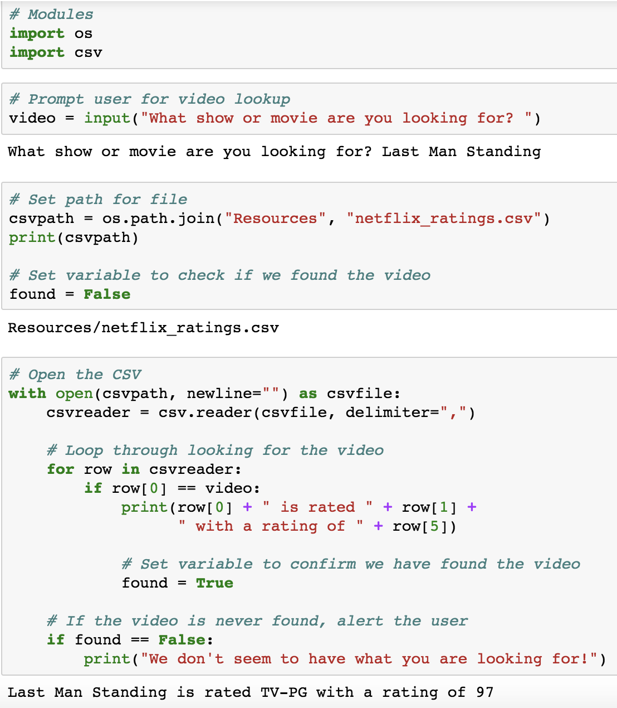

[Having issues with this activity? Report a bug!](https://bit.ly/2JLaNM1)

- - -

## 2. Intro to Pandas & Dataframe Shop

| Activity Time:       0:30 |  Elapsed Time:      1:05  |
|---------------------------|---------------------------|

    
<strong>📣 2.1 Instructor Do: Introduction to Pandas (0:05)</strong>

* Open [slideshow](https://drive.google.com/open?id=1lvscn_6UUbLiXSSC9atN_LfYPgMRhbA5zY9IVQrbRh8) and use slides 12-14 as you cover the talking points for this section:

* The way Jupyter Notebook allows for the testing and visualization of code really starts to shine through when these principles are applied to large tables. As the class has likely realized, however, it can be rather stressful modifying huge datasets using pure Python.

  * Thankfully there exists a library that, despite its cute and cuddly name, is extraordinarily powerful when it comes to visualizing, analyzing, and altering large datasets. This library is **Pandas**.

* While Python alone is stuck using lists, tuples, and dictionaries, Pandas lets Python programmers work with "Series" and "DataFrames"

  * These two data types - unique to Pandas - are essentially structured lists, with many built-in convenience methods that allow for quick and easy manipulation of data

  * A Pandas Series is a one-dimensional labeled array capable of holding any data type. This means that, like an array, the data is linear but that, like a dictionary, it has an index that acts like a key.

  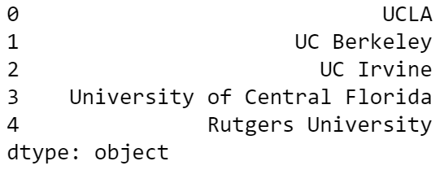

  * A Pandas DataFrame is a two-dimensional labeled data structure with columns of potentially different types. The easiest way to think of it is like an Excel spreadsheet with each column being a Series.

  

    
<strong>📣 2.2 Instructor Do: DataFrame Creation - Pandas (0:05)</strong>

* Open [slideshow](https://drive.google.com/open?id=1lvscn_6UUbLiXSSC9atN_LfYPgMRhbA5zY9IVQrbRh8) and use slides 15-17 while explaining the points below:

* Open [03-IntroToPandas](Activities/03-Ins_IntroToPandas/Solved/creating_data_frames.ipynb) within Jupyter Notebook in order to show the class what Pandas Series and DataFrames are and how to create them.

  * Before doing anything else, the Pandas library is imported using `import pandas as pd`. This method of import allows Pandas functions/methods to be called using the variable `pd`.

  * To create a Series, simply use the `pd.Series()` function and place a list within the parentheses. The index for the values within the Series will be the numeric index of the initial list.

  

  * There are multiple ways through which to create DataFrames from scratch. One way is to use the `pd.DataFrame()` function and provide it with a list of dictionaries. Each dictionary will represent a new row where the keys become column headers and the values will be placed inside the table.

  * Another way is to use the `pd.DataFrame()` function like before but this time provide it with a dictionary of lists. The keys of the dictionary will be the column headers and the listed values will be placed into their respective rows.

  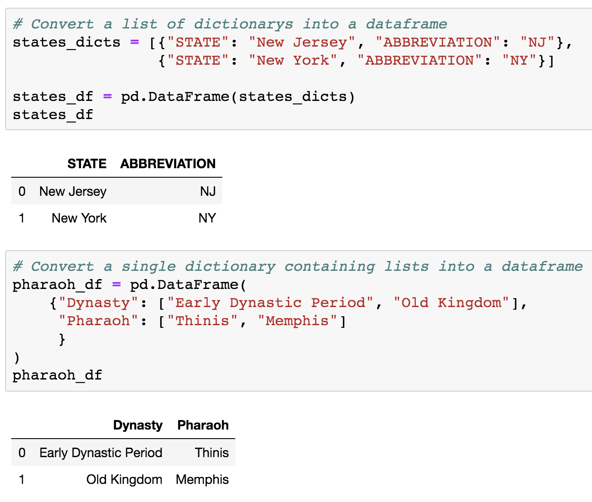

    
<strong>✏️ 2.3 Students Do: Data-Frame Shop (0:15)</strong>

* Open [slideshow](https://drive.google.com/open?id=1lvscn_6UUbLiXSSC9atN_LfYPgMRhbA5zY9IVQrbRh8) and use slides 18 and 19 to introduce this activity to the class.

* Students will now try their hand at creating DataFrames from scratch using the two methods discussed earlier. This will also provide them with the opportunity to better understand what DataFrames look like.

* Open up [04-Stu_DataFrameShop](Activities/04-Stu_DataFrameShop-Pandas/Unsolved/DataFrameShop.ipynb) within the Jupyter Notebook and to show the end results of the application.

* **Files:**

  * [04-Stu_DataFrameShop](Activities/04-Stu_DataFrameShop-Pandas/Unsolved/DataFrameShop.ipynb)

* **Instructions:**

  * Create a DataFrame for a frame shop that contains three columns - "Frame", "Price", and "Sales" - and has five rows of data stored within it.

  * Using an alternate method from that used before, create a DataFrame for an art gallery that contains three columns - "Painting", "Price", and "Popularity" - and has four rows of data stored within it.

* **Bonus:**

  * Once both of the DataFrames have been created, discuss with those around you which method you prefer to use and why.

    
<strong>⭐ 2.4 Review: Data-Frame Shop (0:05)</strong>

* Alternatively, you may also open the [slideshow](https://drive.google.com/open?id=1lvscn_6UUbLiXSSC9atN_LfYPgMRhbA5zY9IVQrbRh8) and use slide 20 while you walk through the code.

* Open [04-Stu_DataFrameShop](Activities/04-Stu_DataFrameShop-Pandas/Solved/DataFrameShop.ipynb) and walk through the code with the class, answering whatever questions students have.

* Key points to cover when discussing this activity:

  * It is important to save the DataFrames created to a variable or else they will only be printed to the screen and will not be available for use later on.

  * While the list of dictionaries method of DataFrame creation is viable, it takes far longer to write the code for since the keys have to be re-written each time. It does allow the programmer to better understand what each row in their DataFrame will look like though.

  * The dictionary of lists method is much more time effective since the keys need only be written once. It can be harder to read through, however, as if even one of the lists contains fewer values than the others than an error will be returned.

  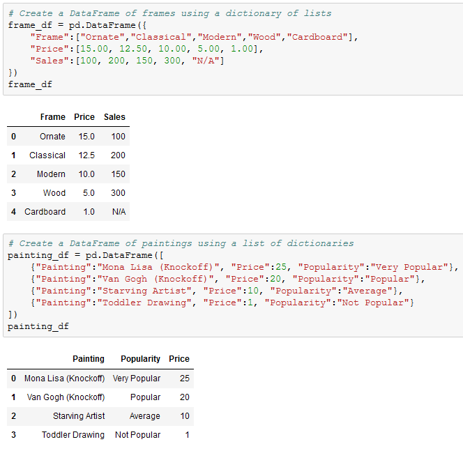

[Having issues with this activity? Report a bug!](https://bit.ly/2RlC5wH)

- - -

## 3. Training Grounds

| Activity Time:       0:25 |  Elapsed Time:      1:30  |
|---------------------------|---------------------------|

    
<strong>📣 3.1 Instructor Do: DataFrame Functions (0:05)</strong>

* Open the [slideshow](https://drive.google.com/open?id=1lvscn_6UUbLiXSSC9atN_LfYPgMRhbA5zY9IVQrbRh8) and use slides 21-29 to move along the following talking points:

* The benefits of using Pandas DataFrames does not lay solely in its visualization of tables. There are also many functions/methods that come packaged with Pandas that allow for quick and easy analysis of large datasets.

* Open up [05-Ins_DataFunctions](Activities/05-Ins_DataFunctions/Solved/data_functions.ipynb) within Jupyter Notebook and make sure to point out how an external CSV file is being imported. Students will learn how to do this later in today's lesson.

  * The first method to describe is that of `head()` which takes a DataFrame and shows only the first five rows of data inside of it. This number can be increased/decreased, however, by placing an integer within the parentheses.

  * The `head()` method is helpful insomuch as it allows the programmer to look at a minified version of a much larger table, thus allowing them to make informed changes without having to search through the entire dataset.

  * Another useful method comes in the form of `describe()` which will print out a DataFrame containing some analytic information on the table and its columns. It is also helpful in showing what other data functions can be performed on a DataFrame or Series.

  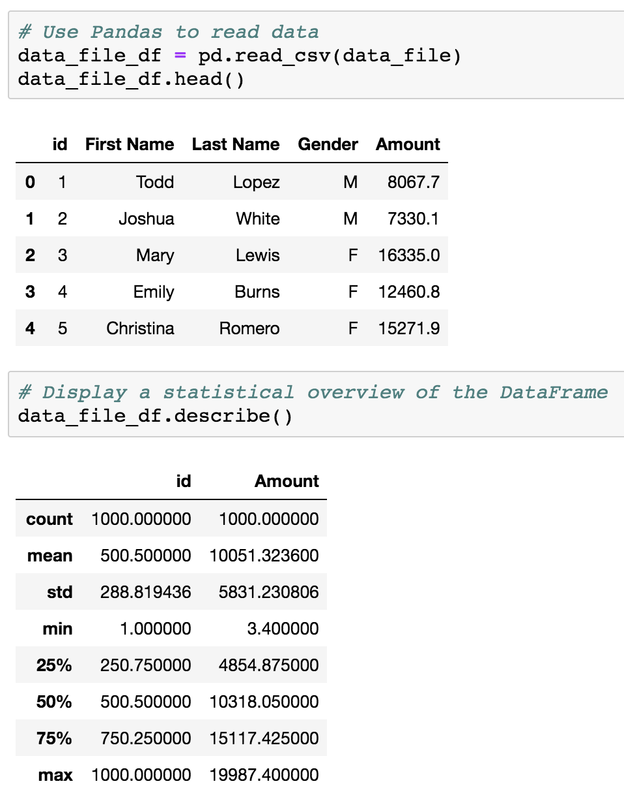

  * Most data functions can also be performed on a Series by referencing a single column within the whole DataFrame. This is done in a similar way to referencing a key within dictionary by taking the DataFrame and following it up with brackets with the desired column's header contained within like a key.

  * Multiple columns can be referenced as well by placing all of the column headers desired within a pair of double brackets. If two sets of brackets are not used then Pandas will return an error.

  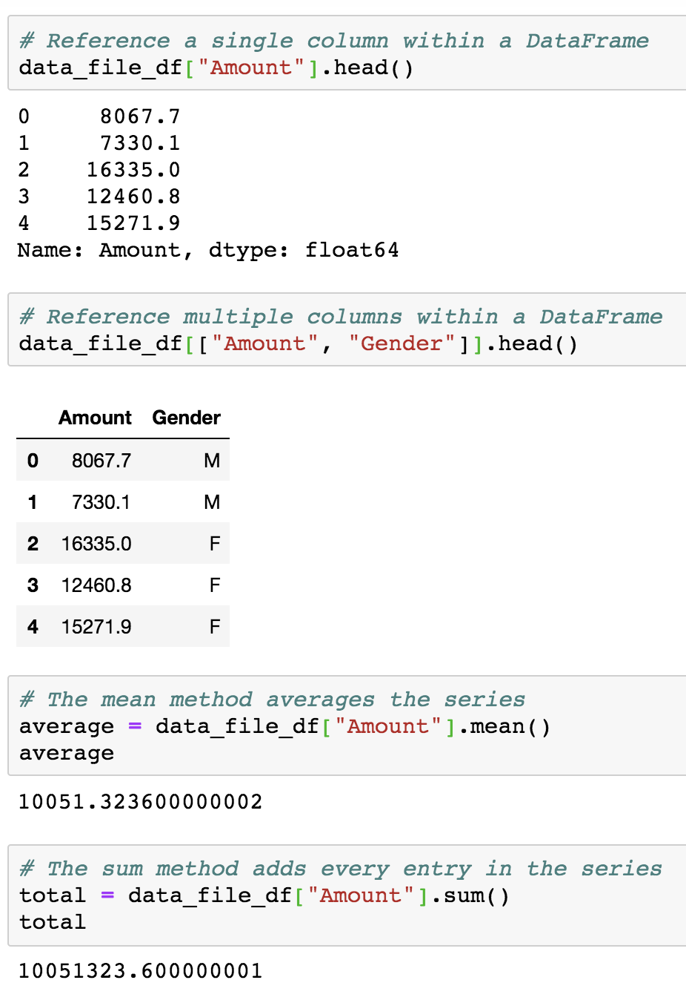

  * There are situations in which it is helpful to list out all of the unique values stored within a column. This is precisely what the `unique()` function does by looking into a Series and returning all of the different values within.

  

  * Another method that holds similar functionality is that of `value_counts()` which not only returns a list of all unique values within a series but also counts how many times a value appears.

  

  * Calculations can also be performed on columns and then added back into a DataFrame as a new column by referencing the DataFrame, placing the desired column header within brackets, and then setting it equal to a Series.

  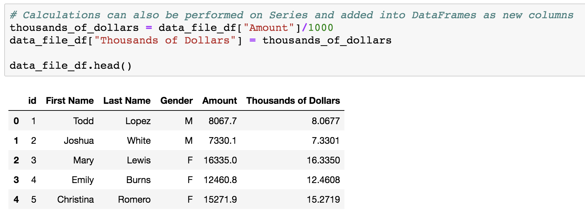

    
<strong>✏️ 3.2 Students Do: Training Grounds (0:15)</strong>

* Open the [slideshow](https://drive.google.com/open?id=1lvscn_6UUbLiXSSC9atN_LfYPgMRhbA5zY9IVQrbRh8) and use slides 30-31 to clarify instructions in case needed and accompany this this activity.

* Students will now take a large DataFrame consisting of 200 rows, analyze it using some data functions, and then add a new column into it.

* Open up [06-Stu_TrainingGrounds](Activities/06-Stu_TrainingGrounds-DataFunctions/Solved/TrainingGrounds.ipynb) within the Jupyter Notebook and run the code to show the end results of the application.

* **File:**

  * [TrainingGrounds.ipynb](Activities/06-Stu_TrainingGrounds-DataFunctions/Unsolved/TrainingGrounds.ipynb)

* **Instructions:**

  * Using the DataFrame provided, perform all of the following actions...

  * Provide a simple, analytical overview of the dataset's numeric columns

  * Collect all of the names of the trainers within the dataset

  * Figure out how many students each trainer has

  * Find the average weight of the students at the gym

  * Find the combined weight of all of the students at the gym

  * Convert the "Membership (Days)" column into weeks and then add this new series into the DataFrame

    
<strong>⭐ 3.3 Review: Training Grounds (0:05)</strong>

* Alternatively, you may also open the [slideshow](https://drive.google.com/open?id=1lvscn_6UUbLiXSSC9atN_LfYPgMRhbA5zY9IVQrbRh8) and use slide 32 while you review the activity.

* Open [06-Stu_TrainingGrounds](Activities/06-Stu_TrainingGrounds-DataFunctions/Solved/TrainingGrounds.ipynb) and walk through the code with the class, answering whatever questions students have.

* Key points to tackle when discussing this activity:

  * By collecting the unique values for the "Trainer" column, it is far easier to see what employees are currently with the "Training Grounds" gym.

  * In order to convert "Membership (Days)" into "Membership (Weeks)", the code simply takes the values stored within the initial column, divides them by seven, and then adds this edited series into a newly created column.

  

[Having issues with this activity? Report a bug!](https://bit.ly/3dRwzv0)

- - -

## 4. Hey Arnold!

| Activity Time:       0:20 |  Elapsed Time:      1:50  |
|---------------------------|---------------------------|

    
<strong>📣 4.1 Instructor Do: Modifying Columns (0:05)</strong>

* Open the [slideshow](https://drive.google.com/open?id=1lvscn_6UUbLiXSSC9atN_LfYPgMRhbA5zY9IVQrbRh8) and use slides 33-36 cover talking points in this lesson.

* As the class already discovered during the previous activity, columns within a DataFrame are not always placed within the desired position by default. In fact, they sometimes may not even have a descriptive or concise enough name.

  * Thankfully it is very easy to modify the names/placement of columns using the `rename()` function and the use of double brackets.

* Open up [07-Ins_ColumnManipulation](Activities/07-Ins_ColumnManipulation/Solved/ColumnManipulation.ipynb) within Jupyter Notebook and walk through the code with the class.

  * In order to collect a list of all the columns contained within a DataFrame, simply use the `df.columns` call and an object containing the column headers will be printed to the screen.

  * To reorder the columns, create a reference to the DataFrame followed by two brackets with the column headers placed in the order desired.

  * It is also possible to remove columns in this way by simply not creating a reference to them. This will, in essence, drop them from the newly made DataFrame.

  * To rename the columns within a DataFrame, use the `df.rename()` method and place `columns={}` within the parentheses. Inside of the dictionary, the keys should be references to the current columns and the values should be the desired column names.

  

    
<strong>✏️ 4.2 Students Do: Hey Arnold! (0:10)</strong>

* Open the [slideshow](https://drive.google.com/open?id=1lvscn_6UUbLiXSSC9atN_LfYPgMRhbA5zY9IVQrbRh8) and use slides 37-38 to clarify instructions for this activity.

* For this activity, students will be taking a pre-made DataFrame of "Hey Arnold!" characters and reorganizing it so that it is more understandable and organized.

* Open up [08-Stu_Hey_Arnold](Activities/08-Stu_Hey_Arnold-DataFrame-Formatting/Solved/hey_arnold.ipynb) within the Jupyter Notebook and run the code to show the end results of the application.

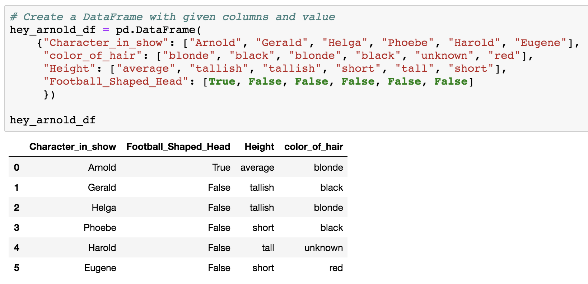

* **Files:**

  * [hey_arnold.ipynb](Activities/08-Stu_Hey_Arnold-DataFrame-Formatting/Unsolved/hey_arnold.ipynb)

* **Instructions:**

* First, use Pandas to create a DataFrame with the following columns and values:

  * `Character_in_show`: Arnold, Gerald, Helga, Phoebe, Harold, Eugene

  * `color_of_hair`: blonde, black, blonde, black, unknown, red

  * `Height`: average, tallish, tallish, short, tall, short

  * `Football_Shaped_Head`: True, False, False, False, False, False

* You'll note that the above column names are inconsistent and difficult to work with. Rename them to the following, respectively:

  * `Character`, `Hair Color`, `Height`, `Football Head`

* Next, create a new table that contains all of the columns in the following order...

  * `Character`, `Football Head`, `Hair Color`, `Height`

    
<strong>⭐ 4.3 Review: Hey Arnold! (0:05)</strong>

* Open the [slideshow](https://drive.google.com/open?id=1lvscn_6UUbLiXSSC9atN_LfYPgMRhbA5zY9IVQrbRh8) and use slide 39 to review the activity.

* Open [08-Stu_Hey_Arnold](Activities/08-Stu_Hey_Arnold-DataFrame-Formatting/Solved/hey_arnold.ipynb) and walk through the code with the class, answering whatever questions students have.

* Key points to tackle when discussing this activity:

  * The first step is to take the currently named columns and convert them into the more readable versions using `hey_arnold.rename(columns={})` and applying the changes to a new variable.

  * Then, using double brackets, the new columns are reorganized and placed into another new variable which now holds the fully formatted DataFrame.

  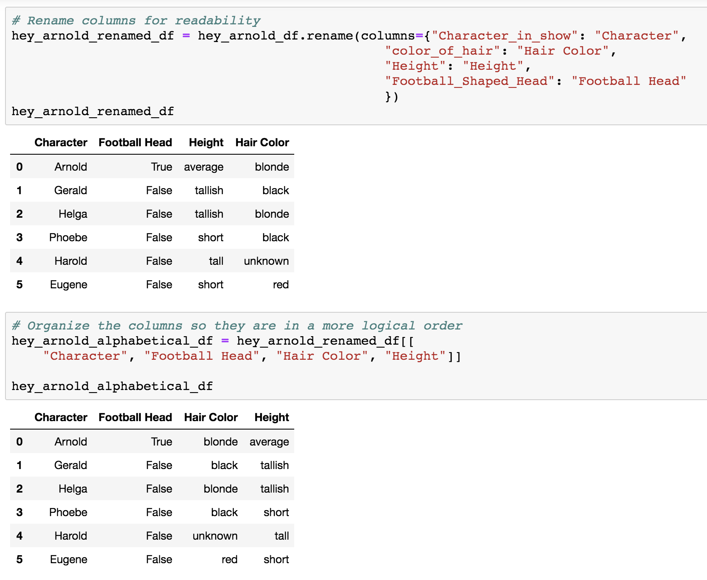

[Having issues with this activity? Report a bug!](https://bit.ly/2R0akJN)

- - -

## Break

| Activity Time:       0:15 |  Elapsed Time:      2:05  |
|---------------------------|---------------------------|

- - -

## 5. GoodReads - Reading and Writing CSVs

| Activity Time:       0:55 |  Elapsed Time:      3:00  |
|---------------------------|---------------------------|

    
<strong>📣 5.1 Instructor Do: Reading and Writing CSV Files (0:05)</strong>

* Open the [slideshow](https://drive.google.com/open?id=1lvscn_6UUbLiXSSC9atN_LfYPgMRhbA5zY9IVQrbRh8) and use slides 41-43 cover talking points in this lesson:

* Up until this point, the class has had to manually create DataFrames using the `pd.DataFrame()` method. There is a far more effective means by which to create large DataFrames; importing CSV files.

* Open up [09-Ins_ReadingWritingCSV](Activities/09-Ins_ReadingWritingCSV/Solved/pandas_reading_files.ipynb) within Jupyter Notebook and walk through the code with the class.

  * Create a reference to the CSV file's path and pass it in into the `pd.read_csv()` method, making certain to store the returned DataFrame within a variable. From then on, the DataFrame can be altered and manipulated like normal.

  * In most cases it is not important to use or define the encoding of the base CSV file but if the encoding is different than UTF-8, then it may become necessary so that the CSV is translated correctly.

  

  * It is just as easy to write to a CSV file as it is to read from one. Simply use the `df.to_csv()` method, passing the path to the desired output file. By using the `index` and `header` parameters, programmers can also manipulate whether they would like the index or header for the table to be passed as well.

  * If the file referenced within the path does not exist, then Pandas will return an error. The file must already exist in order for the DataFrame to be written in.

  

    
<strong>✏️ 5.2 Students Do: GoodReads CSV - Part 1 (0:20)</strong>

* Open the [slideshow](https://drive.google.com/open?id=1lvscn_6UUbLiXSSC9atN_LfYPgMRhbA5zY9IVQrbRh8) and use slides 44-45 to cover instructions for the activity.

* Students will now take a large CSV of books, read it into Jupyter Notebook using Pandas, clean up the columns, and then write their modified DataFrame to a new CSV file.

* Open up the unmodified [10-Stu_GoodReadsCSV/Resources/books.csv](Activities/10-Stu_GoodReadsCSV/Solved/Resources/books.csv) to show students what they will be working with before opening up [10-Stu_GoodReadsCSV/Solved/Output/books.csv](Activities/10-Stu_GoodReadsCSV/Solved/Output/books_clean.csv) to show students what the finished product will look like. The final outputs in the notebook will look like the following:

* **Files:**

  * [GoodReads.ipynb](Activities/10-Stu_GoodReadsCSV/Unsolved/GoodReads.ipynb)

  * [books.csv](Activities/10-Stu_GoodReadsCSV/Unsolved/Resources/books.csv)

* **Instructions:**

  * Read in the GoodReads CSV using Pandas

  * Remove unnecessary columns from the DataFrame so that only the following columns remain: `isbn`, `original_publication_year`, `original_title`, `authors`, `ratings_1`, `ratings_2`, `ratings_3`, `ratings_4`, and `ratings_5`

  * Rename the columns to the following: `ISBN`, `Publication Year`, `Original Title`, `Authors`, `One Star Reviews`, `Two Star Reviews`, `Three Star Reviews`, `Four Star Reviews`, and `Five Star Reviews`

  * Write the DataFrame into a new CSV file

* **Hints:**

  * The base CSV file uses UTF-8 encoding. Trying to read in the file using some other kind of encoding could lead to strange characters appearing within the dataset.

    
<strong>⭐ 5.3 Review: GoodReads (0:05)</strong>

* Open the [slideshow](https://drive.google.com/open?id=1lvscn_6UUbLiXSSC9atN_LfYPgMRhbA5zY9IVQrbRh8) and use slide 46 to review the lesson.

* Open [10-Stu_GoodReads](Activities/10-Stu_GoodReadsCSV/Solved/GoodReads.ipynb) and walk through the code with the class, answering whatever questions students have.

* Key points to tackle when discussing this activity:

  * The initial CSV file is encoded using UTF-8 and should be read using this encoding as well so that ensure there are no strange characters hidden within the dataset.

  * There are a lot of columns that are being modified within this code, so it is essential to make sure that all references are made accurately so as to avoid any potential errors.

  * The path to the output CSV must point to an already existing CSV or else an error will be returned. The encoding for the output CSV should also be set as UTF-8 so that those strange symbols from earlier do not appear.

  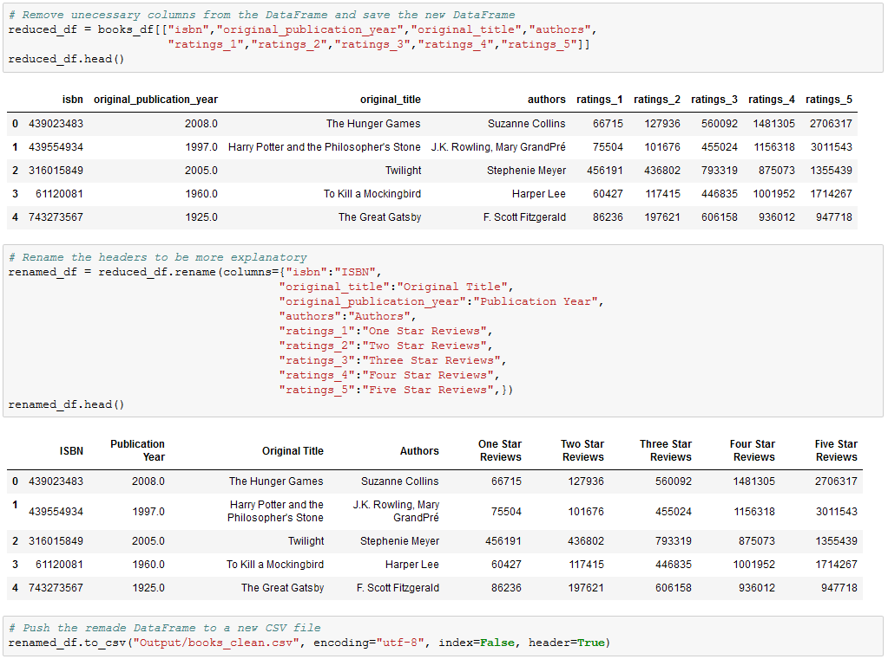

    
<strong>✏️ 5.4 Students Do: GoodReads - Part II (0:20)</strong>

* Students will now take the modified version of the GoodReads DataFrame and create a new Summary DataFrame based upon that dataset using some of Pandas' built-in data functions.

* Open up [11-Stu_GoodReadsSummary](Activities/11-Stu_GoodReadsSummary/Solved/GoodReadsSummary.ipynb) within the Jupyter Notebook and run the code to show the end results of the application.

* **Files:**

  * [GoodReadsSummary.ipynb](Activities/11-Stu_GoodReadsSummary/Unsolved/GoodReadsSummary.ipynb)

  * [books_clean.csv](Activities/11-Stu_GoodReadsSummary/Unsolved/Resources/books_clean.csv)

* **Instructions:**

  * Using the modified DataFrame that was created earlier, create a summary table for the dataset that includes the following pieces of information...

  * The count of unique authors within the DataFrame

  * The year of the earliest published book in the DataFrame

  * The year of the latest published book in the DataFrame

  * The total number of reviews within the DataFrame

    
<strong>⭐ 5.5 Review: GoodReads Part II (0:05)</strong>

* Open the [slideshow](https://drive.google.com/open?id=1lvscn_6UUbLiXSSC9atN_LfYPgMRhbA5zY9IVQrbRh8) and use slide 49 to review the activity.

* Open [11-Stu_GoodReadsSummary](Activities/11-Stu_GoodReadsSummary/Solved/GoodReadsSummary.ipynb) and walk through the code with the class, answering whatever questions students have.

* Key points to hit upon when reviewing this activity:

  * The count of unique authors can be found by using `len(goodreads_df["Authors"].unique())` which looks into the list of Authors, places all of the unique values into a list, and then finds the list's length.

  * To find the earliest year, use the `min()` method on the "Publication Year" column.

  * To find the latest year, use the `max()` method on the "Publication Year" column.

  * To find the total number of reviews given, use the `sum()` function on each of the "<Number> Star Reviews" columns and add up all of the values.

  * In order to add these values into the summary DataFrame, the values must be placed within brackets. Without doing this, Pandas will return an error.

  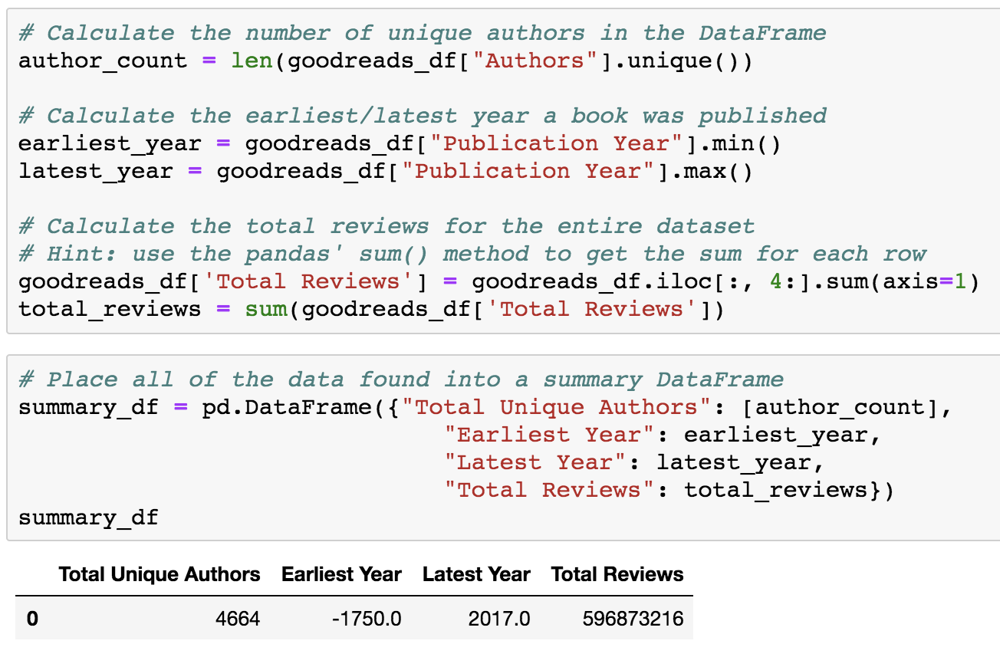

[Having issues with this activity? Report a bug!](https://bit.ly/39BulwD)

- - -

## References

Willden, C. (2017, June 11). 1000 Netflix shows. [https://www.kaggle.com/chasewillden/netflix-shows](https://www.kaggle.com/chasewillden/netflix-shows)

Zygmuntz. (2017, September 13). Zygmuntz/goodbooks-10k. [https://github.com/zygmuntz/goodbooks-10k/blob/master/samples/books.csv](https://github.com/zygmuntz/goodbooks-10k/blob/master/samples/books.csv)

- - -

© 2021 Trilogy Education Services, LLC, a 2U, Inc. brand. Confidential and Proprietary. All Rights Reserved.
