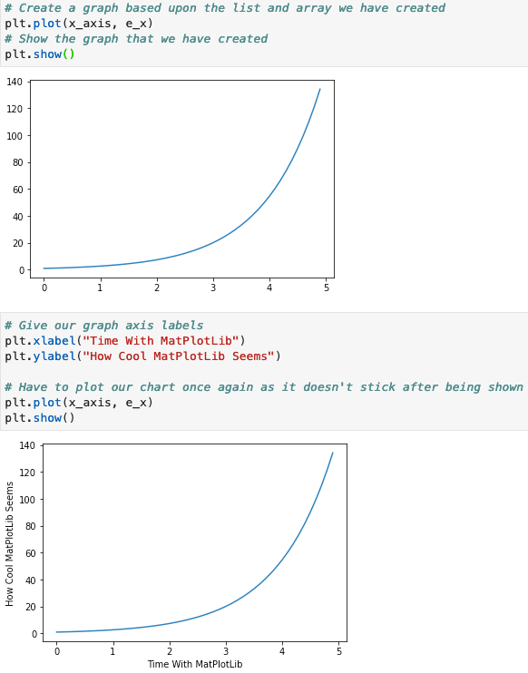
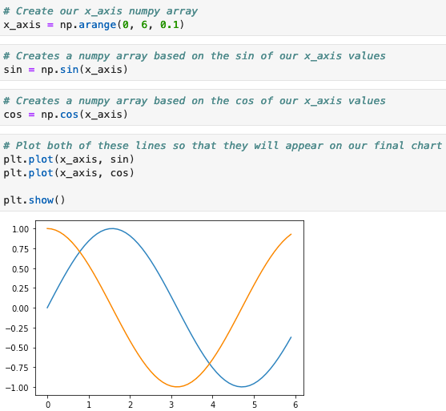
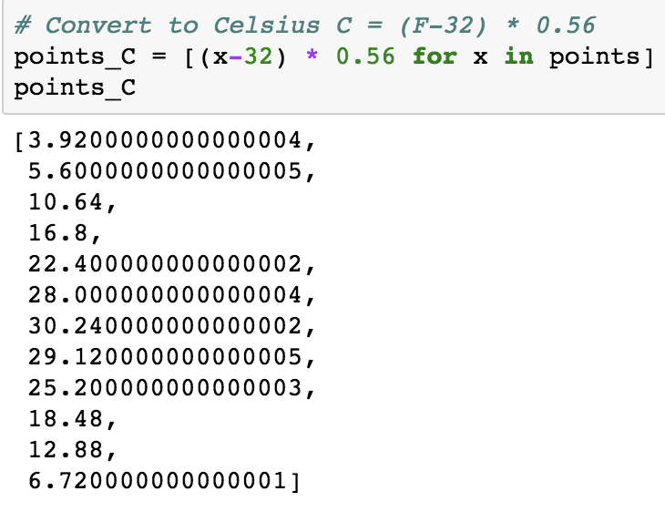
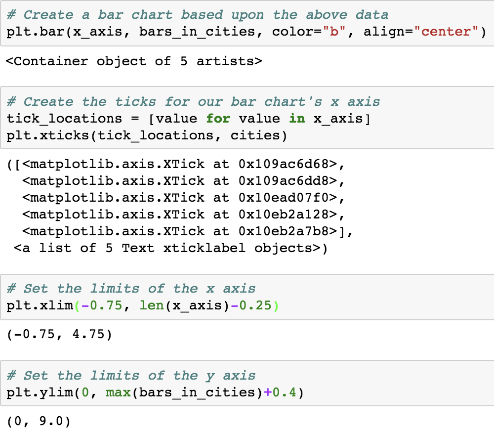
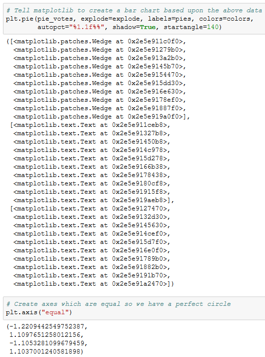

# 5.1 Introduction to Matplotlib

## Overview

Today's class will introduce students to the basics of [Matplotlib](http://Matplotlib.org/), one of the most popular Python plotting libraries in use today. This lesson plan focuses on how to import the `matplotlib` library and how to utilize its core `pyplot` module in order to design and customize line, bar, scatter and pie charts. Today will also serve as a refresher of data visualizations introduced in Unit 1.

### Class Objectives

By the end of today's class, students will be able to:

* Use Matplotlib's Pyplot interface.

* Create line, bar, scatter, and pie charts.

* Change the appearance of their plots.

* Identify basic plot configuration options, such as `xlim` and `ylim.`

## Instructor Prep

  
<strong>Instructor Notes</strong>

* A note on potential errors caused by the Matplotlib library:

  * `%matplotlib notebook` is used in a number of activities. It not only makes a plot interactive, but it also allows it to be updated after the initial plot. If students encounter weirdness during the activities, check to see that they use this line before importing the plotting libraries.

  * Ideally, students should update their Matplotlib to version 2.2 or newer. A bug with earlier versions resizes plots after an image is exported with the `savefig` method.

* The solutions to most of today's activities are fairly simple. The instructor should approach each exercise by presenting the expected output, briefly discussing the code used to generate it, and sharing the final image, but withholding the example code until the activity review.

  * This is to encourage students to develop the habit of exploring the Matplotlib documentation. A large part of the process of developing plots with the library is reading [examples](http://Matplotlib.org/examples/index.html), so it is important for them to become accustomed to this workflow.

* Please refer to our [Student FAQs?](../../../05-Instructor-Resources/README.md#unit-05-matplotlib) for answers to questions frequently asked by students of this program. If you have any recommendations for additional questions, feel free to log an issue or a pull request with your desired additions.

* Have your TAs refer to the [Time Tracker](TimeTracker.xlsx) to stay on track.

* Lastly, as a reminder, these slideshows are for instructor use only; when distributing slides to students, please first export the slides to a PDF file. You may then send out the PDF file.

  
<strong>Sample Class Video</strong>

* To view an example class lecture, see: [Class Video](https://codingbootcamp.hosted.panopto.com/Panopto/Pages/Viewer.aspx?id=ec176c10-1f37-4547-8e89-0e598aa6d66a). Note that video may not reflect the latest lesson plan.

# Class Activities

## 1. Welcome and Intro to MatPlotLib

| Activity Time:       0:15 |  Elapsed Time:      0:15  |
|---------------------------|---------------------------|

  
<strong>📣 1.1 Instructor Do: Introduction to Class (0:05)</strong>

* Open the [slideshow](https://docs.google.com/presentation/d/1pJMdqh6TjdRAiZzT0y8dgeUYSTwRMODxB6MLyvOxacI) and use slides 1–4 to as you cover the following talking points:

  * This week we will be learning how to plot and analyze our datasets using Python.

  * Today's class will introduce students to Matplotlib, one of the most popular Python charting libraries in use.

  * We will focus in particular on familiarizing ourselves with the basics of a module named Pyplot, which we can use to create simple charts quickly.

* Send out the [Student Guide](../StudentGuide.md), which contains the class objectives and useful links that students can refer to during this week's activities.

  
<strong>📣 1.2 Instructor Do: Introduction to Matplotlib (0:10)</strong>

* Open the [slideshow](https://docs.google.com/presentation/d/1pJMdqh6TjdRAiZzT0y8dgeUYSTwRMODxB6MLyvOxacI)  and use slides 5–10 to accompany the beginning of this demonstration.

* Open and run [01-Ins_BasicLineGraphs/exponential_chart.ipynb](Activities/01-Ins_BasicLineGraphs/Solved/exponential_chart.ipynb) in Jupyter Notebook to show students how Pyplot can be used to create an exponential line plot. Be sure to cover the following talking points:

  * For many of our Python activities, we will generate our data using the NumPy library. The NumPy library contains many built-in methods to generate and manipulate simple or complex data types.

  * `np.arange(start, end, step)` creates a NumPy array of numbers from `start` to `end`, where each number in the array is a `step` away from the next ones.

  * A NumPy array is similar to a Python list, but they are not the same thing. A Python list can contain elements of various data types. In contrast, a NumPy array must contain only a single data type. This allows for faster computation and more efficient storage.

  * The `e_x` list is created using a list comprehension. List comprehensions allow lists to be created using mathematic formulas. For example, the one being used in this application takes values from the `x_axis` list one at a time, finds the exponent, and stores the response within a list.

    

  * Matplotlib allows users to generate plots by setting one list or array as the x-axis and another as the y-axis. It really is as simple as calling `plt.plot()`, passing those 2 lists through as parameters, and then calling `plt.show()` to print the chart to the screen.

  * Matplotlib handles the details of painting charts to the screen, but the programmer has full control over each stage of the drawing process if they really need it. By using `plt.xlabel()` and `plt.ylabel`, for example, users can easily add axis titles to their charts.

    

* Open and run [01-Ins_BasicLineGraphs/SinCos.ipynb](Activities/01-Ins_BasicLineGraphs/Solved/sin_cos.ipynb) in Jupyter Notebook to show students how Pyplot can be used to create a plot with multiple lines. Be sure to cover the following talking points:

  * `np.arange()`, `np.sin()`, and `np.cos()` are all being used to create the lists for the application's charts.

  * Charting multiple lines on the same chart is as simple as calling `plt.plot()` 2 times and providing Pyplot with different values.

    

  * While this plot is very simple, it introduces all of the major tools required to build much prettier plots in the future.

* Remind students that visualizations of data are valuable for far more than aesthetics. Trends and human insights buried within complex datasets are often clearest when the data is visualized in some way.

* Open the [Bay Area Weather blog post](https://ermlab.com/en/blog/data-science/pandas-weather-data-visualization-tutorial/), or just the [image](Images/01-temperature.png) and point out that the trend that each city follows is clear from the graphic but may _not_ be obvious in a table.

    

[Having issues with this activity? Report a bug!](https://bit.ly/39AltaI)

- - -

## 2. New Jersey Weather - Line Plots

| Activity Time:       0:20 |  Elapsed Time:      0:35  |
|---------------------------|---------------------------|

  
<strong>✏️ 2.1 Student Do: New Jersey Weather Line Plots (0:15)</strong>

* **File:** [02-Stu_NJTemp/Unsolved/nj_temp.ipynb](Activities/02-Stu_NJTemp-LinePlots/Unsolved/nj_temp.ipynb)

* **Instructions:** [README](Activities/02-Stu_NJTemp-LinePlots/README.md)

* In this activity, students will create a series of line plots using temperature data from New Jersey.

* Open [02-Stu_NJTemp/Solved/NJ_temp.ipynb](Activities/02-Stu_NJTemp-LinePlots/Solved/NJ_temp.ipynb) in the Jupyter Notebook and run the code to show the end results of the application.

* You may choose to open the [slideshow](https://docs.google.com/presentation/d/1pJMdqh6TjdRAiZzT0y8dgeUYSTwRMODxB6MLyvOxacI) and use slides 11–13 to accompany this activity.

  
<strong>⭐ 2.2 Review: New Jersey Weather Line Plots (0:05)</strong>

* Open [02-Stu_NJTemp/nj_temp.ipynb](Activities/02-Stu_NJTemp-LinePlots/Solved/NJ_temp.ipynb) within the Jupyter Notebook and go through the code line by line with the class, answering whatever questions they may have.

  * A list of numbers ranging from 1 to 12 are created using `np.arange(1,13,1)`. The parameters passed tell NumPy to start at 1 and finish before 13, and that each value should be 1 greater than the last.

  * In order to create the Fahrenheit chart, simply pass the `x_axis` and `points` lists into `plt.plot()` and then run `plt.show()`.

    

  * To convert the values within the points list to Celsius, use a list comprehension where each value in the initial list is passed through the following formula: (x-32) * 0.56.

    

  * Showing both lines on a single chart is as simple as running the code for drawing both of the charts within the same cell and then using the `plt.show()` method.

[Having issues with this activity? Report a bug!](https://bit.ly/343vxHS)

- - -

## 3. Legendary Temperature

| Activity Time:       0:25 |  Elapsed Time:      1:00  |
|---------------------------|---------------------------|

  
<strong>📣 3.1 Instructor Do: Configuring Line Plots (0:05)</strong>

* Open the [slideshow](https://docs.google.com/presentation/d/1pJMdqh6TjdRAiZzT0y8dgeUYSTwRMODxB6MLyvOxacI) and use slides 14–17 to accompany the beginning of this demonstration as you cover the following talking points:

  * Matplotlib's basic line plots are rather bland.

  * Matplotlib offers considerable control over the details of our plots' appearances.

  * The easiest way to change the way things look in Matplotlib is to use **keyword arguments** to configure the behavior of `plot`.

* Send out the updated sine and cosine example titled [03-Ins_ConfiguringLinePlots/line_config.ipynb](Activities/03-Ins_ConfiguringLinePlots/Solved/line_config.ipynb) and open the code within Jupyter Notebook. Explain the following:

  * While not massively different aesthetically, this new version of the sin/cos plot does introduce some additional components.

  * `plt.hlines()` is used to draw a horizontal line. This method takes in 3 parameters: the _y_ value across which the line will be drawn, the _x_ value where the line will start, and the _x_ value where the line will end.

  * The transparency of the horizontal line can also be set using the `alpha=` keyword and passing a number between 0 and 1. This setting is possible with most Matplotlib plotting functions.

    

* Draw attention to the lines being drawn and set to `sin_handle,` and `cos_handle,` and explain:

  * `pyplot.plot` returns a list of the lines that were added to the plot.

  * This bit of code is using argument unpacking to select only the first line from that list of lines.

  * So, calling the `sine_handle` is a reference to the lines object.

  * `plt.plot()` can take in more parameters than just the **x** and **y** values for the line being charted. For example, the markers for a plot can be set using `marker=`, the color of a plot can be set using `color=`, and the label for a line can be set using `label=`.

    

  * The `plt.legend()` method allows the user to create a legend for their chart. The `loc` argument is used to set the location of the legend on the chart.

  * While the `plt.show()` command has not changed, a new line called `plt.savefig()` has been added which will save a version of the chart to an external file. Simply pass the file path desired as a parameter to save the image.

    

* Explain that the different [markers](http://Matplotlib.org/api/markers_api.html) and [colors](http://Matplotlib.org/api/colors_api.html) are available in the documentation, which students are encouraged to peruse when building their plots.

  
<strong>✏️ 3.2 Student Do: Legendary Temperature (0:15)</strong>

* **File:** [avg_temp.png](Activities/04-Stu_LegendaryTemperature/Images/avg_temp.png)

* **Instructions:** [README](Activities/04-Stu_LegendaryTemperature/README.md)

  * In this activity, students will edit the line plots they created earlier so that these charts are more visually interesting.

* Encourage students to play with additional configuration options beyond those asked for. Send out links to the Matplotlib API so that students can play around with the library when they finish the activity.

* You may choose to open the [slideshow](https://docs.google.com/presentation/d/1pJMdqh6TjdRAiZzT0y8dgeUYSTwRMODxB6MLyvOxacI) and use slides 18–20 to accompany this activity. Otherwise, show the students what chart they will be attempting to create.

  
<strong>⭐ 3.3 Review: Legendary Temperature (0:05)</strong>

* Open [04-Stu_LegendaryTemperature/legendary_temp.ipynb](Activities/04-Stu_LegendaryTemperature/Solved/legendary_temp.ipynb) within the Jupyter Notebook and go through the code line by line with the class, answering whatever questions they may have. Cover the following talking points:

  * Both `fahrenheit` and `celsius` are followed by commas to set them as tuples. This is crucial because `plt.legend()` expects to be handed tuples within its `handles` parameter and would return an error otherwise.

  * The `loc` parameter of `plt.legend()` has been set to "best" within this application. This allows Matplotlib to decide where to place the legend so that it does not get in the way.

    

* Check with the class to see what interesting formatting options they uncovered during this activity and ask a couple of them to come up and explain their code to the class.

[Having issues with this activity? Report a bug!](https://bit.ly/3dO6M6Z)

- - -

## 4. Coaster Speed

| Activity Time:       0:20 |  Elapsed Time:      1:20  |
|---------------------------|---------------------------|

  
<strong>📣 4.1 Instructor Do: Aesthetics (0:05)</strong>

* Open the [slideshow](https://docs.google.com/presentation/d/1pJMdqh6TjdRAiZzT0y8dgeUYSTwRMODxB6MLyvOxacI) and use slides 21–27 to accompany the beginning of this demo while covering the following talking points:

  * The best plots, like the best code, are easy to read. Emphasize that this is different from being beautiful. Graphics need not be artistic, but they should be easy to understand.

  * Some ways to improve readability include:

    * Adding labels to the x-axis

    * Adding labels to the y-axis

    * Adding titles to plots

    * Limiting the extent of the plot to bound the plot's data points

  * In some cases, adding grids can also help but this can be very situational.

  * Adding labels ensures that the graphic remains honest and easy to understand, even in cases where the visualization is not immediately transparent to most viewers, such as with [Sankey diagrams](https://en.wikipedia.org/wiki/Sankey_diagram).

  * Limiting the extent of the plot maximizes the [data-to-ink ratio](https://infovis-wiki.net/wiki/Data-Ink_Ratio) and constrains the plot to display only relevant information.

* Open the [basic aesthetics added to sine and cosine plot](Images/05-Aesthetics_Output.png). Explain the following:

  * This plot is not yet attractive but is more readable than the previous plots, thanks to the labels and changes being made to the x-axis.

  * `plt.xlabel()`, `plt.ylabel()`, and `plt.title()` are fairly self-explanatory. Simply pass a string into them as a parameter, and the labels and title will be drawn onto the chart.

  * `plt.xlim()` and `plt.ylim()` are used to set where the axes for the chart should begin and end. Matplotlib will naturally create charts with a lot of empty space and these methods can help to limit that.

  * `plt.grid()` is also fairly obvious. Through its use, gridlines are added to the chart.

    

  
<strong>✏️ 4.2 Student Do: Coaster Speed - Styling Line Plots (0:10)</strong>

* **File:** [Coaster Speed Chart](Activities/06-Stu_RollerCoaster-StylingLinePlots/Images/CoasterSpeed.png)

* **Instructions:** [README](Activities/06-Stu_RollerCoaster-StylingLinePlots/README.md)

* In this activity, students will create a line chart that graphs the speed of a roller coaster over time. They will then style the chart and add some aesthetics to it.

* You may choose to open the [slideshow](https://docs.google.com/presentation/d/1pJMdqh6TjdRAiZzT0y8dgeUYSTwRMODxB6MLyvOxacI) and use slides 28–30 to accompany this activity. Otherwise show the students what chart they will be attempting to create.

  
<Strong>⭐ 4.3 Review: Coaster Speed - Styling Line Plots (0:05)</strong>

* Open up [06-Stu_RollerCoaster/coaster_speed.ipynb](Activities/06-Stu_RollerCoaster-StylingLinePlots/Solved/coaster_speed.ipynb) within the Jupyter Notebook and go through the code line by line with the class, answering whatever questions they may have. Cover the following talking points:

  * `plt.title()`, `plt.xlabel()`, and `plt.ylabel()` are used to set the title and axis labels.

  * `plt.xlim()` and `plt.ylim()` are set so that there is as little empty space as possible on the chart while still making it understandable.

    

    

[Having issues with this activity? Report a bug!](https://bit.ly/2xF1JFE)

- - -

## Break

| Activity Time:       0:15 |  Elapsed Time:      1:35  |
|---------------------------|---------------------------|

- - -

## 5. Bars Bar Chart

| Activity Time:       0:25 |  Elapsed Time:      2:00  |
|---------------------------|---------------------------|

  
<strong>📣 5.1 Instructor Do: Different Plots (0:05)</strong>

* Open the [slideshow](https://docs.google.com/presentation/d/1pJMdqh6TjdRAiZzT0y8dgeUYSTwRMODxB6MLyvOxacI) and use slides 32–34 while covering the following talking points:

  * Matplotlib provides a simple interface for producing more than line plots.

  * The most common charts students will generate are line charts, bar charts, pie charts, and scatter plots.

  * **Bar charts** are useful for comparing different entities to one another.

  * **Pie charts** are suitable for displaying parts of a whole—in particular, the amount each constituent contributes to the complete dataset.

  * **Scatter plots** are good for displaying where points fall with respect to 2 different factors.

  * It's important to choose the right plot for a given dataset; the wrong choice can make a graphic less readable or even make the data misleading.

  * Some data might lend itself to different plots; some data can be reasonably displayed via bar or pie chart, for instance.

  
<strong>📣 5.2 Instructor Do: Bar Charts (0:05)</strong>

* Open the [slideshow](https://docs.google.com/presentation/d/1pJMdqh6TjdRAiZzT0y8dgeUYSTwRMODxB6MLyvOxacI) and use slides 35–39 while covering the following talking points:

  * Bar charts are particularly useful when trying to visualize data that is counted or a single variable that is measured multiple times.

    * Data that comes from a single variable is called **univariate**.

    * For example, the amount of rainfall per month for a given location or the results of a poll containing a few different categories could be visualized effectively with a bar chart.

  * Bar charts are not very useful when comparing **bivariate** data, or data that compares 2 different variables.

    * For example, a dataset comparing the number of ice cream bars sold versus daily temperature would not be visualized well using a bar chart.

* Ask the students to think of a few other examples of univariate datasets that would be visualized well with bar charts.

* Open the bar chart example within Jupyter Notebook: [07-Ins_BarCharts/bar_chart.ipynb](Activities/07-Ins_BarCharts/Solved/bar_chart.ipynb). Cover the following talking points:

  * When dealing with bar charts, it is necessary to provide the heights of each bar within an array.

  * The x-axis will also be an array whose length must equal that of the list of heights.

  * Instead of using `plt.plot()` bar charts are drawn using `plt.bar()`.

  * The `align` parameter for `plt.bar()` is center to center the data on each tick.

    

  * An additional aesthetic challenge unique to bar charts is aligning the tick locations on the x-axis and providing textual, rather than numeric, labels.

  * The `tick_locations` list created within this application places a tick for each value in the `x_axis`.

    

  * `plt.xlim()` and `plt.ylim()` are set so that there is some space between the bars and the edge of the chart. This makes the chart look a little better aesthetically.

  
<strong>✏️ 5.3 Student Do: Bars Bar Chart (0:10)</strong>

* **Files:**

  * [08-Stu_PyBars/py_bars.ipynb](Activities/08-Stu_PyBars/Unsolved/py_bars.ipynb)

  * [Bars Bar Chart](Activities/08-Stu_PyBars/Images/BarDensity.png)

* **Instructions:** [README.md](Activities/08-Stu_PyBars/README.md)

* In this activity, students will create a bar chart that visualizes the density of bars within major U.S. cities.

* You may choose to open the [slideshow](https://docs.google.com/presentation/d/1pJMdqh6TjdRAiZzT0y8dgeUYSTwRMODxB6MLyvOxacI) and use slides 40–42 to accompany this activity. Otherwise, show the students what chart they will be attempting to create.

  
<strong>⭐ 5.4 Review: Bars Bar Chart (0:05)</strong>

* Open [08-Stu_PyBars/py_bars.ipynb](Activities/08-Stu_PyBars/Solved/py_bars.ipynb) within the Jupyter Notebook and go through the code line by line with the class, answering whatever questions they may have.

* Focus on the ticks set for the bar chart in particular.

* Explain that `plt.xlim()` is set to go from -0.75 to the length of the y-axis minus 0.25 so that there is a degree of space between the leftmost bar and the edge of the chart.

    

* Explain that the process of tweaking aesthetic parameters can be time consuming. This is why we always want to save our Python code that we use to generate figures - a notebook or script makes recreating any plot trivial.

[Having issues with this activity? Report a bug!](https://bit.ly/2xF1JFE)

- - -

## 6. Pies Pie Chart

| Activity Time:       0:20 |  Elapsed Time:      2:20  |
|---------------------------|---------------------------|

  
<strong>📣 6.1 Instructor Do: Pie Charts (0:05)</strong>

* Open the [slideshow](https://docs.google.com/presentation/d/1pJMdqh6TjdRAiZzT0y8dgeUYSTwRMODxB6MLyvOxacI) and use slides 43–47 while covering the following talking points:

  * Pie charts are particularly useful when trying to visualize percentage, fractional, or proportional data.

    * Essentially, pie charts are great at visualizing "piece of the pie" data.

    * For example, the proportion of Democratic versus Republican versus independent voters would be visualized effectively with a pie chart.

    * The fewer the number of categories, the greater the effectiveness of a pie chart.

    * Pie charts are not effective with datasets that have more than about 10 categories. Similar to bar charts, pie charts are only effective describing univariate data.

    * When there are too many categories, pie charts become too busy and lose their effectiveness.

  * Due to the overlap of functionality, bar charts can also be used to visualize the same data used to generate a pie chart.

    * However, pie charts can be far more dramatic and effective demonstrating a fractional relationship.

    * When in doubt, it is always safer to visualize using a bar chart rather than overcrowding a pie chart.

* Ask the students to think of a few other examples of univariate datasets that would be visualized well with pie charts.

* Open the pie chart example: [09-Ins_PieCharts/pie_chart.ipynb](Activities/09-Ins_PieCharts/Solved/pie_chart.ipynb). Cover the following talking points:

  * The sizes of each wedge are passed into `plt.pie()` as an array. Lists containing the labels for each wedge and the colors for each wedge are also passed in.

  * The pie chart allows the user to choose a wedge to "explode," using the `explode` option. This will separate one wedge from the rest so that it is easier to examine.

  * Inside of the `plt.pie()` method, a parameter of `autopc="%1.1%%"` is being passed. This will automatically convert the values passed into percentages with one decimal place.

    

  * Matplotlib does not constrain pie charts to be circular—by default, they will be ovals if the window the plot lives in is not a square. This is why `plt.axis("equal")` is being passed.

    

* Explain that there are additional configuration options available for improving the appearance of Matplotlib's pie charts should students desire to look into them.

  
<strong>✏️ 6.2 Student Do: Pies Pie Chart (0:10)</strong>

* **Files:**

  * [10-Stu_PyPies/py_pie.ipynb](Activities/10-Stu_PyPies/Unsolved/py_pie.ipynb)

  * [Pies Pie Chart](Activities/10-Stu_PyPies/Images/PyPies.png)

* **Instructions:** [README.md](Activities/10-Stu_PyPies/README.md)

* In this activity, students will create a pie chart that visualizes the favorite pies within the United States.

* You may choose to open the [slideshow](https://docs.google.com/presentation/d/1pJMdqh6TjdRAiZzT0y8dgeUYSTwRMODxB6MLyvOxacI) and use slides 48–50 to accompany this activity. Otherwise, show the students what chart they will be attempting to create.

  

  
<strong>⭐ 6.3 Review: Pies Pie Chart (0:05)</strong>

* Open [10-Stu_PyPies/py_pie.ipynb](Activities/10-Stu_PyPies/Solved/py_pie.ipynb) within the Jupyter Notebook and go through the code line by line with the class, answering whatever questions they may have. Cover the following talking points:

  * One of the things that makes this activity challenging is knowing what colors are available for use. Students can find a list of colors available to peruse [here](https://matplotlib.org/users/colors.html).

  * Pie charts are easy to make because the editing of a chart only really requires the editing of values. The styling and aesthetics other than this are fairly uniform across charts.

    

[Having issues with this activity? Report a bug!](https://bit.ly/2w6SGg3)

- - -

## 7. Scatter Py

| Activity Time:       0:20 |  Elapsed Time:      2:40  |
|---------------------------|---------------------------|

  
<strong>📣 7.1 Instructor Do: Scatter Plots (0:05)</strong>

* Open the [slideshow](https://docs.google.com/presentation/d/1pJMdqh6TjdRAiZzT0y8dgeUYSTwRMODxB6MLyvOxacI) and use slides 51–55 to while covering the following talking points:

  * Scatter plots are extremely useful when visualizing **bivariate** data, or data that relates 2 variables.

    * Any data that we can plot on the x- and y-axis from 2 lists is considered bivariate data.

    * We can describe bivariate data as something versus something else.

    * For example, if we were to plot the amount of ice cream sold per day versus daily temperature, this bivariate data would be best visualized using a scatter plot.

  * Scatter plots are one of the cleanest and most effective charts to use on large datasets (datasets that have 500 values or more).

  * Scatter plots are frequently used to visualize clusters in a dataset.

  * Scatter plots are not great for visualizing continuous measurements.

    * The most common continuous data is data measured over time, or **time series** data.

  * When data is continuous, we often want to be able to interpolate between measurements. In this case, scatter plots may not be as effective as a line plot.

    * This is especially true if the dataset is small—the smaller the dataset, the more likely the audience will want to read between the data points.

  * In most cases, datasets will be large enough to effectively use scatter plots.

* Finally, open the scatter plot example: [11-Ins_ScatterPlots/scatter_plot.ipynb](Activities/11-Ins_ScatterPlots/Solved/scatter_plot.ipynb). Cover the following talking points:

  * This plot uses random data just so the class can avoid cluttering the example with Pandas cleanup—later activities will provide more realistic context.

  * Generating scatter plots demands the simplest set of methods of all the charts so far. Simply take in 2 sets of data and pass them into `plt.scatter()`.

  * The code can change the size of each dot by passing the `s=<LIST>` parameter. In this case, the values stored within `x_axis` will determine the size of a dot.

    

  
<strong>✏️ 7.2 Student Do: Scatter Py (0:10)</strong>

* **Files:**

  * [12-Stu_ScatterPy/ice_cream_sales.ipynb](Activities/12-Stu_ScatterPy/Unsolved/ice_cream_sales.ipynb)

  * [IceCreamSales Chart](Activities/12-Stu_ScatterPy/Images/IceCreamSales.png)

* **Instructions:** [README.md](Activities/12-Stu_ScatterPy/README.md)

* In this activity, students will create a scatter plot that visualizes ice cream sales in comparison to temperature increases.

* You may choose open up the [slideshow](https://docs.google.com/presentation/d/1pJMdqh6TjdRAiZzT0y8dgeUYSTwRMODxB6MLyvOxacI) and use slides 56–58 to accompany this activity. Otherwise, show the students what chart they will be attempting to create.

  

  
<strong>⭐ 7.3 Review Scatter Py (0:05)</strong>

* Open [12-Stu_ScatterPy/ice_cream_sales.ipynb](Activities/12-Stu_ScatterPy/Solved/ice_cream_sales.ipynb) within the Jupyter Notebook and go through the code line by line with the class, answering whatever questions they may have. Be sure to point out the following:

  * In order to make the scatter plot easier to read, we customized the color and boarder of the markers using the `facecolors` and `edgecolors` arguments.

    * If students are curious about the different color options and shape options, they can look at `matplotlib.pyplot` documentation

  * Often times with scatter plot data, values will be tightly clustered or there will be large ranges of white space between values. It is a good idea to set the `plt.xlim()` and `plt.ylim()` functions to ensure our figures are clear and readable.

[Having issues with this activity? Report a bug!](https://bit.ly/3dUNbCv)

- - -

## 8. Average Rainfall

| Activity Time:       0:20 |  Elapsed Time:      3:00  |
|---------------------------|---------------------------|

  
<strong>✏️ 8.1 Student Do: Average Rainfall - Using Bar Charts With Pandas and MatPlotLib (0:15)</strong>

* **Files:**

  * [avg_rain_state.csv](Activities/13-Stu_AvgRain-BarChartsWithPandas/Resources/avg_rain_state.csv)

  * [avg_state_rain.ipynb](Activities/13-Stu_AvgRain-BarChartsWithPandas/Unsolved/avg_state_rain.ipynb)

  * [avg_state_rain.png](Activities/13-Stu_AvgRain-BarChartsWithPandas/Images/avg_state_rain.png)

* **Instructions:**

  * [README](Activities/13-Stu_AvgRain-BarChartsWithPandas/README.md)

* In this activity, students will import data from a CSV file to create a bar chart that shows the average rainfall in different states. This will require them to think outside the box and try using Pandas alongside Matplotlib.

* You may choose to open the [slideshow](https://docs.google.com/presentation/d/1pJMdqh6TjdRAiZzT0y8dgeUYSTwRMODxB6MLyvOxacI) and use slides 59–62 to accompany this activity. Otherwise, show the students what chart they will be attempting to create.

  

  
<strong>⭐ 8.2 Review: Average Rainfall - Using Bar Charts With Pandas and MatPlotLib (0:05)</strong>

* Open [13-Stu_AvgRain/avg_state_rain.ipynb](Activities/13-Stu_AvgRain-BarChartsWithPandas/Solved/avg_state_rain.ipynb) within the Jupyter Notebook and go through the code line by line with the class, answering whatever questions they may have.

* Point out to students that this figure is very busy. A bar plot of this size may be good for exploratory analysis, but not for presentation or reporting.

* Explain that in data science, it is very important to make figures that summarize data truthfully. However, if a figure takes too long to digest, it will lose its effectiveness.

* Explain that as we progress further into the course, we will learn methods of identifying trends and calculating statistics on larger datasets. This will enable us to make more powerful tables and figures that will tell the same story without the visual clutter.

[Having issues with this activity? Report a bug!](https://bit.ly/3aETdVw)

- - -

## References

NOAA National Centers for Environmental information, Climate at a Glance: Statewide Time Series. [https://www.ncdc.noaa.gov/cag/](https://www.ncdc.noaa.gov/cag/)

- - -

© 2021 Trilogy Education Services, LLC, a 2U, Inc. brand. Confidential and Proprietary. All Rights Reserved.
