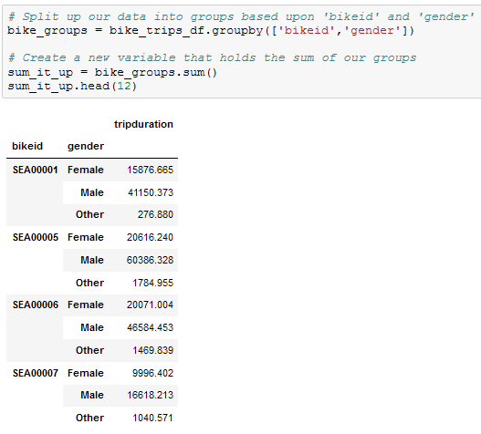
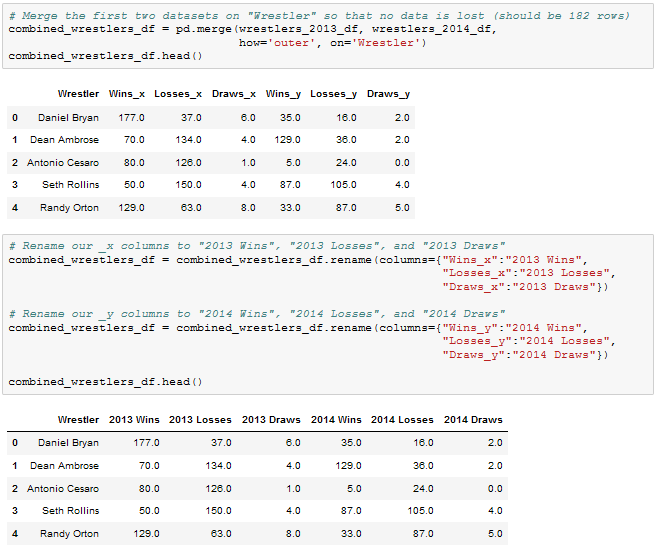

# 5.2 Plotting With Pandas

## Overview

Today's lesson plan introduces students to Pandas plotting, a quick and effective means to create charts using DataFrames.

## Class Objectives

By the end of today's class, students will be able to:

* Create plots using the `DataFrame.plot()` method.
* Explain the advantages and disadvantages of creating charts using the `DataFrame.plot()` method.
* Use Pandas to analyze a complex dataset and chart the visualizations.

## Instructor Prep

<details>
  <summary><strong>Instructor Notes</strong></summary>

* Today's class is rather light in new material. This is because plotting charts through Pandas makes visualizing large sets of data easier than before.

* If your students have trouble displaying plots, there are several possible remedies:

  * Try a different kernel in Jupyter.

  * Place `%matplotlib notebook` at the top of the notebook.

  * Consult [Stack Overflow](https://stackoverflow.com/questions/43027980/purpose-of-matplotlib-inline/43028034) to find possible solutions.

* Please refer to our [Student FAQs?](../../../05-Instructor-Resources/README.md#unit-05-matplotlib) for answers to questions frequently asked by students of this program. If you have any recommendations for additional questions, feel free to log an issue or a pull request with your desired additions.

* Have your TAs refer to the [Time Tracker](TimeTracker.xlsx) to stay on track.

* The slideshow is for instructor use only. When distributing slides to students, please first export the slides to a PDF file. You may then send out the PDF file.

</details>

<details>
  <summary><strong>Sample Class Video</strong></summary>

* To view an example class lecture, see: [Class Video](https://codingbootcamp.hosted.panopto.com/Panopto/Pages/Viewer.aspx?id=fbc015bb-bfee-452b-80cd-03b6bab71122). Note that the video may not reflect the most recent lesson plan.

</details>

- - -

# Class Activities

## 1. Intro and PyPlot Warmup

| Activity Time:       0:20 |  Elapsed Time:      0:20  |
|---------------------------|---------------------------|

<details>
  <summary><strong>📣 1.1 Instructor Do: Introduction to Class (0:02)</strong></summary>

* Open the [slideshow](https://docs.google.com/presentation/d/1AnKduNMApWUrEtakW6JQiNrZ7cZgUPeo0YqKgCjic8U) and use slides 1–3 as you welcome the class and introduce today's lesson. Be sure to cover the following:

* Poll the students and ask how comfortable everyone is with plotting in Python after the last class.

  * Today is all about reinforcing concepts. By the end of class, everyone should feel more comfortable with plotting in Python and choosing appropriate plots for any given dataset.

  * Today we will talk through multiple examples of datasets and asking ourselves what plots visualize the data best.

  * We will also design plots using a different Python method than last class. However the types of plots will all be familiar to us.

</details>

<details>
  <summary><strong>✏️ 1.2 Student Do: PyPlot Warmup (0:13)</strong></summary>

* **File:** [plot_drills.ipynb](Activities/01-Stu_PlotsReview/Unsolved/plot_drills.ipynb)

* **Instructions:** [README.md](Activities/01-Stu_PlotsReview/README.md)

* In this activity students will use PyPlot to create the most effective visualization for a variety of datasets.

* **Important:** Do not open any examples before reviewing this activity. Part of the challenge is for the class to come up with what charts fit the data, so providing them with reference code would give it all away.

* Open the [slideshow](https://docs.google.com/presentation/d/1AnKduNMApWUrEtakW6JQiNrZ7cZgUPeo0YqKgCjic8U) and use slides 4–6 to introduce the students to the first activity. Cover the following talking points:

  * Before diving into the meat and potatoes of today's lesson, we will spend some time warming up our minds with some PyPlot drilling exercises.

  * This activity will not only test our skills in creating plots, but will also make us think about what type of plot best fits a dataset.

</details>

<details>
  <summary><strong>⭐ 1.3 Review: PyPlot Warmup (0:05)</strong></summary>

* Open [01-Stu_PlotsReview](Activities/01-Stu_PlotsReview/Solved/plot_drills.ipynb) within the Jupyter Notebook and go through the code line by line with the class, answering whatever questions they have and making certain to discuss the following points:

  * The first dataset is ideal for a bar chart since the programmer is provided with nothing but a list of strings—gym names—and a list of integers—gym memberships—that should be compared against each other.

  * To ensure that the graph is as aesthetically pleasing as possible, the tick locations for the x-axis are modified so that they fall in the center of their associated bar when the bars are aligned to the edge of the chart. The limits of the x- and y-axes are then also modified to ensure there is some separation between the bars and the edge of the chart.

    

  * The second dataset fits a line chart best since the values within the lists change over time in relation to one another.

  * There is not as much aesthetic editing that needs to be done with this chart other than adding a horizontal line where the y-axis is equal to 0 so that it is easy to tell when a value is positive or negative.

    

  * While the third dataset obviously fits that which would be used for a pie chart, the only thing that differentiates it from the first is the inclusion of the "colors" list and "explode" tuple. Still, since pie charts are helpful when comparing parts of a whole, the pie chart provides a different perspective from the bar chart from earlier.

  * It is important to note how the axes are being set to "equal" so that the pie chart is circular and that the parameter of `autopct=%1.1%%` is passed into the `plt.pie()` method so as to convert the values within the "members" list into percentages with a single decimal point.

    

  * The final dataset compares the relationship between 2 lists with unique values. Because of this, a scatter plot is the ideal method through which to visualize the relationship.

  * Scatter plots require very little in the way of aesthetic styling, so the chart really only needs to be drawn to look pleasing.

    

</details>

<sub>[Having issues with this activity? Report a bug!](https://bit.ly/2UDFU2f)</sub>

- - -

## 2. Battling Kings - Plotting Pandas Data

| Activity Time:       0:35 |  Elapsed Time:      0:55  |
|---------------------------|---------------------------|

<details>
  <summary><strong>📣 2.1 Instructor Do: Plotting Pandas Data (0:10)</strong></summary>

* Open the [slideshow](https://docs.google.com/presentation/d/1AnKduNMApWUrEtakW6JQiNrZ7cZgUPeo0YqKgCjic8U) and use slides 7-12 while covering the following talking points:

  * The plots within the previous activity were generated using mock data. In real applications, data could be messy, incomplete, or in strange formats.

  * When dealing with real data, analysts will typically spend a lot of time "cleaning" it prior to generating any graphics. It is only once the data is clean that they can create an accurate and effective plot.

  * Last week, we learned how to clean up and preprocess datasets using Pandas. Therefore, we can expect most real world data that we analyze will come from within a Pandas DataFrame.

  * The creators of Pandas realized that most people using Pandas would move on to visualize their plots using Matplotlib. In a moment of pure genius, they built Matplotlib methods into their library so as to allow data analysts to easily generate complex charts in very little time.

* Open and run [02-Ins_PandasPlot](Activities/02-Ins_PandasPlot/Solved/avg_state_rain.ipynb) within Jupyter Notebook to show students how Pandas can be used to create intricate plots and data visualizations using the values stored within DataFrames. Cover the following talking points:

  * Using PyPlot, it took a lot of code to create a bar chart of average rainfall by state.

  * Scroll down to the "Using Pandas to Chart a DataFrame" section of the application. See how the original DataFrame is being cut down to only those values that the application should chart. The index for the DataFrame is then set to the "State" column so that Pandas will use these values later on.

  * `DataFrame.plot()` is called and the parameters `kind="bar"` and `figsize=(20,3)` are passed into it. This tells Pandas to create a new bar chart using the values stored within the DataFrame. The values stored within the index will be the labels for the x-axis while the values stored within the other column will be used to plot the y-axis.

  * The bar chart produced is automatically styled. The header for the index is now the label for the x-axis while the header for the other column has been placed inside a legend.

  * The chart can still be edited just like any other kind of PyPlot as well. For example, the title for the chart can still be set using `plt.title()`.

    

  * Pandas will plot multiple columns so long as the DataFrame contains multiple columns of data within it.

  * It is also possible to modify a specific Pandas plot by storing the plot within a variable and then using built-in methods to modify it. For example: `PandasPlot.set_xticklabels()` will allow the user to modify the tick labels on the x-axis without having to manually set the DataFrame's index.

    

  * To use a different plotting type, simply change the "kind" that is being passed as a parameter.

</details>

<details>
  <summary><strong>✏️ 2.2 Student Do: Battling Kings (0:20)</strong></summary>

* **File:** [battling_kings.ipynb](Activities/03-Stu_BattlingKings-PlottingPandas/Unsolved/battling_kings.ipynb)

* **Instructions:** [README](Activities/03-Stu_BattlingKings-PlottingPandas/README.md)

* In this activity, students will create a bar chart that visualizes which kings within the Game of Thrones universe have participated in the most battles. This means that students will need to clean up and analyze a Pandas DataFrame before creating their plot.

* Open [03-Stu_BattlingKings](Activities/03-Stu_BattlingKings-PlottingPandas/Solved/battling_kings.ipynb) within the Jupyter Notebook and run the code to show the end results of the application.

* You may also open the [slideshow](https://docs.google.com/presentation/d/1AnKduNMApWUrEtakW6JQiNrZ7cZgUPeo0YqKgCjic8U) and use slides 13–15 to introduce this activity.

</details>

<details>
  <summary><strong>⭐ 2.3 Review: Battling Kings (0:05)</strong></summary>

* Open [03-Stu_BattlingKings](Activities/03-Stu_BattlingKings-PlottingPandas/Solved/battling_kings.ipynb) within the Jupyter Notebook and go through the code line by line with the class, answering whatever questions they have and making certain to discuss the following points:

  * Since the primary purpose of this chart will be to uncover which kings have participated in the most battles, it is crucial to collect the `value_counts()` of both the "attacking_king" and "defending_king" columns.

  * The values contained within these 2 Pandas series should be added together to calculate the total battles each king was in. This should be done using `Series.add(OtherSeries, fill_value=0)` so that the 2 kings who have only been on the defending sides of battles will be added properly.

  * All that needs to be done from this point on is use `Series.plot(kind="bar")` so as to create the plot desired.

    

</details>

<sub>[Having issues with this activity? Report a bug!](https://bit.ly/2UZrbO3)</sub>

- - -

## 3. Bike Trippin'

| Activity Time:       0:30 |  Elapsed Time:      1:25  |
|---------------------------|---------------------------|

<details>
  <summary><strong>📣 3.1 Instructor Do: Plotting Groups (0:05)</strong></summary>

* Open the [slideshow](https://docs.google.com/presentation/d/1AnKduNMApWUrEtakW6JQiNrZ7cZgUPeo0YqKgCjic8U) and use slides 16–20 as you cover the talking points for this section.

* Ask the students if they remember how to group data using Pandas. Then, remind students of the following:

  * We can group and summarize data using the Pandas `groupby()` function. The output of this is a GroupBy object.

  * A DataFrame is returned when a method such as mean() is called on a GroupBy object."

  ```python
  # Returns a DataFrame from a GroupBy object
  df.groupby('state').mean()
  ```

  * If the method is called on a specific column on a GroupBy object, then a series is returned.

  ```python
  # Returns a Series from a GroupBy object
  states = df.groupby('state')
  states['city'].mean()
  ```

  * `DataFrame.plot()` or `Series.plot()` can then be used to quickly and easily create charts based on summary data.

* Open [04-Ins_GroupPlots](Activities/04-Ins_GroupPlots/Solved/plotting_groups.ipynb) within Jupyter Notebook and run through the code with the class.

  * This example takes used car data from Germany and allows users to determine what categories influence the pricing of a car.

  * Within this application, the original DataFrame is grouped by the values of the "maker" column and returned as a GroupBy object.

  * Those values are then counted on the column "maker", returning a Series with the count of each "maker".

  * This Series is then charted using Pandas.

    

</details>

<details>
  <summary><strong>✏️ 3.2 Student Do: Bike Trippin' - Grouped Charts (0:20)</strong></summary>

* **Files:**

  * [bike_trippin.ipynb](Activities/05-Stu_BikeTrippin-Groupby/Unsolved/bike_trippin.ipynb)

  * [trip.csv](Activities/05-Stu_BikeTrippin-Groupby/Resources/trip.csv)

* **Instructions:**  [README](Activities/05-Stu_BikeTrippin-Groupby/README.md)

* In this activity, students will create a pair of charts based on community bike data collected from Seattle. This activity will require them to create and analyze GroupBy objects before printing some visualizations of their findings to the screen.

* Open [05-Stu_BikeTrippin](Activities/05-Stu_BikeTrippin-Groupby/Solved/bike_trippin.ipynb) within the Jupyter Notebook and run the code to show the results of the application.

* You may choose to open the [slideshow](https://docs.google.com/presentation/d/1AnKduNMApWUrEtakW6JQiNrZ7cZgUPeo0YqKgCjic8U) and use slides 21–23 to accompany this activity.

</details>

<details>
  <summary><strong>⭐ 3.3 Review: Bike Trippin' (0:05)</strong></summary>

* Open [05-Stu_BikeTrippin](Activities/05-Stu_BikeTrippin-Groupby/Solved/bike_trippin.ipynb) within the Jupyter Notebook and go through the code line by line with the class, answering whatever questions they have and making certain to discuss the following points:

  * For the bar chart, the original DataFrame is grouped by the values within the "gender" column and counted.

  * The series returns with a series containing a buggy value in the gender column called "stoptime." This row in the series must be dropped so that the data can be charted accurately.

  * The title for the chart is set within the `Series.plot()` method while the X and Y labels are set using Matplotlib's `Axes.set_xlabel()` and `Axes.set_ylabel()` methods.

    

  * For the pie chart, the original DataFrame is grouped by both the "bikeid" and "gender" columns and returns a GroupBy object. When the sum analysis is performed a DataFrame containing multiple indexes is returned so that the duration is calculated per gender per bike.

    

  * To create a chart based on one bike alone, `loc[]` must be used in order and a single "bikeid" must be passed. This returns a DataFrame with only the "gender" column as the index and "tripduration" as the value.

  * When creating a pie chart, a Y value must be passed into the `DataFrame.plot()` method. This lets Pandas know what label or position of the column to plot. Here we are plotting `tripduration`.

  * The title for the pie chart is being dynamically set by concatenating strings.

    

</details>

<sub>[Having issues with this activity? Report a bug!](https://bit.ly/3dORsXX)</sub>

- - -

## Break

| Activity Time:       0:15 |  Elapsed Time:      1:40  |
|---------------------------|---------------------------|

- - -

## 4. Miles Per Gallon

| Activity Time:       0:20 |  Elapsed Time:      2:00  |
|---------------------------|---------------------------|

<details>
  <summary><strong>✏️ 4.1 Student Do: Miles Per Gallon - Scatter Plot (0:15)</strong></summary>

* **Files:**

  * [mpg.ipynb](Activities/06-Stu_MilesPerGallon-ScatterPlot/Solved/mpg.ipynb)

  * [MPG.csv](Activities/06-Stu_MilesPerGallon-ScatterPlot/Resources/mpg.csv)

* **Instructions:**

  * [README](Activities/06-Stu_MilesPerGallon-ScatterPlot/Instructions.md)

* In this activity, students will create a scatter plot using vehicle data, Pandas, and Matplotlib.

* Open [06-Stu_MilesPerGallon](Activities/06-Stu_MilesPerGallon-ScatterPlot/Solved/mpg.ipynb) within the Jupyter Notebook and run the code to show the end results of the application.

* You may choose to open the [slideshow](https://docs.google.com/presentation/d/1AnKduNMApWUrEtakW6JQiNrZ7cZgUPeo0YqKgCjic8U) and use slides 25–27 to accompany this activity. Otherwise, show the students what chart they will be attempting to create.


</details>

<details>
  <summary><strong>📣 4.2 Instructor Do: Review Miles Per Gallon (0:05)</strong></summary>

* Open [06-Stu_MilesPerGallon](Activities/06-Stu_MilesPerGallon-ScatterPlot/Solved/mpg.ipynb) within the Jupyter Notebook and go through the code line by line with the class, answering whatever questions they have and making certain to discuss the following points:

  * There are quite a few rows in the original dataset that include missing values. These rows are filtered out using a `loc[]` filter that looks for any rows that do not contain a "?" value.

  * The data stored within the "horsepower" column is not numeric by default. This is due to the "?" values that were there, so `pandas.to_numeric()` must be used to convert the column into a usable format.

  * The `x` and `y` parameters in `DataFrame.plot()` allow users to specify which columns they would like to chart. This allows the user to create graphs without having to filter the DataFrame down to only 2 columns.

    

</details>

<sub>[Having issues with this activity? Report a bug!](https://bit.ly/2UA2NU5)</sub>

- - -

## 5. Winner Wrestling

| Activity Time:       1:00 |  Elapsed Time:      3:00  |
|---------------------------|---------------------------|

<details>
  <summary><strong>📣 5.1 Instructor Do: Plotting Multiple Lines (0:05)</strong></summary>

* In this activity, we will explore creating a multiplot with Matplotlib and then with Pandas.

* Open the [slideshow](https://docs.google.com/presentation/d/1AnKduNMApWUrEtakW6JQiNrZ7cZgUPeo0YqKgCjic8U) and use slides 28–30 to cover the following talking points:

  * We have already seen that Pandas plotting has many of the same features and capabilities as using Matplotlib directly.

  * The final feature we will look at today will be adding multiple plots to a single figure.

  * Fundamentally, adding multiple plots to the same figure using Pyplot is the same as using `dataframe.plot()`. We pass multiple plots in the same code block before using the `pyplot.show()` function.

* Open [07-Ins_PandasMultiLine](Activities/07-Ins_PandasMultiLine/Solved/unemploy_chart.ipynb) within Jupyter Notebook and run through the code with the class.

  * Explain to the class how this data, which keeps track of international unemployment numbers, has been split between 2 CSV files and therefore must be merged.

  * After the merging has taken place, the duplicate "Country Code" column should be deleted and the original "Country Code" column reset to its original name.

    

  * The average unemployment rate across the entire globe can be found by finding the means of the DataFrame.

  * Since all of the years are stored within the column headers, they can be collected by taking the series created by the means calculation and looking into its keys.

    

  * The 2 line plots are then created using `plt.plot()`, the first using the average unemployment findings for its *x* values while the other takes in the values of a single row. The *x* values for both of the charts should be the "years" list created earlier.

  * The tuples method discussed during the previous class is used to create the legend for the plots.

    

* Demonstrate that the identical plot can be created with Pandas:

    

  * Although Pandas plots are generally less flexible and customizable than Matplotlib plots, Pandas is capable of generating many common charts.

</details>

<details>
  <summary><strong>✏️ 5.2 Student Do: Winner Wrestling, Part 1 (0:15)</strong></summary>

* **Files:**

  * [winning_wrestlers.ipynb](Activities/08-Stu_WinnerWrestling-Part1/Solved/winning_wrestlers.ipynb)

  * [WWE-Data-2013.csv](Activities/08-Stu_WinnerWrestling-Part1/Resources/WWE-Data-2013.csv)

  * [WWE-Data-2014.csv](Activities/08-Stu_WinnerWrestling-Part1/Resources/WWE-Data-2014.csv)

  * [WWE-Data-2015.csv](Activities/08-Stu_WinnerWrestling-Part1/Resources/WWE-Data-2015.csv)

  * [WWE-Data-2016.csv](Activities/08-Stu_WinnerWrestling-Part1/Resources/WWE-Data-2016.csv)

* **Instructions:** [README.md](Activities/08-Stu_WinnerWrestling-Part1/README.md)

* The rest of class will be dedicated to creating a plot using Pandas and Matplotlib that allows its viewers to visualize the recent careers of professional wrestlers.

* This mini-project has been broken down into 3 parts and was designed for students to work alongside each other in groups.

* In this first part, students will take 4 CSV files and merge them. They will then need to rename and style the columns so that they reflect the data properly.

* Open [08-Stu_WinnerWrestling-Part1](Activities/08-Stu_WinnerWrestling-Part1/Solved/winning_wrestlers.ipynb) within the Jupyter Notebook and run the code to show the results of the application.

* You may choose to open the [slideshow](https://docs.google.com/presentation/d/1AnKduNMApWUrEtakW6JQiNrZ7cZgUPeo0YqKgCjic8U) and use slides 31–33 to accompany this activity. Otherwise, show the students what they will be attempting to create.

  

</details>

<details>
  <summary><strong>⭐ 5.3 Review: Winner Wrestling, Part 1 (0:05)</strong></summary>

* Open [08-Stu_WinnerWrestling-Part1](Activities/08-Stu_WinnerWrestling-Part1/Solved/winning_wrestlers.ipynb) within the Jupyter Notebook and go through the code line by line with the class, answering whatever questions they have and making certain to discuss the following points:

  * The DataFrames should be merged together on the "Wrestler" column using an outer join. This ensures that no data will be lost even if the wrestler is unique to a single CSV.

  * As DataFrames are merged, columns should be renamed so that it is clear what year the wins, losses, and draws are from.

  * While it is possible to merge all of the DataFrames using one incredibly long series of nested merge statements, it is far simpler to merge the DataFrames a pair at a time. This allows programmers to modify columns as they go and lessens the risk of naming a column incorrectly.

    

</details>

<details>
  <summary><strong>✏️ 5.4 Student Do: Winner Wrestling, Part 2 (0:10)</strong></summary>

* **Files:**

  * [winning_wrestlers.ipynb](Activities/08-Stu_WinnerWrestling-Part1/Solved/winning_wrestlers.ipynb)

  * [WWE-Data-2013.csv](Activities/08-Stu_WinnerWrestling-Part1/Resources/WWE-Data-2013.csv)

  * [WWE-Data-2014.csv](Activities/08-Stu_WinnerWrestling-Part1/Resources/WWE-Data-2014.csv)

  * [WWE-Data-2015.csv](Activities/08-Stu_WinnerWrestling-Part1/Resources/WWE-Data-2015.csv)

  * [WWE-Data-2016.csv](Activities/08-Stu_WinnerWrestling-Part1/Resources/WWE-Data-2016.csv)

* **Instructions:** The instructions for this activity are contained within the unsolved version.

* In this second part, groups will create new columns for their DataFrame which will inform readers of how many matches a wrestler has won, lost, drawn, and taken part in over the course of their career.

* Open [09-Stu_WinnerWrestling-Part2](Activities/09-Stu_WinnerWrestling-Part2/Solved/winning_wrestlers.ipynb) within the Jupyter Notebook and run the code to show the end results of the application.

* You may choose to open the [slideshow](https://docs.google.com/presentation/d/1AnKduNMApWUrEtakW6JQiNrZ7cZgUPeo0YqKgCjic8U) and use slides 34–35 to accompany this activity. Otherwise, show the students what they will be attempting to create.

  

</details>

<details>
  <summary><strong>⭐ 5.5 Review: Winner Wrestling, Part 2 (0:05)</strong></summary>

* Open [09-Stu_WinnerWrestling-Part2](Activities/09-Stu_WinnerWrestling-Part2/Solved/winning_wrestlers.ipynb) within the Jupyter Notebook and go through the code line by line with the class, answering whatever questions they have and making certain to discuss the following points:

  * To calculate the total number of wins, losses, or draws, simply add up the values within the corresponding columns for each wrestler and place the output in a new column.

  * To calculate the total number of matches, add up the total wins, losses, and draws for each wrestler and place the output in a new column.

  * To filter out those wrestlers who have not wrestled more than 100 matches, use a `loc[]` filter and check that the "Total Matches" column is greater than or equal to 100.

    

</details>

<details>
  <summary><strong>✏️ 5.6 Student Do: Winner Wrestling, Part 3 (0:15)</strong></summary>

* **Files:**

  * [winning_wrestlers.ipynb](Activities/10-Stu_WinnerWrestling-Part3/Solved/winning_wrestlers.ipynb)

  * [WWE-Data-2013.csv](Activities/10-Stu_WinnerWrestling-Part3/Resources/WWE-Data-2013.csv)

  * [WWE-Data-2014.csv](Activities/10-Stu_WinnerWrestling-Part3/Resources/WWE-Data-2014.csv)

  * [WWE-Data-2015.csv](Activities/10-Stu_WinnerWrestling-Part3/Resources/WWE-Data-2015.csv)

  * [WWE-Data-2016.csv](Activities/10-Stu_WinnerWrestling-Part3/Resources/WWE-Data-2016.csv)

* **Instructions:** The instructions for this activity are contained in the unsolved version.

* In this final part, the class will take the DataFrame they created and, using Matplotlib, chart the number of wins and losses an individual wrestler has had over the course of a career.

* Open [10-Stu_WinnerWrestling-Part3](Activities/10-Stu_WinnerWrestling-Part3/Solved/winning_wrestlers.ipynb) within the Jupyter Notebook and run the code to show the end results of the application.

* You may choose to open the [slideshow](https://docs.google.com/presentation/d/1AnKduNMApWUrEtakW6JQiNrZ7cZgUPeo0YqKgCjic8U) and use slides 36–37 to accompany this activity. Otherwise, show the students what they will be attempting to create.

  

</details>

<details>
  <summary><strong>⭐ 5.6 Review: Winner Wrestling, Part 3 (0:05)</strong></summary>

* Open [10-Stu_WinnerWrestling-Part3](Activities/10-Stu_WinnerWrestling-Part3/Solved/winning_wrestlers.ipynb) within the Jupyter Notebook and go through the code line by line with the class, answering whatever questions they may have and making certain to discuss the following points.

  * Inputs can still function within Jupyter Notebook. Whenever the cell containing the input line is run, a prompt will be printed within the space beneath it, allowing for a user to add a response.

  * Two series must be created for the graph using `loc[]` filtering. Both look for the row with a wrestler name equal to that which the user inputted. The first series takes all of the values in the "Wins" columns while the second series takes all of the values in the "Losses" columns.

  * The "years" list that will serve at the chart's x-axis can be made manually since the years are consistent and known to the programmer.

  * While the `Series.plot()` method could theoretically be used to create both the "Wins" and "Losses" plots, the data is stored within different data types, it is actually easier to use the `plt.plot()` method.

    

</details>

<sub>[Having issues with this activity? Report a bug!](https://bit.ly/2JwjJo3)</sub>

- - -

## References

City of Seattle. (2019). Pronto Cycle Share Trip Data. Seattle, Washington: Open Data Program. [https://data.seattle.gov/Community/Pronto-Cycle-Share-Trip-Data/tw7j-dfaw](https://data.seattle.gov/Community/Pronto-Cycle-Share-Trip-Data/tw7j-dfaw)

Ramos, Ernesto and David Donoho. (1983). 1983 Data Exposition Auto MPG Data Set. Revised from CMU StatLib library. University of California-Irvine Machine Learning Repository. [https://archive.ics.uci.edu/ml/machine-learning-databases/auto-mpg/](https://archive.ics.uci.edu/ml/machine-learning-databases/auto-mpg/)

Kreikenbohm, Philip. (2017). Cagematch.com World Wrestling Entertainment (WWE) Statistics. [https://www.cagematch.net](https://bit.ly/2O4x3pV)

- - -

© 2021 Trilogy Education Services, LLC, a 2U, Inc. brand. Confidential and Proprietary. All Rights Reserved.
