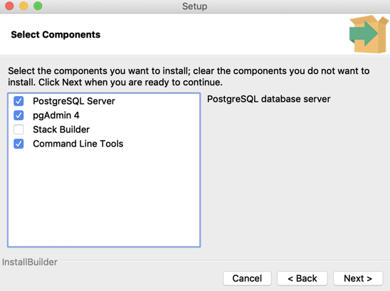

# Installing pgAdmin and Postgres on a Mac

Similar to coding with Python using Visual Studio Code, SQL requires a code editor with the ability to execute the scripts developers (you!) create.

## Before you Begin

* Remember to choose the installation package specific to your operating system and download the latest version.

* Be prepared to record a password, this will be needed later!

## Download Link(s)

* [PostgreSQL](https://www.enterprisedb.com/downloads/postgres-postgresql-downloads)

## Instructions

* After downloading the latest version of PostgreSQL 11, double click on the `postgresql-11.x-osx` file. **Note:** exact file version may be slightly different.

  

* Go through the Setup Wizard and install PostgreSQL. Keep the default location as: `/Library/PostgreSQL/11`.

* Select the components to be installed. **Be sure to un-check `Stack Builder`.**

  

* Next, add your Data Directory. Keep the default location as: `/Library/PostgreSQL/11/data`.

* Next, enter `postgres` as the password. **Be sure to record this password for future use.**

* Keep the default port as `5432` and in the Advanced Options, set the locale as `[Default locale]`.

* The final screen will be the `Pre Installation Summary`.

* When you are done you should have a folder in your Applications with these files.

  

* **Important** if you are running the Big Sur update for Mac you will need to download the latest version of pgAdmin.

  * Go to the [pgAdmin download](https://www.pgadmin.org/download/pgadmin-4-macos/) and select the latest version.

  * Click the `.dmg` files to start the download.

  

  * Once the download is complete click on the `.dmg` file in your downloads to install.

  * After it has finished installing, drag the `pgAdmin` file into your applications folder (this will take a few minutes).

  * Once the transfer completes you will now be able to use `pgAdmin`. **Note** that you will still have a version in your PostgreSQL folder, but only use the version that you copied into Applications.

* To confirm the installation, start `pgAdmin` (this will open in a new browser window) and connect to the default server by clicking on it and entering the password if prompted.
