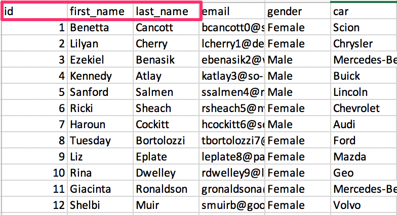

# 13.1 A Case Study of Extract, Transform, Load

## Overview

* Today's class will focus on introducing this week's Extract, Transform, Load (ETL) group project. Students will gain exposure to the ETL process, be assigned to their groups, and create a project proposal.

## Class Priorities

* Students will be given requirements for the ETL project.

* Students will familiarize themselves with an overview of the ETL process.

* Students will be assigned to their groups, and create a feasible project for the time frame.

## Instructor Prep

<details>
  <summary><strong>Instructor Notes</strong></summary>

* **INSTRUCTOR CONTENT NOTE:** If your class learned MySQL content (and _not_ PostgreSQL) during Unit 9, please teach Unit 13 using the `april/archived-content` branch by inputting `git checkout april/archived-content` in your terminal. You can revert back to the `master` branch after this unit is complete.

* This week will provide students a chance to synthesize new material with what they have learned to this point.

* Today's focus should be on identifying a project that they find interesting, but one that is feasible in the time frame. Once groups are formed, the instructor and the TAs should help them with this task.

* The schedule for this week is as follows:

* Day 1 (Today):

  * Students are introduced to the ETL process, and will work through an activity.

  * Students are introduced to the ETL project, its goals, and requirements.

  * Students work with Instructors / TAs to identify feasible projects.

  * Students submit a project proposal.

* Day 2:

  * Students work on their project.

  * Instructors and TAs work closely with groups to offer code assistance, where needed.

* Day 3:

  * Students complete their project.

  * The week is wrapped up with a discussion.

* Remember that this project, like the other projects in this course, is to be graded by yourself and your fellow instructional team members.

* Lastly, as a reminder these slideshows are for instructor use only - when distributing slides to students, please first export the slides to a PDF file. You may then send out the PDF file.

* Please reference our [Student FAQ](../../../05-Instructor-Resources/README.md#unit-13-etl-project) for answers to questions frequently asked by students of this program. If you have any recommendations for additional questions, feel free to log an issue or a pull request with your desired additions.

</details>

<details>
  <summary><strong>Sample Class Video</strong></summary>

* To view an example class lecture visit (Note video may not reflect latest lesson plan): [Class Video](https://codingbootcamp.hosted.panopto.com/Panopto/Pages/Viewer.aspx?id=2e4a05e1-ac7b-4561-90cf-aa850184a9d2)

</details>

- - -

# Class Activities

## 1. Welcome & Intro to ETL

| Activity Time:       0:30 |  Elapsed Time:      0:30  |
|---------------------------|---------------------------|

<details>
  <summary><strong>📣 1.1 Instructor Do: Welcome Students (5 mins)</strong></summary>

* Open the [slideshow](https://docs.google.com/presentation/d/1JNdEk9EI-ulJYYhcIvfi6T2eT1HtJMITp77KQtCojAg/edit?usp=sharing) and use slides 1 - 4 to welcome students and explain that they will be exposed to the Extract, Transform, Load (ETL) process, and solidify their understanding by working on an ETL project.

* Explain that they will put to use skills they have learned up to this point, as well as new ones.

</details>

<details>
  <summary><strong>📣 1.2 Instructor Do: Introduction to the Case Study Project (10 mins)</strong></summary>

* Open the [slideshow](https://docs.google.com/presentation/d/1JNdEk9EI-ulJYYhcIvfi6T2eT1HtJMITp77KQtCojAg/edit?usp=sharing) use slides  5 and 6 to start off by outlining the requirements of the project.

* Explain that project must use two or more sources of data.

  * Two recommended sources are [data.world](https://data.world/) and [Kaggle](https://www.kaggle.com/).

  * Google also has a dataset search interface: [https://toolbox.google.com/datasetsearch](https://toolbox.google.com/datasetsearch).

  * Alternatively, students may use APIs or scrape data from the web. Groups who elect do do this, however, should run it by the instructional staff first.

* Explain that once datasets are identified, students will perform ETL on the data, and document the following in a technical report:

  * Datasets used and their sources

  * Types of data wrangling performed, such as data cleaning, joining, filtering, and aggregating.

  * The schemata used in the final production database, whether relational or non-relational.

* Finally, assign students to their groups. Each group should have ideally two, no more than three, students. Take individual student strengths as you assign them.

</details>

<details>
  <summary><strong>📣 1.3 Instructor Do: Introduction to ETL (15 mins)</strong></summary>

* **Files:**

  * Open the [slideshow](https://docs.google.com/presentation/d/1JNdEk9EI-ulJYYhcIvfi6T2eT1HtJMITp77KQtCojAg/edit?usp=sharing) and follow slides 7 - 13 to introduce the class to ETL.

</details>

<sub>[Having issues with this activity? Report a bug!](https://bit.ly/3aPMrfF)</sub>

- - -

## 2. Pandas ETL

| Activity Time:       0:45 |  Elapsed Time:      1:15  |
|---------------------------|---------------------------|

<details>
  <summary><strong>📣 2.1 Instructor Do: ETL with Pandas (15 mins)</strong></summary>

* Open the [slideshow](https://docs.google.com/presentation/d/1JNdEk9EI-ulJYYhcIvfi6T2eT1HtJMITp77KQtCojAg/edit?usp=sharing) and use slides 14 - 23 to present ETL with Pandas to the students.

* **Note:** Students will need to `pip install psycopg2-binary` for the following code examples to work. Send out instructions for them to do this and show them in the terminal.

* **Troubleshooting:** If you have any issues with installing psycopg2-binary, please refer to the official documentation at [http://initd.org/psycopg/docs/install.html](http://initd.org/psycopg/docs/install.html).

* Explain that the ETL process can be performed using many of the tools that we have seen, such as pgAdmin 4 and Pandas. Open the following [customer_data.csv](Activities/01-Ins_ETL_Pandas/Resources/customer_data.csv) in Excel and explain along the way:

  * This data set represents a raw form of input that includes raw customer information.

  * The only information that is needed for the customer names table are the first three columns.

  

* Next, open [customer_data.json](Activities/01-Ins_ETL_Pandas/Resources/customer_location.json) in a text editor and explain:

  * This is another customer dataset with additional information.

  * This source of data is JSON, but its data is related to the data in the CSV file.

  * ETL is needed to transform this data into a new database that combines data from both sources.

* Open up pgAdmin 4 and connect to the local server.

* Once connected create a new database, `customer_db`.  Then, explain the following steps:

  * Tables are created ahead of time to ensure that we only load what is needed from the data source. **Note** the columns will need to have the same names as the DataFrame columns.

  * Pandas does not allow the assignment of a primary key, so this task needs to be done with pgAdmin 4.

```sql
CREATE TABLE customer_name (
id INT PRIMARY KEY,
first_name TEXT,
last_name TEXT
);

CREATE TABLE customer_location (
id INT PRIMARY KEY,
address TEXT,
us_state TEXT
);
```

* Next open [data_etl.ipynb](Activities/01-Ins_ETL_Pandas/Solved/data_etl.ipynb) in Jupyter notebook. Go through the code explaining along the way:

  * Pandas is used in the extraction process to read the CSV into a DataFrame.

  * Pandas is again used in the transform process to clean the data to take in the columns that are needed for the `customer_name` table.

  * This process is repeated using the JSON data and transformed into what the `customer_location` tables need.

  * Next a library called SQLAlchemy is used to create a connection to the pgAdmin 4 database. Note that SQLAlchemy has expansive features that are beyond the scope of this class right now. Let students know that all they need to know is how to connect to a pgAdmin 4 database.

  * The connection string consists of `user:password@host/db_name`. The user will be `postgres` and the password will be the same one used to connect to pgAdmin 4 server. The host will be `localhost:5432`.  This is then passed into the `create_engine` function, which starts with `postgresql://` followed by the connection string.

    * **Note** students may have to `pip install` [psycopg2-binary](http://initd.org/psycopg/docs/install.html) package for the connection to pgAdmin 4.

  * The `postgresql://` specifies to SQLALchemy the type of the database connection. This can take other parameters such as `mysql`  and `sqlite`.

  * `engine.table_names()` will confirm a successful connection by returning the names of the tables in the pgAdmin 4 database.

  * Pandas again will be used in the load process by using the `.to_sql()` method that takes the name of the table, the connection to the db, what to do if the table already exists and whether to pass an index. Since the table has already been created and exists the DataFrame will append to the current table.

  ```python
  new_customer_data_df.to_sql(name='customer_name', con=engine, if_exists = 'append', index=False)
  ```

  * This is repeated again to load in the `customer_location` DataFrame.

  * Next, check that the data has been loaded into the database by querying the table in Pandas. Alternatively, the pgAdmin 4 workbench UI can used to also look at the table.

  * Finally, in pgAdmin 4, query the database and join the two tables.

  ```sql
  SELECT customer_name.id, customer_name.first_name, customer_name.last_name, customer_location.address, customer_location.us_state
  FROM customer_name
  JOIN customer_location
  ON customer_name.id = customer_location.id;
  ```

</details>

<details>
  <summary><strong>✏️ 2.2 Students Do: Pandas ETL (20 mins)</strong></summary>

* **Note:** Students will need to `pip install psycopg2-binary` before starting this activity.

* Open the [slideshow](https://docs.google.com/presentation/d/1JNdEk9EI-ulJYYhcIvfi6T2eT1HtJMITp77KQtCojAg/edit?usp=sharing) use slides 24 - 26 to go over the intructions of this activity with the class.

* **Files:**

  * [LicensePremise](Activities/02-Stu_ETL_Pandas_Local/Resources/LicensePremise.csv)

  * [CountyLicenseCount](Activities/02-Stu_ETL_Pandas_Local/Resources/CountyLicenseCount.csv)

* **Instructions:**

  * [README.md](Activities/02-Stu_ETL_Pandas_Local/README.md)

</details>

<details>
  <summary><strong>⭐ 2.3 Review: ETL Pandas (10 mins)</strong></summary>

* Open [schema.sql](Activities/02-Stu_ETL_Pandas_Local/Solved/schema.sql) in pgAdmin 4 go through the table queries. You may also have the [slideshow](https://docs.google.com/presentation/d/1JNdEk9EI-ulJYYhcIvfi6T2eT1HtJMITp77KQtCojAg/edit?usp=sharing) on slide 27 opened while explaining the following:

  * A tabled called `premises` is created taking an `id` as an integer and primary key, a text column for `premise_name` and another integer column for `county_id`.

  * A county table that will take `id` as an integer and primary key, a text column for the `county_name`, an integer column for `license_count` and an integer column for the `county_id`.

* Next, open [pandas_etl.ipynb](Activities/02-Stu_ETL_Pandas_Local/Solved/pandas_etl.ipynb) in a Jupyter notebook. Go through the code here explaining along the way:

  * For the **Extraction** step, the CSV files are loaded into a Pandas DataFrame.

  * The **Transformation** is applied separately to each DataFrame to clean up the data.

  * Using the `premise` table created earlier as a guide, a new `transform_premise_df` DataFrame is created from a copy of the original, taking in the columns `License Serial Number`, `Premises Name`, and `County ID`.

  * Since the License Serial Number should be unique, this column is used to drop any duplicated data.

  * Columns are renamed to fit with table names in the database.

  * Index is set to `id`, which was declared as the primary key earlier.

  * This process is mostly repeated for the `transform_county_df` DataFrame.

  * The **Load** process starts by creating a connection to the database.

  * `engine.table_names()` is used to check the connection. This step is generally optional and used here to just confirm the connection was successful to the correct database.

  * Finally, the `.to_sql` method is used to append each DataFrame to each respective table. Also, note that `index=True` is used to state that index has been declared in each DataFrame that is being appended.

* Open up pgAdmin 4 and using [query.sql](Activities/02-Stu_ETL_Pandas_Local/Solved/query.sql), query the `customer_db` database. Quickly explain:

  * Both tables are queried to verify that the data was correctly inserted into each table.

  * Now that ETL is complete, the database can be used for further analysis. For example, both tables can be joined if data is needed from both files. This was difficult prior to ETL because the data was stored in different files with duplicate or missing records.

</details>

<sub>[Having issues with this activity? Report a bug!](https://bit.ly/34hwzQP)</sub>

- - -

## Break

| Activity Time:       0:15 |  Elapsed Time:      1:30  |
|---------------------------|---------------------------|

- - -

## 3. Project Proposals

| Activity Time:       1:30 |  Elapsed Time:      3:00  |
|---------------------------|---------------------------|

<details>
  <summary><strong>✏️ 3.1 Students Do: Project Proposals (1:30)</strong></summary>

* Open the [slideshow](https://docs.google.com/presentation/d/1JNdEk9EI-ulJYYhcIvfi6T2eT1HtJMITp77KQtCojAg/edit?usp=sharing) and use slides 29 - 33 to go over the project guidelines, requirements, and suggestions for the Project. Lastly, you may use slide 34 to inspire the class for greatness.

* **Files:**

  * [README.md](../Supplemental/ProjectGuideLines/README.md)

</details>

- - -

## References

New York State Liquor Authority. (2013). Liquor Authority Daily List of Active Licenses API. Updated 2018. [https://data.ny.gov/Economic-Development/Liquor-Authority-Daily-List-of-Active-Licenses-API/wg8y-fzsj](https://data.ny.gov/Economic-Development/Liquor-Authority-Daily-List-of-Active-Licenses-API/wg8y-fzsj)

Mockaroo, LLC. (2021). Realistic Data Generator. [https://www.mockaroo.com/](https://www.mockaroo.com/)

- - -

© 2021 Trilogy Education Services, LLC, a 2U, Inc. brand. Confidential and Proprietary. All Rights Reserved.
