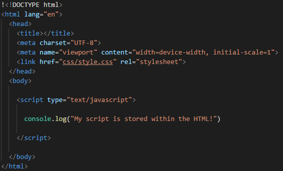
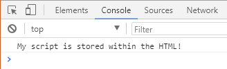
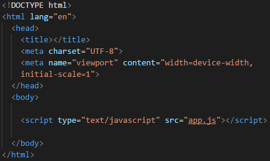
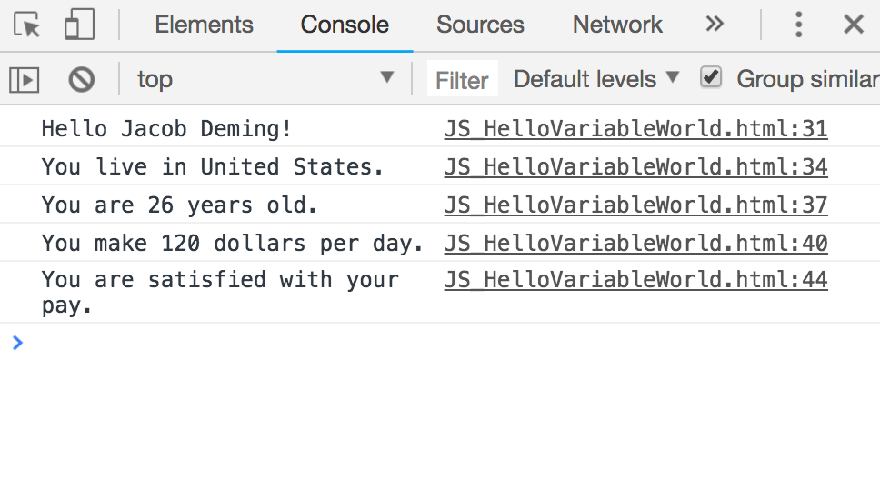
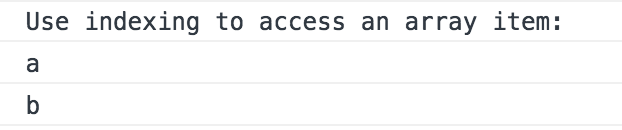
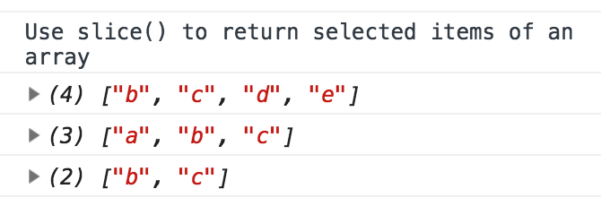
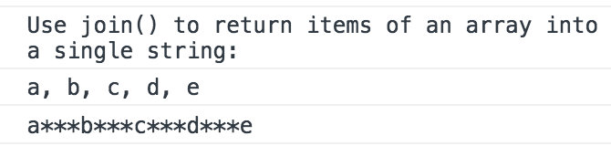
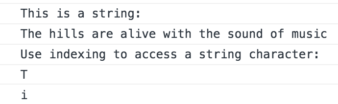
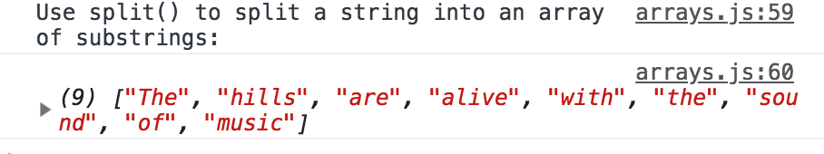
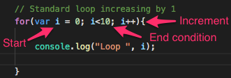

# 14.1 Introduction to JavaScript

## Overview

Today's class will introduce students to the basic syntax of JavaScript.

### Class Objectives

* Students will gain familiarity with JavaScript variables, data types, and statements.
* Students will gain familiarity with basic JavaScript control flow (functions, loops, if/else statements).
* Students will gain familiarity with JavaScript arrays.
* Students will gain familiarity with using and creating functions in JavaScript, including built-in functions.

## Instructor Prep

<details>
  <summary><strong>Instructor Notes</strong></summary>

* Welcome to JavaScript week! Since students have a strong background in Python at this point, the first part of the lesson moves quickly as it assumes basic programming knowledge. Students will take advantage of their existing knowledge of Python to grasp JavaScript fundamentals.

* Despite the syntactical similarities between Python and JavaScript, students who are encountering JavaScript for the first time may experience initial discomfort with it.

* Some students may also wonder at some point how JavaScript relates to data analytics, especially those who are not interested in web development. Remind them that JavaScript is a powerful and very marketable skill.

* As students learn JavaScript, they'll find themselves needing to juggle multiple items, including keeping track of code across multiple documents. They will likely experience some frustration. Again, let them know that they aren't expected to learn all of JavaScript in one week. Rather, this week will be a headlong introduction into the topic.

* Please reference our [Student FAQ](../../../05-Instructor-Resources/README.md#unit-14-intro-to-javascript) for answers to questions frequently asked by students of this program. If you have any recommendations for additional questions, feel free to log an issue or a pull request with your desired additions.

* Have your TAs keep track with the [Time Tracker](TimeTracker.xlsx)

* Lastly, as a reminder these slideshows are for instructor use only - when distributing slides to students, please first export the slides to a PDF file. You may then send out the PDF file.

</details>

<details>
  <summary><strong>Sample Class Video</strong></summary>

* To view an example class lecture visit (Note video may not reflect latest lesson plan): [Class Video](https://codingbootcamp.hosted.panopto.com/Panopto/Pages/Viewer.aspx?id=f4a93f60-70bd-42f5-b91c-aa8c018527a4)

</details>

- - -

# Class Activities

## 1. Intro to JavaScript & From Python to JavaScript

| Activity Time:       0:50 |  Elapsed Time:      0:50  |
|---------------------------|---------------------------|

<details>
  <summary><strong>📣 1.1 Instructor Do: A Quick Intro to JavaScript (10 mins)</strong></summary>

* Open the [slideshow](https://docs.google.com/presentation/d/18hV9yymIeoNjWhmjlMJDyRDARaLqddw7wA7Rayak9ZA/edit?usp=sharing) and welcome students back and explain that today we'll dive into a new language: JavaScript! Use slides 1 - 14 to cover unit 1.1.

* Explain that JavaScript shares many similarities with Python, but that there are also a number of differences, from typical usage to syntax.

* Walk through the slides 1 - 8 and explain why JavaScript is important to a career in data:

  * Just as important as crunching numbers is conveying information to a wider audience, and JavaScript is the language of the web.

  * JavaScript makes it possible to create interactive web pages and visualizations.

  * JavaScript is often used to place API calls to cloud data and services.

  * JavaScript also allows websites to send and receive data from a server, respond to a user's actions on the page, and dynamically modify HTML elements.

  * With JavaScript, it is possible to build interactive sites that do not require the use of the command line interface. For example, data analytics students from this program have used JavaScript to build internal tools and even client-facing dashboards.

  * JavaScript is everywhere. Even machine learning has been made available for the web browser: [https://js.tensorflow.org/](https://js.tensorflow.org/).

  * Bottom line: JavaScript is a very marketable and in-demand skill for any data position.

* Use slides 9 - 14 and share the following tips for learning JavaScript:

  * First, learning JavaScript will take much longer than a single week.

  * Focus on the small stuff and mastery will build over time.

  * Don't stay stuck, ask for help!

  * Review, practice, utilize office hours, get help, and don't give up!

* Send out the following files to be used as reference guides as students progress through JavaScript:

  * [Student Guide](../StudentGuide.md)

  * [JavaScript Data Functions](../Supplemental/JavaScript_Data_Functions.pdf)

  * [JavaScript Reference Guide](../Supplemental/JavaScript_Reference_Guide.pdf)

  * [ES6 Reference Guide](../Supplemental/ES6_Reference_Guide.pdf)

</details>

<details>
  <summary><strong>📣 1.2 Instructor Do: Running JavaScript (15 mins)</strong></summary>

* Since JavaScript is the language of the web, its code is commonly associated with HTML documents, or **inside** HTML documents.

* First, open the [slideshow](https://docs.google.com/presentation/d/18hV9yymIeoNjWhmjlMJDyRDARaLqddw7wA7Rayak9ZA/edit?usp=sharing) and use slides 15 - 18 to go over this lesson.

* Open up [01-Ins_JavaScript/Solved/script-within.html](Activities/01-Ins_JavaScript/Solved/script-within.html) with a text editor and go over the code with the class.

  * The JavaScript code is placed between a pair of `script` tags inside of the HTML file. This means the code will run when the webpage has loaded.

    

  * The `console.log()` function allows the developer to print out a message to a web browser's built-in console. This message can be viewed by opening up the inspector and navigating into the console tab.

  * Load up [01-Ins_JavaScript/Solved/script-within.html](Activities/01-Ins_JavaScript/Solved/script-within.html) within the browser and open the inspector's console to show the class the message that is printed.

    

* Now open up [01-Ins_JavaScript/Solved/script-outside.html](Activities/01-Ins_JavaScript/Solved/script-outside.html) with a text editor and go over this code with the class.

  * The opening `script` tag in this HTML application includes a `src` attribute that refers to an external JavaScript file.

    
    

  * The HTML file **links** to an external JavaScript file named `app.js`, but it does not contain JavaScript code itself.

  * If `app.js` were inside a directory called `static`, the `src` would contain the appropriate path to that file: `<script src="static/app.js">`.

* Next, open [Activities/01-Ins_JavaScript/Solved/app.js](Activities/01-Ins_JavaScript/Solved/app.js), whose code is simply:

  ```js
  console.log("My script is stored outside of the HTML!");
  ```

  * The code inside this external file will run as if it were included within the HTML itself. The console message from the developer will be printed as soon as the webpage loads.

* Load up [01-Ins_JavaScript/Solved/script-outside.html](Activities/01-Ins_JavaScript/Solved/script-outside.html) within the browser and open the inspector's console to show the class the message that is printed.

* Let the class know that using external JavaScript files is far more common than writing JavaScript into the HTML itself since this allows developers to easily reuse code.

  * When the same code is used on multiple sites or HTML pages, it makes sense to have the JavaScript code separated into its own `js` file.

  * If necessary, reiterate that linking an external JavaScript file inside the HTML file is essentially the same as copying and pasting the code inside the `<script>` tags.

* Emphasize that when more than one external script file is referenced inside the HTML document, the order matters!

  * For example, if a variable that is declared in one JavaScript file is used inside another, the file in which it is declared must be referenced first in the HTML document.

* Answer whatever questions students may have before moving onto the next activity.

</details>

<details>
  <summary><strong>🎉 1.3 Everyone Do: From Python to JavaScript (25 mins)</strong></summary>

* **Files:**

  * 1-HelloVariableWorld

    * [python_hello_variable_world.py](Activities/02-Evr_Python_to_JavaScript/Unsolved/1-HelloVariableWorld/python_hello_variable_world.py)

    * [hello-variable-world.js](Activities/02-Evr_Python_to_JavaScript/Unsolved/1-HelloVariableWorld/hello-variable-world.js)

    * [hello-variable-world.html](Activities/02-Evr_Python_to_JavaScript/Unsolved/1-HelloVariableWorld/hello-variable-world.html)

  * 2-ConditionalCheck

    * [python_conditional_check.py](Activities/02-Evr_Python_to_JavaScript/Unsolved/2-ConditionalCheck/python_conditional_check.py)

    * [conditional-check.js](Activities/02-Evr_Python_to_JavaScript/Unsolved/2-ConditionalCheck/conditional-check.js)

    * [conditional-check.html](Activities/02-Evr_Python_to_JavaScript/Unsolved/2-ConditionalCheck/conditional-check.html)

* For this activity, the class will work their way through some of the introductory Python scripts and translate them into JavaScript code. Make certain to point out the similarities/differences between these two programming languages while going over the code.

* First, before opening up anything, explain that JavaScript and Python are logically and syntactically similar, so many of the skills learned from Python will translate into JavaScript.

* Second, open the [slideshow](https://docs.google.com/presentation/d/18hV9yymIeoNjWhmjlMJDyRDARaLqddw7wA7Rayak9ZA/edit?usp=sharing) and use slides 19 - 25 to go over few similarities between JavaScript and Python. Open slide 26 while you live code.

* Explain that the following code examples will be sent out to use as a reference for future activities.

* When coding these activities, open up the original Python script next to the JavaScript code. This way students can easily compare and contrast the two languages.

* Open `python_hello_variable_world.py` with a text editor and tell the class that our first task will be to translate this simple Python script into JavaScript.

* Open `hello-variable-world.js` with a text editor. Live code the solution with the class using the solved version as a guide.

* Highlight the following points:

  * All variables in JavaScript must be initialized using the `var <Variable Name> = <Value>` syntax. This is in contrast to Python, where variables can be declared without the `var` keyword.

  * Just like in Python, JavaScript will automatically determine the data type assigned to a variable.

  ```js
  // Create a variable called "name" that holds a string
  var name = "Homer Simpson";

  // Create a variable called "country" that holds a string
  var country = "United States";

  // Create a variable called "age" that holds an integer
  var age = 26;

  // Create a variable called "hourlyWage" that holds an integer
  var hourlyWage = 15;
  ```

  * Every line in JavaScript ends with a semicolon. While this is not technically a requirement for the language, JavaScript programmers conventionally use a semi-colon to conclude a statement.

  * In Python, Booleans are capitalized. In JavaScript, they are lowercase.

    ```js
      var satisfied = true;
    ```

  * In JavaScript, a string template literal is similar to a Python f-string.

    ```python
    # Python f-string
    print(f"Hello, {name}!")
    ```

    ```js
    // JavaScript string template literal
    console.log(`Hello ${name}!`);
    ```

  * In Python, the variable is enclosed within curly braces: `{name}`.

  * In JavaScript the variable is enclosed within curly braces preceded by the dollar sign: `${name}`.

  * In Python f-string, the string is preceded by the letter `f`.

  * In JavaScript, the string is enclosed by backticks.

  * It is not necessary to cast a variable when printing out an integer alongside strings using JavaScript. The language will automatically cast the integer as a string without explicit instruction.

    ```js
    console.log(`You are ${age} years old.`);
    console.log(`You make ${dailyWage} dollars per day.`);
    ```

  * Just like Python, JavaScript strings can be converted into numerical values.

  * In Python, a number in string format can be converted, or typecast, into a numeric format.

    ```python
    hourly_wage = 15
    weekly_hours = "40"
    weekly_wage = hourly_wage * int(weekly_hours)
    ```

  * The `int()` function is used here to transform a Python string into an Integer.

  * In JavaScript, the same operation is performed with the `parseInt()` method:

    ```js
    var weeklyWage = hourly_wage * parseInt(weekly_hours);
    ```

  * A similar operation can be performed with `parseFloat()` for decimals.

* Open up the HTML file within the browser and show the class the outputs for this application.

  

* Send out the solved `hello-variable-world.js` file to the class.

* Open the [slideshow](https://docs.google.com/presentation/d/18hV9yymIeoNjWhmjlMJDyRDARaLqddw7wA7Rayak9ZA/edit?usp=sharing) and use slides 27 - 31 before the second live code. Leave slide 32 open while you live code. 

* Next, for the live code, open `python_conditional_check.py` and the unsolved `conditional-check.js` file. Live code the Python-to-JavaScript conversion with the class.

* Highlight the following points:

  * Conditionals in JavaScript and Python are fairly similar. Both languages will conditionally execute code based on a boolean expression.

  * JavaScript uses curly braces to define blocks of code. This is equivalent to how Python uses whitespace and indentation to define a block of code.

  * While it is not necessary to indent code blocks in JavaScript, it is still good practice to do so for readability.

    ```js
    if (x === 1) {
      console.log("x is equal to 1");
    }
    ```

  * JavaScript uses `===` to denote strict equality.

  * Python combines boolean expressions using logical statements such as `and` and `or`. The JavaScript equivalent of `and` is `&&` while the `or` equivalent is `||`.

    ```js
    // Checks for two conditions to be met using &&
    if (x === 1 && y === 10) {
      console.log("Both values returned true");
    }

    // Checks if either of two conditions is met using ||
    if (x < 45 || y < 5) {
      console.log("One or the other statements were true");
    }
    ```

  * JavaScript uses `if`...`else if`...`else` to chain conditionals. This is equivalent to `if`...`elif`...`else` in Python.

    ```js
    if (y < 5) {
      console.log("x is less than 10 and y is less than 5");
    }
    else if (y === 5) {
      console.log("x is less than 10 and y is equal to 5");
    }
    else {
      console.log("x is less than 10 and y is greater than 5");
    }
    ```

  * And finally, JavaScript conditional statements can also be nested.

    ```js
    if (x < 10) {
      if (y < 5) {
        console.log("x is less than 10 and y is less than 5");
      }
      else if (y === 5) {
        console.log("x is less than 10 and y is equal to 5");
      }
      else {
        console.log("x is less than 10 and y is greater than 5");
      }
    }
    ```

</details>

<sub>[Having issues with this activity? Report a bug!](https://bit.ly/2RwutYj)</sub>

- - -

## 2. Javascript Loan Approver

| Activity Time:       0:15 |  Elapsed Time:      1:05  |
|---------------------------|---------------------------|

<details>
  <summary><strong>👥 2.1 Partners Do: JavaScript Loan Approver (10 mins)</strong></summary>

* Open the [slideshow](https://docs.google.com/presentation/d/18hV9yymIeoNjWhmjlMJDyRDARaLqddw7wA7Rayak9ZA/edit?usp=sharing) and use slides 33 and 34 to present this activity to the class.

* **Files:**

  * [Activities/03-Par_Loan_Approver/README.md](Activities/03-Par_Loan_Approver/README.md)

  * [Activities/03-Par_Loan_Approver/Unsolved/loan-tree.html](Activities/03-Par_Loan_Approver/Unsolved/loan-tree.html)

* Ask the students to work in pairs to complete the following assignment.

</details>

<details>
  <summary><strong>⭐ 2.2 Review: Loan Approver (5 mins)</strong></summary>

* Open the [slideshow](https://docs.google.com/presentation/d/18hV9yymIeoNjWhmjlMJDyRDARaLqddw7wA7Rayak9ZA/edit?usp=sharing) and leave slide 35 while you review the activity.

* Open [Activities/03-Par_Loan_Approver/Solved/loan-tree.html](Activities/03-Par_Loan_Approver/Solved/loan-tree.html) and highlight the following:

  * The solution uses in-document script tags. This is ok for short scripts, but it is best practice to separate the HTML and JavaScript code into their own files.

  * The logic starts at the top of the decision tree to decide a logical path based on income.

  * The inner logic determines the final decisions.

  * Very complex decision trees will create very complex conditional statements.

* If time permits, walk through the bonus to show the additional layer of nesting.

</details>

<sub>[Having issues with this activity? Report a bug!](https://bit.ly/39GY8nK)</sub>

- - -

## 3. Movie Scores - Loops and Arrays

| Activity Time:       0:50 |  Elapsed Time:      1:55  |
|---------------------------|---------------------------|

<details>
  <summary><strong>🎉 3.1 Everyone Do: JavaScript Arrays (15 mins)</strong></summary>

* **Files:**

  * [Activities/04-Evr_JavaScript_Arrays/Unsolved/arrays.js](Activities/04-Evr_JavaScript_Arrays/Unsolved/arrays.js)

  * [Activities/04-Evr_JavaScript_Arrays/Unsolved/index.html](Activities/04-Evr_JavaScript_Arrays/Unsolved/index.html)

* This activity will introduce students to arrays in JavaScript. Discuss the parallels to Python lists where appropriate. Encourage students to follow along as you code, and make sure to pause frequently to allow them to catch up.

* First, open the [slideshow](https://docs.google.com/presentation/d/18hV9yymIeoNjWhmjlMJDyRDARaLqddw7wA7Rayak9ZA/edit?usp=sharing) and use slides 36 - 40 before live code. Leave slide 41 open while you live code.

* Second, open the unsolved blank JavaScript file, `arrays.js`, and live code the solution. Be sure to show the output of each code snippet in the Chrome Inspector console.

* Highlight the following points:

  * JavaScript arrays are quite similar to Python lists.

    ```js
    var lettersArray = ["a", "b", "c", "d"];
    ```

  * JavaScript arrays, like Python lists, hold items in an ordered fashion.

  * Arrays are mutable: it is possible to, for example, add items to an array.

  * Arrays can hold items of different data types, such as integers and strings. They can even hold other arrays.

  * Like Python, an element in an array can be accessed by its **index**:

    ```js
    var firstLetter = lettersArray[0];
    var secondLetter = lettersArray[1];
    ```

    

  * In Python, the `append()` method is used to add an item to a list. In JavaScript, the **`push()`** method is used:

    ```js
    lettersArray.push("e");
    ```

  * The letter "e" is added to the end of the letters array.

  * To return a portion of an array, the **`slice()`** method is used.

    ```js
    // Returns the elements starting at index position 0 in the array
    var slicedArray1 = lettersArray.slice(1);
    ```

  * It is possible to specify the first and last index positions to slice.

    ```js
    var slicedArray2 = lettersArray.slice(0, 3);
    var slicedArray3 = lettersArray.slice(1, 3);
    ```

  * `slice(0,3)` returns three items, at index 0, 1, and 2.
  * `slice(1,3)` returns two items, at index 1 and 2.

    

  * Similar to `join` in Python, the **`.join()`** method in JavaScript joins the items in an array into a single string.

    ```js
    var joinedArray = lettersArray.join(", ");
    ```

  * The join function takes a delimiter as its argument. In the first example, the items of the array will be joined by a comma and space. In the second example (commented out), by three asterisks.

  * Optional point: in Python, the delimiter is placed first, e.g. `" ".join(mylist)`.

    

* Strings in JavaScript, like their Python counterparts, are indexed:

  ```js
  var soundOfMusic = "The hills are alive with the sound of music";
  console.log(soundOfMusic[0]);
  console.log(soundOfMusic[5]);
  ```

  

* `split()` is the opposite of `join()`. That is, it splits a string with a delimiter and returns an array of substrings.

  ```js
  var soundArray = soundOfMusic.split(" ");
  ```

  * The above splits the string where a space is found and returns the split fragments in an array.

  

* Send the solution to students to use as a reference.

</details>

<details>
  <summary><strong>📣 3.2 Instructor Do: For Loops (10 mins)</strong></summary>

* Open the [slideshow](https://docs.google.com/presentation/d/18hV9yymIeoNjWhmjlMJDyRDARaLqddw7wA7Rayak9ZA/edit?usp=sharing) and use slides 42 and 43 to introduce `for` loops in JavaScript.

* Next, open [Activities/05-Ins_Loops/Solved/static/js/index.js](Activities/05-Ins_Loops/Solved/static/js/index.js) within an IDE and explain the code line-by-line:

  * First, a variable `i` is used to control the number of loops. This typically is initialized to `0`, but it can be set to any starting value.

  * Next, a conditional expression is used to determine when to stop the loop iteration. In this example, `i` will loop from 0 to 9.

  * Finally, an expression is used to either increment or decrement the value of `i` at the end of each loop.

  * The body of the `for` loop is contained in the curly braces. Everything inside of the body will be executed once per loop.

    

* Show how the variable `i` can be used to iterate through a JavaScript array.

  ```js
  // Looping through an array
  var students = ["Johnny", "Tyler", "Bodhi", "Pappas"];

  for (var i = 0; i < students.length; i++) {
    console.log(students[i]);
  }
  ```

</details>

<details>
  <summary><strong>✏️ 3.3 Students Do: Movie Scores Array (20 mins)</strong></summary>

* Open the [slideshow](https://docs.google.com/presentation/d/18hV9yymIeoNjWhmjlMJDyRDARaLqddw7wA7Rayak9ZA/edit?usp=sharing) and use slides 44 and 45 to present this activity to the class.

* Students will use conditionals and loops to iterate through an array of movie scores and sort scores into new arrays by their values.

* **Files:**

  * [Activities/06-Stu_Movie_Scores_Array/README.md](Activities/06-Stu_Movie_Scores_Array/README.md)

  * [Activities/06-Stu_Movie_Scores_Array/Unsolved/index.html](Activities/06-Stu_Movie_Scores_Array/Unsolved/index.html)

  * [Activities/06-Stu_Movie_Scores_Array/Unsolved/static/js/index.js](Activities/06-Stu_Movie_Scores_Array/Unsolved/static/js/index.js)

</details>

<details>
  <summary><strong>⭐ 3.4 Review: Movie Scores (5 mins)</strong></summary>

* Open the [slideshow](https://docs.google.com/presentation/d/18hV9yymIeoNjWhmjlMJDyRDARaLqddw7wA7Rayak9ZA/edit?usp=sharing) and leave slide 46 while reviewing the activity.

* Open up [index.html](Activities/06-Stu_Movie_Scores_Array/Solved/static/js/index.js) and highlight the following:

* Empty arrays are used to store the movie types: `goodMovies`, `okMovies`, and `badMovies`.

* A `for` loop is used to iterate over each score in `movieScores`.

* The total sum of movie scores is calculated by adding the score to the sum during each loop. This is used later to calculate the average. Note: Consider showing that this expression is equivalent to `sum = sum + score;`.

```js
sum += score;
```

* `if` statements are used to determine which array to push the score to.

* Finally, we can use the array lengths to determine how many movies are in each category.

```js
var numGoodMovies = goodMovieScores.length;
var numOkMovies = okMovieScores.length;
var numBadMovies = badMovieScores.length;
```

* Answer whatever questions students may have before moving onto the next activity.

</details>

<sub>[Having issues with this activity? Report a bug!](https://bit.ly/2JPaLCt)</sub>

- - -

## Break

| Activity Time:       0:15 |  Elapsed Time:      2:10  |
|---------------------------|---------------------------|

- - -

## 4. Statistics Functions

| Activity Time:       0:45 |  Elapsed Time:      2:55  |
|---------------------------|---------------------------|

<details>
  <summary><strong>📣 4.1 Instructor Do: Functions (15 mins)</strong></summary>

* **Files:**

  * [Activities/07-Ins_Functions/Solved/functions.py](Activities/07-Ins_Functions/Solved/functions.py)

  * [Activities/07-Ins_Functions/Solved/static/js/functions.js](Activities/07-Ins_Functions/Solved/static/js/functions.js)

* Open the [slideshow](https://docs.google.com/presentation/d/18hV9yymIeoNjWhmjlMJDyRDARaLqddw7wA7Rayak9ZA/edit?usp=sharing) and use slides 48 - 54 before use the Chrome Inspector to show the output of the `functions.js` file. Leave slide 55 open while showcasing the output.

* Compare and contrast Python functions to JavaScript functions and highlight the following:

  * In Python, functions are declared with the `def` keyword, while JavaScript used `function`.

  * Python functions declaration are then finished by adding a colon with indented code written underneath.

    ```js
    function printHello() {
      console.log("Hello there!");
    }
    ```

  * JavaScript functions can be defined with parameters.

    ```js
    function addition(a, b) {
      return a + b;
    }
    ```

  * Functions must be called to execute the code.

    ```js
    printHello();
    console.log(addition(44, 50));
    ```

  * Arrays can be passed to functions.

    ```js
    function listLoop(userList) {
      for (var i = 0; i < userList.length; i++) {
        console.log(userList[i]);
      }
    }

    var friends = ["Sarah", "Greg", "Cindy", "Jeff"];
    listLoop(friends);
    ```

  * Functions can call other functions.

    ```js
    // Functions can call other functions
    function doubleAddition(c, d) {
      var total = addition(c, d) * 2;

      return total;
    }

    // Log results of doubleAddition function
    console.log(doubleAddition(3, 4));
    ```

  * Finally, JavaScript also has several internal functions.

    ```js
    // Javascript built in functions
    var longDecimal = 112.34534454;
    var roundedDecimal = Math.floor(longDecimal);
    console.log(roundedDecimal);
    ```

</details>

<details>
  <summary><strong>✏️ 4.2 Students Do: Statistics Functions (20 mins)</strong></summary>

* Open the [slideshow](https://docs.google.com/presentation/d/18hV9yymIeoNjWhmjlMJDyRDARaLqddw7wA7Rayak9ZA/edit?usp=sharing) and use slides 56 and 57 to present this activity to the class.

* **Files:**

  * [Activities/08-Stu_Stats_Functions/README.md](Activities/08-Stu_Stats_Functions/README.md)

  * [Activities/08-Stu_Stats_Functions/Unsolved/static/js/app.js](Activities/08-Stu_Stats_Functions/Unsolved/static/js/app.js)

  * [Activities/08-Stu_Stats_Functions/Unsolved/index.html](Activities/08-Stu_Stats_Functions/Unsolved/index.html)

* **Instructions**

* Using the movie array from earlier as a starting point, create functions that will return statistical values from any given array of data.

* Create functions that will find the following:

  * Mean
  * Variance
  * Standard Deviation

* Each function should `console.log` both the name of the statistic used and its value. For example "The Mean is: 33.3".

* The functions should be able to take any array of numbers and return the statistical value.

* After you have the functions working with movie data set run them on the following additional data points:

  * `monthlyAvgRainFall = [3.03, 2.48, 3.23, 3.15, 4.13, 3.23]`
  * `mileRunTimes = [5.06, 4.54, 5.56, 4.40, 7.10]`

* **Hints**

* Use the Javascript Math library to handle calculations needing exponents or square roots.

* If you need to refresh how to calculate variance and standard deviation, here are some pages to consult:

  * [variance](https://stats.stackexchange.com/questions/212650/variance-explanation.html)

  * [standard deviation](https://www.mathsisfun.com/data/standard-deviation.html)

</details>

<details>
  <summary><strong>⭐ 4.3 Review Statistics Functions (10 mins)</strong></summary>

* Open the [slideshow](https://docs.google.com/presentation/d/18hV9yymIeoNjWhmjlMJDyRDARaLqddw7wA7Rayak9ZA/edit?usp=sharing) and use slide 58 to review the activity.

* Open [index.html](Activities/08-Stu_Stats_Functions/Solved/index.html) in a browser and open the Chrome Inspector console to display the results. Then open [app.js](Activities/08-Stu_Stats_Functions/Solved/static/js/app.js) in a text editor. Highlight the following points:

  * First, a function called `mean` is created that accepts an array as an argument. This function iterates over the array, sums the values, and then divides by the length of the array.

    ```js
    function mean(arr) {
      var total = 0;
      for (var i = 0; i < arr.length; i++) {
        total += arr[i];
      }
      var meanValue = total / arr.length;

      return meanValue;
    }
    ```

  * Next, a function is defined to calculate variance. Variance can be found by subtracting the mean from each number, squaring the result, and then averaging the square differences.

    ```js
    function variance(arr) {
      var meanValue = mean(arr);
      var total = 0;

      for (var i = 0; i < arr.length; i++) {
        total += (arr[i] - meanValue) ** 2;
      }
      var varianceValue = total / arr.length;
      return varianceValue;
    }
    ```

  * Finally, a function is defined to calculate the standard deviation. This is just the square root of the variance.

    ```js
    function standardDeviation(arr) {
      var varianceValue = variance(arr);
      var standardDeviationValue = Math.sqrt(varianceValue);

      return standardDeviationValue;
    }
    ```

* Let students know that this activity was challenging, but there are statistical libraries that they can leverage in the future.

</details>

<sub>[Having issues with this activity? Report a bug!](https://bit.ly/2VkD5SX)</sub>

- - -

## 5. Demo Homework

| Activity Time:       0:05 |  Elapsed Time:      3:00  |
|---------------------------|---------------------------|

<details>
  <summary><strong>📣 5.1 Instructor Do: Demo Homework (5 mins)</strong></summary>

* Open the [slideshow](https://docs.google.com/presentation/d/18hV9yymIeoNjWhmjlMJDyRDARaLqddw7wA7Rayak9ZA/edit?usp=sharing) and leave slide 59 open while demoing the homework.

* Congratulate students on learning a brand new programming language!

* Explain that the next several weeks will focus on building some really cool applications using JavaScript.

* Demo the [homework assignment](../../../02-Homework/14-Intro-To-JavaScript/Solutions/).

</details>

- - -

### End Class

- - -

© 2021 Trilogy Education Services, LLC, a 2U, Inc. brand. Confidential and Proprietary. All Rights Reserved.
