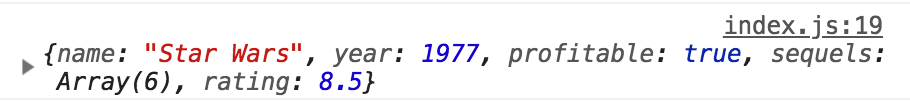
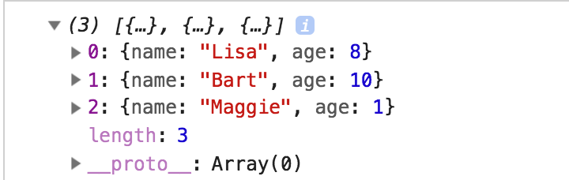
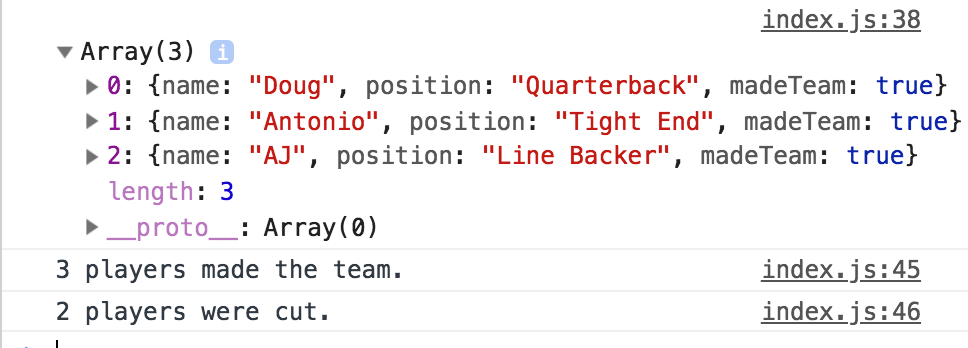
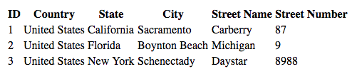

# 14.2 Objects, ES6, and Tables

## Overview

Today's class will take a deeper look into JavaScript through Objects, ES6, and tables.

## Class Objectives

* Students will understand and be able to use forEach and callback functions and how to use them.

* Students will create, update, and iterate JavaScript Objects.

* Students will understand how to apply map and filter to parse data.

* Students will be able to create and use arrow functions to simplify code.

* Students will understand the basic structure of a Bootstrap HTML table.

## Instructor Prep

<details>
  <summary><strong>Instructor Notes</strong></summary>

* Much of today's class will focus on delving further into JavaScript, enabling students to perform more sophisticated operations and data manipulation.

* Students may be scrambling to keep up with the new material, but remind them that they will have the next few weeks to practice these fundamentals. Today's lesson is really about exposure to modern JavaScript programming techniques and best practices.

* Concepts and syntax from ES6 will be introduced today, along with objects and functional programming. Today's topics cover most of the syntax that they will encounter in modern data applications written in JavaScript.

* Please reference our [Student FAQ](../../../05-Instructor-Resources/README.md#unit-14-intro-to-javascript) for answers to questions frequently asked by students of this program. If you have any recommendations for additional questions, feel free to log an issue or a pull request with your desired additions.

* Have your TAs keep track with the [Time Tracker](TimeTracker.xlsx).

</details>

<details>
  <summary><strong>Sample Class Video</strong></summary>

* To view an example class lecture visit (Note video may not reflect latest lesson plan): [Class Video part 1](https://codingbootcamp.hosted.panopto.com/Panopto/Pages/Viewer.aspx?id=5a8e9ff6-e38f-4dfd-811f-a9ba000c3e58) and [Class Video part 2](https://codingbootcamp.hosted.panopto.com/Panopto/Pages/Viewer.aspx?id=e95a16f6-af5b-41ea-84f5-a9ba00273368).

</details>

- - -

# Class Activities

## 1. Welcome & Movie Scores

| Activity Time:       0:40 |  Elapsed Time:      0:40  |
|---------------------------|---------------------------|

<details>
  <summary><strong>📣 1.1 Instructor Do: Welcome Class (5 mins)</strong></summary>

* Open the [slideshow](https://docs.google.com/presentation/d/1gluLlSNw7kpT2JuZFqo4SAZmWvN92MNbjL6A0ezmTmg/edit?usp=sharing) and use slides 1 - 3 to welcome the class and explain that today, we will cover objects, functional programming, and data munging in JavaScript.

* Explain that the techniques covered today are very common ways to work with data using modern JavaScript syntax and best practices.

</details>

<details>
  <summary><strong>📣 1.2 Instructor Do: forEach and Callbacks (15 mins)</strong></summary>

* Open the [slideshow](https://docs.google.com/presentation/d/1gluLlSNw7kpT2JuZFqo4SAZmWvN92MNbjL6A0ezmTmg/edit?usp=sharing) and use slides 4 - 7 to introduce students to the `forEach` method.

* Compare the `forEach` method to the traditional `for loop`. While both loop over an array, a `for loop` will repeat until a specified condition is met, while `forEach` will call a function once for each element.

* Open the instructor demo in [Activities/01-Ins_forEach/Solved/index.js](Activities/01-Ins_forEach/Solved/index.js).

* Live code this activity and pause frequently for students to catch up.

* First, show how to create a basic function and run it.

  ```javascript
  function printName (name) {
      console.log(name);
  };

  printName("Todd");
  ```

* Next, refresh students on the use of a traditional `for loop` to iterate through an array:

  ```javascript
  for (var i = 0; i < students.length; i++) {
    printName(students[i]);
  }
  ```

* Now, show how to iterate through the same array using the `forEach` method:

  ```javascript
  students.forEach(printName);
  ```

* Remind students that with `forEach`, a function is called and performs an action on each element in the array.

* Point out that the temporary variable `i` is no longer needed.

* Additionally, explain that an `inline function` can be utilized instead of declaring a separate function.

  ```javascript
  students.forEach(function(name) {
    console.log(name);
  });
  ```

</details>

<details>
  <summary><strong>✏️ 1.3 Students Do: Movie Scores - forEach (15 mins)</strong></summary>

* Open the [slideshow](https://docs.google.com/presentation/d/1gluLlSNw7kpT2JuZFqo4SAZmWvN92MNbjL6A0ezmTmg/edit?usp=sharing) and use slides 8 and 9 to introduce this activity to the class.

* **Files:**

  * [Activities/02-Stu_Movie_Score_forEach/README.md](Activities/02-Stu_Movie_Score_forEach/README.md)

  * [Activities/02-Stu_Movie_Score_forEach/Unsolved/index.html](Activities/02-Stu_Movie_Score_forEach/Unsolved/index.html)

  * [Activities/02-Stu_Movie_Score_forEach/Unsolved/index.js](Activities/02-Stu_Movie_Score_forEach/Unsolved/index.js)

</details>

<details>
  <summary><strong>⭐ 1.4 Review: Movie Scores (5 mins)</strong></summary>
  
* Open the [slideshow](https://docs.google.com/presentation/d/1gluLlSNw7kpT2JuZFqo4SAZmWvN92MNbjL6A0ezmTmg/edit?usp=sharing) and leave slide 10 while reviewing the activity.

* Open [Activities/02-Stu_Movie_Score_forEach/Solved/index.html](Activities/02-Stu_Movie_Score_forEach/Solved/index.html) in a browser and also open an inspector to display the results. Then open [Activities/02-Stu_Movie_Score_forEach/Solved/index.js](Activities/02-Stu_Movie_Score_forEach/Solved/index.js) in a text editor. Walk through the code and explain:

  * A variable holding the rating score is no longer necessary.

  * This is because we now have a function performing the same task:

  ```javascript
  movieScores.forEach(function(score) {
  ```

  * This function takes each rating score and adds it to the variable `sum`.

  * Next, it runs each score through the `if...else` statement and then pushes it to the designated array.

  * The remainder of the original code is untouched.

</details>

<sub>[Having issues with this activity? Report a bug!](https://bit.ly/2UQGUjL)</sub>

- - -

## 2. Word Frequency Counter

| Activity Time:       0:30 |  Elapsed Time:      1:10  |
|---------------------------|---------------------------|

<details>
  <summary><strong>📣 2.1 Instructor Do: JavaScript Objects (10 mins)</strong></summary>

* Open the [slideshow](https://docs.google.com/presentation/d/1gluLlSNw7kpT2JuZFqo4SAZmWvN92MNbjL6A0ezmTmg/edit?usp=sharing) and use slides 11 - 13 to present this lesson.

* Explain to students that JavaScript objects are similar to Python dictionaries. Assure students that their ample experience in using Python dictionaries, as well as parsing and dealing with JSON data (JavaScript Object Notation), will serve them well today.

* Take a moment to **summarize** some things we know about Python dictionaries:

  * They **organize** information in `key` and `value` pairings.

  * Unlike lists, key-value pairs are **unordered**.

  * The `key` is used to **access** the `value`.

* Open [index.html](Activities/03-Ins_JavaScript_Objects/Solved/index.html) in a browser and [index.js](Activities/03-Ins_JavaScript_Objects/Solved/index.js) with a text editor.

* Explain that JavaScript objects look very similar to Python dictionaries.

  ```javascript
  var movie = {
    name: "Star Wars",
    year: 1977,
    profitable: true,
    sequels: [5, 6, 1, 2, 3, "The Last Jedi"]
  };
  ```

  * Each `key` can hold as its `value` of any one of data types, including a string, a boolean, or an array. It can even hold an object.

* To retrieve a `value` from the object, both **dot** notation and **bracket** notation can be used for the `key`. However, the **dot** notation is preferred.

  ```javascript
  console.log(movie.name);
  console.log(movie.year);
  console.log(movie.sequels[0]);
  ```

  ```javascript
  console.log(movie["name"]);
  ```

* Show that, much like in Python, a property can be added to a JavaScript object simply by specifying a key and assigning a value to it:

  ```javascript
  movie.rating = 8.5;
  console.log(movie);
  ```

* Show that key-value pairs can also be deleted:

  ```javascript
  delete movie.sequels;
  console.log(movie);
  ```

* Show the updated object in the browser:

  

* Also like Python, it's possible to test whether a `key`, or a `property`, exists in an `object`:

  ```javascript
  if ('rating' in movie) {
    console.log("This movie has a rating!");
  }
  ```

  * If the `movie` object has a `property` named "rating," the console prints the statement.

* Finally, demonstrate how to loop through an object.

  ```javascript
  for (var prop in movie) {
    console.log(movie[prop]);
  }
  ```

  * This code loops through the key-value pairs of the `movie` object.

  * The variable `prop` represents the object's key in each iteration.

  * During each iteration in this for-loop, the value of the key-value pair is printed to the console with `movie[prop]`.

* Explain that JavaScript has several more built-in methods to manipulate objects. Here, the object is a cartoon family:

  ```javascript
  var people = {
    mom: "wilma flintstone",
    dad: "fred flintstone",
    daughter: "pebbles",
    son: "bambam"
  };
  console.log(people);
  ```

* Explain that `Object.keys()` displays all the `keys` of an object.

  ```javascript
  console.log(Object.keys(people));
  ```

  * The method takes the name of the object as its argument.

* Similarly, show that `Object.values()` displays all the `values` of an object.

  ```javascript
  console.log(Object.values(people));
  ```

* Finally, show that to access both keys and values, `Object.entries()` can be used:

  ```javascript
  console.log(Object.entries(people));
  ```

  * Each key-value pair is returned inside an array.

* Show the results in the console while briefly reiterating the above methods:

  

</details>

<details>
  <summary><strong>✏️ 2.2 Students Do: Word Frequency Counter (15 mins)</strong></summary>

* Open the [slideshow](https://docs.google.com/presentation/d/1gluLlSNw7kpT2JuZFqo4SAZmWvN92MNbjL6A0ezmTmg/edit?usp=sharing) and use slides 14 and 15 to present this activity to the class.

* **Files:**

  * [Activities/04-Stu_Word_Counter_Objects/README.md](Activities/04-Stu_Word_Counter_Objects/README.md)

  * [Activities/04-Stu_Word_Counter_Objects/Unsolved/index.html](Activities/04-Stu_Word_Counter_Objects/Unsolved/index.html)

  * [Activities/04-Stu_Word_Counter_Objects/Unsolved/index.js](Activities/04-Stu_Word_Counter_Objects/Unsolved/index.js)

</details>

<details>
  <summary><strong>⭐ 2.3 Instructor Do: Review Word Frequency Counter (5 mins)</strong></summary>

* Open the [slideshow](https://docs.google.com/presentation/d/1gluLlSNw7kpT2JuZFqo4SAZmWvN92MNbjL6A0ezmTmg/edit?usp=sharing) and use slides 16 and 17 to review this activity.

* **Files:**

  * [Activities/04-Stu_Word_Counter_Objects/Solved/index.html](Activities/04-Stu_Word_Counter_Objects/Solved/index.html)

  * [Activities/04-Stu_Word_Counter_Objects/Solved/index.js](Activities/04-Stu_Word_Counter_Objects/Solved/index.js)

* Explain that the function should print to the console an object like this:

  

  * Each word in the string is a `key` in this object, and the frequency of its appearance the `value`.

* Next, explain that the string is split into an array of words.

  ```javascript
  var stringArray = myString.split(" ");
  ```

  * An empty space is used as the delimiter. That is, the string is split wherever an empty space is found.

* Next, explain that an empty object is declared. This will hold each word, as well as its word count:

  ```javascript
  var wordFrequency = {};
  ```

* Explain that a for-loop iterates over the array of words.

  ```javascript
  for (var i = 0; i < stringArray.length; i++) {

    var currentWord = stringArray[i];

    if (currentWord in wordFrequency) {
      wordFrequency[currentWord] += 1;
    }
    else {
      wordFrequency[currentWord] = 1;
    }
  }
  ```

  * If the word in current iteration exists in the `wordFrequency` object, its count is increased by 1.

  * If it does not yet exist in the object, it is added to it, and its word frequency is set to 1, since it is being seen for the first time.

* Finally, the `wordFrequency` object is printed to the console.

</details>

<sub>[Having issues with this activity? Report a bug!](https://bit.ly/2JN8ZBO)</sub>

- - -

## 3. Map & Arrow Functions

| Activity Time:       0:30 |  Elapsed Time:      1:40  |
|---------------------------|---------------------------|

<details>
  <summary><strong>🎉 3.1 Everyone Do: Map (15 mins)</strong></summary>

* Open the [slideshow](https://docs.google.com/presentation/d/1gluLlSNw7kpT2JuZFqo4SAZmWvN92MNbjL6A0ezmTmg/edit?usp=sharing) and use slides 18 - 20 to cover this lesson.

* **Files:**

  * [Activities/05-Evr_Map/Solved/static/js/map.js](Activities/05-Evr_Map/Solved/static/js/map.js)

  * [Activities/05-Evr_Map/Solved/index.html](Activities/05-Evr_Map/Solved/index.html)

* This activity will cover the use of the `map` function. Feel free to demonstrate the code, or have the class code along with you, whichever you deem more appropriate for your class.

* This is an important activity as it introduces a powerful tool within the JavaScript arsenal, functional programming.

* Begin by walking through the first example:

  ```javascript
  var theStagesOfJS = ["confidence", "sadness", "confusion", "realization", "debugging", "satisfaction"];

  var mapSimpleArray = theStagesOfJS.map(function(item) {
    return item;
  });

  console.log(mapSimpleArray);
  ```

  * In this example, the `.map` method created a new array from the existing array.

* Walk through the next code example to demonstrate using `map` to provide an index position of the array.

  ```javascript
  var mapArrayWithIndex = theStagesOfJS.map(function(item, index) {
    return `Stage ${index}: ${item}`;
  });

  console.log(mapArrayWithIndex);
  ```

  * This is similar to `enumerate` in Python, where both the item and its index position in passed to the function.

  * Note that the original array is unchanged.

  ```javascript
  console.log(theStagesOfJS)
  // The original array is unchanged
  ```

* Proceed to the next code example and demonstrate how to map over an array of objects.

  ```javascript
  var students = [
    {name: "Malcolm", score: 80},
    {name: "Zoe", score: 85},
    {name: "Kaylee", score: 99},
    {name: "Simon", score: 99},
    {name: "Wash", score: 79}
  ];

  var names = students.map(function(student) {
    return student.name;
  });

  var scores = students.map(function(student) {
    return student.score;
  });
  ```

  * With `map`, two new arrays were created from the original: one holding student names, and the other holding student scores.

  * When the original array is called, it remains unchanged.

* Next, walk through the following code example and examine the differences between `map` and `forEach`.

  * Remind students that `forEach` executes a function on each element in an array.

  * Explain that `map` creates a new array with the results of calling a function on each element in the original array.

  * Demonstrate how `forEach` affects the same `theStagesOfJS` array from earlier when saved as a new variable:

  ```javascript
  // Save as a new variable
  var forEachStages = theStagesOfJS.forEach(function(each, index) {
    // the return of forEach is ignored
    return `Stage ${index + 1}: ${each}`;
  });

  // undefined
  console.log(forEachStages);

  // unaltered
  console.log(theStagesOfJS);
  ```

  * Note that the new variable is undefined because `forEach` does not automatically create new arrays like `map`.

  * Remind students that when `map` was used, an entirely new array was created.

* Next, walk through the code included in Part B.

  ```javascript
  theStagesOfJS.forEach(function(each, index) {
    theStagesOfJS[index] = `Stage ${index + 1}: ${each}`;
  });

  console.log(theStagesOfJS);
  ```

  * Point out that instead of creating a new variable, `forEach` has been used directly on the array.

  * This alters, or mutates, the original array.

* Time permitting, present students with a challenge activity.

* Send out the following starter code and encourage them to follow the prompts:

  ```javascript
  var princesses = [
    { name: "Rapunzel", age: 18 },
    { name: "Mulan", age: 16 },
    { name: "Anna", age: 18 },
    { name: "Moana", age: 16 }
  ];

  // Log the name of each princess, followed by a colon, followed by their age
  // Hint: use forEach


  // Create an array of just the names from the princesses array
  // Hint: use map
  ```

* Let the class know that they have 5 minutes to complete this activity.

* After the 5 minutes are up, review the following code:

  ```javascript
  // Log the name of each princess, follow by a colon, followed by their age
  // forEach: executes a provided function once for each array element
  princesses.forEach(function (princess) {
    console.log(`${princess.name}: ${princess.age}`)
  });

  // Create an array of just the names from the princesses array
  // Map: creates a new array with the results of calling a provided function on every element in the calling array
  var names = princesses.map(function(princess) {
    return princess.name;
  });

  console.log(names);
  ```

* Make sure to explain how each method interacts with the array to provide the desired results.

* Send out the following items for students to use as reference as they progress through the week:

  * [Activities/05-Evr_Map/Solved/static/js/map.js](Activities/05-Evr_Map/Solved/static/js/map.js)

  * [Map vs forEach](https://codeburst.io/javascript-map-vs-foreach-f38111822c0f)

</details>

<details>
  <summary><strong>🎉 3.2 Everyone Do: Arrow Functions (15 mins)</strong></summary>

* Open the [slideshow](https://docs.google.com/presentation/d/1gluLlSNw7kpT2JuZFqo4SAZmWvN92MNbjL6A0ezmTmg/edit?usp=sharing) and use slides 21 - 23 to go present this lesson to the class. 

* **Files:**

  * [Activities/06-Evr_Arrow_Functions/Solved/static/js/arrow.js](Activities/06-Evr_Arrow_Functions/Solved/static/js/arrow.js)

  * [Activities/06-Evr_Arrow_Functions/Solved/index.html](Activities/06-Evr_Arrow_Functions/Solved/index.html)

* This activity introduces `arrow functions` to the class. Feel free to demonstrate the code, or have the class code along with you, whichever you deem more appropriate for your class.

* Explain that this is another important activity as it teaches techniques and syntax that they will likely encounter in future data applications.

* Begin by explaining that an arrow function is a new, concise syntax for JavaScript functions.

  * Arrow functions allow us to drop the `function` keyword and only show the parameters.

  ```javascript
  var mapArrow1 = theStagesOfJS.map((item) => {
  return item;
  });
  ```

  * Note that the fat arrow `=>` that was added indicates an arrow function.

* Mention that using a `fat arrow` saves time typing by dropping the `function` keyword.

* In the next example, demonstrate further function simplification by removing the curly braces.

  ```javascript
  var mapArrow2 = theStagesOfJS.map(item => return item);
  ```

* Moving on to the next code example, point out that the `return` keyword has been removed and the `return statement` is now implied.

  ```javascript
  var mapArrow3 = theStagesOfJS.map(item => item);
  ```

* Explain that the first `item` on the left of the arrow is the name of the function parameter, and the second item is the returned value. Compare this code to the original function.

* Next, demonstrate an arrow function with more than one parameter.

  ```javascript
  var mapReturn2 = theStagesOfJS.map((item, index) => {
    return `Stage ${index}: ${item}`;
  });
  ```

  * Note that the parentheses are still in use when a function is called on two parameters.

* Point out that in the same function, code can be reduced even further by removing the curly braces when there is a single line of code in the function body:

  ```javascript
  var mapReturn2 = theStagesOfJS.map((item, index) => `Stage ${index}: ${item}`);
  ```

* Explain that curly braces are used when the function body has more lines of code than just the return statement.

* Next, demonstrate how combining `map` and `arrow functions` makes it quite easy to build an array of values from an array of objects:

  ```javascript
  var names = students.map(student => student.name);

  var scores = students.map(student => student.score);
  ```

* Finally, present students with a challenge activity.

  * Encourage students to revisit the princess activity from the last challenge.

  * Let the students know that for this challenge, they have five minutes to refactor the code to use arrow functions.

  * After five minutes have passed, review the following code:

  ```javascript
  // log the name of each princess, follow by a colon, followed by their age
  // forEach: executes a provided function once for each array element
  princesses.forEach(princess => console.log(`${princess.name}: ${princess.age}`));

  // create an array of just the names from the princesses array
  // map: creates a new array with the results of calling a provided function on every element in the calling array
  var names = princesses.map(princess => princess.name);
  console.log("names: ", names);
  ```

* Point out how each function has been made more concise by removing the `function` keyword and curly braces.

* Send out the following items for students to use as reference as they progress through the week:

  * [Activities/06-Evr_Arrow_Functions/Solved/static/js/arrow.js](Activities/06-Evr_Arrow_Functions/Solved/static/js/arrow.js)

  * [When and Why You Should Use ES6 Arrow Functions](https://medium.freecodecamp.org/when-and-why-you-should-use-es6-arrow-functions-and-when-you-shouldnt-3d851d7f0b26)

</details>

<sub>[Having issues with this activity? Report a bug!](https://bit.ly/39Pru3j)</sub>

- - -

## Break

| Activity Time:       0:15 |  Elapsed Time:      1:55  |
|---------------------------|---------------------------|

- - -

## 4. Recipe Iteration

| Activity Time:       0:35 |  Elapsed Time:      2:30  |
|---------------------------|---------------------------|

<details>
  <summary><strong>📣 4.1 Instructor Do: Object Iteration (15 mins)</strong></summary>

* Open the [slideshow](https://docs.google.com/presentation/d/1gluLlSNw7kpT2JuZFqo4SAZmWvN92MNbjL6A0ezmTmg/edit?usp=sharing) and use slides 25 and 26 to present this lesson to the students.

* Explain to students that, similar to arrays, JavaScript provides a few easy ways to iterate over Object keys and values.

* Open [index.js](Activities/07-Ins_Object_Iteration/Solved/static/js/index.js) and explain the following:

  * The `forEach()` method is used with `Object.keys()` to iterate through the keys in the object.

  * Similar to arrays, each key is passed to a custom function. In this example, this function logs each key to the console.

  ```javascript
  // Use forEach to Loop through keys
  Object.keys(userInfo).forEach(function(key){
      console.log(`Key: ${key}`)
  });
  ```

  * Explain that the object's values can also be iterated over using `forEach` and `Object.values`. In this example, an arrow function is used to log each value to the console.

  ```javascript
  // Use forEach combined with arrow functions to loop through values
  Object.values(userInfo).forEach(value => console.log(`Values: ${value}`));
  ```

  * `Object.entries` can be used to iterate through the keys and the values. Each key and value pair is passed to the function. This example uses [assignment destructuring](https://developer.mozilla.org/en-US/docs/Web/JavaScript/Reference/Operators/Destructuring_assignment) to assign the key and value to `key` and `value` parameters. The function then logs each key and value to the console.

  ```javascript
  // Loop through entries with forEAch and arrow functions
  Object.entries(userInfo).forEach(([key, value]) => console.log(`Key: ${key} and Value ${value}`));
  ```

  * Arrays of objects can use a combination of `forEach()` to first iterate through the array of objects, and then to iterate through the keys and values of each single object.

  ```javascript
  // Loop through array of objects then each object
  users.forEach((user) => {
      console.log(user);

      // Get the entries for each object in the array
      Object.entries(user).forEach(([key, value]) => {
          // Log the key and value
          console.log(`Key: ${key} and Value ${value}`)
      })
  });
  ```

</details>

<details>
  <summary><strong>✏️ 4.2 Students Do: Recipe Iteration (15 mins)</strong></summary>

* Open the [slideshow](https://docs.google.com/presentation/d/1gluLlSNw7kpT2JuZFqo4SAZmWvN92MNbjL6A0ezmTmg/edit?usp=sharing) and use slides 27 and 28 to present this activity to the class.

* **Files:**

  * [Activities/08-Stu_Object_Iteration/README.md](Activities/08-Stu_Object_Iteration/README.md)

  * [Activities/08-Stu_Object_Iteration/Unsolved/static/js/index.js](Activities/08-Stu_Object_Iteration/Unsolved/static/js/index.js)

</details>

<details>
  <summary><strong>⭐ 4.3 Review: Recipe Iteration (5 mins)</strong></summary>

* Open the [slideshow](https://docs.google.com/presentation/d/1gluLlSNw7kpT2JuZFqo4SAZmWvN92MNbjL6A0ezmTmg/edit?usp=sharing) and use slide 29 while reviewing the activity.

* Open [Activities/08-Stu_Object_Iteration/Solved/static/js/index.js](Activities/08-Stu_Object_Iteration/Solved/static/js/index.js) and explain the following:

  ```javascript
  dishes = [];
  spices = [];
  recipes.forEach((recipe) => {

    Object.entries(recipe).forEach(([key, value]) => {

      if (key === "dish") {
        dishes.push(value);
      }
      else {
        spices.push(value);
      }
    });
  });
  ```

  * First, we declare empty arrays to contain our dishes and spices. This needs to be outside of the `forEach` function so the values are not overwritten.

  * `forEach` is then used to iterate over each recipe object in the array.

  * For each recipe, `Object.entries` and `forEach` is used to get each key and value from the object.

  * Finally, each key is compared and pushed to the appropriate array.

* If time permits, highlight the following points about the bonus:

  ```javascript
  var dishesMapped = recipes.map(recipe => recipe.dish);
  var spicesMapped = recipes.map(recipe => recipe.spice);
  ```

  * The code for building an array of values using map/arrow is very clean and simple. However, it takes two passes to build the `dishes` and `spices` array.

  * Mapping over arrays of objects is very common way to extract an array of values.

</details>

<sub>[Having issues with this activity? Report a bug!](https://bit.ly/3e5CGwf)</sub>

- - -

## 5. Filters

| Activity Time:       0:25 |  Elapsed Time:      2:55  |
|---------------------------|---------------------------|

<details>
  <summary><strong>📣 5.1 Instructor Do: Filter (10 mins)</strong></summary>

* Open the [slideshow](https://docs.google.com/presentation/d/1gluLlSNw7kpT2JuZFqo4SAZmWvN92MNbjL6A0ezmTmg/edit?usp=sharing) and slides 30 - 32 to present this lesson to the class.

* **Files**

  * [Activities/09-Ins_Filter/Solved/index.html](Activities/09-Ins_Filter/Solved/index.html)

  * [Activities/09-Ins_Filter/Solved/filter.js](Activities/09-Ins_Filter/Solved/filter.js)

* Inform students that learning to filter data will be important for completing this week's homework.

* Explain that Data filtering can often be done on the server, but there are cases in which it may be desirable to place an API call and filter the results all in the browser.

* Explain that JavaScript offers an elegant `filter()` method.

* Open `filter.js` and show that `simpsons` is an array of objects.

* Open the browser and shows the results of the filter:

  

  * Only family members whose age is younger than 30 are displayed.

* Next, go over the anatomy of the `filter()` method in the example:

  ```javascript
  function selectYounger(person) {
    return person.age < 30;
  }

  var youngSimpsons = simpsons.filter(selectYounger);
  ```

  * The `filter()` method is directly applied to the `simpsons` array.

  * `filter()` calls `selectYounger()`, a custom function that defines the filtering criterion.

  * `selectYounger()`, when called by `filter()`, takes each item in an array as its argument, arbitrarily named `person` here.

  * Only objects whose `age` property is less than 30 are returned.

* Summarize that filtering is a two-step process.

  * An analogy here might be that a detective named `filter` is hired to comb through the data to find people younger than 30. The detective, in turn, hires a subcontractor named `selectYounger` to inspect each individual's age.

* If time allows, go through several more examples of filtering with the class, such as the age being older than 8, or the length of the name being longer than four characters.

</details>

<details>
  <summary><strong>✏️ 5.2 Students Do: Filters (10 mins)</strong></summary>

* Open the [slideshow](https://docs.google.com/presentation/d/1gluLlSNw7kpT2JuZFqo4SAZmWvN92MNbjL6A0ezmTmg/edit?usp=sharing) and slides 33 and 34 to present this activity to the students.

* **Files:**

  * [Activities/10-Stu_Filters/README.md](Activities/10-Stu_Filters/README.md)

  * [Activities/10-Stu_Filters/Unsolved/index.html](Activities/10-Stu_Filters/Unsolved/index.html)

  * [Activities/10-Stu_Filters/Unsolved/index.js](Activities/10-Stu_Filters/Unsolved/index.js)

</details>

<details>
  <summary><strong>⭐ 5.3 Review: Filtered Roster Check (5 mins)</strong></summary>

* Open the [slideshow](https://docs.google.com/presentation/d/1gluLlSNw7kpT2JuZFqo4SAZmWvN92MNbjL6A0ezmTmg/edit?usp=sharing) and leave slide 35 while reviewing the activity.

* Open `index.html` with a browser and show the console.

  

  * An array of objects containing players who made the team is shown.

  * It also shows that 3 players made the team, and 2 did not.

* Open `index.js` and walk through the code:

  ```javascript
  function madeCut(player) {
    return player.madeTeam;
  }

  var playersOnTeam = roster.filter(madeCut);
  ```

  * Using the `filter()` method is a two-step process.

  * A custom function named `madeCut()` is called by `filter()`.

  * `madeCut()` takes `player` as its arbitrarily named argument, and returns only players whose `madeTeam` property is `true`.

  * `return player.madeTeam;` is the more concise equivalent of `return player.madeTeam == true;`.

  * The result is returned as an array of objects.

* Optionally, briefly go over calculating the size of the final roster:

  ```javascript
  var numberOfPlayers = playersOnTeam.length;
  var numberOfCutPlayers = roster.length - numberOfPlayers;
  console.log(`${numberOfPlayers} players made the team.`);
  ```

  * Both calculations use the `length` property.

  * To print the results to the console, the template literal is used, enclosing the variable inside `${}` and the entire string inside backticks.

</details>

<sub>[Having issues with this activity? Report a bug!](https://bit.ly/3aSsTra)</sub>

- - -

## 6. HTML Tables

| Activity Time:       0:05 |  Elapsed Time:      3:00  |
|---------------------------|---------------------------|

<details>
  <summary><strong>📣 6.1 Instructor Do: HTML Tables (5 mins)</strong></summary>

* Open the [slideshow](https://docs.google.com/presentation/d/1gluLlSNw7kpT2JuZFqo4SAZmWvN92MNbjL6A0ezmTmg/edit?usp=sharing) and use slides 36 - 38 to present this lesson to the class.

* Explain that data tables have their own HTML syntax.

* Demo the activity solution in the browser and then open [table.html](Activities/11-Ins_HTML_table/Solved/table.html) in an editor to explain the following points about HTML tables:

  

  * A table is created using a pair of `table` tags.

  * Each row of the table is created using `tr` tags.

  * For header rows, a special `th` tag is used to denote the header cells.

  * `td` tags are used to define table cells. `td` stands for [Table Data](https://www.w3schools.com/html/html_tables.asp) and represents each cell of data in the table.

  * The nesting here is important. You always have table cells (`td`) within rows (`tr`).

* Explain that we can use Bootstrap to create visually appealing data tables.

* Send out the link to the [Bootstrap Tables Documentation](https://getbootstrap.com/docs/3.3/css/#tables) for students to use as a reference.

* Next, demo the Bootstrap solution in the browser and open [bootstrap-table.html](Activities/11-Ins_HTML_table/Solved/table-bootstrap.html) in an editor to explain the following points about HTML tables:

  

  * Bootstrap adds additional table classes to the HTML tags to style the table.

  * Bootstrap tables also use `thead` and `tbody` tags to separate the table header code from the table body.

  * Explain that within `thead`, the header is still defined using a `tr` row with `th` tags for header cells.

  * Explain that `tbody` uses one `tr` tag per row with `td` tags per data cells.

* Explain that manually building HTML tables can become a tedious task, but JavaScript can be used to automate this. The next class will cover dynamically building tables with JavaScript.

</details>

<sub>[Having issues with this activity? Report a bug!](https://bit.ly/2Rdw4Sj)</sub>

- - -

### End Class

- - -

© 2021 Trilogy Education Services, LLC, a 2U, Inc. brand. Confidential and Proprietary. All Rights Reserved.
