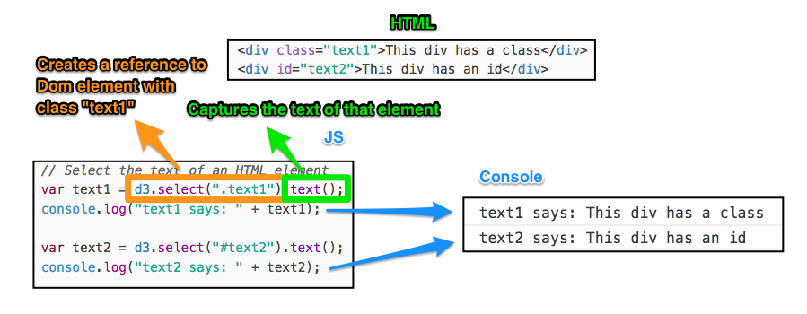
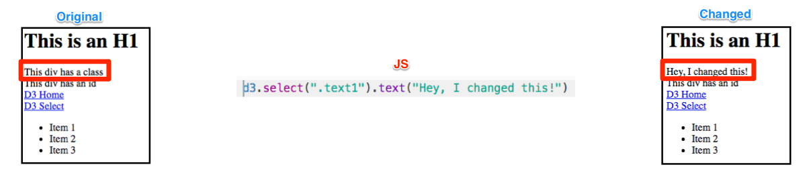
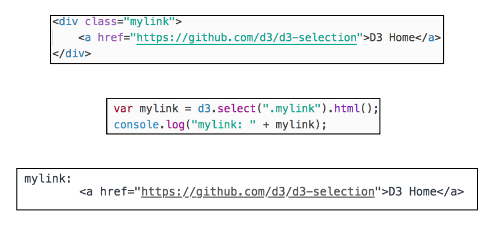
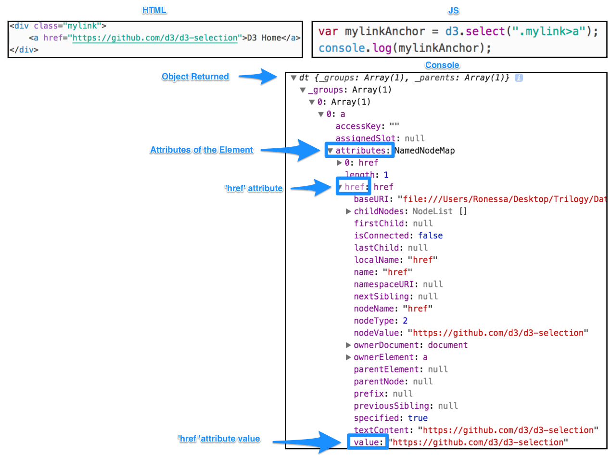
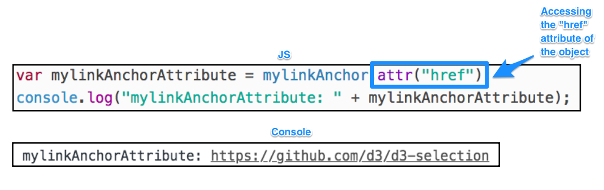

# 14.3 JavaScript with D3.js

## Overview

Today's class will introduce students to DOM selection, manipulation, and events using [D3.js](https://d3js.org/).

## Class Objectives

* Students will use D3 for basic DOM manipulation.
* Students will be able to populate a table using static data structures.
* Students will understand events.
* Students will be able to use `this` to reference elements.
* Students will use D3 to attach events to DOM elements.
* Students will dynamically manipulate the DOM through events.
* Students will be able to dynamically filter tables.

## Instructor Prep

<details>
  <summary><strong>Instructor Notes</strong></summary>

* You may find that this lesson falls on a weekday due to a holiday shifting the course schedule. In this case, we have provided notes within the LP that will allow you to **easily adjust the length of the lesson to fit into a weekday class**.

  * Be on the lookout for a ⏰**3-Hour Adjustment** note at the top of activities in this Lesson Plan. If this class is being taught on a weekday, please utilize the directions found in the note. Keep in mind that breaks will be reduced from 40 minutes to the typical 15 minutes for a weekday class as well.

  * Shortening these activities could potentially limit the students' ability to finish them, so please remind them to utilize office hours to clear up any questions they may have.

* Students will spend today's class working with data in JavaScript and learning how to manipulate the DOM with D3. The material covered today is intended to be a gentle introduction to the DOM using helper methods from D3.

* Because this is the only the third day of a very rapid introduction to JavaScript, many students may be feeling overwhelmed. It is important to take the time to reassure them that it will take time to feel confident in these new skills. The next several classes will provide additional opportunities to learn and practice JavaScript.

* Today's class uses only a subset of D3.js to perform basic DOM manipulation and event handling. Data binding is not covered in this lesson as D3 is only being used as an aid to simplify interaction with the DOM. A full week will be dedicated to further exploring D3 in a future unit.

* Please reference our [Student FAQ](../../../05-Instructor-Resources/README.md#unit-14-intro-to-javascript) for answers to questions frequently asked by students of this program. If you have any recommendations for additional questions, feel free to log an issue or a pull request with your desired additions.

* Lastly, as a reminder these slideshows are for instructor use only - when distributing slides to students, please first export the slides to a PDF file. You may then send out the PDF.

</details>

<details>
  <summary><strong>Sample Class Video</strong></summary>

* To view an example class lecture visit (Note video may not reflect latest lesson plan): [Class Video](https://codingbootcamp.hosted.panopto.com/Panopto/Pages/Viewer.aspx?id=d5a8583f-2e67-49b4-b689-aa070183724f)

</details>

- - -

# Class Activities

## 1. Welcome & Intro to D3

| Activity Time:       0:30 |  Elapsed Time:      0:30  |
|---------------------------|---------------------------|

<details>
  <summary><strong>📣 1.1 Instructor Do: Welcome and Slideshow (5 mins)</strong></summary>
  
* Open the [slideshow](https://docs.google.com/presentation/d/1YKXvECbjkb_ou_-FOxjFo3DkjAmrS8glEt3U-JSoXUg/edit?usp=sharing) and use slides 1 - 5 to welcome students to class and explain that today's focus will be on dynamically manipulating HTML with JavaScript.

* It's ok to feel overwhelmed when learning a new programming language, especially for a complex language like JavaScript.

* This week is only the first introduction to the language.

* It will take time and practice to become good at JavaScript.

* The transformation from JavaScript Jellybean to JavaScript Juggernaut will happen before you know it!

* Talk to us if you need extra help!

* Show the objectives slide and explain the following points about the D3.js library:

  * D3.js is an incredibly powerful visualization library written in JavaScript.

  * Today's class will cover a subset of D3 used to select and create HTML elements dynamically.

  * A future Unit will be dedicated purely to learning D3.js to build dynamic visualizations in JavaScript.

</details>

<details>
  <summary><strong>🎉 1.2 Everyone Do: Intro to D3 and Select (25 mins)</strong></summary>

* ⏰**3-Hour Adjustment**: Reduce activity time to 15 minutes.

* **Files:**

  * [Activities/01-Evr_D3_Select/Unsolved/index.html](Activities/01-Evr_D3_Select/Unsolved/index.html)

  * [Activities/01-Evr_D3_Select/Unsolved/static/js/index.js](Activities/01-Evr_D3_Select/Unsolved/static/js/index.js)

* Open the [slideshow](https://docs.google.com/presentation/d/1YKXvECbjkb_ou_-FOxjFo3DkjAmrS8glEt3U-JSoXUg/edit?usp=sharing) and use slides 6 - 10 to present this activity.

* **Activity Notes:**

  * Live code this activity with the class, pausing frequently to allow students to catch up.

  * Periodically send out the code covered thus far to help students that may have syntax errors.

* Inform students that we will go over using D3 to manipulate DOM elements; that is, the elements of a web page.

* Similar to selecting DOM elements with `soup.find()` when web scraping with Beautiful Soup, D3 can be used to extract information from an HTML document and can change its contents and styling.

* Demonstrate how to import D3 in the script tag, using a CDN link:

  ```javascript
    <script src="https://d3js.org/d3.v5.min.js"></script>
  ```

* Explain that `d3.select()` can be used to get a reference to an element, then capture the text of that element. Open the console and show students the output.

* Emphasize that the element is selected with the class name 'text1'. Then, the text of the element is captured by chaining that reference with the `.text()` method.

  

* Demonstrate that the text of the element can be **changed**. Code the following line, and refresh the browser.

  ```javascript
  s3.select(".text1").text("Hey, I changed this!")
  ```

  * The browser now reflects the change:

    

* Demonstrate how to capture the inner HTML of an element by using the `html()` method.

  

* Next, demonstrate how to select the **child** element of an element:

  ```javascript
    // Select an element's child element
    // An object is returned
    var mylinkAnchor = d3.select(".mylink>a");
    console.log(mylinkAnchor);
  ```

  * With `(".mylink>a")`, the anchor element contained within the div with the class name "mylink" is selected.

  * When `mylinkAnchor` is printed to the console, an object is returned with a number of properties of the element.

  

  * Using D3's `attr()` method, the `href` value can be accessed directly.

  

* Code the line below to change the `href`, then demonstrate by clicking on the link to navigate the page to Python's home page.

  ```javascript
  mylinkAnchor.attr("href", "https://python.org")
  ```

* Code the following to demonstrate chaining; which allows the joining of multiple methods sequentially.

  ```javascript
  // Use chaining to join methods
  d3.select(".mylink>a").attr("href", "https://nytimes.org").text("Now this is a link to the NYT!!");
  ```

* Code the following to show that `selectAll()` can be used to select all elements with a certain tag, class, or id, and then change the style of those elements.

  ```javascript
  // Select all list items, then change their font color
  d3.selectAll("li").style("color", "blue");
  ```

* Code the following and show that D3 can be used to first select an element, then append a child element to it.

  ```javascript
  // Create a new element
  var li1 = d3.select("ul").append("li");
  li1.text("A new item has been added!")

  //Use chaining to create a new element and set its text
  var li2 = d3.select("ul").append("li").text("Another new item!");
  ```

* Take a moment to answer any remaining questions before moving on.

</details>

<sub>[Having issues with this activity? Report a bug!](https://bit.ly/3bYT3IK)</sub>

- - -

## 2. D3 Select

| Activity Time:       0:30 |  Elapsed Time:      1:00  |
|---------------------------|---------------------------|

⏰ **3-Hour Adjustment**: Skip the **2.1 Students Do** activity and continue on to the 2.2 review activity.

<details>
  <summary><strong>✏️ 2.1 Students Do: D3 Select (20 mins)</strong></summary>

* ⏰**3-Hour Adjustment**: Skip this **Students Do** activity and continue on to the review activity.

* Open the [slideshow](https://docs.google.com/presentation/d/1YKXvECbjkb_ou_-FOxjFo3DkjAmrS8glEt3U-JSoXUg/edit?usp=sharing) and use slides 11 and 12 to present this activity to the class.  

* **Files:**

  * [Activities/02-Stu_D3_Select/README.md](Activities/02-Stu_D3_Select/README.md)

  * [Activities/02-Stu_D3_Select/Unsolved/index.html](Activities/02-Stu_D3_Select/Unsolved/index.html)

  * [Activities/02-Stu_D3_Select/Unsolved/static/js/app.js](Activities/02-Stu_D3_Select/Unsolved/static/js/app.js)

</details>

<details>
  <summary><strong>⭐ 2.2 Instructor Do: Review D3 Select (10 mins)</strong></summary>

* ⏰**3-Hour Adjustment**: This review activity is now an **Everyone Do**.

* Open the [slideshow](https://docs.google.com/presentation/d/1YKXvECbjkb_ou_-FOxjFo3DkjAmrS8glEt3U-JSoXUg/edit?usp=sharing) and use slide 13 to review the activity.

  * Spend only 15 minutes on this activity.

  * Use the review section as guidance for talking points as you live-code along with the students.

  * Be sure to take your time and answer all student questions along the way.

* **Files**:

  * [Activities/02-Stu_D3_Select/Solved/index.html](Activities/02-Stu_D3_Select/Solved/index.html)

  * [Activities/02-Stu_D3_Select/Solved/static/js/app.js](Activities/02-Stu_D3_Select/Solved/static/js/app.js)

* Open the files and be sure to point out the following:

  * The first step is to select the table and add the Bootstrap striped table class.

    ```javascript
    var table = d3.select("table");
    table.attr("class", "table table-striped");
    ```

  * To add the new row of data, select the table body and then add the new table row.

    ```javascript
    var row = tbody.append("tr");
    ```

  * The row reference can be used to add a new table cell for the student name and grade. The student name is index position 0 while the student grade is index position 1.

    ```javascript
    row.append("td").text(newGrade[0]);
    row.append("td").text(newGrade[1]);
    ```

* If time permits, cover the bonus and explain the following:

  * `forEach` can be used to iterate over each item in the array.

  * Arrays can be [destructured](https://developer.mozilla.org/en-US/docs/Web/JavaScript/Reference/Operators/Destructuring_assignment) in JavaScript assignments. This is similar to unpacking a tuple in Python.

    ```javascript
    // [student, grade] destructures (unpacks) the student name and grade
    // for each item in the array
    grades.forEach(([student, grade]) => {

      // Append one table row per student/grade
      var row = tbody.append("tr");

      // append one cell for the student and one cell for the grade
      row.append("td").text(student);
      row.append("td").text(grade);
    });
    ```

* Ask if there are any questions before proceeding to the next example.

</details>

<sub>[Having issues with this activity? Report a bug!](https://bit.ly/3bVNDOL)</sub>

- - -

## 3. D3 Table & Event Listeners

| Activity Time:       0:35 |  Elapsed Time:      1:35  |
|---------------------------|---------------------------|

<details>
  <summary><strong>🎉 3.1 Everyone Do: D3 Table (20 mins)</strong></summary>

* Open the [slideshow](https://docs.google.com/presentation/d/1YKXvECbjkb_ou_-FOxjFo3DkjAmrS8glEt3U-JSoXUg/edit?usp=sharing) and use slides 14 and 15 to go over this activity.

* **Files:**

  * [Activities/03-Evr_D3_Table/Unsolved/index.html](Activities/03-Evr_D3_Table/Unsolved/index.html)

  * [Activities/03-Evr_D3_Table/Unsolved/static/js/index.js](Activities/03-Evr_D3_Table/Unsolved/static/js/index.js)

  * [Activities/03-Evr_D3_Table/Unsolved/static/js/data.js](Activities/03-Evr_D3_Table/Unsolved/static/js/data.js)

* Open the `index.html` file and show the starter code for the table.

* Show the data structure for the weather report in `data.js`.

* Open the unsolved version of `index.js` and live code each step with the class. Highlight the following points:

  * Use `console.log` at each step to verify the format and structure of the data.

  * Each weather report is stored as an array of objects, so the first step is to iterate through that array with `forEach`.

    ```javascript
    data.forEach(function(weatherReport) {
      console.log(weatherReport);
    });
    ```

  * Each weather report needs its own row in the table.

    ```javascript
    data.forEach(function(weatherReport) {
      console.log(weatherReport);
      var row = tbody.append("tr");
    });
    ```

  * `Object.entries` can be used to create an array of key/value pairs for each weather report object.

    ```javascript
    data.forEach(function(weatherReport) {
      console.log(weatherReport);
      var row = tbody.append("tr");

      Object.entries(weatherReport).forEach(function([key, value]) {
        console.log(key, value);
      });
    });
    ```

  * A cell for each value can then be appended to the row.

    ```javascript
    data.forEach(function(weatherReport) {
      console.log(weatherReport);
      var row = tbody.append("tr");
      Object.entries(weatherReport).forEach(function([key, value]) {
        console.log(key, value);
        // Append a cell to the row for each value in
        // the weather report object
        var cell = tbody.append("td");
        cell.text(value);
      });
    });
    ```

  * Finally, we can refactor the code to use arrow functions.

    ```javascript
    data.forEach((weatherReport) => {
      var row = tbody.append("tr");
      Object.entries(weatherReport).forEach(([key, value]) => {
        var cell = tbody.append("td");
        cell.text(value);
      });
    });
    ```

* Explain that this code snippet will be a key part of the homework solution.

* Answer any questions before moving on.

</details>

<details>
  <summary><strong>📣 3.2 Instructor Do: D3 Event Listeners (15 mins)</strong></summary>

* Open the [slideshow](https://docs.google.com/presentation/d/1YKXvECbjkb_ou_-FOxjFo3DkjAmrS8glEt3U-JSoXUg/edit?usp=sharing) and use slides 16 - 21 to present this lesson to the class.   

* **Files:**

  * [Activities/04-Ins_Event_Listeners/Solved/index.html](Activities/04-Ins_Event_Listeners/Solved/index.html)

  * [Activities/04-Ins_Event_Listeners/Solved/index.js](Activities/04-Ins_Event_Listeners/Solved/index.js)

* Explain that the activities so far have selected or appended elements in the HTML. This code is executed once upon loading the browser. What makes JavaScript really interesting is that it can listen for user events on the page and execute code when these events are detected. This provides an incredibly powerful mechanism for building dynamic and interactive applications.

* Inform the class that several event types are supported by the browser including:

  * `click`

  * `change`

  * `keydown`

  * `keyup`

  * `scroll`

  * `pointerenter`

  * `pointerleave`

  * and many more!

* Send out a reference to [web events](https://developer.mozilla.org/en-US/docs/Web/Events).

* Before demonstrating any syntax, explain that events have:

  * A target: a reference to the object that dispatched the event.

  * A handler: a function which should be executed in response to the event occurring.

* Open [Activities/04-Ins_Event_Listeners/Solved/index.html](Activities/04-Ins_Event_Listeners/Solved/index.html).

* Click the **Click Me!** button to show the dynamic nature of the button click.

* Open the Chrome Inspector window and demonstrate the different functions available in [Activities/04-Ins_Event_Listeners/Solved/index.js](Activities/04-Ins_Event_Listeners/Solved/index.js).

* Explain the following:

  * Event handlers are just normal functions that you call when an event occurs.

    ```javascript
    // This function is triggered when the button is clicked
    function handleClick() {
      console.log("A button was clicked!");

      // We can use d3 to see the object that dispatched the event
      console.log(d3.event.target);
    }
    ```

  * Events are attached using the `.on()` function in d3.

    ```javascript
    button.on("click", handleClick);
    ```

  * The event target is the object that triggered the event. This can be referenced with `d3.event.target`.

  * Event handlers can also be defined inline.

    ```javascript
    button.on("click", function() {
      console.log("Hi, a button was clicked!");
      console.log(d3.event.target);
    });
    ```

  * Event handlers are just normal functions that can execute code or call other functions.

    ```javascript
    button.on("click", function() {
      d3.select(".giphy-me").html("");
    });
    ```

  * Input elements can trigger change events. The value of the element can be referenced with `d3.event.target.value`.

    ```javascript
    inputField.on("change", function() {
      var newText = d3.event.target.value;
      console.log(newText);
    });
    ```

</details>

<sub>[Having issues with this activity? Report a bug!](https://prepopulate.jotform.io/)</sub>

- - -

## 4. On Change

| Activity Time:       0:30 |  Elapsed Time:      2:05  |
|---------------------------|---------------------------|

<details>
  <summary><strong>✏️ 4.1 Students Do: On Change (20 mins)</strong></summary>

* Open the [slideshow](https://docs.google.com/presentation/d/1YKXvECbjkb_ou_-FOxjFo3DkjAmrS8glEt3U-JSoXUg/edit?usp=sharing) and use slides 22 and 23 to present this activity to the class.

* **Files:**

  * [Activities/05-Stu_onChange/README.md](Activities/05-Stu_onChange/README.md)

  * [Activities/05-Stu_onChange/Unsolved/index.html](Activities/05-Stu_onChange/Unsolved/index.html)

  * [Activities/05-Stu_onChange/Solved/static/js/app.js](Activities/05-Stu_onChange/Solved/static/js/app.js)

</details>

<details>
  <summary><strong>⭐ 4.2 Review: On Change (10 mins)</strong></summary>

* Open the [slideshow](https://docs.google.com/presentation/d/1YKXvECbjkb_ou_-FOxjFo3DkjAmrS8glEt3U-JSoXUg/edit?usp=sharing) and use slide 24 to review the activity.

* **Files**:

  * [Activities/05-Stu_onChange/Solved/index.html](Activities/05-Stu_onChange/Solved/index.html)

  * [Activities/05-Stu_onChange/Solved/static/js/app.js](Activities/05-Stu_onChange/Solved/static/js/app.js)

* Open the files and be sure to point out the following:

  * We first need to select the input and output elements that we need to monitor or update.

    ```javascript
    var text = d3.select("#text");
    var output = d3.select(".output");
    ```

  * We use `.on()` to attach an onChange event to the input field.

    ```javascript
    text.on("change", handleChange);
    ```

  * We select the text using directly from the event target.

    ```javascript
    var inputText = d3.event.target.value;
    ```

  * After reversing the string, we use `.text()` to set the output h1 text to the reversed text.

    ```javascript
    output.text(reversedInput);
    ```

* If time permits, cover the bonus and explain the following:

  * Before we append any new `li` tags, `.html("")` is used to clear any old `li` tags.

  * We use `Object.entries(frequencyCounts)` to create an array of key, value pairs where the key is the character and the value is the count.

  * We can then iterate over that array using `forEach`.

  * Finally, we append each `word: count` pair as a new `li` element.

    ```javascript
    var li = output.append("li").text(`${key}: ${value}`);
    ```
* Ask if there are any questions before proceeding to the next example.

</details>

<sub>[Having issues with this activity? Report a bug!](https://bit.ly/2UM1KQW)</sub>

- - -

## Break

| Activity Time:       0:40 |  Elapsed Time:      2:45  |
|---------------------------|---------------------------|

⏰ **3-Hour Adjustment**: Break will be 15 minutes.

- - -

## 5. Button Clicks

| Activity Time:       0:20 |  Elapsed Time:      3:05  |
|---------------------------|---------------------------|

<details>
  <summary><strong>✏️ 5.1 Students Do: Button Clicks (15 mins)</strong></summary>

* Open the [slideshow](https://docs.google.com/presentation/d/1YKXvECbjkb_ou_-FOxjFo3DkjAmrS8glEt3U-JSoXUg/edit?usp=sharing) and use slides 26 and 27 to present this activity to the class.

* **Files:**

  * [Activities/06-Stu_Button_Click/README.md](Activities/06-Stu_Button_Click/README.md)

  * [Activities/06-Stu_Button_Click/Unsolved/index.html](Activities/06-Stu_Button_Click/Unsolved/index.html)

  * [Activities/06-Stu_Button_Click/Unsolved/static/js/app.js](Activities/06-Stu_Button_Click/Unsolved/static/js/app.js)

</details>

<details>
  <summary><strong>⭐ 5.2 Review: Button Clicks (5 mins)</strong></summary>

* Open [Activities/06-Stu_Button_Click/Solved/static/js/app.js](Activities/06-Stu_Button_Click/Solved/static/js/app.js) and the  [slideshow](https://docs.google.com/presentation/d/1YKXvECbjkb_ou_-FOxjFo3DkjAmrS8glEt3U-JSoXUg/edit?usp=sharing) on slide 28 while you highlight the following points:

  * The Star Wars episode number is created dynamically using `Math.floor` and `Math.random`.

    ```javascript
    var text = d3.select(".star-wars")
      .text(Math.floor(Math.random() * 9) + 1);
    ```

  * The upvote and downvote buttons are selected by their class names.

    ```javascript
    var upvote = d3.select(".upvote");
    var downvote = d3.select(".downvote");
    ```

  * The counter is also selected to get the current vote count.

    ```javascript
    var counter = d3.select(".counter");
    ```

  * Each button has its own click handler. The upvote will increment the count and the downvote will decrement the count.

    ```javascript
    upvote.on("click", function () {
      var currentCount = parseInt(counter.text());
      currentCount += 1;
      counter.text(currentCount);
    });
    ```

  * The counter value needs to be converted from text to an integer.

    ```javascript
    var currentCount = parseInt(counter.text());
    ```

* If time permits show that the bonus uses an array of arrays format to store the vote type and the current vote for each click.

  ```javascript
  var data = [];
  // ...
  data.push(["upvote", currentCount]);
  ```

* Answer any remaining questions before moving on.

</details>

<sub>[Having issues with this activity? Report a bug!](https://bit.ly/2XfH6KW)</sub>

- - -

## 6. Introducing `this` & Forms

| Activity Time:       0:20 |  Elapsed Time:      3:25  |
|---------------------------|---------------------------|

<details>
  <summary><strong>📣 6.1 Instructor Do: Introducing `this` (10 mins)</strong></summary>

* Open the [slideshow](https://docs.google.com/presentation/d/1YKXvECbjkb_ou_-FOxjFo3DkjAmrS8glEt3U-JSoXUg/edit?usp=sharing) and use slides 29 - 32 to go over `this` keyword.

* **Files:**

  * [Activities/07-Ins_This/Solved/index.html](Activities/07-Ins_This/Solved/index.html)

  * [Activities/07-Ins_This/Solved/app.js](Activities/07-Ins_This/Solved/app.js)

* Explain that in JavaScript, the thing called `this` is the object that "owns" the code (i.e. the object that invokes the function where `this` is used).

* Explain that the `this` keyword can be very useful to identify which element triggered an event. For example, `this` inside of an event handler would refer to the specific button that was clicked.

* Open `app.js` and walk through the through the first example:

  ```javascript
  d3.selectAll("button").on("click", function() {
    console.log(this);
  });
  ```

  * `d3.selectAll("button")` is used to select all buttons in the document.

  * When a button is clicked, a function is triggered that will log `this` to the console.

  * In this example, `this` will refer to the specific button that was clicked. There are multiple buttons on the page, but only the button that was clicked will be logged to the console.

* Go over the second code example. Open index.html in a browser and demonstrate the clicking on a list item turns it blue.

* Next, show the second code example and highlight the following points:

  ```javascript
  d3.selectAll("li").on("click", function() {
    var listItem = d3.select(this);
    listItem.style("color", "blue");

    var listItemText = listItem.text();
    console.log(listItemText);
  });
  ```

  * When an item is clicked, that particular `li` element is assigned to the variable `listItem` via `d3.select(this)`.

  * Selecting the element with D3 makes it possible to use D3 functions such as `style` or `text` on the element.

  * For example, its font color is changed to blue with `listItem.style("color", "blue");`.

* Send out the following reference for students that want to explore the `this` keyword further.

  * [this & object prototypes](https://pepa.holla.cz/wp-content/uploads/2016/08/You-Don-t-Know-JS-this-Object-Prototypes.pdf)

</details>

<details>
  <summary><strong>📣 6.2 Instructor Do: Forms (10 mins)</strong></summary>

* Open the [slideshow](https://docs.google.com/presentation/d/1YKXvECbjkb_ou_-FOxjFo3DkjAmrS8glEt3U-JSoXUg/edit?usp=sharing) and use slides 31 - 32 to present this lesson to the class.

* **Files:**

  * [Activities/08-Ins_Forms/Solved/index.html](Activities/08-Ins_Forms/Solved/index.html)

  * [Activities/08-Ins_Forms/Solved/index.js](Activities/08-Ins_Forms/Solved/index.js)

* Open `index.html` in the browser and demo the form.

* Explain that forms are used to collect data from users.

* Open the `index.js` file and explain the following:

  * Event listeners can be attached to any element.

  * By default, submitting a form will cause the browser to refresh the webpage.

  * We select both the `#button` and `#form` so either type of submission will run the `runEnter()` function

  * `d3.event.preventDefault()` is a special function that prevents the form submission from refreshing the page.

    ```javascript
    d3.event.preventDefault();
    ```

  * Input elements store user text in the value property. D3 provides a `property` function to access the value.

    ```javascript
    var inputValue = inputElement.property("value");
    ```

  * Finally, the span tag is selected and updated with the inputValue.

    ```javascript
    d3.select("h1>span").text(inputValue);
    ```

</details>

<sub>[Having issues with this activity? Report a bug!](https://bit.ly/3aJ8XqF)</sub>

- - -

## 7. Form Filter

| Activity Time:       0:35 |  Elapsed Time:      4:00  |
|---------------------------|---------------------------|

<details>
  <summary><strong>👥 7.1 Partners Do: Form Filter (25 mins)</strong></summary>

* Open the [slideshow](https://docs.google.com/presentation/d/1YKXvECbjkb_ou_-FOxjFo3DkjAmrS8glEt3U-JSoXUg/edit?usp=sharing) and use slides 33 - 34 to present this lesson to he class.

* ⏰**3-Hour Adjustment**: Reduce activity time to 15 minutes.

* **Files:**

  * [Activities/09-Par_Form_Filter/README.md](Activities/09-Par_Form_Filter/README.md)

  * [Activities/09-Par_Form_Filter/Unsolved/index.html](Activities/09-Par_Form_Filter/Unsolved/index.html)

  * [Activities/09-Par_Form_Filter/Unsolved/data.js](Activities/09-Par_Form_Filter/Unsolved/data.js)

  * [Activities/09-Par_Form_Filter/Unsolved/app.js](Activities/09-Par_Form_Filter/Unsolved/app.js)

</details>

<details>
  <summary><strong>⭐ 7.2 Review: Form Filter (10 mins)</strong></summary>

* Open the [slideshow](https://docs.google.com/presentation/d/1YKXvECbjkb_ou_-FOxjFo3DkjAmrS8glEt3U-JSoXUg/edit?usp=sharing) and use slide 35 to review the activity.  

* **Files**:

  * [Activities/09-Par_Form_Filter/Solved/index.html](Activities/09-Par_Form_Filter/Solved/index.html)

  * [Activities/09-Par_Form_Filter/Solved/data.js](Activities/09-Par_Form_Filter/Solved/data.js)

  * [Activities/09-Par_Form_Filter/Solved/app.js](Activities/09-Par_Form_Filter/Solved/app.js)

* Open the files and be sure to point out the following:

  * This activity uses roughly the same click handler as the instructor demo.

  * The input id has been changed in this example to `patient-form-input`.

  * The input field is used to filter the data by blood type.

    ```javascript
    var filteredData = people.filter(person => person.bloodType === inputValue);
    ```
* If time permits, cover the bonus:

  * `map` can be used to quickly create an array of age values for the filtered data.

    ```javascript
    var ages = filteredData.map(person => person.age);
    ```

  * The `math.js` library provides functions to calculate all of the required summary statistics.

    ```javascript
    var mean = math.mean(ages);
    var median = math.median(ages);
    var mode = math.mode(ages);
    var variance = math.variance(ages);
    var standardDeviation = math.std(ages);
    ```

  * D3 is used to dynamically append the summary statistics to the unordered list.

    ```javascript
    d3.select(".summary")
      .append("li").text(`Mean: ${mean}`)
      .append("li").text(`Median: ${median}`)
      .append("li").text(`Mode: ${mode}`)
      .append("li").text(`Variance: ${variance}`)
      .append("li").text(`Standard Deviation: ${standardDeviation}`);
    ```

* Congratulate students on making it through a very fast-paced unit!

* Ask students to practice these activities and use office hours to really hone their skills.

* Explain that the next two units will provide additional practice with JavaScript and D3.

</details>

<sub>[Having issues with this activity? Report a bug!](https://bit.ly/2V9GDXJ)</sub>

- - -

### End Class

- - -

© 2021 Trilogy Education Services, LLC, a 2U, Inc. brand. Confidential and Proprietary. All Rights Reserved.
