# 15.1 Introduction to Plotly.js

## Overview

Today's lesson plan introduces students to [Plotly.js](https://plot.ly/javascript/), a high-level wrapper around D3.js. The entire Plotly unit aims to strengthen students' JavaScript skills. Today, students will be introduced to JavaScript's math library, as well revisit functional programming in JavaScript.

## Class Objectives

By the end of class, students will be able to:

* Use Plotly to create basic charts, including bar charts and line charts.
* Use Plotly's `layout` object to customize the appearance of their charts.
* Annotate charts with labels, text, and hover text.
* Use JavaScript's math library to generate random integers.
* Use filter() and arrow functions to manipulate and filter datasets.

## Instructor Prep

<details>
  <summary><strong>Instructor Notes</strong></summary>

* In this week's class, students will learn to create compelling data visualizations with Plotly.js.

* An equally important goal for this week is to solidify their understanding of JavaScript. Last week's classes taught the basics of JavaScript. This week will build on last week's content, and further your students' understanding of using JavaScript to manipulate data.

* The focus for today's lesson is therefore twofold: (1) to introduce basics of data visualization with Plotly, and (2) to continue to solidify your students' JavaScript skills.

* Plotly.js is not a difficult library for students to learn. An important priority for this week is therefore to reinforce the fundamentals of JavaScript, rather than to master the subtle details of Plotly. Encourage your students to first consult Plotly's user-friendly [documentation](https://plot.ly/javascript/) if questions arise.

* Some of the activities have optional components. Go through them if time allows. Otherwise, focus on the key elements of today's lesson discussed above.

* As a reminder these slideshows are for instructor use only - when distributing slides to students, please first export the slides to a PDF file. You may then send out the PDF file.

* Please reference our [Student FAQ](../../../05-Instructor-Resources/README.md#unit-15-interactive-visualizations-and-dashboards) for answers to questions frequently asked by students of this program. If you have any recommendations for additional questions, feel free to log an issue or a pull request with your desired additions.

</details>

<details>
  <summary><strong>Sample Class Video</strong></summary>

* To watch an example class lecture, go here:
  [Class Video](https://codingbootcamp.hosted.panopto.com/Panopto/Pages/Viewer.aspx?id=b15a33ab-ce84-487f-9978-aa930185733c). Note that these videos may not reflect the most recent lesson plan.

</details>

- - -

# Class Activities

## 1. Welcome & Basic Plots With Plotly

| Activity Time:       0:25 |  Elapsed Time:      0:25  |
|---------------------------|---------------------------|

<details>
  <summary><strong>📣 1.1 Instructor Do: Welcome, Why Plotly, and Goals (10 mins)</strong></summary>

* Welcome students to class and open the [slideshow](https://docs.google.com/presentation/d/1Itu7Afxcya2bQpZ-Ko1hreMgCIN0E7V5y6E02_L7MAc/edit?ts=5cd309b4#slide=id.g480f0dd0a7_0_1809). Walk through the slides and be sure to cover the following points:

* Explain that the aim of this unit is to learn how to build interactive visualizations.

* Cover the following points in your discussion:

  * Data professionals not only need to analyze and draw conclusions based on data, but also visualize the data to allow their audience to draw the same conclusions. Interactivity helps with this.

  * A JavaScript visual library like Plotly offers attractive data visualizations that can be disseminated to a wide audience.

* Emphasize that this week will be an opportunity for students to strengthen their JavaScript skills.

  * Learning JavaScript is a journey filled with challenges, but completing that journey can be incredibly rewarding.

  * A data professional with a strong JavaScript background can be an extremely useful data storyteller by applying mechanisms for building interactivity to customer-facing visualizations.

* Send out the following article that talks about the power of [interactive visualizations](https://www.forbes.com/sites/benkerschberg/2014/04/30/five-key-properties-of-interactive-data-visualization/).

* Send out the [Student Guide](../StudentGuide.md) for students to reference as they progress through the week's activities.

* Walk through today's Learning Outcomes and Class Objectives.

* Finally, send the link to [Quandl](https://docs.quandl.com/docs#section-authentication) to students, and inform that they will need to obtain a Quandl API key. We will not be using Quandl today, but students will need an API during day 2.

</details>

<details>
  <summary><strong>📣 1.2 Instructor Do: Basic Plots with Plotly (15 mins)</strong></summary>

* **File:** [Activities/01-Ins_Basic_Plots/Solved](Activities/01-Ins_Basic_Plots/Solved)

* In this activity, you will demonstrate the basic plots possible with the Plotly library.

* Open `index.html` in your browser:

  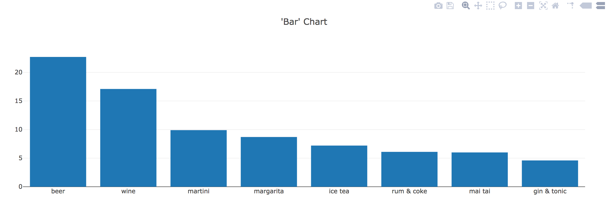

  * This is a bar chart plotting various types of drinks against the percentages of drinks ordered at a bar.

* Now open `plots.js`:

  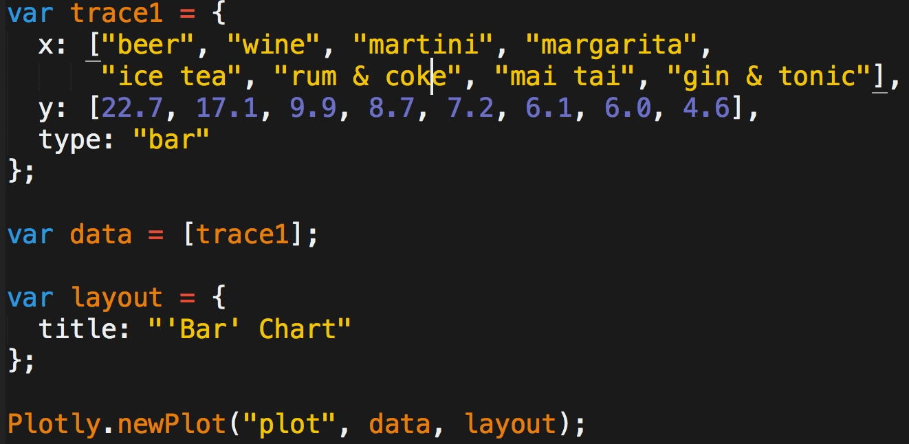

* Explain that in Plotly, the term `trace` refers to an object that contains (1) data to be plotted, and (2) specifications for plotting.

* Ask the class what `trace1` consists of:

  * Data for the x-axis: labels for each drink, presented as a key-value pair of `x` and an array of drinks.

  * Data for the y-axis, again organized as a key-value pair.

  * A specification for the type of the chart.

* Point out that in `var data = [trace1];`, `trace1` is enclosed in an array.

  * Including multiple traces in the array will allow visualizing multiple traces in the same chart, as we will see later.

* Then point out that in the last line of the script, we use the `Plotly.newPlot()` method to plot our chart. It takes three arguments:

  * The first, `"plot"`, refers to the `id` of the `div` where the plot will be displayed.

  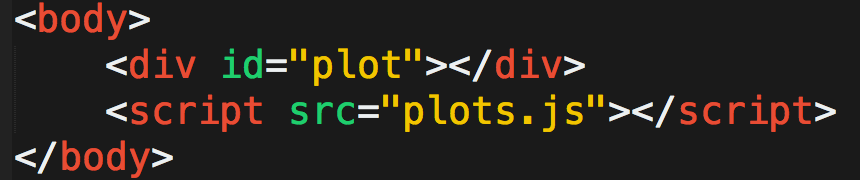

  * The second argument, `data`, refers to the trace.

  * The last argument, `layout`, is optional and refers in this case to the title displayed in the chart.

* Next, comment out the code from Part 1 and uncomment the code from Part 2 in `plots.js`. Reload `index.html`. Bring to students' attention that we've now added labels for x- and y-axes.

  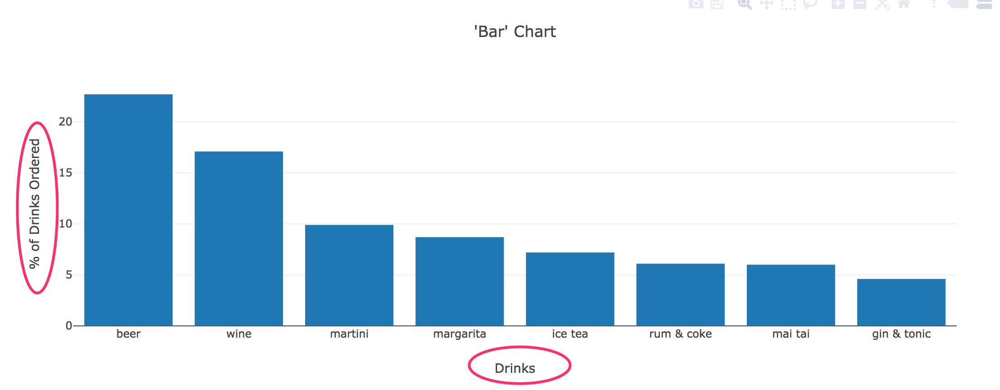

* Open the JavaScript code and explain that we have simply added `xaxis` and `yaxis` specifications to the `layout` object:

  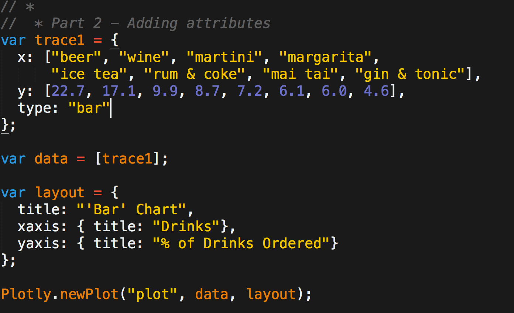

* Next, comment out the code from Part 2 and uncomment the code from Part 3. Load `index.html` again:

  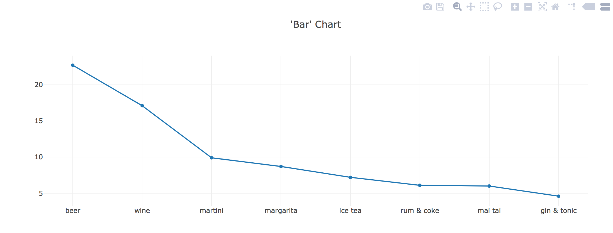

* Open the code file and explain that in the code, the only change to take place was the `type: "line"`, in contrast to `type: "bar"` from the bar chart.

  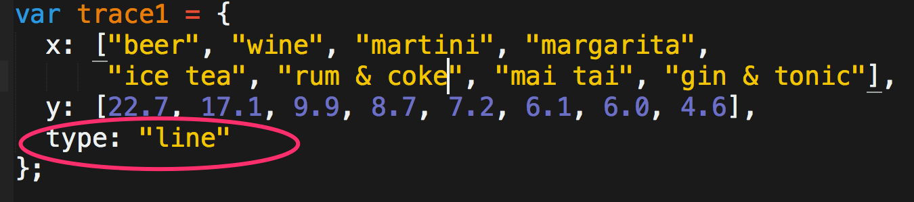

#### Optional

* Next, ask the class whether we can change the specification to `type: "pie"` to create a pie chart. (The answer is no; doing so will lead to a blank chart.)

* Uncomment the code in Part 5 and reload the page. We get a pie chart!

  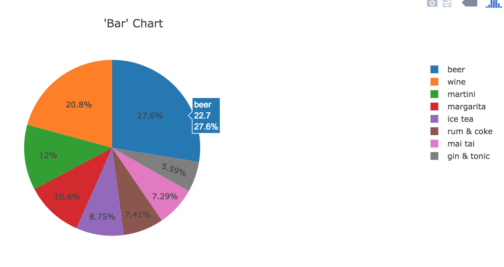

* Send out the link to the [pie chart documentation](https://plot.ly/javascript/pie-charts/) and ask the class how they might fix the broken pie chart.

* Show the code to the class:

  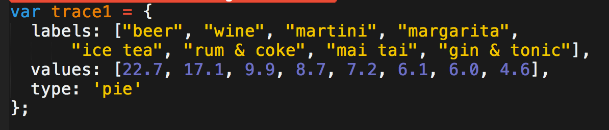

  * In `trace1`, instead of `x` and `y`, we use the keys `labels` and `values`.

  * We also specify the type of chart as `'pie'`.

* Answer any questions before moving on.

</details>

<sub>[Having issues with this activity? Report a bug!](https://bit.ly/34fTEmL)</sub>

- - -

## 2. A Flicker of the Eye

| Activity Time:       0:25 |  Elapsed Time:      0:50  |
|---------------------------|---------------------------|

<details>
  <summary><strong>✏️ 2.1 Student Do: A Flicker of the Eye (20 mins)</strong></summary>

* **Files:**

  * [Activities/02-Stu_First_Chart/README.md](Activities/02-Stu_First_Chart/README.md)
  * [Activities/02-Stu_First_Chart/Unsolved](Activities/02-Stu_First_Chart/Unsolved)

* In this activity, students will create a Plotly bar chart that shows the relationship between eye color and the frequency of eye flickers.

</details>

<details>
  <summary><strong>⭐ 2.2 Review: A Flicker of the Eye (5 mins)</strong></summary>

* **File**: [Activities/02-Stu_First_Chart/Solved/plots.js](Activities/02-Stu_First_Chart/Solved/plots.js)

* Open [Activities/02-Stu_First_Chart/Solved/plots.js](Activities/02-Stu_First_Chart/Solved/plots.js). Provide a quick overview of the activity:

  * Much of the activity is straightforward, with one quirk: we have multiple data points for each eye color, but Plotly does not plot them all. It plots the aggregate of them, but only includes the last value listed for each eye color in the hover label.

  * For example, for "Brown," the final flicker value listed in the CSV file is 24.5.

* Explain that a more meaningful approach to plotting may be to take the average of each eye color.

* Using the [slideshow](https://docs.google.com/presentation/d/1Itu7Afxcya2bQpZ-Ko1hreMgCIN0E7V5y6E02_L7MAc/edit?ts=5cd309b4#slide=id.g59dd8002d5_0_121), remind the class that we have just learned the basics of creating plots in Plotly. (Slide 9)

</details>

<sub>[Having issues with this activity? Report a bug!](https://bit.ly/2UNYGnw)</sub>

- - -

## 3. Filter/Map/Arrow & Fastest Growing Cities

| Activity Time:       0:45 |  Elapsed Time:      1:35  |
|---------------------------|---------------------------|

<details>
  <summary><strong>📣 3.1 Instructor Do: Filter/Map/Arrow Warm-Up (15 mins)</strong></summary>

* **Files:**

  * [Activities/03-Evr_Filter_Warmup/Solved/data.js](Activities/03-Evr_Filter_Warmup/Solved/data.js)

  * [Activities/03-Evr_Filter_Warmup/Solved/index.html](Activities/03-Evr_Filter_Warmup/Solved/index.html)

  * [Activities/03-Evr_Filter_Warmup/Solved/plot.js](Activities/03-Evr_Filter_Warmup/Solved/plot.js)

* Provide an overview of the activity: This activity is a review and application of `.filter()`, `.map()` and arrow functions to create a bar chart with Plotly.

* In the `data.js` file, show that the `topMovies` array has 10 objects.

* Open `index.html` in a browser and show that there are fewer than 10 bars in the bar chart. When we filter the `topMovies` based on `imdbRating` that is greater than 8.9, only 4 of the top 10 movies are displayed.

  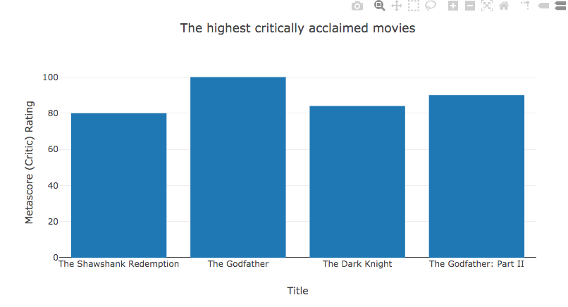

* In the `plots.js` file, review the `.filter()` method. Explain that it is used to create a custom filtering function that returns the movies with an IMDb rating higher than 8.9.

    ```js
    function filterMovieRatings(movie) {
    return movie.imdbRating > 8.9;
    }
    var filteredMovies = topMovies.filter(filterMovieRatings);
    ```

* Next, review the `.map()` method, which can be used to create new arrays. The `map()` method creates new arrays from the `title` and `metascore` properties of each object in the filtered dataset.

  ``` js
  var titles = filteredMovies.map(movies =>  movies.title);

  var ratings = filteredMovies.map(movies => movies.metascore);
  ```
* Walk through the `var trace` object.

  * We assign the `titles` array to the x-axis and the `ratings` array to the y-axis.

  * We specify the type of chart as a bar plot with `type: "bar"`.

* Remind students that:

  * `var data = [trace];` is an array.

  * `var layout` defines the plot layout.

  * `Plotly.newPlot()` is used to plot the chart, which takes the arguments.

  * `"bar-plot"` refers to the `id` of the `div` where the plot will be displayed.

  * `data` refers to the trace.

  * `layout` refers to the title and axes titles displayed in the chart.

  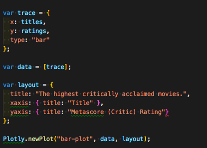

* Answer any questions before moving on.

</details>

<details>
  <summary><strong>✏️ 3.2 Student Do: Fastest Growing Cities (20 mins)</strong></summary>

* **Files:**

  * [Activities/04-Stu_Filter_Warmup/README.md](Activities/04-Stu_Filter_Warmup/README.md)

  * [Activities/04-Stu_Filter_Warmup/Unsolved/plot.js](Activities/04-Stu_Filter_Warmup/Unsolved/plot.js)

  * [Activities/Stu_Filter_Warmup/Unsolved/data.js](Activities/04-Stu_Filter_Warmup/Unsolved/data.js)

* In this activity, students will use functional programming techniques to create plots for cities with the fastest population growth.

</details>

<details>
  <summary><strong>⭐ 3.3 Review: Fastest Growing Cities (5 mins)</strong></summary>

* **File:** [Activities/04-Stu_Filter_Warmup/Solved/plot.js](Activities/04-Stu_Filter_Warmup/Solved/plot.js)

* Explain to students that this was a somewhat challenging activity, as it requires using functional programming techniques.

* Open the [solution](Activities/04-Stu_Filter_Warmup/Solved/plot.js).

* Explain that the `filterCities` function is used to filter values greater than `15000`:

    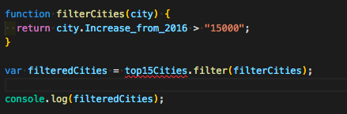

* Explain that `map` is used with an arrow function to return the city and population for all of the filtered cities.

    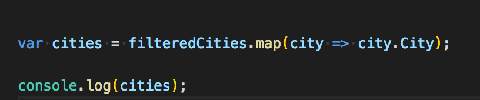

    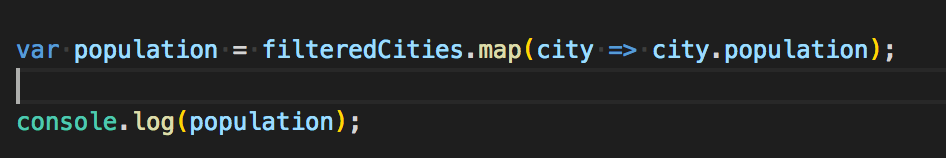

  * `city => city.City` is a shortcut to `function(city) {return city.City;}`

  * `city => city.population` is a shortcut to `function(city) {return city.population;}`

* Next, explain how `trace` is structured:

    ``` js
    var trace = {
      x: cities,
      y: population,
      type: "bar"
    };
    ```

  * `x` becomes the cities array of `city.City` values, and `y` becomes the population array of `city.population` values.

  * The type of chart is specified with `type: "bar"`.

* The rest of the code should be familiar to students, but answer any questions before moving on.

    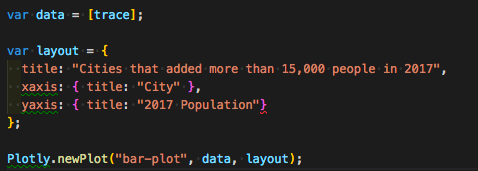

* If time permits, go over the bonus question and explain the following:

  * Using `parseInt()` we can create two arrays, one that has the 2016 population and one that has the increase in population for each of the filtered cities.

    ``` js
    var pop2016 = filteredCities.map(city => (parseInt(city.population) - parseInt(city.Increase_from_2016)));

    var increase = filteredCities.map(city => parseInt(city.Increase_from_2016));
    ```

  * Next, we create an empty list that will hold the population rate.

    ``` js
    pop_rate = [];
    ```

  * Then we create a for loop to iterate through the two arrays, calculate the *rate* of population increase for each city, and add it to the list while in the loop.

    ``` js

    for (i=j= 0; i < pop2016.length && j < increase.length; i++, j++) {

      {var rate = (parseInt(increase[j])/parseInt(pop2016[i])) * 100
      pop_rate.push(rate);
      }
    }
    ```

  * In `trace2`, the `x` becomes the `cities` array, and the `y` becomes the population rate, `pop_rate`, and we specify the type of chart, `type: "bar"`.

    ``` js
    var trace2 = {
      x: cities,
      y: pop_rate,
      type: "bar"
    };
    ```

  * The rest of the code should be familiar to students.

    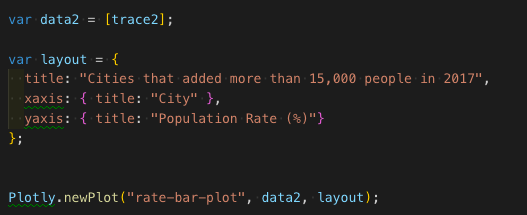

  * Finally, we add the `pop_rate_desc` to the `y` in `trace2` to graph the population rate in descending order.

    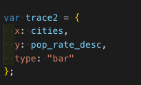

* Answer any questions before moving on.

</details>

<details>
  <summary><strong>📣 3.4 Instructor Do: Goals Review (5 mins)</strong></summary>

* Open the [slideshow](https://docs.google.com/presentation/d/1Itu7Afxcya2bQpZ-Ko1hreMgCIN0E7V5y6E02_L7MAc/edit?ts=5cd309b4#slide=id.g59dd8002d5_0_133) and go over what we have accomplished so far (Slide 10):

  * Learned how to create basic plots in Plotly.

  * Learned how to use a functional programming technique (`filter()`) to render charts in Plotly.

* Take this time to clear up any questions that students may have.

</details>

<sub>[Having issues with this activity? Report a bug!](https://bit.ly/39RbOfU)</sub>

- - -

## Break

| Activity Time:       0:15 |  Elapsed Time:      1:50  |
|---------------------------|---------------------------|

- - -

## 4. Lottery Number Generator

| Activity Time:       0:30 |  Elapsed Time:      2:20  |
|---------------------------|---------------------------|

<details>
  <summary><strong>📣 4.1 Instructor Do: Random Numbers (10 mins)</strong></summary>

* **File:** [Activities/05-Ins_Math_Random/Solved/math.js](Activities/05-Ins_Math_Random/Solved/math.js)

* In this section, students will learn about using the [Math library](https://developer.mozilla.org/en-US/docs/Web/JavaScript/Reference/Global_Objects/Math) to perform mathematical operations.

* Open the console in Chrome and type `Math`. Show students the many properties and methods that the `Math` library uses.

  * `Math.random()` is used to generate a random number between 0 and 1 (inclusive of 0, but not 1).

  * Decimal numbers can be rounded to the nearest whole number using `Math.round()`.

  * `Math.floor()` can be used to round down to the nearest whole integer.

  * `floor` and `round` can be combined with `Math.random()` to generate random whole numbers.

  * A random number can be scaled by a constant to create whole numbers larger than 1.

</details>

<details>
  <summary><strong>✏️ 4.2 Student Do: Lottery Number Generator (15 mins)</strong></summary>

* **Files:**

  * [Activities/06-Stu_Random_Number_Gen/README.md](Activities/06-Stu_Random_Number_Gen/README.md)

  * [Activities/06-Stu_Random_Number_Gen/Unsolved/math.js](Activities/06-Stu_Random_Number_Gen/Unsolved/math.js)

* In this activity, students will use the JavaScript `Math` library to manipulate numbers and mathematical operations.

</details>

<details>
  <summary><strong>⭐ 4.3 Review: Lottery Number Generator (5 mins)</strong></summary>

* **File:** [Activities/06-Stu_Random_Number_Gen/Solved/math.js](Activities/06-Stu_Random_Number_Gen/Solved/math.js)

* Open the code:

  ```js
  var powerBallNumbers = [];

  for (var i = 0; i < 5; i++) {
   powerBallNumbers.push(Math.floor(((Math.random() * 59) + 1));
  }

  powerBallNumbers.push(Math.floor(((Math.random() * 35) + 1));
  ```

* Highlight the following points:

  * A for loop is used to generate 5 random numbers.

  * The for loop iterates through a range from 0 to 5 and calls the `Math.random()` function.

  * `Math.random()` is multipled by 58 and then plus 1 to scale the random number up to 59.

  * Finally, `Math.floor()` is used to round the number down to the nearest whole integer.

  * For the bonus, a 6th number between 1 and 35 is added to the `powerBallNumbers` array by scaling `Math.random()` by 34 and then plus 1.

* Open the [slideshow](https://docs.google.com/presentation/d/1Itu7Afxcya2bQpZ-Ko1hreMgCIN0E7V5y6E02_L7MAc/edit?ts=5cd309b4#slide=id.g59dd8002d5_0_145) and remind the class that we have learned how to use JavaScript's `Math` library. (Slide 11)

* Answer any questions before moving on.

</details>

<sub>[Having issues with this activity? Report a bug!](https://bit.ly/2xRLgOj)</sub>

- - -

## 5. Multiple Traces

| Activity Time:       0:40 |  Elapsed Time:      3:00  |
|---------------------------|---------------------------|

<details>
  <summary><strong>📣 5.1 Instructor Do: Plotting Multiple Traces (10 mins)</strong></summary>

* **File:** [Activities/07-Ins_Multi_Trace/Solved/index.html](Activities/07-Ins_Multi_Trace/Solved/index.html)

* This section is a quick demonstration of adding multiple traces to a Plotly chart.

* Open [Activities/07-Ins_Multi_Trace/Solved/index.html](Activities/07-Ins_Multi_Trace/Solved/index.html) in your browser:

  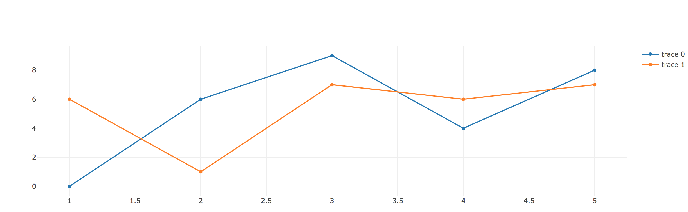

* Explain that there are two line plots of randomly generated numbers. (Because they're generated randomly, the numbers may differ from those in this screenshot).

* Open [Activities/07-Ins_Multi_Trace/Solved/plots.js](Activities/07-Ins_Multi_Trace/Solved/plots.js). If time allows, discuss the random generator function:

  ```js
  function randomNumbersBetween0and9(n) {
    var randomNumberArray = [];
    for (var i = 0; i < n; i++) {
      var randomNumber = Math.floor(Math.random() * 10);
      randomNumberArray.push(randomNumber);
    }
    return randomNumberArray;
  }
  ```

  * The function takes as its argument a number `n` that will determine the size of the array.

  * First, an empty array is created.

  * During each iteration of a for loop, a random number between 0 and 1, inclusive, is generated and rounded down to the nearest integer with `Math.floor()`. Then it is multiplied by 10 to result in random integers between 0 and 10. This number then appends to the array of random numbers.

* Walk through the rest of the code:

  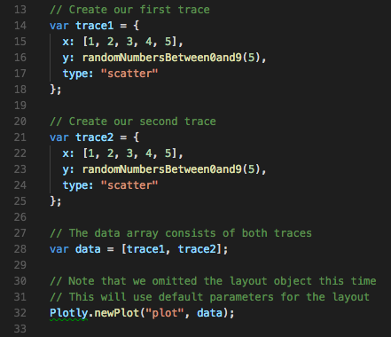

  * Each of the two traces plots 5 randomly generated integers against the same x-axis, an array.

  * Both `trace1` and `trace2` are assigned to an array called `data` and charted as a scatterplot.

  * In the last line of the code, we see two arguments: `"plot"` and `data`. A possible third argument would have been used to specify the layout but is omitted. The layout, therefore, follows Plotly's default settings.

</details>

<details>
  <summary><strong>✏️ 5.2 Student Do: Multiple Traces (20 mins)</strong></summary>

* **Files**

  * [Activities/08-Stu_Multi_Trace/Unsolved](Activities/08-Stu_Multi_Trace/Unsolved)

  * [Activities/08-Stu_Multi_Trace/README.md](Activities/08-Stu_Multi_Trace/README.md)

* In this activity, students will use functional programming techniques to create a Plotly chart with multiple traces.

</details>

<details>
  <summary><strong>⭐ 5.3 Review: Multiple Traces Activity (5 mins)
</strong></summary>

* **Files:**

  * [Activities/08-Stu_Multi_Trace/Solved/plots.js](Activities/08-Stu_Multi_Trace/Solved/plots.js)

  * [Activities/08-Stu_Multi_Trace/Solved/index.html](Activities/08-Stu_Multi_Trace/Solved/index.html)

* Open the [solution](Activities/08-Stu_Multi_Trace/Solved/plots.js). Explain that this was a fairly challenging activity, as it requires using functional programming techniques.

* Explain that for the first trace, which deals with Greek gods, defining the x-axis points can be accomplished by using `map()` to return the `pair` value from the dataset.

  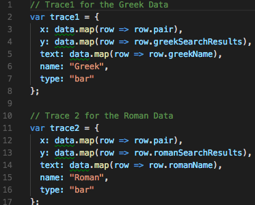

  * Here, `row => row.pair` is essentially a shortcut for writing `function (row) {return row.pair;}`.

  * `map()` is used to transform each row in the dataset to its `pair` attribute.

  * `x` becomes an array of `row.pair` values.

* Explain that the second trace deals with Roman gods. Everything here is analogous to trace 1:

  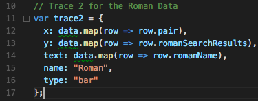

* Answer any questions before moving on.

</details>

<details>
  <summary><strong>📣 5.4 Instructor Do: Goals Review and End Class (5 mins)</strong></summary>

* Open the [slideshow](https://docs.google.com/presentation/d/1Itu7Afxcya2bQpZ-Ko1hreMgCIN0E7V5y6E02_L7MAc/edit?ts=5cd309b4#slide=id.g59dd8002d5_0_157) to review today's goals. (Slide 12)

* Remind students that we learned to use another functional programming technique, `map()`, in rendering multiple plots in Plotly.

* Use this time to answer questions and clear up any sources of confusion for students before ending class.

</details>

<sub>[Having issues with this activity? Report a bug!](https://bit.ly/39MCbUc)</sub>

- - -

© 2021 Trilogy Education Services, LLC, a 2U, Inc. brand. Confidential and Proprietary. All Rights Reserved.
