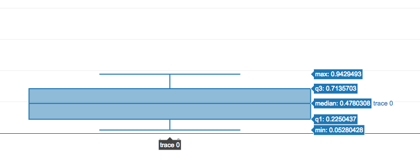
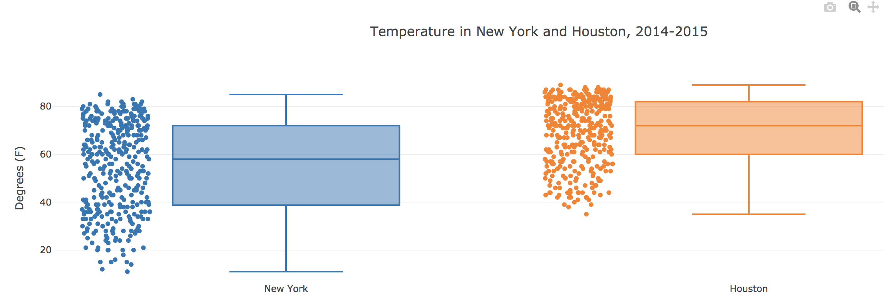
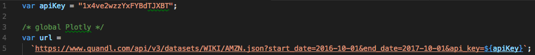
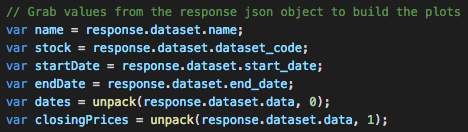
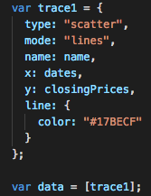
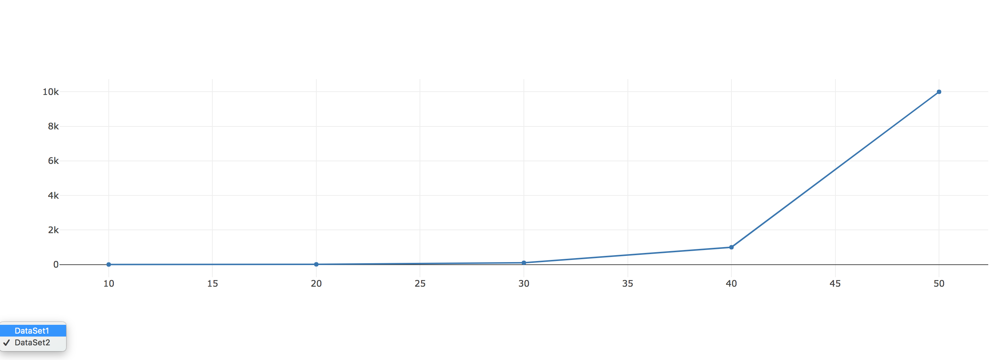
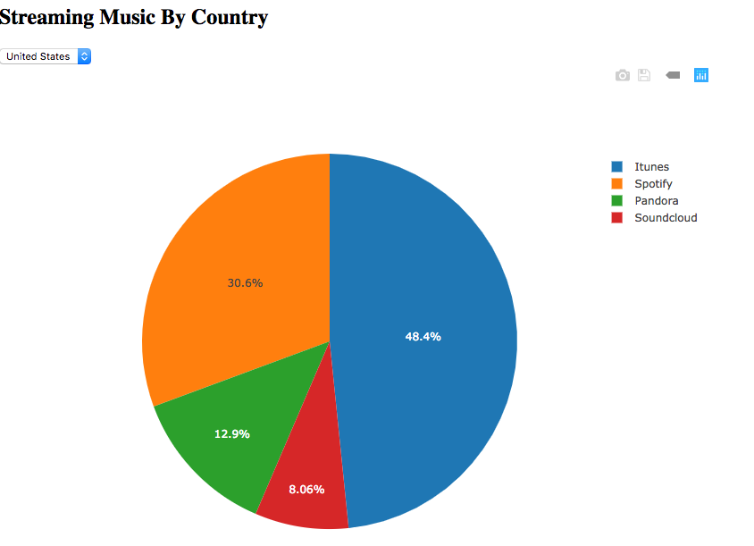

# 15.2 Advanced Charts in Plotly

## Overview

Today's class will introduce students to advanced data visualization with Plotly. The lesson covers advanced features like custom tick labels, layouts, colors, dropdowns, and click events.

## Class Objectives

By the end of today's class, students will be able to:

* Use advanced JavaScript methods.
* Manipulate charts through dropdown events and click events.
* Create charts using data from API calls.
* Use `Plotly.restyle()` to create dynamic charts.

## Instructor Prep

<details>
  <summary><strong>Instructor Notes</strong></summary>

* Please reference our [Student FAQ](../../../05-Instructor-Resources/README.md#unit-15-interactive-visualizations-and-dashboards) for answers to questions frequently asked by students of this program. If you have any recommendations for additional questions, feel free to log an issue or a pull request with your desired additions.

* During today's class, students will place API calls in JavaScript, create events with dropdown menus, and learn to sort and slice data in JavaScript. Using these skills, they will create advanced visualizations in Plotly, such as box plots.

* Today's focus should be improving students' JavaScript skills. Rather than get bogged down in the particulars of Plotly, emphasize the fundamental JavaScript techniques that will translate to creating impressive data visualization in other libraries as well.

* Today's class is dense with activities. Use your judgment to adjust timing of activities. Since boxplot activities are the least crucial to completing this week's homework, you may omit them partially or altogether to devote more time to other activities.

</details>

<details>
  <summary><strong>Sample Class Video</strong></summary>

* To view an example class lecture visit (Note video may not reflect latest lesson plan): [Class Video](https://codingbootcamp.hosted.panopto.com/Panopto/Pages/Viewer.aspx?id=083343f2-ebee-4b71-a622-aa950184d68a)

</details>

- - -

# Class Activities

## 1. Welcome & Box Plots

| Activity Time:       0:40 |  Elapsed Time:      0:40  |
|---------------------------|---------------------------|

<details>
  <summary><strong>📣 1.1 Instructor Do: Welcome Class, Goals, and Review (0:10)</strong></summary>

* **File:** [Slideshow](https://docs.google.com/presentation/d/1yuXXpqLpPw663BrnldolcL8kQKZmieHTNzt-2DdBCIA/edit?ts=5cd30bd3#slide=id.g480f0dd0a7_0_1809)

* Welcome everyone to class. Take a minute to explain that today we will continue our in-depth exploration of Plotly and JavaScript.

* Open the slideshow and review the topics we'll be covering today. (Slide 2)

* Inform students that by the end of the class, they'll be able to:

  * Use advanced JavaScript methods to create charts in Plotly.

  * Use event handling to create dynamic charts with Plotly.

  * Use Plotly to create charts with data from API calls.

* If time allows, take a moment to summarize the fundamentals of Plotly.js from the previous class:

  * All charts are created using JSON objects.

  * Every property of the chart has a corresponding JSON attribute that can be used to customize the appearance and behavior.

  * Attributes can be divided into two categories:

    * `traces`: Objects that are used to provide information about a single series of the data to be plotted on the graph.

    * `layout`: Provides different attributes that control elements like title and annotations.

  * Traces can be further categorized by the chart type. Attributes available for customization will depend on the value of the type attribute.

</details>

<details>
  <summary><strong>📣 1.2 Instructor Do: Box Plots (0:10)</strong></summary>

* **File:** [Activities/01-Ins_BoxPlot/Solved/](Activities/01-Ins_BoxPlot/Solved/)

* Open [index.html](Activities/01-Ins_BoxPlot/Solved/index.html) in the browser to demonstrate what a box plot looks like.

  

* Give the following explanation:

  * Each box corresponds to a different distribution.

  * The line in the middle of the box identifies the median of the underlying data.

  * The upper and lower bounds of the box represent the upper and lower quartiles of the underlying data.

  * The lines outside and above/below the box represent the maximum/minimum of the underlying data.

  * Each box summarizes an entire _distribution_ of data.

* Explain that box plots are useful tools for visualizing the statistical similarity between distributions.

* Encourage students to create box plots as a logical step in the exploration phase of their analysis work.

* Open [plots.js](Activities/01-Ins_BoxPlot/Solved/plots.js) and go over the code with students.

  * The syntax for creating a box plot with Plotly is very similar to previous examples we've covered.

  * The option to render a scatter plot next to the box plot, `boxpoints: "all"`, has been commented out, but it can be uncommented to show its effects.

* Answer any questions before moving on.

</details>

<details>
  <summary><strong>✏️ 1.3 Student Do: Box Plots (0:10)</strong></summary>

In this activity, students will create box plots to depict the survival rates of different kinds of cancer.

* **Files:**

  * [Activities/02-Stu_BoxPlot/Unsolved/index.html](Activities/02-Stu_BoxPlot/Unsolved/index.html)

  * [Activities/02-Stu_BoxPlot/Unsolved/data.js](Activities/02-Stu_BoxPlot/Unsolved/data.js)

  * [Activities/02-Stu_BoxPlot/Unsolved/plots.js](Activities/02-Stu_BoxPlot/Unsolved/plots.js)

  * [Activities/02-Stu_BoxPlot/Unsolved/Bonus](Activities/02-Stu_BoxPlot/Unsolved/Bonus)

* **Instructions:**

  * [README.md](Activities/02-Stu_BoxPlot/README.md)

</details>

<details>
  <summary><strong>⭐ 1.4 Review: Box Plots (0:10)</strong></summary>

* **Files:**

  * [plots.js](Activities/02-Stu_BoxPlot/Solved/plots.js).

  * [data.js](Activities/02-Stu_BoxPlot/Solved/data.js).

* Open `plots.js` and explain the code.

  ```js
  var trace1 = {
    y: temps.newyork,
    name: "New York",
    type: "box",
    boxpoints: "all"
  };

  var trace2 = {
    y: temps.houston,
    name: "Houston",
    type: "box",
    boxpoints: "all"
  };

  var data = [trace1, trace2];

  var layout = {
    title: "Temperature in New York and Houston, 2014-2015",
    yaxis: { title: "Degrees (F)"}
  };
  ```

  * The code here is similar to that of the previous instructor demo.

  * Two traces are created, and the `type` is specified as `"box"`.

  * `boxpoints: "all"` creates a scatterplot next to each boxplot with a dot for each data point.

* Open `index.html` in a browser.

  

* Ask students what they were able to observe from the boxplots:

  * Predictably, the median temperature in Houston is higher than in New York.

  * The maximum temperature (that is, the maximum daily mean temperature) is modestly higher in Houston, but the temperature range in New York is considerably broader.

  * In both cities, the quartile above the median is narrower than the one below it (third and second quartiles, respectively).

* If time allows, discuss the more challenging bonus activity.

* Open `plot.js` and explain `trace1`.

  ```js
  var trace1 = {
      x: data.organ,
      y: data.survival.map(val => Math.sqrt(val)),
      type: "box",
      name: "Cancer Survival",
      boxpoints: "all"
  };
  ```

  * The x-axis comprises each organ.

  * The y-axis is created by using `map()` to obtain the square root of the survival rate.

  * Organs sharing the same name are aggregated in the plot.

</details>

<sub>[Having issues with this activity? Report a bug!](https://bit.ly/3bZFZTQ)</sub>

- - -
  
## 2. D3.json & Stock Prices Time Series

| Activity Time:       0:45 |  Elapsed Time:      1:25  |
|---------------------------|---------------------------|

<details>
  <summary><strong>📣 2.1 Instructor Do: D3.json (0:10)</strong></summary>

* **Files:**

  * [index.html](Activities/03-Ins_D3_JSON/Solved/index.html)

  * [plots.js](Activities/03-Ins_D3_JSON/Solved/demo.js)

* Explain that D3.js provides a function to fetch JSON data from APIs on the web.

* Visit the [SpaceX API](https://api.spacexdata.com/v2/launchpads) to show the JSON data.

* Live code or walk through the demo and highlight the following:

  ```javascript
  const url = "https://api.spacexdata.com/v2/launchpads";

  d3.json(url).then(function(data) {
      console.log(data);
  });
  ```

  * `d3.json` is very similar to Python `requests.get`.

  * `d3.json` returns a JavaScript promise: it places an API call to the `url`; once it's available, the callback function prints it to the console.

* Use the second example to explain the concept of promises in JavaScript:

  ```javascript
  const dataPromise = d3.json(url);
  console.log("Data Promise: ", dataPromise);
  ```

  * The data from a promise is only available inside of the `.then` function.

  * The `dataPromise` variable is assigned a promise of future data, but the data must be accessed inside of the `.then` function.

</details>

<details>
  <summary><strong>📣 2.2 Instructor Do: Introduce Stock Prices Time Series Activity (0:10)</strong></summary>

* **Files:**

  * [Activities/04-Stu_Stocks_D3/Solved/index.html](Activities/04-Stu_Stocks_D3/Solved/index.html)

  * [Activities/04-Stu_Stocks_D3/Solved/plots.js](Activities/04-Stu_Stocks_D3/Solved/plots.js)

* Demonstrate the solved [index.html](Activities/04-Stu_Stocks_D3/Solved/index.html) in the browser. Be sure to replace the API key in [Activities/04-Stu_Stocks_D3/Solved/plots.js](Activities/04-Stu_Stocks_D3/Solved/plots.js) with your own.

* Explain that, in the next activity, students will use the [Quandl API](https://docs.quandl.com/) to fetch stock data.

  **Note:** Emphasize that students must sign up for their own API key in order to complete the day's activities.

* Explain the example request on the [time series usage](https://docs.quandl.com/docs/in-depth-usage) page.

```bash
# Note the ticker symbol (AMZN) and the API KEY at the end of the URL
curl "https://www.quandl.com/api/v3/datasets/WIKI/AMZN/data.json?api_key=YOURAPIKEY"
```

* Send the link to the [Quandl API page](https://docs.quandl.com/docs#section-authentication), where students will be able to sign up for an API key.

</details>

<details>
  <summary><strong>✏️ 2.3 Student Do: Stock Prices Time Series Activity (0:15)</strong></summary>

* **Files:**

  * [index.html](Activities/04-Stu_Stocks_D3/Unsolved/index.html)

  * [plots.js](Activities/04-Stu_Stocks_D3/Unsolved/plots.js)

* **Instructions:**

  * [README.md](Activities/04-Stu_Stocks_D3/README.md)

* In this activity, students will create a dynamic time series chart of financial data. Students must sign up for their own API key in order to complete this activity.

</details>

<details>
  <summary><strong>⭐ 2.4 Review: Stock Prices Time Series (0:05)</strong></summary>

* **Files:**

  * [index.html](Activities/04-Stu_Stocks_D3/Solved/index.html)

  * [plots.js](Activities/04-Stu_Stocks_D3/Solved/plots.js)

* Open the solved `index.html` in the browser to display the chart.

* Open the solved `plots.js` in your code editor.

* Point out that the solution to this activity follows this pattern:

  * Retrieve data from Quandl via `d3.json`.

  * Unpack data from the response data.

  * Create and render `trace`, `data`, and `layout` objects with the unpacked data.

* Explain that we use [template strings](https://developer.mozilla.org/en-US/docs/Web/JavaScript/Reference/Template_literals) to build the base `url` that we use for requests.

  

* Explain that, in `buildPlot`, we can use dot notation and `unpack` to extract the necessary data from the response.

  

* Point out that the rest of the code is familiar from our previous plots. Simply set the `x` and `y` keys in our `trace1` object, which we use to create the `data` array we pass to Plotly.

  

</details>

<details>
  <summary><strong>📣 2.5 Instructor Do: Goals Review (0:05)</strong></summary>

* Open the [slideshow](https://docs.google.com/presentation/d/1yuXXpqLpPw663BrnldolcL8kQKZmieHTNzt-2DdBCIA/edit?ts=5cd30bd3#slide=id.g59dfa23864_0_2171) and remind students that they are now able to (Slides 3-4):

  * Create meaningful box plots with Plotly.

  * Use Plotly to create charts with data from API calls, in this case to Quandl.

</details>

<sub>[Having issues with this activity? Report a bug!](https://bit.ly/2UNAjGA)</sub>

- - -

## Break

| Activity Time:       0:15 |  Elapsed Time:      1:40  |
|---------------------------|---------------------------|

- - -

## 3. Slice, Dice, and Sort

| Activity Time:       0:35 |  Elapsed Time:      2:15  |
|---------------------------|---------------------------|

<details>
  <summary><strong>📣 3.1 Instructor Do: Sorting and Slicing (0:15)</strong></summary>

* **Files:**

  * [sorting.js](Activities/05-Ins_Sort_Slice/Solved/sorting.js)

  * [slicing.js](Activities/05-Ins_Sort_Slice/Solved/slicing.js)

  * [index.html](Activities/05-Ins_Sort_Slice/Solved/index.html)

* **Note:** It is highly recommended that you live code this activity.

* Open `sorting.js` and use `index.html` to display the results. Cover the following points:

  * When working with data, it will often be necessary to sort the data, either in ascending or descending order.

  * To sort an array in JavaScript, we call its `sort()` method.

  * When we call `sort`, we must pass it a callback function specifying _how_ to sort.

  ```js
  // Sorts ascending
  var sortedAscending = [3, 2, 1].sort(function compareFunction(firstNum, secondNum) {
  // resulting order is (1, 2, 3)
  return firstNum - secondNum;
  });
  ```

* Explain that `compareFunction` compares two values at a time.

  * In this example, `compareFunction` first compares 1 and 2. The arguments `firstNum` and `secondNum` are arbitrary names, but there must be two arguments.

  * This function returns `firstNum - secondNum`. In this case, since `firstNum`, 3, is greater than `secondNum`, 2, it returns a positive number.

  * If the compare function returns a _positive_ number for a given pair of numbers `[firstNum, secondNum]`, it will put them in the _reverse order_ in the final array: `[secondNum, firstNum]`.

  * Likewise, if the compare function returns a _negative_ number for a given pair `[firstNum, secondNum]`, it will preserve their order in the output array: `[firstNum, secondNum]`.

  * The `compareFunction` continues to compare two values in the array at a time.

* Emphasize that `sort` modifies the array it's called on _in place_. Also point out that it is often safer to sort a _copy_ of an array rather than the input itself.

* Open the `index.html` to display the output.

* Next, discuss the `slice()` method. Open `slicing.js` and explain the code:

  ```js
  var names = ["Jane", "John", "Jimbo", "Jedediah"];
  var left = names.slice(0, 2);
  ```

* Explain that the `slice()` method is similar to slicing a list in Python: it allows cutting a subsection of a JavaScript array.

  * `slice()` produces _shallow_ copies, meaning that it does not affect the original array.

  * `slice()` takes two arguments. The first is the index position of the subsection. The second is the index position, up to which the slicing will take place.

  * In this case, slicing begins at index position 0 and continues up to, but not including, index position 2.

* Finally, explain the `reverse()` method: It simply reverses the order of an array.

</details>

<details>
  <summary><strong>✏️ 3.2 Student Do: Slice, Dice, and Sort (0:15)</strong></summary>

* **File:** [06-Stu_Sort_Slice/Unsolved](Activities/06-Stu_Sort_Slice/Unsolved/)

* **Instructions:** [README.md](Activities/06-Stu_Sort_Slice/README.md)

* In this activity, students will sort, slice, and reverse an array to build a horizontal bar chart.

* The **Practice** will use [sliceSort.js](Activities/06-Stu_Sort_Slice/Unsolved/sliceSort.js)

* The **Horizontal Bar Chart** will use [plots.js](Activities/06-Stu_Sort_Slice/Unsolved/plots.js)

</details>

<details>
  <summary><strong>⭐ 3.3 Review: Slice, Dice, and Sort (0:05)</strong></summary>

* **File:** [06-Stu_Sort_Slice/Solved](Activities/06-Stu_Sort_Slice/Solved/)

* Open up `sliceSort.js`. First, explain the `sort()` method:

  ```js
  var sorted = numArray.sort(function sortFunction(a, b) {
      return b - a;
  });
  ```

  * The `sort()` method calls another function as an argument.

  * The custom `sortFunction()` here compares two numbers at a time and returns `b - a`.

  * If the custom function returns a positive number, it _reverses_ the order of the two numbers. That is, if `a` is 1, and `b` is 100, `b - a` is a positive number, so the order is reversed.

* Next, explain sorting with an arrow function:

  ```js
  var sortedByArrow = numArray.sort((a, b) => b - a);
  ```

  * Instead of a named custom function, the syntax here is more straightforward and elegant.

  * It still takes `a` and `b` as its arguments and returns `b - a` to sort an array in descending order.

* Explain that `reverse()` reverses the order of an array.

  ```js
  var reversedArray = sortedByArrow.reverse();
  ```

* Explain that slicing from index position 0 of an array, up to but not including index position 5, yields the first 5 elements of an array:

  ```js
  var sliced = sortedAscending.slice(0, 5);
  ```

* Now move on to the chart. Open `index.html` and inform students that the chart is horizontal, sorted, and sliced.

* Next, open `data.js` and point out that the `data` is an array of objects. The objects were sorted by using the `greekSearchResults` property.

  ```js
  var sortedByGreekSearch = data.sort((a, b) => b.greekSearchResults - a.greekSearchResults);
  ```

* Explain that `slice()` and `reverse()` are used to select the first 10 elements of the sorted dataset, and then reverse their order:

  ```js
  slicedData = sortedByGreekSearch.slice(0, 10);
  reversedData = slicedData.reverse();
  ```

  * The array was reversed to accommodate Plotly's plotting conventions: it builds a horizontal bar chart from bottom to top.

  * The array can be sorted in ascending order instead.

* Point out that `orientation: h` in `trace1` creates a horizontal bar chart.

  **Note:** Remind students that they had to consult the Plotly documentation for this activity, and that Plotly's documentation is straightforward to use.

* Explain that we can set the size of the margins in the `layout` object.

* Answer any questions before moving on.

</details>

<sub>[Having issues with this activity? Report a bug!](https://bit.ly/2x7rbUc)</sub>

- - -
  
## 4. An Eventful Click & Dropdown Events

| Activity Time:       0:20 |  Elapsed Time:      2:35  |
|---------------------------|---------------------------|

<details>
  <summary><strong>🎉 4.1 Everyone Do: An Eventful Click (0:10)</strong></summary>

This activity is a brief refresher on event handling. In it, everyone will print the value of a dropdown menu item when it is selected.

* **File:** [07-Evr-Events_Review/Unsolved](Activities/07-Evr-Events_Review/Unsolved)

* **Instructions:** [README.md](Activities/07-Evr-Events_Review/README.md)

* Open the console for `index.html` and demonstrate that changing the dropdown menu item prints two items to the console:

  * The `id` of the dropdown menu element

  * `option1` or `option2`, depending on which item is selected

* Open `index.html` in an editor and explain the code:

  ```html
    <select id="selectOption">
      <option value="option1">Menu Option 1</option>
      <option value="option2">Menu Option 2</option>
  </select>
  ```

  * The dropdown menu is created with `<select>`.

  * Each dropdown menu item is created with an `<option>` with a `value` attribute.

  * The `id` of the dropdown menu is `selectOption`.

* Next, open `script.js` and walk through the code:

  ```js
  d3.selectAll("body").on("change", updatePage);

  function updatePage() {
      var dropdownMenu = d3.selectAll("#selectOption").node();
      var dropdownMenuID = dropdownMenu.id;
      var selectedOption = dropdownMenu.value;
  }
  ```

  * D3 is used to select the document `body` and create an event handler that calls `updatePage()` when a change takes place.

  * The dropdown menu's `id` and `value` attributes are assigned to variables, and then logged to the console.

* Summarize the major points of this demo:

  * A dropdown menu is created in the HTML document.

  * A D3 event handler calls a custom function to print the dropdown menu's attributes to the console.

* Answer any questions before moving on.

</details>

<details>
  <summary><strong>📣 4.2 Instructor Do: Dropdown Events and Plotly (0:10)</strong></summary>

* **File:** [Activities/08-Ins_Dropdown_Events/Solved/](Activities/08-Ins_Dropdown_Events/Solved/)

* In this section, you will demonstrate how to use events on the DOM to modify plots.

* Open `index.html` in the browser and use the dropdown menu to toggle between two datasets:

  

* Note that selecting a different dataset will re-render the plot on the screen.

* Open `plots.js` and explain the code:

  * By calling the `init()` function, a default dataset is displayed when the page is rendered:

  ```js
  function init() {
  data = [{
      x: [1, 2, 3, 4, 5],
      y: [1, 2, 4, 8, 16] }];
  var LINE = d3.selectAll("#plot").node();
  Plotly.newPlot(LINE, data);
  }
  ```

  * The `init()` function is called at the end of the script file.

  * Otherwise, everything in this function should be familiar. It renders a simple line chart in Plotly.

* Explain event handling. When a change takes place to the dropdown menu, the `updatePlotly()` function is called.

  ```js
  d3.selectAll("#selDataset").on("change", updatePlotly);
  ```

* Explain `function updatePlotly()`:

  ```js
  var dropdownMenu = d3.select("#selDataset");
  var dataset = dropdownMenu.property("value");
  ```

  * The dropdown menu is selected using D3, and then assigned to a variable, `dropdownMenu`.

  * The value of the dropdown menu item is also assigned to a variable, `dataset`.

* Explain that, after initializing `x` and `y` as empty arrays, their values are selected depending on the `value` of the dropdown menu selection:

  ```js
  var x = [];
  var y = [];

  if (dataset == 'dataset1') {
      x = [1, 2, 3, 4, 5];
      y = [1, 2, 4, 8, 16];
  }

  if (dataset == 'dataset2') {
      x = [10, 20, 30, 40, 50];
      y = [1, 10, 100, 1000, 10000];
  }
  ```

* Next, explain that when a change takes place in the DOM, instead of drawing a new plot in Plotly, the existing one is restyled:

  ```js
  Plotly.restyle("plot", "x", [x]);
  Plotly.restyle("plot", "y", [y]);
  ```

* Send students the link to the [Plotly documentation]([https://plot.ly/javascript/plotlyjs-function-reference/#plotlyrestyle](https://plot.ly/javascript/plotlyjs-function-reference/#plotlyrestyle)) and give your students a minute or two to review it.

  * According to the documentation, restyling an existing plot is faster than drawing a new one.

  * In this code, only the `x` and `y` arrays are modified.

* Summarize the key points of this example:

  * A default plot is rendered on the page.

  * A change takes place in the DOM when a dropdown menu item is selected.

  * A function is triggered with the DOM element's value as its argument.

  * The function uses Plotly's `restyle()` method to modify an existing plot.

* Answer any questions before moving on.

</details>

<sub>[Having issues with this activity? Report a bug!](https://bit.ly/2UKqOI6)</sub>

- - -
  
## 5. A Musical Pie

| Activity Time:       0:25 |  Elapsed Time:      3:00  |
|---------------------------|---------------------------|

<details>
  <summary><strong>✏️ 5.1 Student Do: A Musical Pie (0:15)</strong></summary>

In this activity, students will enhance their event handling chops by creating a dynamic pie chart using Plotly. When a country is selected from the dropdown menu, its dataset will be displayed in the browser.

* **File:** [09-Stu-Event_Final/Unsolved](Activities/09-Stu-Event_Final/Unsolved)

* **Instructions:** [README.md](Activities/09-Stu-Event_Final/README.md)

</details>

<details>
  <summary><strong>⭐ 5.2 Review: A Musical Pie (0:05)</strong></summary>

* **File:** [09-Stu-Event_Final/Solved](Activities/09-Stu-Event_Final/Solved)

* Open `index.html` in a browser and show the finished product:

  

* Open `index.html` with a code editor and explain the code:

  ```html
    <select id="selDataset">
        <option value="us">United States</option>
        <option value="uk">UK</option>
        <option value="canada">Canada</option>
    </select>
  ```

  * `<select>` and `<option>` tags are used to create a dropdown menu.

  * The `value` attribute of each `option` specifies the country whose data will be selected and visualized.

* Open `data.js` and explain the structure of the dataset:

  ```js
  var data = {
  us: {
      Spotify: 19,
      Soundcloud: 5,
      Pandora: 8,
      Itunes: 30
  },
  ```

  * The objects are nested within an object by country.

  * From these objects, arrays of subscriber numbers and music provider labels will need to be created for Plotly.

* Open `plots.js` and explain the creation of the needed arrays:

  ```js
  var us = Object.values(data.us);
  var uk = Object.values(data.uk);
  var canada = Object.values(data.canada);
  ```

  * `Objects.values()` are used to create arrays of subscriber numbers by country.

  * Because the objects are nested, it is possible to use the dot notation to specify the country, e.g., `data.us`.

  ```js
  var labels = Object.keys(data.us);
  ```

  * Similarly, an array of music provider labels is created with `Object.keys()`.

* Explain that `init()` displays the default U.S. pie chart:

  ```js
  function init() {
    var data = [{
      values: us,
      labels: labels,
      type: "pie"
    }];

    var layout = {
      height: 600,
      width: 800
    };

    Plotly.newPlot("pie", data, layout);
  }

  init();
  ```

* Explain that one change of the dropdown menu, `getData()`, is called:

  ```js
  d3.selectAll("#selDataset").on("change", getData);
  function getData() {
      var dropdownMenu = d3.select("#selDataset");
      var dataset = dropdownMenu.property("value");
      var data = [];

      if (dataset == 'us') {
        data = us;
      }
      else if (dataset == 'uk') {
        data = uk;
      }
      else if (dataset == 'canada') {
        data = canada;
      }
      updatePlotly(data);
  }
  ```

  * D3 is used to assign the dropdown menu and the dropdown menu selection to variables.

  * An empty array is initialized.

  * Then, the data array that matches the country is selected and passed on as an argument of the `updatePlotly()` function.

</details>

<details>
  <summary><strong>📣 5.3 Instructor Do: Goals Review and End Class (0:05)</strong></summary>

* Open the [slideshow](https://docs.google.com/presentation/d/1yuXXpqLpPw663BrnldolcL8kQKZmieHTNzt-2DdBCIA/edit?ts=5cd30bd3#slide=id.g59dfa23864_0_2183) and remind students that they are now able to (Slides 5-6):

  * Use advanced JavaScript methods to create charts in Plotly.

  * Use event handling to create dynamic charts with Plotly.

* Answer any questions before ending class.

</details>

<sub>[Having issues with this activity? Report a bug!](https://bit.ly/34gdkH8)</sub>

- - -

© 2021 Trilogy Education Services, LLC, a 2U, Inc. brand. Confidential and Proprietary. All Rights Reserved.
