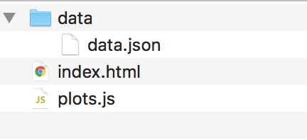

# 15.3 Plotly on the Web

## Overview

In this lesson, students will learn how to use Plotly to create advanced dynamic charts. They will also learn to deploy a custom dashboard.

## Class Objectives

By the end of class, students will be able to:

* Use switch statements to direct control flow in JavaScript.
* Create advanced dynamic charts, such as candlestick charts.
* Create and deploy custom dashboards.

## Instructor Prep

<details>
  <summary><strong>Instructor Notes</strong></summary>

* You may find that this lesson falls on a weekday due to a holiday shifting the course schedule. In this case, we have provided notes within the LP that will allow you to **easily adjust the length of the lesson to fit into a weekday class**.

  * Be on the lookout for a ⏰**3-Hour Adjustment** note at the top of activities in this Lesson Plan. If this class is being taught on a weekday, please utilize the directions found in the note. Keep in mind that breaks will be reduced from 40 minutes to the typical 15 minutes for a weekday class as well.

  * Shortening these activities could potentially limit the students' ability to finish them, so please remind them to utilize office hours to clear up any questions they may have.

* Please reference our [Student FAQ](../../../05-Instructor-Resources/README.md#unit-15-interactive-visualizations-and-dashboards) for answers to questions frequently asked by students of this program. If you have any recommendations for additional questions, feel free to log an issue or a pull request with your desired additions.

* In today's class, students will learn how to use switch statements, create advanced time series charts, and deploy Plotly dashboards on the web.

* As in previous classes this week, they will continue to fortify their JavaScript skills as they work with switch statements and API calls. Continue to focus on helping students with these generalizable skills.

</details>

<details>
  <summary><strong>Sample Class Video</strong></summary>

* To view an example class lecture visit (Note video may not reflect latest lesson plan): [Class Video](https://codingbootcamp.hosted.panopto.com/Panopto/Pages/Viewer.aspx?id=9e526bbc-9906-44f7-8adc-aa5b003ed02b)

</details>

- - -

# Class Activities

## 1. Welcome & Switch Statements

| Activity Time:       0:25 |  Elapsed Time:      0:25  |
|---------------------------|---------------------------|

<details>
  <summary><strong>📣 1.1 Instructor Do: Welcome and Goals Review (5 mins)</strong></summary>

* Welcome students to class. Reassure them that JavaScript will become easier with practice, and that this class will give them a lot of opportunities to do just that.

* Open the [slideshow](https://docs.google.com/presentation/d/1B3QouokhC6x4DIvhuzBG7jiUExolgjFRQwWkcdGUBAQ) and review today's goals:

  * Use switch statements.

  * Use Plotly to create dynamic charts.

  * Create time series analysis visualizations.

  * Create and deploy custom dashboards.

</details>

<details>
  <summary><strong>📣 1.2 Instructor Do: Switch Statements (20 mins)</strong></summary>

* ⏰**3-Hour Adjustment**: Reduce activity time to 15 minutes.

* **Files:**

  * [index.html](Activities/01-Ins_Switch/Solved/index.html)

  * [script.js](Activities/01-Ins_Switch/Solved/script.js)

  * [script2.js](Activities/01-Ins_Switch/Solved/script2.js)

* Remind students that, in previous lessons, we have used `if/else/elseif` statements to perform actions based on binary conditions.

* Explain that the switch statement offers a way to deal with multiple conditions. Open `script.js` and go over the code:

  ```js
  function chooseFriend(friend) {
      switch(friend) {
        case "Mickey":
          console.log("I am a very famous mouse!");
          break;
        case "Donald":
          console.log("I am a very famous duck!");
          break;
        case "Goofy":
          console.log("I am a very famous dog!");
          break;
        default:
          console.log("Did you forget to choose a friend?");
      }
  }
  ```

  * In this case, the switch statement is wrapped inside a function.

  * The keyword `switch` takes an argument and is followed by a code block enclosed in curly braces. Its argument here is `friend`.

  * The `case` clauses here account for three possibilities: that the `friend` is one of Mickey, Donald, and Goofy.

  * There is also a `default` clause. If the argument is not accounted for by the `case` clauses, the default executes.

  * The `break` keyword signifies a stop of code execution and exit out of the code block.

    * For example, if `"Mickey"` is passed on as the argument to the `chooseFriend()` function, "I am a very famous mouse!" is printed to the console. Instead of printing the next statement, JavaScript exits the current code block.

    * Without `break`, the next line of executable code will be executed.

* To illustrate this point about `break`, comment out the first occurrence of the `break` keyword in `script.js` and refresh the browser: "I am a very famous mouse!" and "I am a very famous duck!" should now print to the console.

* Explain that while the switch statement does not exist in Python, other languages such as JavaScript and SQL do have it.

* Before moving on, summarize the main points of the demo:

  * The switch statement allows a more elegant way to create conditions than does the if/else statement.

  * `switch` takes an argument, and `case` clauses determine what to do.

  * `break` exits the code block.

* Next, explain that switch statements can be used to assign data to a variable, which is then used outside of the switch statement. Open `switch2.js` and go over the code:

  ```javascript
  function chooseFriend(friend) {
    var message = "";
    switch(friend) {
      case "Mickey":
        message = "I am a very famous mouse!";
        break;
      case "Donald":
        message = "I am a very famous duck!";
        break;
      case "Goofy":
        message = "I am a very famous dog!";
        break;
      default:
        message = "Did you forget to choose a friend?";
    }
    console.log(message);
  }
  ```

* Answer any questions before moving on.

</details>

<sub>[Having issues with this activity? Report a bug!](https://form.jotform.com/93104673884161?activityTitle=1.%20Switch%20Statements&lessonTitle=Plotly%20and%20Beyond&lessonNumber=15.3)</sub>

- - -

## 2. The Thrill of the Case

| Activity Time:       0:35 |  Elapsed Time:      1:00  |
|---------------------------|---------------------------|

<details>
  <summary><strong>✏️ 2.1 Student Do: The Thrill of the Case (25 mins)</strong></summary>

* ⏰**3-Hour Adjustment**: Reduce activity time to 20 minutes.

In this activity, students will work with switch statements.

* **File:** [02-Stu_Switch/Unsolved](Activities/02-Stu_Switch/Unsolved)

* **Instructions:** [README.md](Activities/02-Stu_Switch/README.md)

* **Option A:** [switch.js](Activities/02-Stu_Switch/Unsolved/switch.js)

* **Option B:** [plot.js](Activities/02-Stu_Switch/Unsolved/plots.js)

</details>

<details>
  <summary><strong>⭐ 2.2 Review: The Thrill of the Case (10 mins)</strong></summary>

* **File:** [Activities/02-Stu_Switch/Solved](Activities/02-Stu_Switch/Solved)

* Open `switch.js` and explain the solution to the first part of the activity.

  ```js
  function chooseLetter(letter) {
      switch(letter) {
        case "A":
          console.log(1);
          break;
        case "B":
          console.log(2);
          break;
        case "C":
          console.log(3);
          break;
        case "D":
          console.log(4);
          break;
        case "E":
          console.log(5);
          break;
        default:
          console.log(0);
          break;
      }
  }
  ```

  * The switch statement is enclosed within a function that takes a letter as its argument.

  * The argument is passed into the switch statement as its argument.

  * In the case that the letter is "A," the integer `1` is printed to the console. Then `break` stops code execution and exits the code block.

  * If the argument is not one of the five uppercase letters, `0` is printed to the console.

* Next, open `index.html` in the browser and demonstrate the working solution.

  

* Open `index.html` with a code editor and explain the code:

  ```html
  <select id="selDataset">
      <option value="dataset1">DataSet1</option>
      <option value="dataset2">DataSet2</option>
      <option value="dataset3">DataSet3</option>
  </select>
  ```

  * This is a dropdown menu with an `id` of `selDataset`.

  * Three menu items are created, each with a `value` that can be extracted when it is selected.

* Next, open `plots.js` with a code editor and explain the code. This function displays a default plot on the page.

  ```js
  function init() {
      data = [{
        x: [1, 2, 3, 4, 5],
        y: [1, 2, 4, 8, 16] }];

      var CHART = d3.selectAll("#plot").node();

      Plotly.newPlot(CHART, data);
  }
  ```

* Walk through the rest of the code:

  ```js
  function updatePlotly() {
      var dropdownMenu = d3.select("#selDataset");
      var dataset = dropdownMenu.node().value;

      var CHART = d3.selectAll("#plot").node();

      var x = [];
      var y = [];

      switch(dataset) {
        case "dataset1":
        x = [1, 2, 3, 4, 5];
        y = [1, 2, 4, 8, 16];
        break;

      case "dataset2":
        x = [10, 20, 30, 40, 50];
        y = [1, 10, 100, 1000, 10000];
        break;

      case "dataset3":
        x = [100, 200, 300, 400, 500];
        y = [10, 100, 50, 10, 0];
        break;

      default:
        x = [1, 2, 3, 4, 5];
        y = [1, 2, 3, 4, 5];
        break;
    }

    Plotly.restyle(CHART, "x", [x]);
    Plotly.restyle(CHART, "y", [y]);
  }
  ```

  * `var dropdownMenu = d3.select("#selDataset");` assigns the dropdown menu to a variable.

  * When a dropdown menu item is selected, its `value` becomes assigned to the variable `dataset`.

  * `CHART` is the HTML `div` that holds the chart.

  * Empty arrays are initialized for `x` and `y` values.

  * The switch statement takes the `dataset` (the dropdown menu item) as its argument. Depending on the `value`, one of three pairs of arrays gets assigned to `x` and `y`.

  * `Plotly.restyle()` re-renders the chart with the updated data.

</details>

<sub>[Having issues with this activity? Report a bug!](https://bit.ly/2XeGkhh)</sub>

- - -

## 3. Dynamically Selected Stocks & Candlestick Charts

| Activity Time:       0:50 |  Elapsed Time:      1:50  |
|---------------------------|---------------------------|

<details>
  <summary><strong>🎉 3.1 Everyone Do: Dynamically Selected Stocks (25 mins)</strong></summary>

* ⏰**3-Hour Adjustment**: Reduce activity time to 20 minutes.

* **Files:**

  * [index.html](Activities/03-Evr_Stocks_Dynamic/Solved/index.html)

  * [plots.js](Activities/03-Evr_Stocks_Dynamic/Solved/plots.js)

* Explain to the students that this next activity we will all code together to design a dynamic plot that reads the stock from the user form.

**Note:** Remember to replace the API key with your own. Remind students when going through this example to do the same

* Demonstrate the solved `index.html` in the browser.

* Open the solved `plots.js` in your text editor.

* Explain the overall structure of the solution:

  * `d3.select("#submit").on("click", handleSubmit);`

  * First, we attach a click handler to the `#submit` button, configuring it to execute `handleSubmit` whenever a user clicks on it.

* Explain the code in `handleSubmit()`.

  ```js
  function handleSubmit() {
      d3.event.preventDefault();
      var stock = d3.select("#stockInput").node().value;
      d3.select("#stockInput").node().value = "";
      buildPlot(stock);
  }
  ```

  When called, it:

  * Calls `preventDefault` to prevent the page from reloading.

  * Collects the user's selected stock from the form.

  * Clears the form by resetting the input's `value` attribute to the empty string.

  * Calls `buildPlot` with the user's selected `stock` ticker.

* Open the console and explain the data that needs to be extracted:

  

  

  The columns of interest are those listing the date and the closing price, the **first and fifth** values in each row of data.

* Explain that to create arrays of the dates and closing prices, `map()` can be used on the JSON response:

  ```js
  var dates = data.dataset.data.map(row => row[0]);
  var closingPrices = data.dataset.data.map(row => row[4]);
  ```

  * `data.dataset.data` returns an array of arrays, each of which is data for a single data.

  * `map()` can be used to extract the item at a given position from each array.

</details>

<details>
  <summary><strong>🎉 3.2 Everyone Do: Candlestick Charts (25 mins)</strong></summary>

* ⏰**3-Hour Adjustment**: Reduce activity time to 20 minutes.

* **Files:**

  * [index.html](Activities/04-Evr_Stocks_CandleStick/Solved/index.html)

  * [plots.js](Activities/04-Evr_Stocks_CandleStick/Solved/plots.js)

* Demonstrate the solved [index.html](Activities/04-Evr_Stocks_CandleStick/Solved/index.html) in the browser.

  **Note:** Remember to replace the API key with your own.

* Point out that this chart displays the time series of closing price data, as well as a series of "candles" representing additional data for each day.

  

  * The top and bottom of each candle represent the _closing_ and _opening_ prices for the stock.

  * The lower price is used to draw the bottom boundary for the candle.

  * The higher price is used to draw the upper boundary for the candle.

  * When the closing price is _higher_ than the opening price, the candle is colored red.

  * When the closing price is _lower_ than the opening price, the candle is colored orange.

  * The candle colors allow a financial analyst to determine if a stock is bearish or bullish on a given day.

  * The "wicks" outside of the candles represent the _high_ and _low_ prices for the day.

  * Candlestick charts are useful because they summarize all of the fundamental figures that describe a series of prices in a single plot. These charts are even more informative when plotted on top of the time series that generates them.

* Explain that in order to generate a candlestick chart for a given stock with Plotly, students will need to:

  * Retrieve high, low, opening, and closing prices for the stock.

  * Use these prices to define trace objects.

* Finally, open `plots.js`. Explain that, unlike in the previous activity, in this script a generalized helper function is used to map data from each row by index position:

  ```js
  function unpack(rows, index) {
      return rows.map(function(row) {
        return row[index];
      });
  }
  ```

  * A function called `unpack` takes an array of arrays, called `rows`.

  * The function creates an array in which the index value from each row (array) in `rows` is extracted.

</details>

<sub>[Having issues with this activity? Report a bug!](https://bit.ly/2UPsHDE)</sub>

- - -

## Break

| Activity Time:       0:40 |  Elapsed Time:      2:30  |
|---------------------------|---------------------------|

⏰ **3-Hour Adjustment**: Reduce break time to 15 minutes.

- - -

## 4. Stock Time Series Dashboard

| Activity Time:       0:30 |  Elapsed Time:      3:00  |
|---------------------------|---------------------------|

<details>
  <summary><strong>✏️ 4.1 Student Do: Stock Time Series Dashboard (20 mins)</strong></summary>

* ⏰**3-Hour Adjustment**: Reduce activity time to 15 minutes.

* **File:** [Activities/05-Stu_Stocks_Report/Unsolved](Activities/05-Stu_Stocks_Report/Unsolved)

* **Instructions:** [Activities/05-Stu_Stocks_Report/README.md](Activities/05-Stu_Stocks_Report/README.md)

* In this activity, students will create a dashboard of a selected company's stock prices.

</details>

<details>
  <summary><strong>⭐ 4.2 Review: Stock Time Series Dashboard (10 mins)</strong></summary>

* **Files:**

  * [Activities/05-Stu_Stocks_Report/Solved/index.html](Activities/05-Stu_Stocks_Report/Solved/index.html)

  * [Activities/05-Stu_Stocks_Report/Solved/plots.js](Activities/05-Stu_Stocks_Report/Solved/plots.js)

* Take a few moments to demonstrate the solved version.

* Call on a few students to share the dashboards they created.

</details>

<sub>[Having issues with this activity? Report a bug!](https://bit.ly/39PtBUE)</sub>

- - -

## 5. Using Python HTTP Server & Deployment to GitHub Pages

| Activity Time:       0:30 |  Elapsed Time:      3:30  |
|---------------------------|---------------------------|

<details>
  <summary><strong>📣 5.1 Instructor Do: Using the Python HTTP Server (15 mins)</strong></summary>

* **Files:**

  * [06-Ins_Python_HTTP_Server/Solved/](Activities/06-Ins_Python_HTTP_Server/Solved/)

  * [Activities/06-Ins_Python_HTTP_Server/CORS.md](Activities/06-Ins_Python_HTTP_Server/CORS.md)

* Begin by explaining that we can also read local JSON files instead of using APIs. However, we need to use a web server to make the file available to the webpage.

* Explain servers at a high level:

  * A server is a program or device that performs actions such as processing and sharing data.

  * For example, when a user logs in on a website, the server receives the user's information, compares it against information in its database, and sends it back to the user.

  * This is called a **request-response model**. The user, also known as the client, sends a request to the webpage server, which in return sends the requested data in response.

* Open `index.html` in a browser and open the console. Point out the error and explain:

  * This is a **CORS**, or **Cross-Origin Resource Sharing**, error.

    

* Explain why a browser can't read the JSON file directly:

  * Browsers, for security reasons, heavily restrict reading from, and writing to, local files.

  * If access to local files were allowed, remote sites would be allowed to read and manipulate your private data. Or simply opening a local file with the browser could trigger a malicious script.

  * Running a static server, `python -m http.server` in this case, allows us to skirt this restriction.

* Explain that Python’s HTTP server provides a web address for both the file and the HTML page and avoids security issues.

  * Students who are curious about CORS can read the [included guide](Activities/06-Ins_Python_HTTP_Server/CORS.md) for more information.

* From the [Activities/06-Ins_Python_HTTP_Server/Solved](Activities/06-Ins_Python_HTTP_Server/Solved) directory, run `python -m http.server` in your console. Navigate to `localhost:8000` to show that files are being served from the server, and no CORS error is returned.

* Emphasize that `index.html` must be at the directory where `python -m http.server` is run.

* Open `index.js` and explain:

  * D3 sends a request to the route `data/data.json`.

  ```js
  d3.json("data/data.json").then((data) => {}
  ```

  * Previously, the script returned a CORS error because it attempted to access the local JSON data without a server.

  * With a server, the data is retrieved from its own URL.

* Navigate to `localhost:8000/data/data.json` to view the JSON data that is requested.

  

* Answer any questions before moving on.

</details>

<details>
  <summary><strong>📣 5.2 Instructor Do: Deployment to GitHub Pages (15 mins)</strong></summary>

* ⏰**3-Hour Adjustment**: Reduce activity time to 10 minutes.

* **File:** [Activities/07-Ins_Github_Pages/Solved](Activities/07-Ins_Github_Pages/Solved)

* Inform students that they will deploy this week's homework to GitHub Pages.

  * The data for the homework will be in a JSON file.

  * Students will use the `d3.json()` method to fetch data from the JSON file and visualize it.

  * They will need to upload the JSON file to GitHub as well as the HTML and JavaScript script files.

* Explain the benefits of deploying a Plotly visualization with a data file.

  * It makes a data visualization available to the public that is much more visually appealing than a published Jupyter Notebook.

  * The ability to read in data from local files means that data sources aren't limited to placing API calls.

* Navigate to the Solved directory and show the Plotly project structure:

  * The data is contained in a JSON file.

  

  * Because `data.json` is an external file, the data in it cannot be pulled directly into the JavaScript file.

  * Instead, it must be fetched from a server.

* Take a moment to explain the relative path of the `data.json` file.

  * As `plotly.js` must be able to access the contents of `data.json`, it must navigate to the `data` directory, and then `data.json`.

  * In `plotly.js`, the file path is entered as the argument of the `json` method: `d3.json("data/data.json")`.

  * Previously, URLs of APIs were placed as an argument to fetch data. Now, the JSON file is accessed instead.

* Navigate to the Solved directory from the CLI and start a local server with `python -m http.server`. Then go to `localhost:8000` in your browser.

  

* In the next segment, demonstrate how to deploy an existing project to GitHub Pages. The following steps should be familiar to students but are provided below for reference.

* First, create a new repository in GitHub.

  * Go to the GitHub website and create a new repository by clicking **New**.

  

  * The repository must be made public in order to be deployed to GitHub Pages.

  

  * Clone the repository by copying the URL and entering `git clone <url>` in the CLI.

  

* Next, push the project to GitHub.

  * Navigate to the directory of the repository.

  * Copy and paste the HTML, JavaScript, and JSON files from the Solved folder into the repository.

  * `git add .`

  * `git commit -m "<your message here>"`

  * `git push origin main`

* Next, go to the project page on GitHub and click on **Settings** to configure for deployment.

  

  * Under Settings, go to GitHub Pages and select **main branch**.

  

  * Click **Save**.

* The project should now be deployed to GitHub Pages.

  

  * The URL of the deployed page is `<account name>.github.io/<project name>`.

  * The deployment should be relatively quick but may take up to several minutes.

</details>

<sub>[Having issues with this activity? Report a bug!](https://bit.ly/2XdF3XJ)</sub>

- - -

## 6. Seek and Deploy

| Activity Time:       0:30 |  Elapsed Time:      4:00  |
|---------------------------|---------------------------|

<details>
  <summary><strong>✏️ 6.1 Student Do: Seek and Deploy (20 mins)</strong></summary>

* ⏰**3-Hour Adjustment**: Reduce activity time to 15 minutes.

* **File:** [Activities/08-Stu_Github_Pages/Unsolved](Activities/08-Stu_Github_Pages/Unsolved)

* **Instructions:** [Activities/08-Stu_Github_Pages/README.md](Activities/08-Stu_Github_Pages/README.md)

* In this activity, students will deploy a Plotly project with a local data file to GitHub Pages.

  **Note:** As students work on the activity, you and your TAs should identify and help students who are struggling.

</details>

<details>
  <summary><strong>⭐ 6.2 Review: Seek and Deploy (10 mins)</strong></summary>

* Briefly walk through the steps of deployment to GitHub Pages.

  * Create a project repository in GitHub.

  * Clone the repository on the local computer.

  * Add the project files to the repository.

  * Push the changes to GitHub.

  * In the repository settings, select **main branch** under Source, and then click **Save**.

  

* If time allows, take a moment to highlight the following elements of the code.

  * In the HTML file, the D3 library is read in from a CDN:

  ```html
  <script src="https://d3js.org/d3.v5.min.js"></script>
  ```

  * In the JavaScript file, a D3 method is used to read the data from the JSON file:

  ```js
  d3.json("data/data.json").then((incomingData) => {}
  ```

  * After reading in the JSON file, its data is referred arbitrarily here as `incomingData`; however, this argument could be given any other name such as `data` or `jsonData`.

</details>

<sub>[Having issues with this activity? Report a bug!](https://bit.ly/3bX7ZaC)</sub>

- - -

© 2021 Trilogy Education Services, LLC, a 2U, Inc. brand. Confidential and Proprietary. All Rights Reserved.
