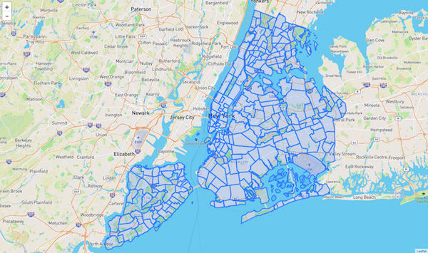
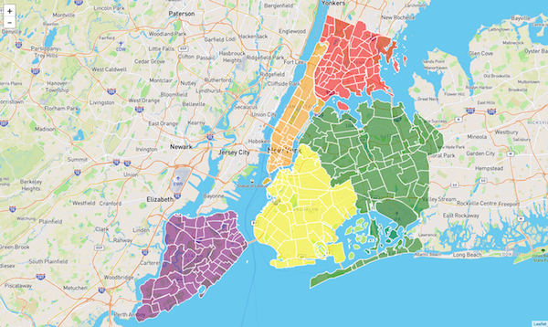
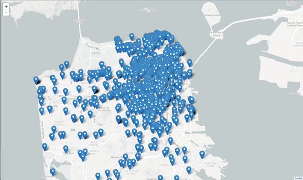
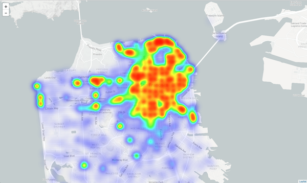
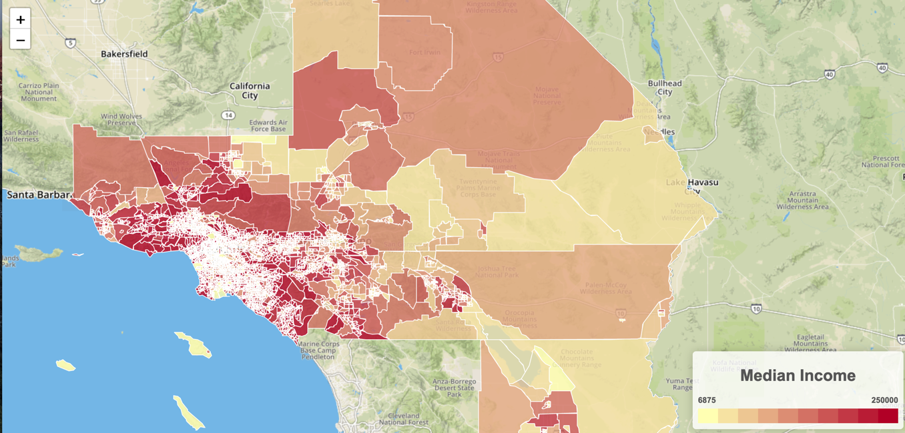

# 17.2 GeoJSON & Leaflet Plugins

## Overview

Today's class will be spent furthering our knowledge of GeoJSON and learning about the wonders of Leaflet plugins.

## Class Objectives

* Students will gain a firm grasp of mapping with GeoJSON.
* Students will learn about and practice using Leaflet plugins and third-party libraries.
* Students will learn how different maps can effectively visualize different datasets.

## Instructor Notes

<details>
    <summary><strong>Instructor Priorities</strong></summary>

* Students should have a firm grasp on advanced mapping with the GeoJSON format.
* Students should understand how to utilize third-party Leaflet plugins to visualize data.
* Students should be comfortable reading and comprehending software documentation.

</details>

<details>
    <summary><strong>Instructor Notes</strong></summary>

* Today we are going to be doing a lot of different exercises and moving fairly quickly. If you want you can allow students to work in pairs on student exercises.
* The provided code does not include a Mapbox API token, be sure to have your unique token available.
* Make sure to look over the exercises before coming to class!
* Please reference our [Student FAQ](../../../05-Instructor-Resources/README.md#unit-17-geojson-and-leaflet) for answers to questions frequently asked by students of this program. If you have any recommendations for additional questions, feel free to log an issue or a pull request with your desired additions.

</details>

<details>
    <summary><strong>Sample Class Video</strong></summary>

* To view an example class lecture visit (Note video may not reflect latest lesson plan): [Class Video](https://codingbootcamp.hosted.panopto.com/Panopto/Pages/Viewer.aspx?id=360171ef-fec5-46bd-a44f-a874001196f0)

</details>

- - -

# Class Activities

## 1. Welcome & NY Neighborhoods

| Activity Time:       0:25 |  Elapsed Time:      0:25  |
|---------------------------|---------------------------|

<details>
    <summary><strong>📣 1.1 Instructor Do: Welcome Students</strong></summary>

* Open the [slideshow](https://docs.google.com/presentation/d/1yKMtwQXSs743Bcl3WLHoCLnC2IRhJBkdSWfrT6NRrKk/edit?usp=sharing) and use slides 1 and 2 to welcome your students to class and address any lingering questions they may have from last time. Also take this opportunity to give your students an overview of what today's class has in store for them.

* Today we will be continuing our discussion on GeoJSON and learning how to extend the functionality of Leaflet with third-party plugins!

</details>

<details>
    <summary><strong>📣 1.2 Instructor Do: GeoJSON Review (0:05)</strong></summary>

* Open the [slideshow](https://docs.google.com/presentation/d/1yKMtwQXSs743Bcl3WLHoCLnC2IRhJBkdSWfrT6NRrKk/edit?usp=sharing) and use slides 3 - 5 to assist you with this review.

* Also, open up the [earthquake example from last class](http://earthquake.usgs.gov/earthquakes/feed/v1.0/summary/all_hour.geojson)

  * Once again, note that this link show us all of the earthquakes that have transpired during the past hour all across the globe.

  * Reiterate that the GeoJSON contains an array of `features` that contain both geographic data (geometry) and descriptive information (properties). In this case, each earthquake is a feature. In addition to the geographical data of where it occurred, we can also see the time, magnitude, and other sorts of information on each earthquake.

</details>

<details>
    <summary><strong>🎉 1.3 Everyone Do: NY Neighborhoods (0:20)</strong></summary>

* Next we will be diving right into an example that uses some advanced Leaflet/GeoJSON functionality.

* Open the [slideshow](https://docs.google.com/presentation/d/1yKMtwQXSs743Bcl3WLHoCLnC2IRhJBkdSWfrT6NRrKk/edit?usp=sharing) and use slides 6 - 11 to go over this lesson with the class.

* We are going to be building a map of New York City broken down by boroughs and neighborhoods. Students will first make a basic map of the data, and then we will learn to spice it up as a class.


(NYC Boroughs & Neighborhoods - Basic)

**NOTE: There are 4 different JavaScript files you will be working with. Simply switch your HTML file to use a different logic.js file to access the different steps.**

* First, we are going to be grabbing our data using D3 like we had during the last class. Our data can be found on NYC community data site: [BetaNYC](http://data.beta.nyc/dataset/pediacities-nyc-neighborhoods).

  * A direct link to the data can be found [here](http://data.beta.nyc//dataset/0ff93d2d-90ba-457c-9f7e-39e47bf2ac5f/resource/35dd04fb-81b3-479b-a074-a27a37888ce7/download/d085e2f8d0b54d4590b1e7d1f35594c1pediacitiesnycneighborhoods.geojson).

  * Note that just like last example, we have an array of features. Each feature is an object that contains properties (in this case neighborhood information) and geometry (where it fits on the map).

* **Note:** If the website is down use the `nyc.geojson` file. To do so run the following steps:

  * Make sure the link to data.beta.nyc in all the `logic.js` files is commented out.

  ```js
  // If data.beta.nyc is down comment out this link
  // var link = "http://data.beta.nyc//dataset/0ff93d2d-90ba-457c-9f7e-39e47bf2ac5f/resource/" +
  // "35dd04fb-81b3-479b-a074-a27a37888ce7/download/d085e2f8d0b54d4590b1e7d1f35594c1pediacitiesnycneighborhoods.geojson";
  ```

  * Make sure the link to the local file is un-commented.

  ```js
  // Uncomment this link local geojson for when data.beta.nyc is down
  var link = "static/data/nyc.geojson";
  ```

  * Run `python -m http.server` in the folder where your `index.html` file is located.

* So now we have our map! It's not terribly descriptive, however, so lets add some custom styling.

  * Open up the logic for the next version of the map in [logic2.js](./Activities/01-Evr_BasicNYCBoroughs/Solved/static/js/logic2.js) and then take a look at the code.

  * Features can be styled just like paths from earlier. We can change their border, fill, color, opacity, etc. We are setting the style by passing in a style object. Take a moment to change the style up a bit.

* There is, however, another way to set the style of a feature, so open up the next version of the map logic in [logic3.js](./Activities/01-Evr_BasicNYCBoroughs/Solved/static/js/logic3.js).

  * In this version, we are passing in a function that can style individual features based on their properties.

  * If we look back at the GeoJSON we can see that each feature has the `borough` property, which can be accessed through `feature.properties.borough`

  * We have written a function that uses a `switch` statement to return a different color based upon the borough that the neighborhood belongs to.

  * Each feature is styled using this function, so all of our boroughs will be color coded!


(NYC Boroughs & Neighborhoods - Completed)

* The last step in completing our map will be to add some interaction. Specifically, we will be adding mouse events using the `onEachFeature` option. You can find the code including this option in [logic4.js](./Activities/01-Evr_BasicNYCBoroughs/Solved/static/js/logic4.js).

  * `onEachFeature` will call the provided function on every feature--essentially looping through all of the neighborhoods. This is useful because we want to bind some mouse events to all of our neighborhoods.

  * First we want to bind a pop-up so that, when we click on a neighborhood, we can see its name and which borough it belongs to.

  * We also have access to a number of events we can subscribe to. We are going to set events to trigger on mouseover, mouseout, and click. On mouseover and mouseout we want to change the opacity of the feature so that it has a nice highlight effect.

  * Our click function calls the `fitBounds()` function on our clicked feature.

* Check with your students to see if there are any questions. Answer them all to the best of your ability before moving on.

</details>

<sub>[Having issues with this activity? Report a bug!](https://bit.ly/2XjYPAD)</sub>

- - -

## 2. Intro to Plugins

| Activity Time:       0:15 |  Elapsed Time:      0:40  |
|---------------------------|---------------------------|

<details>
    <summary><strong>🎉 2.1 Everyone Do - Intro to Plugins: Heat Map of Crime in San Francisco (0:15)</strong></summary>

* Open the [slideshow](https://docs.google.com/presentation/d/1yKMtwQXSs743Bcl3WLHoCLnC2IRhJBkdSWfrT6NRrKk/edit?usp=sharing) and use slides 12 and 13 to live code this activity.

* Leaflet is designed to be a very light-weight and fast library and it only focuses on a core set of features. Through the use of plugins, however, we can give additional functionality to Leaflet.

  * Plugins are third-party libraries that integrate with Leaflet to give it additional features. We can create heat maps, map our data as a function of time, and so much more!

* Point students to the [Leaflet plugins section](http://Leafletjs.com/plugins.html) and let them spend a few minutes looking at the different possibilities plugins can offer.

* Our next activity as a class is going to focus on plotting some basic data with vanilla Leaflet and then adding a third-party plugin to make a really cool (and insightful) map!

  * You can find all of the solved files for this activity in [Solved](./Activities/02-Evr_CrimeHeatmap/Solved), but try to do your best in coding out this activity live.

* In this exercise we will be visualizing historical crime data in SF. All of this information and more is available at [San Francisco's open data site](https://data.sfgov.org/).

  * Our specific dataset can be found [HERE](https://data.sfgov.org/Public-Safety/Police-Department-Incident-Reports-Historical-2003/tmnf-yvry). Send this link out and make sure your class is following along with you!

  * Click `API` and the API endpoint will be revealed.

  * It's worth noting that, although we are using JSON, the data can be exported into other formats, such as CSV and XML. Today, however, we will only be using JSON.

* The next step is to use D3 to grab and then plot this data.


(Crime in San Francisco - Vanilla Markers)

* Now it is time to add in our plugin! For this activity we will be using [Leaflet.Heat](https://github.com/Leaflet/Leaflet.heat) to make a heat map. Send this link to your students, or have them find it on the plugin page.

  * As stated in the documentation, all we have to do to use the Leaflet.heat plugin is download the `Leaflet.heat.js` file and link to it in our project's HTML file.

  * The documentation tells us that we will need to create a new type of layer, a `heatLayer`, and feed it an array of points. It might be a good idea ask the students how to implement this plugin by looking at its repository. Reading and parsing documentation is an important skill for any developer!

  * Instead of adding a marker to the map, we will loop through the data and push it to an array. We will feed that array of points into the `heatLayer`, along with some options, and then add it to the map.

  * In the finished file, we have made some additional changes by modifying the `radius` and `blur` while also upping the record count to 10,000! According to the documentation, what other options could we have modified?


(Heat map of Crime in San Francisco)

* Check with your students to see if there are any questions. Answer them all to the best of your ability before moving on.

</details>

<sub>[Having issues with this activity? Report a bug!](https://bit.ly/2V9Pdpz)</sub>

- - -

## 3. Rat Cluster

| Activity Time:       0:40 |  Elapsed Time:      1:20  |
|---------------------------|---------------------------|

<details>
    <summary><strong>✏️ 3.1 Students Do: Rat Cluster (0:30)</strong></summary>

* Open the [slideshow](https://docs.google.com/presentation/d/1yKMtwQXSs743Bcl3WLHoCLnC2IRhJBkdSWfrT6NRrKk/edit?usp=sharing) and use slides 14 and 15 to present this activity to the class.

* In this next activity, students will be flying solo. They will be taking data from NYC open data website ([NYC Open Data](https://data.cityofnewyork.us/)) and plotting it with the help of a Leaflet plugin. Feel free to let them work in pairs, as this can be a challenging topic.

  * You may also wish to spend a few minutes demonstrating how to build a URL on the NYC Open Data website with desired endpoints.

* **Files:**

  * [Unsolved](./Activities/03-Stu_MarkerClusters/Unsolved)

* **Instructions:**

  * [README](./Activities/03-Stu_MarkerClusters/README.md)

</details>

<details>
    <summary><strong>⭐ 3.2 Review: Rat Cluster Activity (0:10)</strong></summary>

* Open the [slideshow](https://docs.google.com/presentation/d/1yKMtwQXSs743Bcl3WLHoCLnC2IRhJBkdSWfrT6NRrKk/edit?usp=sharing) and use slide 16 while reviewing the activity with the class.

* Send out the [solution files](./Activities/03-Stu_MarkerClusters/Solved) to the class and review the previous activity, making sure to answer any questions that your class may have.

</details>

<sub>[Having issues with this activity? Report a bug!](https://bit.ly/3e6oaUH)</sub>

- - -

## Break

| Activity Time:       0:15 |  Elapsed Time:      1:35  |
|---------------------------|---------------------------|

- - -

## 4. Choropleth

| Activity Time:       0:40 |  Elapsed Time:      2:15  |
|---------------------------|---------------------------|

<details>
    <summary><strong>👥 4.1 Partners Do: Choropleth (0:30)</strong></summary>

* Open the [slideshow](https://docs.google.com/presentation/d/1yKMtwQXSs743Bcl3WLHoCLnC2IRhJBkdSWfrT6NRrKk/edit?usp=sharing) and use slides 18 - 20 to present this activity to the class.


(Median Income Choropleth)

* In this activity, the class will be working together with their partners to create a choropleth map that will visualize the median household incomes of LA and surrounding counties.

  * Since we have yet to go over choropleth's as a class, this activity will take place over a series of "steps" and the class will rejoin after each step to review what they have done before moving on.

* **Files:**

  * [Unsolved](./Activities/04-Par_MoneyChoropleth/Unsolved)

* **Instructions:**

  * [README](./Activities/04-Par_MoneyChoropleth/README.md)

</details>

<details>
    <summary><strong>⭐ 4.2 Review: Choropleth Activity (0:10)</strong></summary>

* Open the [slideshow](https://docs.google.com/presentation/d/1yKMtwQXSs743Bcl3WLHoCLnC2IRhJBkdSWfrT6NRrKk/edit?usp=sharing) and use slide 21 while reviewing the activity with the class.

* Send out the [solution](Activities/04-Par_MoneyChoropleth/Solved) to the class and review the previous activity, making sure to answer any questions that your class may have.

  * Make especially certain to go over the creation of the legend.

</details>

<sub>[Having issues with this activity? Report a bug!](https://bit.ly/2VevNQk)</sub>

- - -

## 5. A Map of Your Very Own

| Activity Time:       0:45 |  Elapsed Time:      3:00  |
|---------------------------|---------------------------|

<details>
    <summary><strong>✏️ 5.1 Groups Do: A Map of Your Very Own (0:30)</strong></summary>

* Open the [slideshow](https://docs.google.com/presentation/d/1yKMtwQXSs743Bcl3WLHoCLnC2IRhJBkdSWfrT6NRrKk/edit?usp=sharing) and use slide 22 to present this activity to the class.

* Have students get into small groups. They will create a map of their very own from scratch. They will find a dataset, map it, then use a new plugin to visualize the data in an interesting way.

* Tell them that they will share their map with the class and give a VERY brief presentation on it at the end of the day.

  * The focus of this assignment is on getting a working map, however, so also let them know that the presentations are wholly secondary to making something cool.

</details>

<details>
    <summary><strong>🎉 5.2 Everyone Do: Mini-Presentations on Maps (0:15)</strong></summary>

* Open the [slideshow](https://docs.google.com/presentation/d/1yKMtwQXSs743Bcl3WLHoCLnC2IRhJBkdSWfrT6NRrKk/edit?usp=sharing) and use slide 23 while the class perform their mini-presentations.

* Bring the class back together and then call up groups one at a time to present their newest map to the class. Have them explain how they made the map in basic detail and answer whatever questions that may come up during the presentations.

</details>

<sub>[Having issues with this activity? Report a bug!](https://bit.ly/2yLaqPj)</sub>

- - -

© 2021 Trilogy Education Services, LLC, a 2U, Inc. brand. Confidential and Proprietary. All Rights Reserved.
