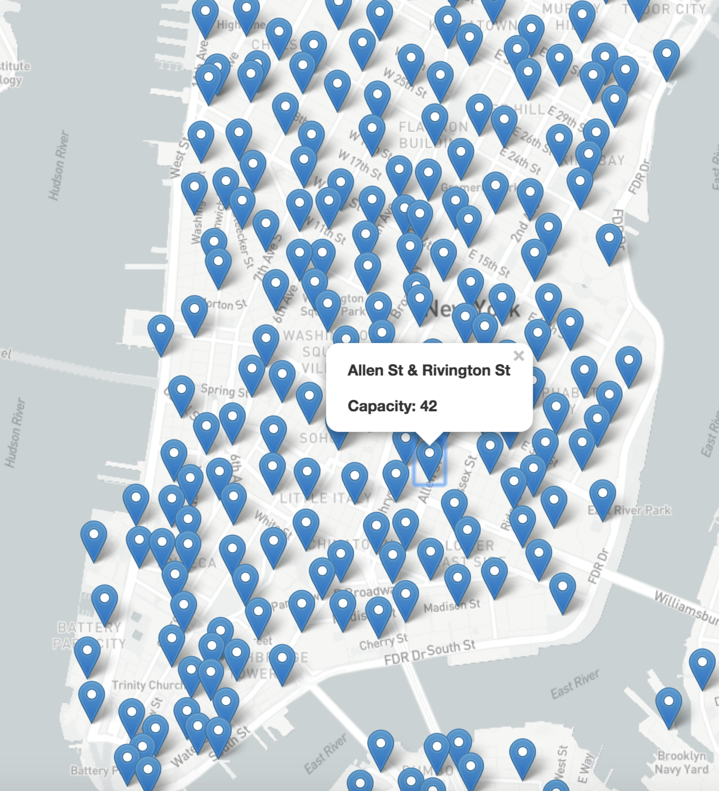
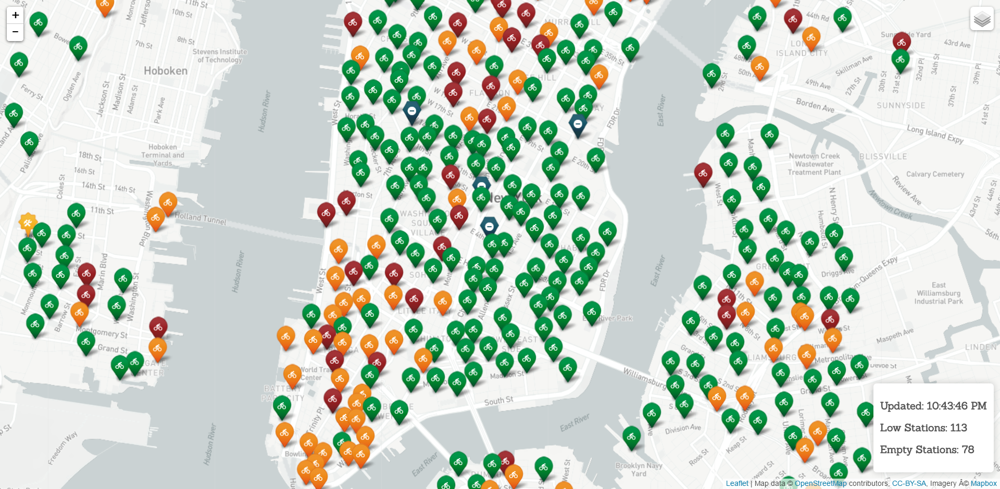

# 17.3 Citi Bike Leaflet and Introduction to Projects

## Overview

In this class, students will further develop their Leaflet skills by working on a mini-project in which they will map Citi Bike data. The remainder of the class will be used to assign students to project groups and draft project 2 proposals.

## Class Objectives

* Students will gain a Leaflet mastery by completing an in-class project.
* Form project 2 teams and draft project 2 proposals.

## Instructor Prep

    
<strong>Instructor Priorities</strong>

* Students should have the time to further develop their Leaflet skills by creating a map of all of the Citi Bike Stations in New York.

    
<strong>Instructor Notes</strong>

* Your project week may have been shifted due to a holiday. This means that students will have less time to work on projects today.

  * It may be helpful to remind students that there are office hours before and after class that may be used for extended project work.

  * Alternatively they may coordinate with team members to work on their projects outside of class.

* At the start of class you will be reintroducing students to the Career Services support that is available to them during their job search. If possible, take a moment to go through the [short slideshow](https://docs.google.com/presentation/d/18inCMR9TB47q3yEY-YflqA-96cBqXheM9X0BrD0Gk9Y/edit#slide=id.p7) at the start of class.

* A large portion of time during the beginning of class is dedicated to students working on a Leaflet project. During that time, make sure TAs and yourself are walking around offering assistance to students who are stuck.

* Be sure to keep your unique Mapbox API token nearby; the provided code does not include an active token for today's activity.

* The final part of today's class will be used to form project 2 groups and draft the project 2 proposals. This will be a great chance for students to finalize any last minutes questions before they start projects.

* Please reference our [Student FAQ](../../../05-Instructor-Resources/README.md#unit-17-geojson-and-leaflet) for answers to questions frequently asked by students of this program. If you have any recommendations for additional questions, feel free to log an issue or a pull request with your desired additions.

    
<strong>Sample Class Video</strong>

* To view an example class lecture visit (Note video may not reflect latest lesson plan): [Class Video](https://codingbootcamp.hosted.panopto.com/Panopto/Pages/Viewer.aspx?id=a954dd44-5a1f-4d2b-ad6e-a87500f73c41)

- - -

# Class Activities

## 1. Welcome & Citi Bike

| Activity Time:       1:10 |  Elapsed Time:      1:10  |
|---------------------------|---------------------------|

    
<strong>📣 1.1 Instructor Do: Welcome Class and Reintroduce Career Services (15 mins)</strong>

* Welcome the class and ask them to raise their hand if they are actively engaged in or intend to engage in a job search by the end of the program.

* Open the [slideshow](https://docs.google.com/presentation/d/1ghcXr2lt8-YJpmAhB-5bRH89hnDmh70lUkuOD-DC6jk/edit?usp=sharing) and use slides 1 and 2 while welcoming the class and slides 3 - 9 to cover career services.

* Remind the class that, now that they are over two-thirds of the way through the program, this is a great time to start thinking about their job search and engaging with the many Career Services options provided as part of the program.

* If there are any questions, advise students to reach out to their Student Success Manager.

    
<strong>📣 1.2 Instructor Do: Introduce Citi Bike (10 mins)</strong>

* Open the [slideshow](https://docs.google.com/presentation/d/1ghcXr2lt8-YJpmAhB-5bRH89hnDmh70lUkuOD-DC6jk/edit?usp=sharing) and use slides 10 - 12 to go over this lesson with the class.

* Inform students that they'll be utilizing the Citi Bike API to create a Leaflet map displaying locations of Citi Bike Stations in New York. There are two versions of the activity, a basic version and a more advanced version, which will require two datasets from separate Citi Bike API endpoints. At a minimum, students should work to complete a basic version.

* Open the [Stu_Citi_Bike_Basic_Solved](Activities/01-Stu_CitiBike_Leaflet/Solved/Basic/index.html) then in terminal run `python -m http.server` and navigate to [http://127.0.0.1:8000/](http://127.0.0.1:8000/) in the browser to show students the basic version of the map made using only the first dataset.

  

  * Point out the following:

    1. Each marker is placed at the latitude and longitude returned by the request.

    2. When a marker is clicked, a popup appears displaying the station name and capacity.

* Take a moment to show students the response given back by the [Citi Bike API Station Information Endpoint](https://gbfs.citibikenyc.com/gbfs/en/station_information.json) used to create this map. Be sure to mention the following:

  1. This data is **not** GeoJSON because it doesn't include any features.

  2. This response does, however, include the longitude and latitude for each bike station, which is what we'll use to place our markers.

  3. The response also includes other useful information, such as the `name`, `station_id`, and `capacity` of each bike station.

  4. Go back and forth between this data and the map to illustrate how the returned data is being used.

* After answering any questions about the basic version of the map, shut down the server, open up [Stu_Citi_Bike_Adanced_Solved](Activities/01-Stu_CitiBike_Leaflet/Solved/Advanced/index.html) and restart the server with `python -m http.server`. Navigate to to [http://127.0.0.1:8000/](http://127.0.0.1:8000/) and show the class the advanced version of the map they will be working towards. Be sure to highlight the following functionality:

  1. This solution groups markers into layers according to station status, e.g. "Out of Order", "Coming Soon", or "Empty".

  2. Using a Leaflet plugin, different custom markers are used for each status group.

  3. Similar to the first example, when a marker is clicked, a popup appears. Additionally, we see the number of bikes available at each station along with the station name and total capacity.

  4. This version of the activity uses a map legend to display quantities of markers of each status, as well as their colors and the last time the API was updated.

  5. Stress that students complete the basic version of the activity before moving on to this more advanced version.

  

* Remind students that they'll need to perform a second API call in order to obtain all of the data needed to build this advanced map. The first was the [Citi Bike API Station Information Endpoint](https://gbfs.citibikenyc.com/gbfs/en/station_information.json), which we demonstrated with the basic map.

* Now show students the response given back by the [Citi Bike API Station Status Endpoint](https://gbfs.citibikenyc.com/gbfs/en/station_status.json). Be sure to highlight the following:

  1. This endpoint provides information about the status of each bike station, including the number of bikes available and whether or not the station is currently installed and renting bikes.

  2. This endpoint does not, however, provide coordinates for each bike station. This must still be obtained from the first endpoint we discussed, the [Citi Bike API Station Information Endpoint](https://gbfs.citibikenyc.com/gbfs/en/station_information.json).

  3. The stations in both API responses have corresponding `station_id` properties. This should make it easier to match up and utilize data in both datasets.

* Students are encouraged to get creative with this activity. This could mean using a different type of base map or using vector layers instead of markers.

* Explain that all of these instructions as well as additional suggestions in [Stu_Citi_Bike_Unsolved](Activities/01-Stu_CitiBike_Leaflet/Unsolved).

* Remind students that they will need their unique Mapbox API Tokens for this activity.

    
<strong>✏️ 1.3 Groups Do: Citi Bike (30 mins)</strong>

* Open the [slideshow](https://docs.google.com/presentation/d/1ghcXr2lt8-YJpmAhB-5bRH89hnDmh70lUkuOD-DC6jk/edit?usp=sharing) and use slides 13 - 16 to present this activity to the class.

* In this activity, students will be working with the Citi Bike API in groups to build a map of all the Citi Bike Stations and their statuses.

* **Instructions:** [README](Activities/01-Stu_CitiBike_Leaflet/README.md)

    
<strong>⭐ 1.4 Review: Citi Bike (15 mins)</strong>

* Open the [slideshow](https://docs.google.com/presentation/d/1ghcXr2lt8-YJpmAhB-5bRH89hnDmh70lUkuOD-DC6jk/edit?usp=sharing) and leave slide 17 open while reviewing the activity.

* Send out [Stu_Citi_Bike_Solved](Activities/01-Stu_CitiBike_Leaflet/Solved) and go over the solutions as a class.

* Let students know that this was an ambitious project to attempt to fully complete in the allotted time, but would have been good practice with Leaflet and traversing data structures with JavaScript. Encourage them to continue working on it outside of class, if they have not already finished, as it would make for an impressive addition to their portfolios.

* Answer any further questions about the solution.

[Having issues with this activity? Report a bug!](https://bit.ly/3aRRHQ9)

- - -

## Break

| Activity Time:       0:40 |  Elapsed Time:      1:50  |
|---------------------------|---------------------------|

⏰ **3-Hour Adjustment**: Break will be 15 minutes.

- - -

## 2. Intro to Project 2

| Activity Time:       2:10 |  Elapsed Time:      4:00  |
|---------------------------|---------------------------|

    
<strong>📣 2.1 Instructor Do: Introduce Project 2 (10 mins)</strong>

* **Files:**

* Open the [slideshow](https://docs.google.com/presentation/d/1ghcXr2lt8-YJpmAhB-5bRH89hnDmh70lUkuOD-DC6jk/edit?usp=sharing) and use slides 19 - 27 to present the guidelines of the project. 

    
<strong>🎉 2.2 Everyone Do: Project 2 Teams and Proposals (2:00)</strong>

* ⏰**3-Hour Adjustment**: If today's class is on a weekday, reduce the project work time to **1 hour and 25 minutes**.

* Open the [slideshow](https://docs.google.com/presentation/d/1ghcXr2lt8-YJpmAhB-5bRH89hnDmh70lUkuOD-DC6jk/edit?usp=sharing) and leave slide 28 open. The remainder of the class will be used to assign project 2 teams of 4 students and allow students to brainstorm and draft their project 2 proposals.

- - -

© 2021 Trilogy Education Services, LLC, a 2U, Inc. brand. Confidential and Proprietary. All Rights Reserved.
