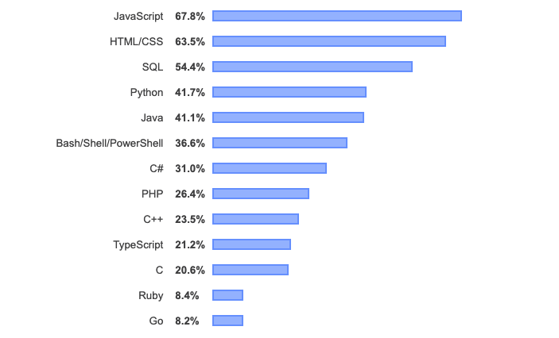
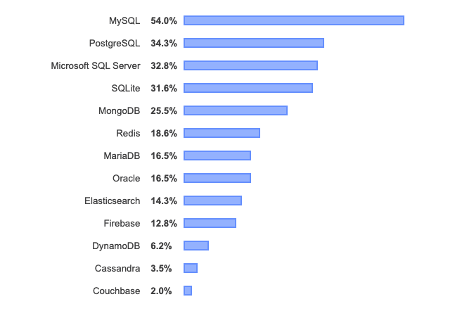

# Career Connection

Welcome to another weekly dose of Career Services material! This week you tackled structured query language, or SQL for short.

> Some people will read SQL as "ess-queue-el" and others say "sequel." You'll hear both, and both are completely valid.

Depending on your current work or what you were doing before boot camp, this may or may not have been your first exposure to SQL. If it was, it can be a little overwhelming, especially the setup. SQL has the tendency to bring about a lot of errors during its inaugural setup, especially on Windows machines, but once you've got it working, learning the power of structured query language is immensely useful.

## Flavors of SQL

If you go ahead and drop "SQL developer" into an Indeed.com search, you'll find that PostgreSQL is not the only type of SQL out there. In fact, you will likely come across the following terms:

- MySQL
- Microsoft SQL Server / MSSQL
- PostgreSQL
- MariaDB

This list is by no means exhaustive, there are many other types, but here's the takeaway:

**It does not matter.**

The various types of SQL are not all that different from each other; if you concentrate on fully understanding the concepts of PostgreSQL such as reading, writing, deleting and updating data, and creating joins and relationships between data, then you'll be set to interview for any position requiring any kind of SQL flavored database.

## Look to the Future

So now that we've got the whole "oh my goodness, there's so many different versions of SQL out there, how am I going to learn them all?" thing out of the way, let's take a look at some real-life business use-cases for a SQL database and why companies like to use it.

In the [2019 Stack Overflow](https://insights.stackoverflow.com/survey/2019) developer survey, SQL was ranked the 3rd most popular language used by developers:

But note that the two that beat out SQL were a) JavaScript and b) HTML/CSS which serve completely different use-cases. Trying to vote "language popularity" between these and SQL is really like trying to compare apples and oranges—they do completely different things. Think of SQL vs. Python—extremely different right?

With that in mind, we are free and clear to say that SQL is by far the most popular databasing language that you can learn (and yes, there are others)!

Additionally, looking at the survey responses on flavors of SQL, PostgreSQL is right up there with some 34.3% of developers saying it's their favorite. MySQL edged it out, but if you can do PostgreSQL, you can easily switch over to MySQL any time:

And if that's not enough to win you over to the world of relational databases and SQL, indeed.com consistently reports average salaries of over $90,000 for SQL developers ($91,412 in 2020). So, as a data engineer, it’s an incredibly important and valuable skill for you to have!

## Technical Interview

Here are some important SQL questions that you should know the answer to. See if you can figure out the right answer, and jot it down in a notebook or in a text editor. Once you’re done, take a look at the solution.

- What is SQL and how is it different from NoSQL?
  - SQL databases are held in tables, and are relational; i.e. tables can be related to other tables in the database. NoSQL databases are usually document based, where key-value pairs are used to store data.
- What is a primary key?
  - A primary key is either a single or combination of fields which uniquely identify a row in the table.
- What is a foreign key?
  - A foreign key in one table represents the primary key of another table. The relationship between the two is created by referencing each key.
- What joins can you tell me about?
  - Inner join
    - Inner joins return rows where there is at least one match of rows
  - Right join
    - Returns all the rows from the right hand table, even if there are no matches in the left
  - Left join
    - Reverse of right join
  - Full join
    - Results in the combination of results from both left and right tables. It will contain all records from both tables.
- What is a relationship and which kinds are there?
  - Relationships are the associations between two columns in two or more tables. Table A will be associated with Table B in different ways. They are:
    - One-to-one
      - Defined as a direct relationship between two tables, a primary key on Table A will be associated with a foreign key on Table B. I.e. One author has only one place of birth.
    - One-to-many
      - Defined as a relationship between two tables where a row from Table A matches multiple rows in Table B. I.e. One author can have many books.
    - Many-to-one
      - The reverse of many-to-one, where a row from Table can match multiple from Table A.
    - Many-to-many
      - Defined as a relationship between two tables where multiple rows from Table A match multiple rows from Table B, usually through Table C. I.e. where Table A is a list of application users, and table B is a list of books, Table C would combine IDs from both tables to indicate who owns which books in their personal library.

## Continue to Hone Your Skills

If you're interested in learning more about the technical interviewing process and practicing algorithms in a mock interview setting, check out our upcoming workshops.

